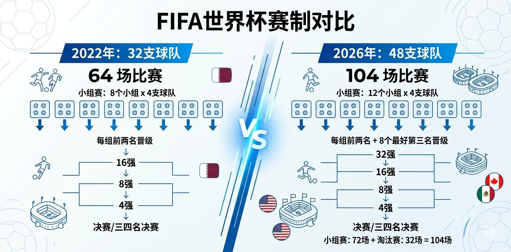
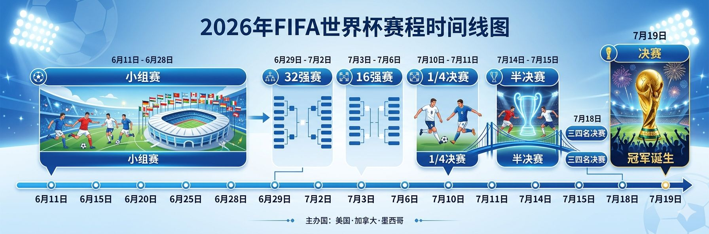
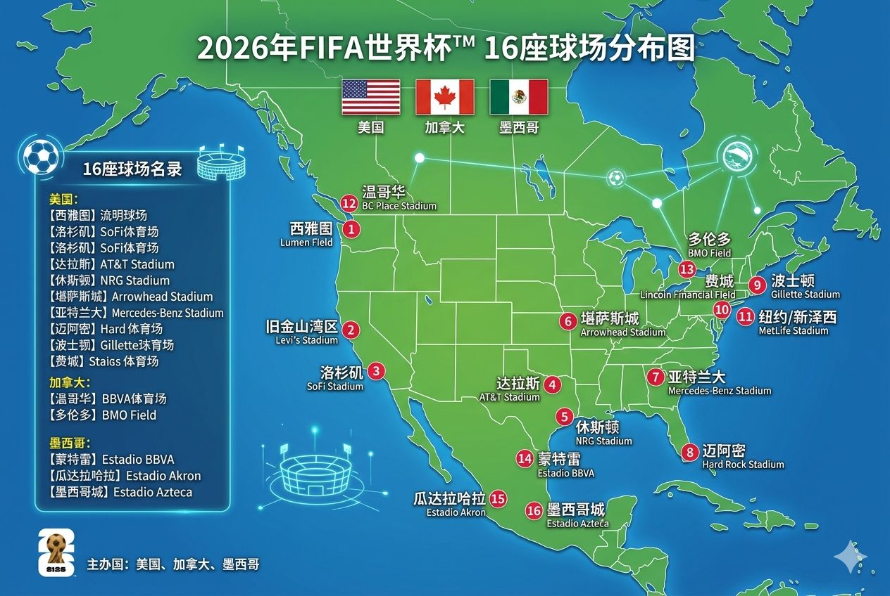
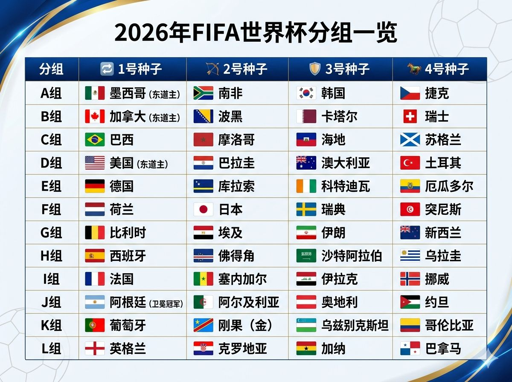

# 震惊！2026世界杯扩军竟惊动了高数老师：连踢8场才能夺冠，国际足联你是懂CPU球员的

各位常年埋头敲代码、改 Bug 的硬核球迷们，抬起头来，世界线已经变了！

如果你对世界杯的印象还停留在"32 支球队、8 个小组、淘汰赛从 1/8 决赛开始"，那么恭喜你，你的基础数据库已经**严重过时（Deprecated）**。国际足联（FIFA）在 2026 年正式上线了他们耗时多年研发的大型扩容补丁——**世界杯 48 队完全体版本**。

这个新版本不仅让全球的高数老师连夜起来算晋级概率，更让各大俱乐部的体能教练直呼"国际足联你没有心"。今天这篇文档，我们就用最硬核、最通俗的语言，把本届世界杯的新架构（赛制）**和**完全配置单（分组）给你一次性掰扯清楚。

---

## 🛠️ 架构大重构：从 32 到 48 的"高并发"改版

这次扩军，绝不仅仅是多塞 16 支球队发盒饭那么简单。整个赛事的赛制全面改革了。



### 1. 比赛场次暴增：104 场疯狂运转

以前 32 队时代，整届比赛也就 64 场。现在场次直接拉满，比赛总场次飙升到了恐怖的 **104 场**！这意味着在长达近四十天的时间里，几乎天天都是"黄金双十一"，足球迷的肝将面临前所未有的高压测试。

### 2. 小组赛规则：4 队一组，拒绝抱团

之前国际足联曾想过搞"3 队一组"的离奇骚操作，后来发现容易出现两队打默契球把第三队做掉的 Bug。于是紧急回滚代码，最终确定了现在的方案：

* **12 个小组**（A 组到 L 组），每组依然是 **4 支球队**进行单循环。

### 3. 淘汰赛触发器：新增 1/16 决赛（32强）

以前小组前两名直接晋级 16 强。现在对不起，由于扩军到了 12 个组，光靠前两名（24 队）凑不满淘汰赛对阵。

* **晋级规则**：每个小组的前两名直接晋级，同时，**12 个小组中成绩最好的 8 个小组第三名**，也能混进淘汰赛！
* 这就导致了一个神级名场面：小组赛踢完，48 队里只有 16 支倒霉蛋回家，剩下的 32 支球队要在淘汰赛里开始疯狂肉搏。

### 4. 夺冠之路变长：7 场 → 8 场

以往冲到决赛的劳模球队（比如上届的阿根廷和法国），从头到尾也就踢 7 场比赛。现在由于多了一轮 1/16 决赛，**任何一支想要举起大力神杯的球队，必须足足踢满 8 场比赛！** 这多出来的一场，是对球员肌肉纤维和主帅板凳厚度的极限压榨。

---

## ⏰ 赛程时间线（程序员版）

```
6月11日  ──── 开幕式（墨西哥 vs 南非）
  │
  ├─ 6/11 ~ 6/27  ──── 小组赛（48队 × 3轮 = 36个比赛日）
  │
  ├─ 6/28 ~ 6/30  ──── 休息日（天台维修期）
  │
  ├─ 6/30 ~ 7/3   ──── 1/16 决赛（32强，新增！）
  │
  ├─ 7/4 ~ 7/8    ──── 1/8 决赛
  │
  ├─ 7/9 ~ 7/10   ──── 1/4 决赛
  │
  ├─ 7/14 ~ 7/15  ──── 半决赛
  │
  └─ 7/19         ──── 决赛 🏆
```



**总时长**：39 天，104 场比赛，16 座球场，3 个国家。这是一场足球迷的"极限压力测试"。

---

## 🌎 跨国联办：史上最大规模的三国联合承办

本届世界杯是历史上首次由三个国家联合举办——**美国🇺🇸、加拿大🇨🇦、墨西哥🇲🇽**。这意味着整个赛事跨越时区、跨越气候、跨越文化，对球员和球迷都是一次史诗级考验。

### 💡 看点一：时差友好到离谱

这是对亚洲球迷最友好的一届世界杯！大部分比赛在北京时间**凌晨 0 点到早上 8 点**之间，意味着你不需要像看卡塔尔世界杯那样凌晨 3 点爬起来，也不用像看欧洲杯那样熬到天亮。体能教练看了都流泪，这届世界杯对亚洲观众的 CPU 负载终于降下来了。

### 💡 看点二：气候地狱，球员的终极烤验

美加墨三国的气候跨度极大——从墨西哥的高原酷热（墨西哥城海拔 2240 米），到加拿大的凉爽草地，再到美国东海岸的湿热桑拿。这意味着：

- **欧洲球队**（如德国、西班牙）需要适应高温高海拔
- **南美球队**（如阿根廷、巴西）在墨西哥城有天然主场优势
- **非洲球队**（如尼日利亚、塞内加尔）的体能优势在炎热气候下会被放大

### 💡 看点三：16 座球场，16 种风格

从纽约的大都会人寿体育场（容量 82,500）到墨西哥城的阿兹特克体育场（容量 87,000），再到温哥华的 BC Place（容量 54,500），每座球场的草皮、海拔、气候都不一样。这届世界杯，"客场优势"这个概念将被重新定义。



---

## 📋 分组抽签完整配置单：12 组 48 队完整名单

接下来，直接上干货。这是我为你整理的本届大赛全部 48 支球队的完整分组名单。建议直接截图保存，或者转发给你的球友们：



| 分组 | 🔄 1号种子 | 🏹 2号种子 | 🛡️ 3号种子 | 🐎 4号种子 |
| --- | --- | --- | --- | --- |
| **A 组** | 🇲🇽 墨西哥（东道主） | 🇿🇦 南非 | 🇰🇷 韩国 | 🇨🇿 捷克 |
| **B 组** | 🇨🇦 加拿大（东道主） | 🇧🇦 波黑 | 🇶🇦 卡塔尔 | 🇨🇭 瑞士 |
| **C 组** | 🇧🇷 巴西 | 🇲🇦 摩洛哥 | 🇭🇹 海地 | 🏴󠁧󠁢󠁳󠁣󠁴󠁿 苏格兰 |
| **D 组** | 🇺🇸 美国（东道主） | 🇵🇾 巴拉圭 | 🇦🇺 澳大利亚 | 🇹🇷 土耳其 |
| **E 组** | 🇩🇪 德国 | 🇨🇼 库拉索 | 🇨🇮 科特迪瓦 | 🇪🇨 厄瓜多尔 |
| **F 组** | 🇳🇱 荷兰 | 🇯🇵 日本 | 🇸🇪 瑞典 | 🇹🇳 突尼斯 |
| **G 组** | 🇧🇪 比利时 | 🇪🇬 埃及 | 🇮🇷 伊朗 | 🇳🇿 新西兰 |
| **H 组** | 🇪🇸 西班牙 | 🇨🇻 佛得角 | 🇸🇦 沙特阿拉伯 | 🇺🇾 乌拉圭 |
| **I 组** | 🇫🇷 法国 | 🇸🇳 塞内加尔 | 🇮🇶 伊拉克 | 🇳🇴 挪威 |
| **J 组** | 🇦🇷 阿根廷（卫冕冠军） | 🇩🇿 阿尔及利亚 | 🇦🇹 奥地利 | 🇯🇴 约旦 |
| **K 组** | 🇵🇹 葡萄牙 | 🇨🇩 刚果（金） | 🇺🇿 乌兹别克斯坦 | 🇨🇴 哥伦比亚 |
| **L 组** | 🏴󠁧󠁢󠁥󠁮󠁧󠁿 英格兰 | 🇭🇷 克罗地亚 | 🇬🇭 加纳 | 🇵🇦 巴拿马 |

---

## 🧐 是"版本特性"还是"逻辑 Bug"？三大终极看点

面对这样一份群魔乱舞的配置单，本届世界杯的观赛体验将呈现出极度两极分化的奇妙景观：

### 💡 看点一：小组赛不再是"大佬的温床"

别以为强队可以随便刷分。看看 **I 组（法国、塞内加尔、伊拉克、挪威）**，这四个队聚在一起，简直是把地狱级难度写在了公屏上。


2002 年世界杯揭幕战，塞内加尔 1-0 爆冷击败卫冕冠军法国的画面还历历在目，如今两队再度同组，复仇与反复仇的戏码即将上演。而哈兰德领衔的挪威，更是这组最大的搅局者。

再看看 **K 组（葡萄牙、刚果（金）、乌兹别克斯坦、哥伦比亚）**，2014 年世界杯 J 罗攻破葡萄牙球门的经典画面，至今仍是 C 罗心中的痛。如今两队再度碰面，C 罗能否在 41 岁高龄完成复仇？

### 💡 看点二：亚洲新势力集体"拒绝陪跑"

以前亚洲球队常年被认为是送分童子。但你看看最近的战绩：**日本队轰出 80% 的恐怖胜率**，**伊拉克甚至在最新热身赛里 1-1 强行逼平了西班牙**，而首次杀入正赛的**乌兹别克斯坦**也顶着 60% 的胜率在 K 组耀武扬威。


扩军让他们拿到了更多的资源和底气，本届亚洲球队极有可能成为掀翻欧洲传统秩序的"致命木马"。

### 💡 看点三：天台保洁阿姨的终极噩梦——"最佳小组第三"

这是本届最让人大开眼界的规则。以前只要输掉前两场，基本就可以订机票回家了。现在不一样了！哪怕你前两场打完积 1 分，只要最后一场比赛憋出一个大招狂刷净胜球，你依然有很大机会作为"12个小组里最强的8个第三名"仰卧起坐、强行挺进 32 强。这就意味着，**小组赛最后一轮，所有同时进行的比赛将会陷入完全失控的算分大乱斗！**

---

## 📊 数据彩蛋：1248 名球员的星级评分系统

为了精准预测本届世界杯的走势，我为全部 48 支球队的 1248 名球员建立了一套**10 分制 + 5 星双标注**的评分系统：

| 星级 | 评分区间 | 含义 | 代表球员 |
|------|---------|------|---------|
| ★★★★★ | 8.8 - 10.0 | 世界级巨星 | 梅西(9.6)、姆巴佩(9.5)、哈兰德(9.4) |
| ★★★★ | 7.5 - 8.7 | 五大联赛主力 | 大多数豪门首发球员 |
| ★★★ | 6.3 - 7.4 | 主流联赛轮换 | 国家队主力级别 |
| ★★ | 5.2 - 6.2 | 次级联赛主力 | 边缘国脚 |
| ★ | < 5.2 | 冷门联赛替补 | 新军球员 |

**五星球星 Top 10**：

| 排名 | 球员 | 国家 | 评分 | 位置 |
|------|------|------|------|------|
| 1 | 梅西 | 🇦🇷 阿根廷 | 9.6 | 前锋 |
| 2 | 姆巴佩 | 🇫🇷 法国 | 9.5 | 前锋 |
| 3 | 哈兰德 | 🇳🇴 挪威 | 9.4 | 前锋 |
| 4 | 贝林厄姆 | 🏴󠁧󠁢󠁥󠁮󠁧󠁿 英格兰 | 9.3 | 中场 |
| 5 | 维尼修斯 | 🇧🇷 巴西 | 9.2 | 前锋 |
| 6 | 孙兴慜 | 🇰🇷 韩国 | 9.1 | 中场 |
| 7 | 凯恩 | 🏴󠁧󠁢󠁥󠁮󠁧󠁿 英格兰 | 9.1 | 前锋 |
| 8 | 内马尔 | 🇧🇷 巴西 | 9.0 | 前锋 |
| 9 | 范戴克 | 🇳🇱 荷兰 | 9.0 | 中卫 |
| 10 | 基米希 | 🇩🇪 德国 | 8.9 | 中场 |

---

> **Status Check**: 赛制与分组初始化已完成。下一篇，我将开启"硬核沙盘推演"，带大家交叉比对 1248 名球员的星级评分与近期战绩，看看博彩公司开出的夺冠赔率背后，到底隐藏着哪些不为人知的资金流向和翻车陷阱。
>
> 如果你觉得这篇观赛指南对你有用，欢迎点赞、转发，留下你的神预测！
