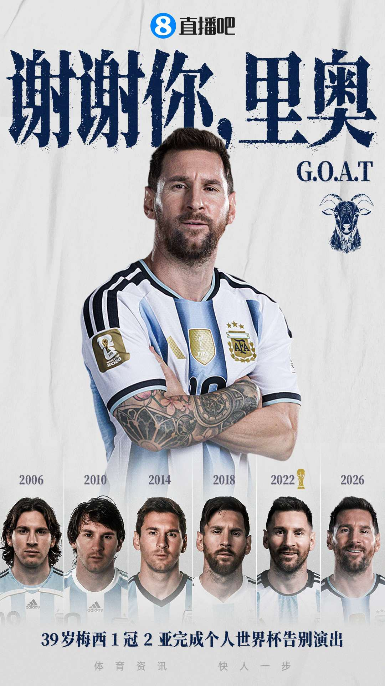
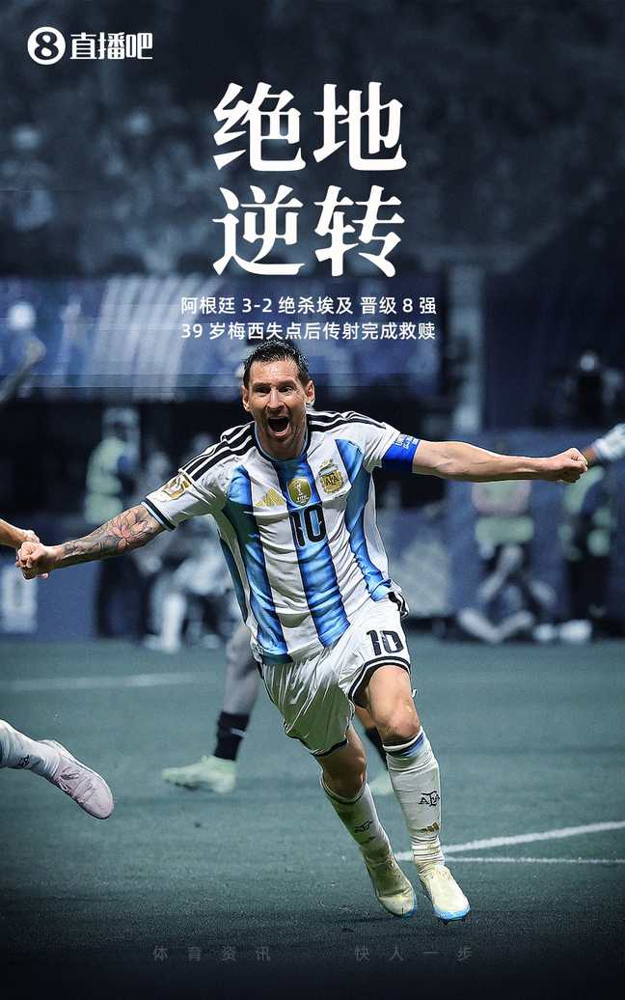

# 🏆 2026美加墨世界杯大结局：斗牛士加冕！球王谢幕！这是我们亲眼见证的，最接近完美的一届世界杯

> 📊 **39天，104场比赛，48支球队，一种结局。** 西班牙1-0加时击败阿根廷，时隔16年再夺世界杯冠军！费兰106分钟凌空抽射，一剑封喉！恩佐染红，梅西谢幕——赛后球王独自站立望向远方，久久不愿离去……英格兰6-4法国，萨卡帽子戏法，三四名决赛踢成对攻大战。39天前的预测全部验证，39天后的结局超出想象。**高僧以70%命中率加冕本届预测王，笑傲江湖。** 这篇总结，我们用最完整的方式，送别这届世界杯。

世界杯落幕了。

西班牙捧起了大力神杯，梅西完成了最后一舞，39天里发生了太多太多——冷门、绝杀、逆转、神仙球、告别、黑马、纪录……如果要用一句话总结这届世界杯，我愿意这么说：

**这是足球最好的模样。**

从开幕日墨西哥碾压南非，到小组赛西班牙被佛得角逼平，到哈兰德双响淘汰巴西，到挪威让二追三，到阿根廷让二追三，到梅里诺91分钟绝杀葡萄牙，到贝林厄姆加时绝杀挪威，到劳塔罗92分钟头球绝杀英格兰，再到决赛费兰106分钟凌空抽射——

**每一场比赛都有剧本，每一粒进球都有意义，每一次逆转都让人热泪盈眶。**

今天，让我们用最完整的方式，为这届世界杯画上句号。

---

## 🏆 最终章：西班牙1-0加时阿根廷！球王谢幕，斗牛士封王

2026年7月20日凌晨3点，纽约大都会人寿体育场，世界杯决赛。

西班牙对阵阿根廷，欧洲冠军对阵美洲冠军，2010年冠军对阵2022年冠军，19岁**亚马尔**对阵39岁**梅西**——这是世界杯决赛历史上最具话题性的一场对决。

比赛进程：

- **第6分钟**，梅西险些形成单刀，乌奈·西蒙出击拦截——阿根廷全场最有威胁的进攻
- **第44分钟**，利桑德罗受伤离场，阿根廷后防遭受重大打击
- **第82分钟**，恩佐两黄在身，防守动作受限
- **第90+3分钟**，恩佐大动作踢翻库巴西，**两黄变一红被罚下！** 阿根廷少打一人！
- **第96分钟**，尼科补射破门被吹无效——奥塔门迪用身体挡住了西班牙的进攻
- **第106分钟**，**波罗右路传中，尼科后点头球摆渡，费兰跟进凌空抽射——皮球直挂死角！1-0！**

西班牙领先！这一球，值一座世界杯冠军！

全场阿根廷只有**2脚射门**——是的，这是阿根廷本届世界杯最艰难的一场比赛，也是梅西最后一届世界杯的最后90分钟。

赛后，镜头捕捉到了最让人心碎的一幕——**39岁的梅西独自站立，望向远方，久久不愿离去。他没有与任何人庆祝，没有走向大力神杯，只是静静地站在那里，望向那片他为之奋斗了一生的绿茵场……**

**谢谢你，里奥。**

---

## 🥉 季军赛：英格兰6-4法国！萨卡帽子戏法！三四名决赛踢成对攻大战

三四名决赛从来不缺少进球，英法大战再次证明这一点。

英格兰6-4击败法国，萨卡上演帽子戏法，贝林厄姆建功，赖斯开场3分钟闪击破门——上半场英格兰就打了法国一个4-0，**法国后防被打成筛子**。下半场姆巴佩双响+1助攻帮助法国连追三球，一度追到4-3，但萨卡点球命中上演帽子戏法再次拉开差距。最终6-4，英格兰创造近60年最佳战绩，德尚14年法国执教谢幕。

**三四名决赛，永远别押谁赢——这场6-4，大概是最好的理由。**

---

## 📊 世界杯最终排名

| 名次 | 球队 | 战绩 |
|------|------|------|
| 🥇 冠军 | 🇪🇸 **西班牙** | 7胜1平 |
| 🥈 亚军 | 🇦🇷 **阿根廷** | 7胜1负 |
| 🥉 季军 | 🏴󠁧󠁢󠁥󠁮󠁧󠁿 **英格兰** | 6胜2负 |
| 殿军 | 🇫🇷 **法国** | 6胜2负 |

---

## 🏆 西班牙夺冠之路：含金量十足的王者之路

西班牙本届世界杯的夺冠之路，起步并不顺利，却越走越稳——从小组赛首战0-0被佛得角逼平，到淘汰赛连克葡萄牙、比利时、法国、阿根廷，走完了一条**含金量十足的冠军之路**：

| 阶段 | 比分 | 对手 | 关键事件 |
|------|------|------|---------|
| 小组赛首轮 | 0-0 | 佛得角 | 全场创造大量机会却未能破门，爆冷闷平 |
| 小组赛第2轮 | 4-0 | 沙特 | 亚马尔世界杯首发+破门，西班牙迅速进入状态 |
| 小组赛末轮 | 1-0 | 乌拉圭 | 小组第一出线 |
| 1/16决赛 | 3-0 | 奥地利 | 淘汰赛首战完胜，延续零封势头 |
| 1/8决赛 | 1-0 | 葡萄牙 | **梅里诺补时阶段绝杀！** 41岁C罗最后一舞落幕 |
| 1/4决赛 | 2-1 | 比利时 | 法比安破门，德凯特拉雷扳平，**梅里诺再次绝杀！** 连续两场绝杀！ |
| 半决赛 | 2-0 | 法国 | 奥亚萨瓦尔点球+波罗单刀，**三杀法国！** 时隔16年再进决赛 |
| 决赛 | 1-0（加时） | 阿根廷 | **费兰106分钟凌空抽射制胜！** 队史第二冠！ |

**连续三届大赛淘汰法国**——2024欧洲杯半决赛、2025欧国联半决赛、2026世界杯半决赛，斗牛士在大赛半决赛中对法国完成三杀！

从小组赛首战0-0战平新军佛得角，到淘汰赛连克葡萄牙、比利时、法国和阿根廷，这条冠军之路的含金量，毋庸置疑。

这支年轻的西班牙，平均年龄不到25岁，**奥尔莫、尼科、费兰、库巴西、亚马尔**……未来可期。

---

## 🐐 梅西的世界杯最后一舞：8球4助，两次决赛，一个不完美的完美结局

39岁的梅西，世界杯最后一舞。

从2006年德国的青涩少年，到2010年南非的失落天才，到2014年里约的咫尺之遥，到2018年莫斯科的黯然离场，再到2022年卡塔尔封王——**2026年，39岁的梅西再次站在世界杯决赛的舞台上。**

本届世界杯梅西的数据：

- **8粒进球**（本届射手榜第二）
- **4次助攻**（本届助攻榜第一）
- **连续两届带队杀入世界杯决赛**

**本届最难忘的梅西时刻：**

- 🔥 小组赛对阿尔及利亚上演帽子戏法，世界杯第17球超越克洛泽
- 🔥 对奥地利梅开二度，世界杯第18球独享历史射手王
- 🔥 对佛得角任意球破门，世界杯第19球创纪录
- 🔥 1/8决赛0-2落后，5分钟内传射导演惊天逆转
- 🔥 半决赛两记助攻导演逆转英格兰
- 🔥 **决赛第6分钟险些单刀——这是39岁球王最后的威胁**

**即使以失利告终，这依然是历史上最伟大的世界杯谢幕演出之一。**

**球王谢幕，传奇永存。**

---

## 🔥 本届世界杯名场面回顾：我们见证了足球最好的模样

### 🐴 让二追三！本届最疯狂的逆转

**阿根廷3-2埃及（1/8决赛）**
0-2落后，梅西罚丢点球，埃及66分钟2-0领先——然后，梅西5分钟内传射建功，恩佐92分钟头球绝杀！阿根廷让二追三，全世界沸腾！

**比利时3-2塞内加尔（1/8决赛）**
比利时一度0-2落后，蒂莱曼斯打入压哨点球绝杀逆转——而且他在比赛中还和队友闹了内讧，赛后却成了英雄。

### ⚡ 绝杀！绝杀！还是绝杀！

- **梅里诺补时阶段绝杀葡萄牙**（1/8决赛）——41岁C罗的世界杯最后一舞，就此落幕
- **梅里诺再次绝杀比利时**（1/4决赛）——连续两场绝杀，一战封神
- **贝林厄姆加时93分钟绝杀挪威**（1/4决赛）——皇马双子星内战，笑到最后
- **劳塔罗92分钟头球绝杀英格兰**（半决赛）——连续两届世界杯决赛都有进球
- **费兰106分钟凌空抽射**（决赛）——一剑封喉，值一座世界杯冠军

### 💥 黑马狂奔：挪威、摩洛哥、埃及搅局

- **挪威2-1淘汰巴西**：哈兰德双响，五星巴西轰然倒下，这是本届世界杯最大的冷门
- **摩洛哥点球淘汰荷兰**：继2022年之后再次扮演黑马角色
- **埃及点球淘汰澳大利亚**：8强席位中唯一的非洲代表

### 🐐 超级纪录夜

- **梅西世界杯第18球**，超越克洛泽独享历史射手王
- **姆巴佩国家队进球超越齐达内**，成为法国队史射手王
- **C罗第5届世界杯**，职业生涯第8次参加世界杯（史上最多）
- **41岁C罗**上演世界杯最后一舞

---

## 🏆 预测战绩总榜：恭喜高僧，以70%加冕本届预测王！

> 📊 **最终战绩**（全部104场比赛）

| 排名 | 预测方 | 最终战绩 | 命中率 | 段位 | 盈亏 |
|------|--------|---------|--------|------|------|
| 🥇 | 🙏 **高僧** | **72/104** | **70%** | 🎲 **赌神** | **+$5,554** |
| 🥈 | 🤖 **模型** | **64/104** | **62%** | 🎲 赌徒 | +$2,344 |
| 🥉 | 🐷 **YOYO** | **62/104** | **60%** | 🎲 **赌神** | +$3,234 |

**高僧登顶本届预测王！** 决赛押西班牙命中，季军赛押法国翻车，瑕不掩瑜。模型决赛押阿根廷失利，但整体62%命中率依然稳健。

---

## 🎲 赌神最终账单

**规则**：初始 $2,000，每场押 $200，Bet365 赔率结算

| 排名 | 预测方 | 最终余额 | 总盈亏 | 段位 |
|------|--------|---------|--------|------|
| 🥇 | 🙏 高僧 | **$7,554** | **+$5,554 💰💰💰💰💰** | 🎲 **赌神** |
| 🥈 | 🐷 YOYO | $5,234 | +$3,234 💰💰💰 | 🎲 **赌神** |
| 🥉 | 🤖 模型 | $4,344 | +$2,344 💰💰 | 🎲 赌徒 |

**赔率再次证明了一切——押对决赛，一场顶两场！**

---

## 📸 图片来源

本文所有比赛图片均来自[直播吧](https://news.zhibo8.com/)，仅供非商业用途。

---

> **🏆 2026美加墨世界杯，正式收官。**
>
> 西班牙16年后再捧大力神杯，队史第二冠。
> 梅西的世界杯最后一舞，以不完美的姿态完美落幕。
> 英格兰创造近60年最佳战绩。
> 挪威成为最大黑马，巴西倒在了最不该倒的地方。
>
> 39天，104场比赛，48支球队。
>
> 我们见证了绝杀、逆转、纪录、告别。
> 我们见证了足球最好的模样。
>
> **下一届世界杯，相约2030年，世界杯100周年——西班牙、葡萄牙、摩洛哥三国联办。**
>
> 再见，美加墨。
> 再见，里奥。
> **足球不死，传奇永恒。**

**AnfinsenYu** | 2026年7月20日
