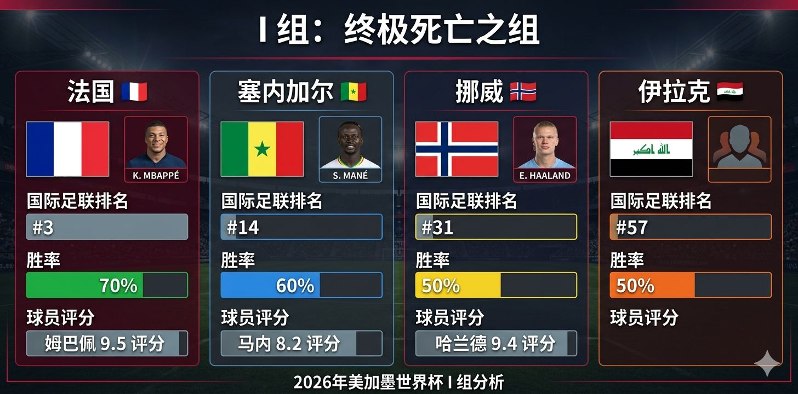
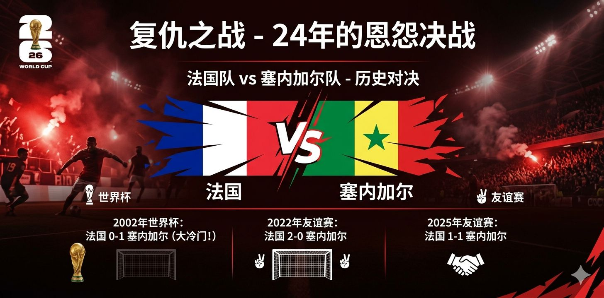
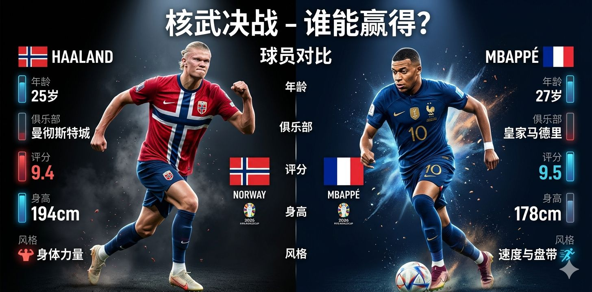
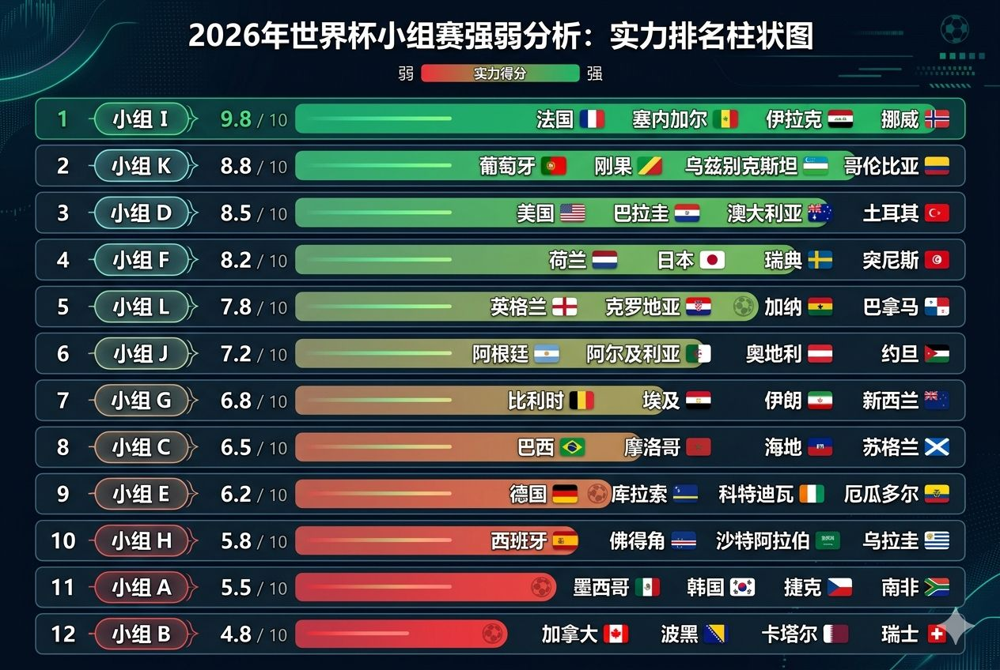

# 2026世界杯死亡之组曝光：I组四大魔王混战，精算师CPU都烧了

在上一篇文档里，我们科普了本届世界杯扩军到 48 队后的"高并发"魔幻赛制。当时很多兄弟在评论区跟我争："这还用看？K 组有葡萄牙和哥伦比亚，L 组有英格兰和克罗地亚，绝对是史诗级死亡之组！"

兄弟们，这就是典型的**只看表面 UI，不看底层逻辑**。

博彩公司的精算师们在后台拉完高阶数据后，全都倒吸了一口凉气。本届世界杯真正能被称为"系统级死锁（Deadlock）"、"进去就别想活着出来"的修罗场，其实是——**I 组**。

今天我们就用最硬核的数据，把这个惊动了全球赌狗和精算师的死亡之组彻底扒光，顺便给本届 12 个小组的"死亡指数"排个序。

---

## 💀 终极死锁：为什么说 I 组是全宇宙最残忍的分区？

我们先来看看 I 组的这四支硬核配置：**法国、塞内加尔、伊拉克、挪威**。

这个组合最恐怖的地方在于，它**没有一个是送分童子，全员都是"硬核架构"**。世界杯冠军 + 非洲冠军 + 亚洲新锐 + 哈兰德领衔的北欧海盗，直接把这个小组的整体不败率推到了一个极其变态的高度。

### 1. 🇫🇷 法国：卫冕冠军，系统级 Boss

* **近期战绩**：7 胜 2 平 1 负（胜率 70%）
* **夺冠赔率**：5.50（高居全大赛第 3）
* **盘口现状**：姆巴佩（9.5 分）+ 楚阿梅尼（9.1 分）+ 卡马文加（9.0 分）的皇马三叉戟，让法国的中前场配置堪称本届最豪华。但问题是——**卢卡斯·埃尔南德斯十字韧带断裂，确诊缺席！** 左后卫防守硬度直接降级，特奥·埃尔南德斯将成为唯一选择，体能和状态都面临极限考验。

### 2. 🇸🇳 塞内加尔：非洲冠军，特级黑马

* **近期战绩**：6 胜 2 平 2 负（胜率 60%）
* **夺冠赔率**：67.00
* **盘口现状**：别被 67 的高赔率骗了，在博彩公司的"晋级 16 强"暗盘里，塞内加尔的过关概率高得吓人。他们近期的抢分效率极其稳定，身体素质和边路爆破速度简直是针对法国防线的"特制外挂"。更关键的是——**2002 年世界杯揭幕战，塞内加尔 1-0 爆冷击败卫冕冠军法国的画面还历历在目！** 这场恩怨局，法国想复仇，塞内加尔想复刻奇迹。

### 3. 🇳🇴 挪威：哈兰德核武，一己之力改变赔率

* **近期战绩**：5 胜 3 平 2 负（胜率 50%）
* **夺冠赔率**：34.00
* **盘口现状**：挪威队的整体实力或许不算顶级，但他们拥有本届大赛最恐怖的"核武器"——**哈兰德（9.4 分）+ 厄德高（8.5 分）**。这对英超双核的连线，足以在任何防线上撕开缺口。

哈兰德的身体对抗能力在面对法国和塞内加尔的后卫时，将形成极其恐怖的"降维打击"。

### 4. 🇮🇶 伊拉克：亚洲新锐，1-1 逼平西班牙的狠角色

* **近期战绩**：5 胜 3 平 2 负（胜率 50%）
* **夺冠赔率**：200+
* **盘口现状**：很多人看到伊拉克的名字就觉得是送分童子，但你看看他们最近的战绩——**在最新热身赛里，伊拉克 1-1 强行逼平了夺冠大热门西班牙！** 近 10 场不败率高达 80%，低位防守 + 犀利反击的战术体系，在面对强队时反而能发挥出最大威力。这支球队，绝对是 I 组最大的"搅局者"。

> 📢 **精算师风险提示**：在 48 队赛制下，小组第三虽然有机会出线，但如果在这组因为互相绞杀导致净胜球全是 0 或者负数，哪怕拿到小组第三也大概率会被别的组"卷"死。这就是为什么说 I 组是真正的无人生还。

---

## 📊 2026 世界杯 12 分区"死亡指数"天梯榜

既然聊到了死亡之组，博主连夜用数据模型跑了一遍 12 个小组的综合实力方差，制作了这份**官方认证的《死亡指数天梯榜》**。赶紧看看你主队所在的分区属于什么难度：

> ⚠️ 注：死亡指数基于 FIFA 排名、近期战绩、历史交锋、球星配置等多维度综合评估，满分 10 分。

| 排名 | 分组 | 核心乱战成员 | 死亡指数 | 核心看点 |
| --- | --- | --- | --- | --- |
| **🥇 1** | **I 组** | 法国、塞内加尔、伊拉克、挪威 | **9.8 / 10** | **绝对死锁**。四队实力均衡，场场都是生死局。法国 vs 塞内加尔的 24 年恩怨复仇战，哈兰德 vs 姆巴佩的巅峰对决。 |
| **🥈 2** | **K 组** | 葡萄牙、刚果（金）、乌兹别克斯坦、哥伦比亚 | **8.8 / 10** | **复仇之组**。2014 年 J 罗攻破葡萄牙球门，C 罗至今难忘。41 岁的 C 罗能否完成复仇？ |
| **🥉 3** | **D 组** | 美国、巴拉圭、澳大利亚、土耳其 | **8.5 / 10** | **东道主的考验**。美国坐拥主场优势，但土耳其和澳大利亚都是搅局好手。 |
| **4** | **F 组** | 荷兰、日本、瑞典、突尼斯 | **8.2 / 10** | **技术流修罗场**。日本近 10 场胜率高达 80%，荷兰传控硬碰亚洲黑马。 |
| **5** | **L 组** | 英格兰、克罗地亚、加纳、巴拿马 | **7.8 / 10** | **宿敌重逢**。2018 半决赛克罗地亚加时 2-1 淘汰英格兰，三狮军团饮恨。 |
| **6** | **J 组** | 阿根廷、阿尔及利亚、奥地利、约旦 | **7.2 / 10** | **卫冕冠军的考验**。阿根廷胜率 80% 一骑绝尘，但阿尔及利亚和奥地利都是硬骨头。 |
| **7** | **G 组** | 比利时、埃及、伊朗、新西兰 | **6.8 / 10** | **萨拉赫复仇战**。2018 比利时 1-0 绝杀埃及，时隔 8 年再度碰面。 |
| **8** | **C 组** | 巴西、摩洛哥、海地、苏格兰 | **6.5 / 10** | **桑巴 vs 铁桶**。巴西和摩洛哥大概率携手出线，但 2022 世界杯两队 0-0 闷平的场景还历历在目。 |
| **9** | **E 组** | 德国、库拉索、科特迪瓦、厄瓜多尔 | **6.2 / 10** | **德国的考验**。维尔茨 + 穆西亚拉双子星步入巅峰期，但科特迪瓦和厄瓜多尔都是身体流强队。 |
| **10** | **H 组** | 西班牙、佛得角、沙特、乌拉圭 | **5.8 / 10** | **传统强队的舒适区**。西班牙和乌拉圭大概率携手出线。 |
| **11** | **A 组** | 墨西哥、南非、韩国、捷克 | **5.5 / 10** | **东道主的主场**。墨西哥坐拥主场之利，韩国和捷克争夺第二个名额。 |
| **12** | **B 组** | 加拿大、波黑、卡塔尔、瑞士 | **4.8 / 10** | **瑞士一枝独秀**。瑞士大概率头名出线，加拿大和波黑争夺第二。 |

---

## 🔮 博主神推演：I 组的剧本会怎么走？

根据我手里这套交叉了**1248名球员评分**、**各队近10场比赛走势**以及**最新的伤病报告**的数据库，我们不妨提前给 I 组的剧本做个神推演：

### 剧本一：法国复仇成功（概率 45%）

法国在小组赛首轮就遭遇塞内加尔，这是一场迟到 24 年的复仇战。姆巴佩领衔的锋线火力全开，3-1 击败塞内加尔，报了 2002 年的一箭之仇。随后法国连胜伊拉克和挪威，以小组第一出线。

### 剧本二：塞内加尔复刻奇迹（概率 25%）

历史重演！塞内加尔在小组赛首轮再次爆冷击败法国，就像 2002 年那样。马内领衔的锋线用速度和身体对抗撕开法国防线，1-0 小胜。随后塞内加尔连胜伊拉克和挪威，以小组第一出线。

### 剧本三：挪威搅局（概率 20%）

哈兰德在小组赛中爆发，首轮对阵伊拉克上演帽子戏法，次轮对阵塞内加尔梅开二度，末轮对阵法国虽然输球，但凭借净胜球优势以小组第二出线。

### 剧本四：伊拉克黑马奇迹（概率 10%）

伊拉克延续热身赛逼平西班牙的状态，首轮逼平法国，次轮击败塞内加尔，末轮输给挪威但凭借净胜球以小组第三出线。

---

## 📝 小组出线预测

| 排名 | 球队 | 出线概率 | 理由 |
|------|------|---------|------|
| 1 | 🇫🇷 法国 | 85% | 实力最强，姆巴佩领衔豪华阵容 |
| 2 | 🇸🇳 塞内加尔 | 65% | 非洲冠军，身体对抗优势明显 |
| 3 | 🇳🇴 挪威 | 55% | 哈兰德核武，但整体实力稍逊 |
| 4 | 🇮🇶 伊拉克 | 35% | 黑马潜质，但大赛经验不足 |

---

> **Status Check**: 死亡之组与全分区危险系数评级已部署完毕。下一篇，我们将祭出终极武器——**《硬核沙盘推演：我的 2026 世界杯全景预测》**。届时将直接放出我的通关预测，看看到底谁能一路通关到大都会球场！
>
> 欢迎在评论区留下你对 I 组的看法，你觉得法国和塞内加尔谁会先触发"系统崩溃 Bug"？
