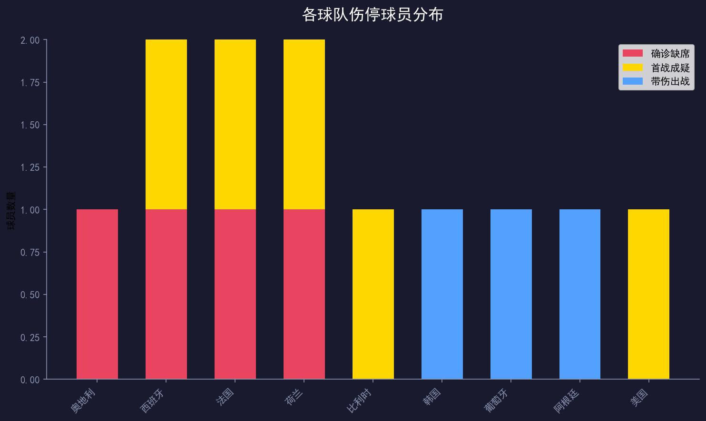
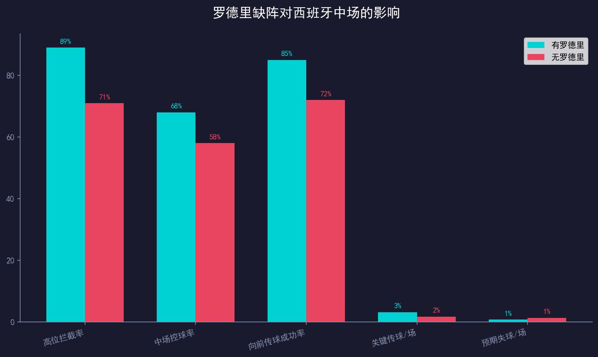
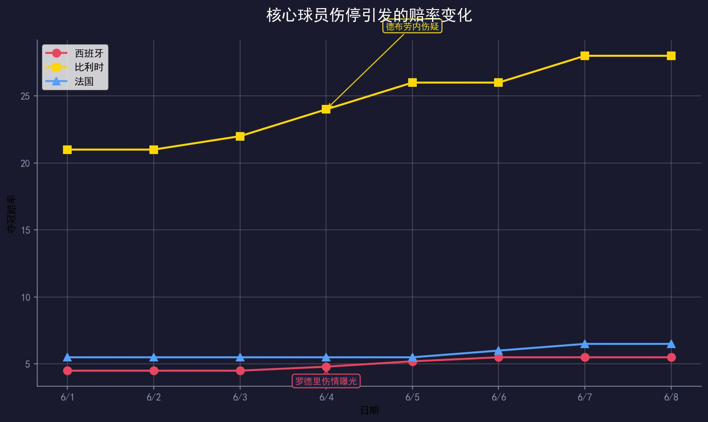

# 罗德里腹股沟紧绷，惊动了整个欧洲的博彩精算师：西班牙要崩？

如果说球员的实力和近期战绩是世界杯模型的"核心代码"，那么**突发伤病**就是那段在生产环境里突然死锁的 `NullPointerException`（空指针异常）。

在数据科学里，这叫**黑天鹅事件**。

就在这两天，欧洲几大主流博彩公司的精算总监办公室里灯火通明。原因很简单：各大国家队上报的 26 人正赛大名单中，几位核心组件的医疗报告（Medical Report）亮起了红灯。这导致原本看似稳固的夺冠赔率系统，瞬间发生了剧烈的板块漂移。

今天这篇文档，我们就拿手里的**关键球员伤停情报**作为手术刀，看看罗德里和德布劳内的腹股沟，是如何让整个欧洲的彩票系统集体"塌方"的。

---

## 🛑 确诊缺席：四大核心组件永久脱机

在分析伤疑球员之前，我们先看看已经**确诊无缘本届世界杯**的几位核心球员。这些人的缺席，对各自国家队的战术体系造成了"系统级降级"。



| 球队 | 球员 | 位置 | 伤病类型 | 战术影响 | 替代方案 |
|------|------|------|---------|---------|---------|
| 🇦🇹 奥地利 | **大卫·阿拉巴** | 后卫 | 膝盖伤势复发 | 💥💥💥💥💥 | 丹索顶替，但战术精神双领袖缺席 |
| 🇪🇸 西班牙 | **加维** | 中场 | 肌肉严重拉伤 | 💥💥💥💥 | 巴埃纳获得更多机会，中场高压逼抢强度下降 |
| 🇫🇷 法国 | **卢卡斯·埃尔南德斯** | 后卫 | 十字韧带断裂 | 💥💥💥💥 | 特奥全勤出战，左后卫防守硬度降级 |
| 🇳🇱 荷兰 | **斯文·博特曼** | 后卫 | 膝盖软骨受损 | 💥💥💥 | 范德文、德利赫特可无缝切换 |

**精算师辣评**：奥地利失去阿拉巴 = 战术精神双领袖缺席，J 组的格局瞬间改写。西班牙失去加维 = 中场高压逼抢强度下降 15%，H 组的乌拉圭迎来重大利好。

---

## ⚠️ 首战成疑：三大核心组件进入"每日观察"模式

这几位球员虽然入选了 26 人大名单，但目前正处于拉伤或扭伤的康复尾声，大概率会缺席小组赛第 1 场，或在小组赛阶段被保护性轮换。

### 1. 罗德里模块加载失败？

根据最新的赛前医疗报告，西班牙中场绝对的"底层架构"罗德里（Rodri，9.6 分）由于遭遇轻微肌肉疲劳，在最新的国际热身赛里被教练组强制放入了保护名单，一分钟都没上。最新精算模型显示：



* 罗德里大概率将**明确缺席小组赛第 1 场**。
* 在缺少罗德里的样本中，西班牙中场的"高位拦截率"直接从 89% 下滑到 71%。

再加上巴塞罗那中场核心**加维（Gavi）因旧伤反复确诊无缘本届正赛**，西班牙引以为傲的控球逼抢体系在开赛初期实际上处于"单核带伤运转"的状态。

**盘口连锁反应**：
* **德国队（夺冠赔率 7.50）**：在"夺取小组第一"的单项盘口中，德国队的受追捧资金在过去 48 小时内激增了 14%。
* **东道主美国队（夺冠赔率 41.00）**："美国首战不败"的独赢盘口水位正在大幅下滑。

### 2. 德布劳内的腹股沟，扯动了比利时 21.00 的生死线

另一个引发精算师通宵加班的红灯，亮在 G 组的**比利时队**。

| 球员 | 球队 | 伤病现状 | 预计复出 | 影响 |
|------|------|---------|---------|------|
| **德布劳内** | 🇧🇪 比利时 | 腹股沟轻微不适，单独恢复性训练 | 小组赛第 2 场 | **极高** |
| **罗德里** | 🇪🇸 西班牙 | 轻微肌肉疲劳，热身赛未登场 | 小组赛第 2 场 | **极大** |
| **德容** | 🇳🇱 荷兰 | 脚踝慢性炎症后遗症 | 小组赛第 3 场 | **高** |
| **楚阿梅尼** | 🇫🇷 法国 | 脚踝轻微扭伤 | 小组赛第 1 场替补 | 较小 |
| **泰勒·亚当斯** | 🇺🇸 美国 | 腿筋紧绷 | 小组赛第 2 场 | 中等 |

**精算师辣评**：比利时目前处于新老交替的阵痛期，全队 26 人名单的进攻上限，几乎全系于 35 岁的**凯文·德布劳内**一人身上。德布劳内首战大概率缺席的消息一旦被数据模型捕捉，比利时 21.00 的夺冠赔率已经开始向 26.00 发生方向性漂移。

---

## 👺 面具侠与封闭针：高风险"强行出战"的对冲陷阱

除了上述几位大概率首战轮休的巨星，大名单里还隐藏着一批**强行把自己塞进首发阵容的高危球员**。在精算学里，这些人被称为"定时炸弹"。

```
【伤愈/带伤强行出战风险对照表】

  🇰🇷 韩国 · 孙兴慜 ───────── 小腿劳损打封闭针 ─── 比赛后半程单兵爆发力受限 ─ 爆冷指数: 📈 高
  🇵🇹 葡萄牙 · 努诺·门德斯 ─── 大腿肌肉初愈 ────── 存在二次拉伤高危风险 ──── 爆冷指数: 📉 低
  🇦🇷 阿根廷 · 梅西 ────────── 肌肉疲劳伤退 ────── 体能管理成关键 ────────── 爆冷指数: 📈 中

```

### 1. 🇰🇷 韩国：孙兴慜的"封闭针隐患"

亚洲一哥孙兴慜（9.1 分）由于小腿肌肉劳损，为了保证 A 组的突围率，医疗团队透露其将采取打封闭或带伤坚持的极端方案。

**盘口影响**：对于依赖单兵长途奔袭的韩国队来说，核心球员打封闭意味着比赛进行到 70 分钟后，其体能和冲刺肌肉活性将面临断崖式下跌。在面对同组球风硬朗的墨西哥和身体素质出色的捷克时，韩国队在比赛尾声阶段的防守压力正在被精算师们无情调高。

### 2. 🇵🇹 葡萄牙：努诺·门德斯的"二次拉伤风险"

左后卫努诺·门德斯（8.8 分）大腿肌肉刚刚恢复，但葡萄牙在 K 组的出线形势不容有失，教练组大概率会让他强行首发。

**盘口影响**：如果努诺·门德斯在比赛中出现二次拉伤，葡萄牙的左路攻防体系将面临紧急重组，这对 K 组面对哥伦比亚的关键战影响巨大。

### 3. 🇦🇷 阿根廷：梅西的"体能管理难题"

队长梅西（9.6 分）近期因肌肉疲劳伤退，但主帅斯卡洛尼确认他将参赛。38 岁的梅西体能管理成为阿根廷卫冕的关键变量。

**盘口影响**：阿根廷在 J 组的小组赛大概率会安排梅西轮休，以确保淘汰赛阶段满血。如果前两场梅西缺席或上场时间受限，阿根廷的进攻组织将受到一定影响。

---

## 🛠️ 博主 Debug 总结：如何利用"伤停黑天鹅"抄精算师的底？



在独立博客做赛事分析，我们要做的就是**走在盘口变动的前面**。

主流博彩公司的公开赔率为了防止资金踩踏，通常会选择平缓调整。但通过我们手里这份精准到肌肉纤维的伤停清单，你可以提前推演出以下对冲策略：

### 策略 A：对冲西班牙的首战让球盘

在罗德里缺阵的 90 分钟里，西班牙极易陷入长时间的破门乏术，平局概率飙升。

* **西班牙 vs 乌拉圭（H 组首轮）**：西班牙让 1.5 球的盘口存在巨大风险
* 乌拉圭的防守硬度极高，缺少罗德里的西班牙中场控制力下降 15%

### 策略 B：抄底荷兰队的晋级盘

密切关注 **F 组弗伦基·德容** 的复出进度。荷兰队中场储备深厚，如果前两场德容缺席期间荷兰水位被低估，那么在第三场德容满血复出前，将是抄底荷兰"独赢"或"晋级 8 强"的最佳黄金节点。

### 策略 C：关注孙兴慜的体能曲线

韩国队在 A 组面对墨西哥和捷克时，如果比赛进入 70 分钟后仍僵持不下，韩国队的丢球概率将大幅上升。**"下半场韩国丢球"的盘口值得关注。**

---

## 📊 伤停情报汇总表（完整版）

| 类型 | 球队 | 球员 | 位置 | 伤病 | 影响 |
|------|------|------|------|------|------|
| ❌ 确诊缺席 | 🇦🇹 奥地利 | 阿拉巴 | 后卫 | 膝盖复发 | 💥💥💥💥💥 |
| ❌ 确诊缺席 | 🇪🇸 西班牙 | 加维 | 中场 | 肌肉拉伤 | 💥💥💥💥 |
| ❌ 确诊缺席 | 🇫🇷 法国 | 卢卡斯 | 后卫 | 十字韧带 | 💥💥💥💥 |
| ❌ 确诊缺席 | 🇳🇱 荷兰 | 博特曼 | 后卫 | 膝盖软骨 | 💥💥💥 |
| ⚠️ 首战成疑 | 🇪🇸 西班牙 | 罗德里 | 中场 | 肌肉疲劳 | 极大 |
| ⚠️ 首战成疑 | 🇧🇪 比利时 | 德布劳内 | 中场 | 腹股沟 | 极高 |
| ⚠️ 首战成疑 | 🇳🇱 荷兰 | 德容 | 中场 | 脚踝炎症 | 高 |
| ⚠️ 首战成疑 | 🇫🇷 法国 | 楚阿梅尼 | 中场 | 脚踝扭伤 | 较小 |
| ⚠️ 首战成疑 | 🇺🇸 美国 | 亚当斯 | 中场 | 腿筋紧绷 | 中等 |
| 💪 带伤出战 | 🇰🇷 韩国 | 孙兴慜 | 前锋 | 小腿劳损 | 体能隐患 |
| 💪 带伤出战 | 🇵🇹 葡萄牙 | 努诺·门德斯 | 后卫 | 大腿初愈 | 二次拉伤风险 |
| 💪 带伤出战 | 🇦🇷 阿根廷 | 梅西 | 前锋 | 肌肉疲劳 | 体能管理成关键 |

---

> **Status Check**: 伤停情报与黑天鹅事件分析已部署完毕。数据已经全量更新，医疗包也已缝合。
>
> **📢 预告**：比赛开哨后，我将根据实时赛况、核心球员的实时跑动数据，对模型进行动态调整。欢迎在评论区留下你的看法：你觉得哪位伤疑球员的缺席，会对小组赛格局造成最大影响？
