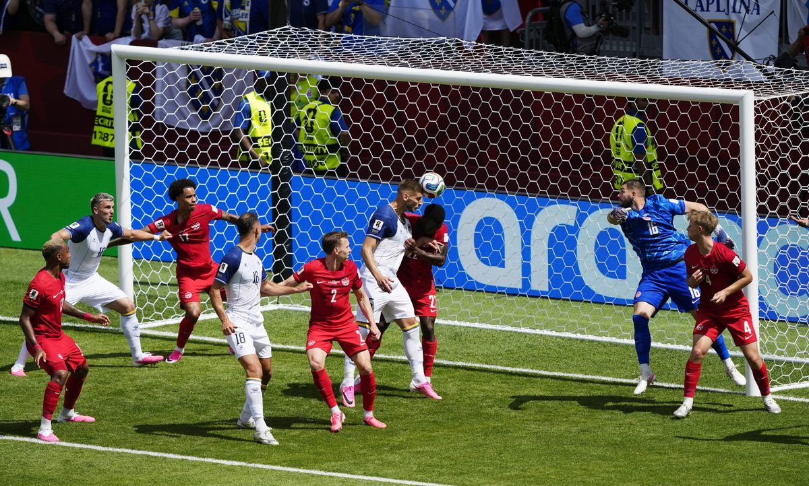
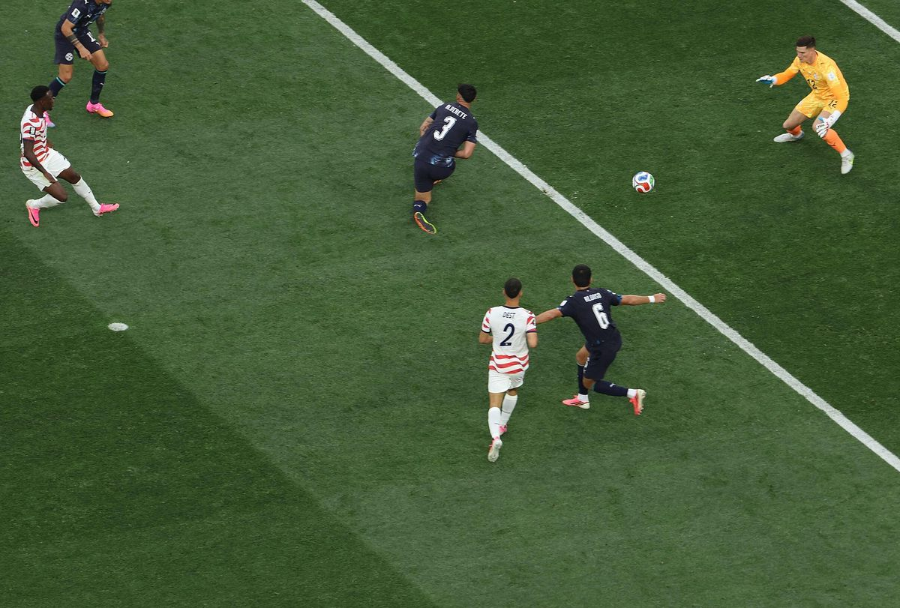
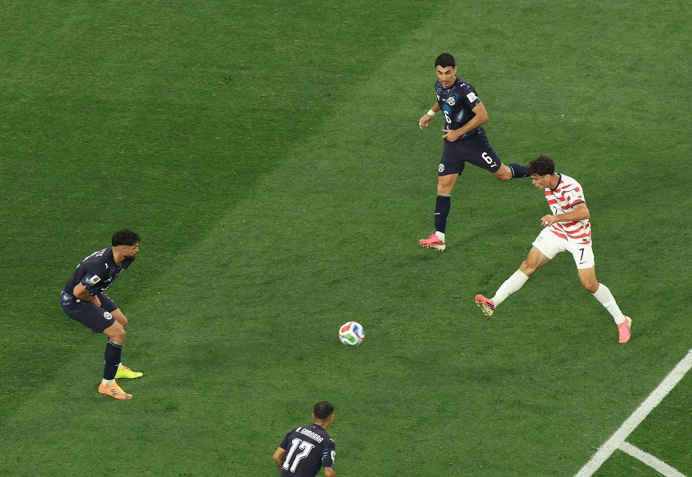
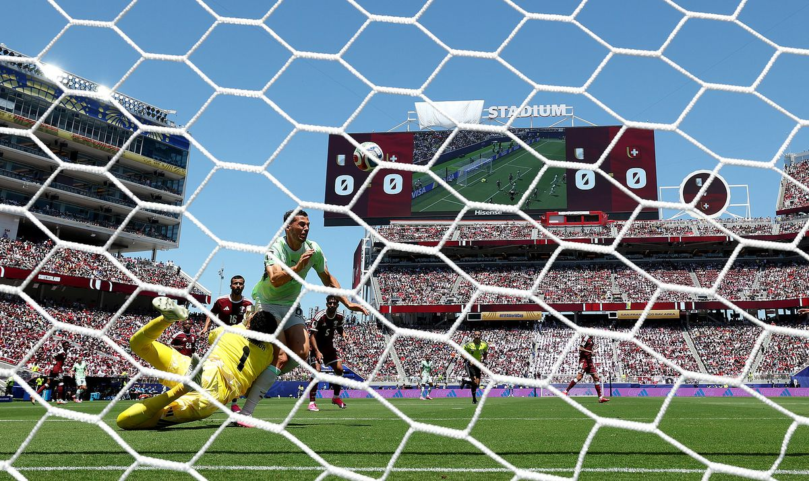
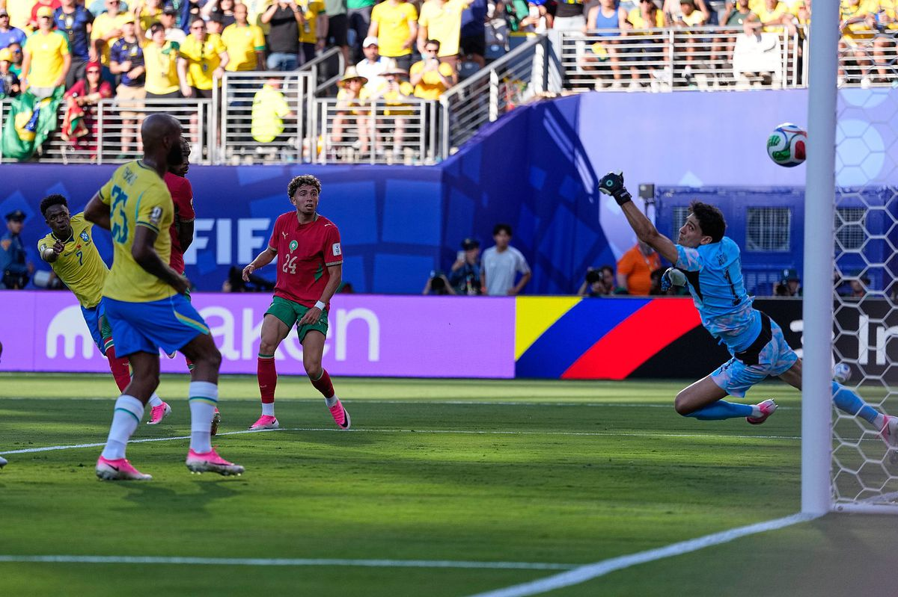
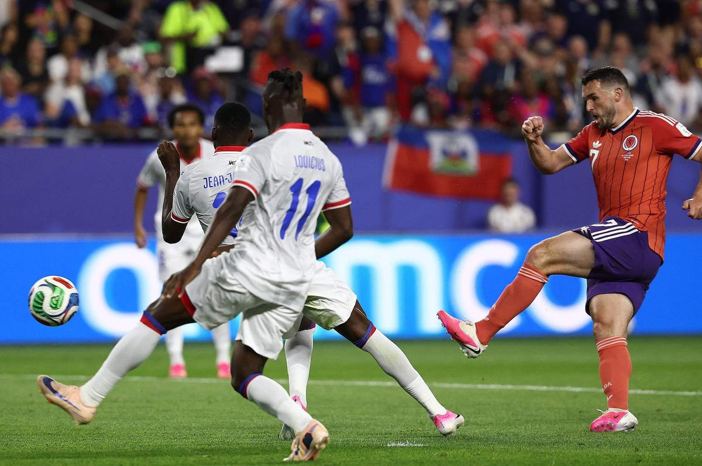
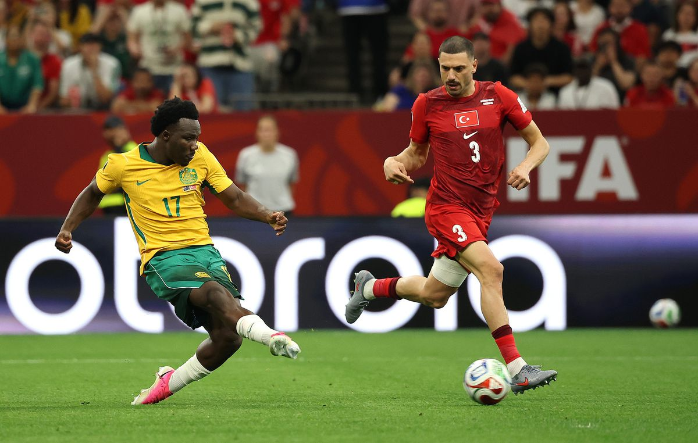
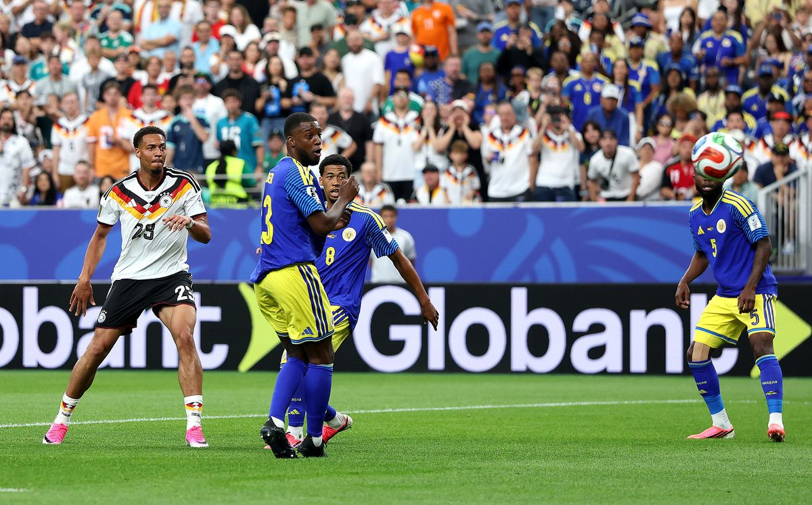
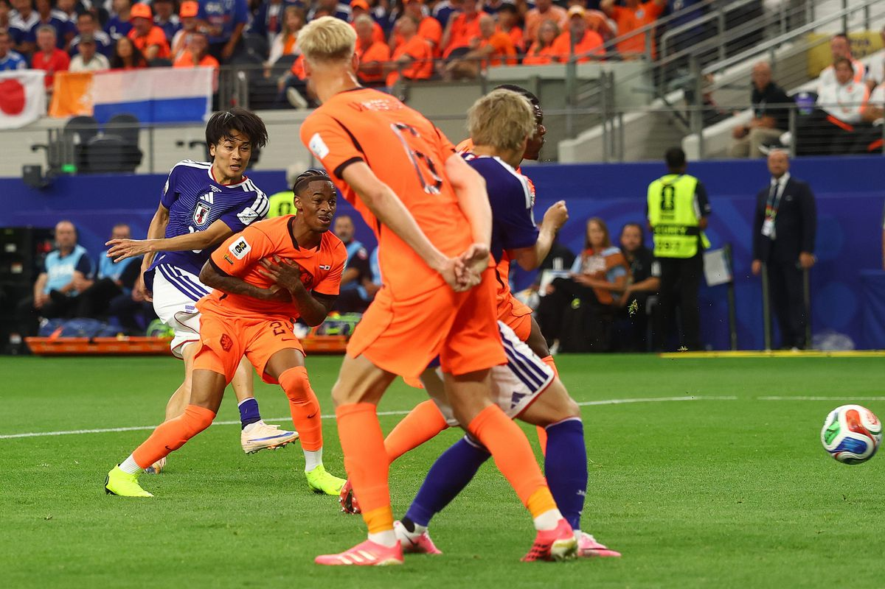
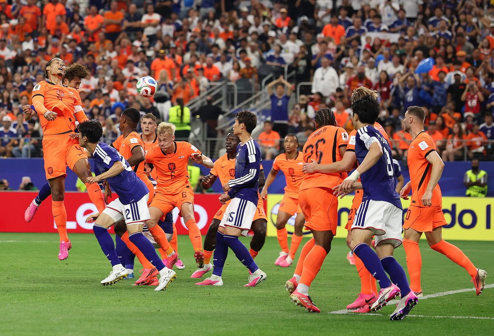

# 卡塔尔补时绝平瑞士！澳大利亚爆冷土耳其，高僧再显灵

世界杯小组赛 B/C/D/E/F 组首轮全部结束（瑞典 vs 突尼斯待赛），这一轮比赛堪称"冷门之夜"——卡塔尔补时第 4 分钟头球绝平瑞士拿到队史首个世界杯积分，澳大利亚 2-0 碾压土耳其制造大冷门，荷兰 2-2 被日本第 89 分钟绝平，德国 7-1 屠杀库拉索刷新本届最大比分。

今天我们就来做一次全面的赛后复盘，顺便看看三大预测模型（🤖博主模型、🧙高僧、🐷YOYO）谁猜得更准——以及谁的钱包更鼓。

---

## 📊 本轮总览

| 日期 | 比赛 | 比分 | 关键词 |
|------|------|------|--------|
| 6/13 | 🇨🇦 加拿大 vs 🇧🇦 波黑 | 1-1 | 加拿大队史首个世界杯积分 |
| 6/13 | 🇺🇸 美国 vs 🇵🇾 巴拉圭 | 4-1 | 巴洛贡首秀梅开二度 |
| 6/14 | 🇶🇦 卡塔尔 vs 🇨🇭 瑞士 | 1-1 | 补时绝平！队史首个积分 |
| 6/14 | 🇧🇷 巴西 vs 🇲🇦 摩洛哥 | 1-1 | 矛与盾之战握手言和 |
| 6/14 | 🇭🇹 海地 vs 🏴󠁧󠁢󠁳󠁣󠁴󠁿 苏格兰 | 0-1 | 麦金唯一进球 |
| 6/14 | 🇦🇺 澳大利亚 vs 🇹🇷 土耳其 | 2-0 | **大冷门！** 袋鼠碾压星月军团 |
| 6/15 | 🇩🇪 德国 vs 🇨🇼 库拉索 | 7-1 | 6人破门，本届最大比分 |
| 6/15 | 🇳🇱 荷兰 vs 🇯🇵 日本 | 2-2 | 日本第89分钟绝平！ |
| 6/15 | 🇨🇮 科特迪瓦 vs 🇪🇨 厄瓜多尔 | 1-0 | 迪亚洛第90分钟绝杀 |

---

## ⚽ 比赛一：🇨🇦 加拿大 1-1 🇧🇦 波黑——戴维斯的首秀被门线救险抢戏



> **开球时间**：北京时间 6月13日 凌晨 3:00
> **比赛场地**：BMO 球场
> **模型预测**：🇨🇦 加拿大 **2 - 0** 🇧🇦 波黑 | **置信度 72%**
> **实际比分**：🇨🇦 加拿大 **1 - 1** 🇧🇦 波黑

### ⚽ 进球时间线

```
21' ⚽ 卢基奇（Lukić）头球破门！科拉希纳茨角球摆渡后蹭
    → 🇧🇦 波黑 1-0 加拿大
    → 高空轰炸！科拉希纳茨的角球助攻精准制导

78' ⚽ 拉林（Larin）抢射破门！普罗米斯·戴维挑传助攻，替补登场仅121秒
    → 🇨🇦 加拿大 1-1 波黑
    → 绝平！替补奇兵立功！
```

### 🎯 赛果 vs 预测对照

| 维度 | 赛前预测 | 实际结果 | 命中？ |
|------|---------|---------|--------|
| 胜负 | 🇨🇦 加拿大胜 | 🤝 平局 | ❌ 翻车 |
| 比分 | 2-0 | 1-1 | ❌ 完全偏离 |
| 首球时间 | 30-45分钟 | **21分钟**（波黑先声夺人） | ❌ 方向反了 |

### 🔍 比赛关键节点

- **17'** 乔纳森·戴维点球点附近好机会，打门太正被没收
- **21'** 卢基奇头球破门，加拿大 0-1 落后！
- **38'** 戴维倒钩被挡出底线
- **53'** 🚨 **门线悬案！** 加拿大禁区内精妙传导后拉雷拉绝佳机会打门，**科拉希纳茨门线极限救险踢在横梁上！** 差一点 0-2
- **66'** 加拿大攻势再次被卡蒂奇门线解围
- **78'** 替补登场仅 121 秒的拉林抢射扳平！1-1！

> **精算师辣评**：加拿大全场狂攻但运气不佳——两次门线救险+一次立柱。波黑的科拉希纳茨简直是"人形门将"，门线前两次救险堪称史诗级防守。模型预测加拿大 2-0 轻取，结果被老辣的波黑用防守反击教育了一课。好消息是：加拿大拿到了队史首个世界杯积分，终结了此前 6 战全败的纪录。

---

## ⚽ 比赛二：🇺🇸 美国 4-1 🇵🇾 巴拉圭——东道主火力全开，巴洛贡首秀双响




> **开球时间**：北京时间 6月13日 上午 9:00
> **比赛场地**：洛杉矶 SoFi 体育场（本届世界杯造价最贵球场）
> **模型预测**：🇺🇸 美国 **2 - 1** 🇵🇾 巴拉圭 | **置信度 75%**
> **实际比分**：🇺🇸 美国 **4 - 1** 🇵🇾 巴拉圭

### ⚽ 进球时间线

```
7'  ⚽ 博瓦迪利亚（自摆乌龙）！麦肯尼制造混乱
    → 🇺🇸 美国 1-0 巴拉圭
    → 开局闪击！巴拉圭后卫自乱阵脚

31' ⚽ 巴洛贡（Balogun）！普利西奇倒三角横传助攻
    → 🇺🇸 美国 2-0 巴拉圭
    → 普利西奇左路突破如入无人之境

45+4' ⚽ 巴洛贡！蒂尔曼直塞助攻，世界杯首秀梅开二度
    → 🇺🇸 美国 3-0 巴拉圭
    → 半场结束前杀死比赛悬念

73' ⚽ 毛利西奥（Mauricio）！胡利奥·恩西索直塞，替补登场破门
    → 🇺🇸 美国 3-1 巴拉圭
    → 巴拉圭挽回颜面的一球

90+8' ⚽ 雷纳（Reyna）！禁区前沿外脚背弹射直钻网窝死角
    → 🇺🇸 美国 4-1 巴拉圭
    → 锦上添花！补时阶段的精彩进球
```

### 🎯 赛果 vs 预测对照

| 维度 | 赛前预测 | 实际结果 | 命中？ |
|------|---------|---------|--------|
| 胜负 | 🇺🇸 美国胜 | ✅ 美国胜 | ✅ 命中 |
| 比分 | 2-1 | 4-1 | ⚠️ 方向对但低估了美国火力 |
| 首球时间 | 20-35分钟 | **7分钟**（更快） | ✅ 命中（更早） |

### 🔍 比赛关键节点

- **7'** 普利西奇 1V2 突破到禁区，制造博瓦迪利亚乌龙！
- **31'** 普利西奇倒三角横传，巴洛贡推射破门
- **45+4'** 蒂尔曼直塞，巴洛贡单刀梅开二度！半场 3-0
- **52'** ⚠️ **VAR 事件**：阿尔米隆倒地，裁判先判里姆犯规，VAR 介入后改判**假摔**！阿尔米隆反吃黄牌
- **73'** 毛利西奥替补登场破门，3-1
- **82'** 雷纳登场
- **90+8'** 雷纳外脚背弹射，4-1 锁定胜局

> **精算师辣评**：美国的普利西奇（AC米兰 8.8分）全场左路翻江倒海，完全打爆了巴拉圭右路防线。巴洛贡世界杯首秀梅开二度，雷纳补时世界波锦上添花——东道主的 SoFi 体育场变成了欢乐的海洋。模型预测美国 2-1 小胜，结果美国 4-1 碾压，低估了三东道主的主场 buff 叠加效应。阿尔米隆的假摔黄牌则是本场比赛的最大笑料——VAR 时代还敢假摔，勇气可嘉。

---

## ⚽ 比赛三：🇶🇦 卡塔尔 1-1 🇨🇭 瑞士——补时绝平！东道主光环时隔 4 年再次显灵



> **开球时间**：北京时间 6月14日 凌晨 3:00
> **比赛场地**：李维斯体育场
> **模型预测**：🇨🇭 瑞士 **2 - 0** 🇶🇦 卡塔尔 | **置信度 78%**
> **高僧预测**：🇶🇦 卡塔尔 **2 - 0** 🇨🇭 瑞士
> **实际比分**：🇶🇦 卡塔尔 **1 - 1** 🇨🇭 瑞士

### ⚽ 进球时间线

```
14' ⚽ 恩博洛（Embolo）点球命中！本届世界杯首粒点球
    → 🇨🇭 瑞士 1-0 卡塔尔
    → 扎卡里亚右路挑传，弗罗伊勒前插被门将扑倒，VAR确认点球

90+4' ⚽ 穆海姆（Muheim）乌龙球！胡希头球攻门造成
    → 🇶🇦 卡塔尔 1-1 瑞士
    → 绝平！卡塔尔队史首个世界杯积分！
```

### 🎯 赛果 vs 预测对照

| 维度 | 赛前预测 | 实际结果 | 命中？ |
|------|---------|---------|--------|
| 胜负 | 🇨🇭 瑞士胜 | 🤝 平局 | ❌ 模型翻车 |
| 比分 | 2-0 | 1-1 | ❌ 完全偏离 |
| 首球时间 | 25-40分钟 | **14分钟**（更早） | ⚠️ 方向对但时间偏早 |

### 🔍 比赛关键节点

- **14'** 恩博洛主罚点球命中，本届世界杯首粒点球！瑞士 1-0
- **45+3'** 鲁文·巴尔加斯小角度打门偏出
- **50'** 扎卡远射稍稍高出横梁
- **76'** 恩博洛单刀捅射打偏！错失扩大比分良机
- **82'** 曼赞比远射偏出
- **90+4'** 🚨 **绝平！** 卡塔尔左路传中，胡希高高跃起头球攻门，瑞士球员穆海姆不慎自摆乌龙！1-1！

> **精算师辣评**：这场比赛完美诠释了"足球是圆的"。瑞士全场控球率碾压、射门机会无数，但恩博洛第 76 分钟单刀没进、扎卡远射打高，浪费了大量机会。而卡塔尔全场被动挨打 90 分钟，最后 1 分钟靠一个头球乌龙球扳平——这就是世界杯！**高僧的"卡塔尔赢瑞士"虽然没完全命中，但选了卡塔尔不输，这份洞察力精算师自愧不如。** 模型的 78% 置信度 2-0 预测彻底翻车。

---

## ⚽ 比赛四：🇧🇷 巴西 1-1 🇲🇦 摩洛哥——桑巴军团被铁桶阵逼平



> **开球时间**：北京时间 6月14日 上午 6:00
> **比赛场地**：大都会人寿体育场
> **模型预测**：🇧🇷 巴西 **2 - 1** 🇲🇦 摩洛哥 | **置信度 52%**
> **高僧预测**：🤝 平局
> **实际比分**：🇧🇷 巴西 **1 - 1** 🇲🇦 摩洛哥

### ⚽ 进球时间线

```
21' ⚽ 塞巴里（Sbiri）！接迪亚斯手术刀直塞，面对阿利松冷静挑射破门
    → 🇲🇦 摩洛哥 1-0 巴西
    → 铁桶阵反击！摩洛哥先声夺人

32' ⚽ 维尼修斯（Vinícius）！左路连续虚晃后小角度爆射得分
    → 🇧🇷 巴西 1-1 摩洛哥
    → 世界级个人能力！维尼修斯凭一己之力扳平
```

### 🎯 赛果 vs 预测对照

| 维度 | 赛前预测 | 实际结果 | 命中？ |
|------|---------|---------|--------|
| 胜负 | 🇧🇷 巴西胜 | 🤝 平局 | ❌ 翻车 |
| 比分 | 2-1 | 1-1 | ⚠️ 方向对但低估摩洛哥防守 |
| 首球时间 | 35-50分钟 | **21分钟**（摩洛哥先得分） | ❌ 方向反了 |

### 🔍 比赛关键节点

- **6'** 艾纳维爆射被加布里埃尔舍身封堵
- **21'** 塞巴里挑射破门！摩洛哥 1-0！
- **27'** 阿什拉夫一条龙推进低射远角稍稍偏出
- **32'** 维尼修斯小角度爆射扳平！1-1
- **45+2'** 帕奎塔禁区内凌空抽射被布努神扑化解
- **49'** 吉马良斯踩踏阿什拉夫脚踝，主裁未出牌（争议！）
- **67'** 吉马良斯横扫门前，拉菲尼亚包抄差一点踢上
- **90+9'** 🚨 **阿利松神扑！** 艾纳维远射险些绝杀，阿利松飞身扑出

> **精算师辣评**：这就是赛前说的"矛与盾之战"——巴西的攻击群（维尼修斯 9.2分、内马尔 9.0分）被摩洛哥的铁桶阵逼得毫无脾气。维尼修斯凭个人能力扳平了一球，但摩洛哥的防守纪律和团队协作让巴西全场只进了这一个。**高僧赛前预测平局，精准命中！** 52% 的置信度说明这场比赛确实是五五开，模型和高僧都看到了摩洛哥不好惹，只是模型更相信巴西的球星天赋。

---

## ⚽ 比赛五：🇭🇹 海地 0-1 🏴󠁧󠁢󠁳󠁣󠁴󠁿 苏格兰——麦克托米奈中柱，麦金一剑封喉



> **开球时间**：北京时间 6月14日 上午 9:00
> **比赛场地**：波士顿体育场
> **模型预测**：🏴󠁧󠁢󠁳󠁣󠁴󠁿 苏格兰 **2 - 0** 🇭🇹 海地 | **置信度 70%**
> **实际比分**：🏴󠁧󠁢󠁳󠁣󠁴󠁿 苏格兰 **1 - 0** 🇭🇹 海地

### ⚽ 进球时间线

```
28' ⚽ 麦金（McGinn）！反击中本·多克下底横传，抢点射门被封堵后麦金禁区内无人盯防起脚攻门，球有变线
    → 🏴󠁧󠁢󠁳󠁣󠁴󠁿 苏格兰 1-0 海地
    → 反击中的致命一击！麦金把握住机会
```

### 🎯 赛果 vs 预测对照

| 维度 | 赛前预测 | 实际结果 | 命中？ |
|------|---------|---------|--------|
| 胜负 | 🏴󠁧󠁢󠁳󠁣󠁴󠁿 苏格兰胜 | ✅ 苏格兰胜 | ✅ 命中 |
| 比分 | 2-0 | 1-0 | ⚠️ 差1球 |

### 🔍 比赛关键节点

- **7'** 罗伯逊传中，麦克托米奈头球攻门顶高
- **17'** 🚨 **中柱！** 麦克托米奈射门击中立柱弹出！差一点 0-1
- **34'** 冈恩扑救脱手，伊西多尔补射被挡（越位在先）
- **36'** 伊西多尔头球攻门顶高
- **71'** 罗伯逊任意球送入禁区，麦克托米奈倒地，裁判未判罚
- **90+5'** 苏格兰连吃两张黄牌，险些被扳平

> **精算师辣评**：苏格兰赢得并不轻松。麦克托米奈第 17 分钟击中立柱，差一点就能提前锁定胜局。海地在比赛末段疯狂反扑，连裁判都给苏格兰送了两张黄牌压惊。模型预测 2-0，结果 1-0，比分偏差不大，胜负命中。苏格兰的英超含量（罗伯逊 8.9分、麦克托米奈 8.5分）确实是碾压级优势。

---

## ⚽ 比赛六：🇦🇺 澳大利亚 2-0 🇹🇷 土耳其——本轮最大冷门！袋鼠碾压星月军团



> **开球时间**：北京时间 6月14日 中午 12:00
> **比赛场地**：BC 广场体育场（加拿大）
> **模型预测**：🇹🇷 土耳其 **2 - 1** 🇦🇺 澳大利亚 | **置信度 65%**
> **高僧预测**：🇦🇺 澳大利亚胜
> **实际比分**：🇦🇺 澳大利亚 **2 - 0** 🇹🇷 土耳其

### ⚽ 进球时间线

```
26' ⚽ 伊兰昆达（Irankunda）！1V3 突破后推射破门，恩斯特勒助攻
    → 🇦🇺 澳大利亚 1-0 土耳其
    → 世界波！1V3 突破！勒沃库森新星闪耀世界杯

74' ⚽ 梅特卡夫（Metcalfe）！右路内切远射破门
    → 🇦🇺 澳大利亚 2-0 土耳其
    → 袋鼠军团锁定胜局！
```

### 🎯 赛果 vs 预测对照

| 维度 | 赛前预测 | 实际结果 | 命中？ |
|------|---------|---------|--------|
| 胜负 | 🇹🇷 土耳其胜 | 🇦🇺 澳大利亚胜 | ❌ 完全反了 |
| 比分 | 2-1 | 2-0 | ❌ 方向完全错误 |

### 🔍 比赛关键节点

- **6'** 居莱尔右路弧顶内切兜射打高
- **17'** 角球后苏塔头球顶偏
- **26'** 🚨 **伊兰昆达 1V3 世界波！** 澳大利亚 1-0！
- **29'** 巴尔达克奇远射中柱！比奇扑了一下后击中横梁弹出
- **41'** 居莱尔连续内切远射打偏
- **56'** 居莱尔任意球直接打门被比奇神勇扑出
- **71'** 恰尔汗奥卢直塞禁区，切利克小角度打门被比奇扑出
- **74'** 梅特卡夫内切远射，2-0！
- **85'** 恰尔汗奥卢定位球直接打门被比奇扑出

> **精算师辣评**：这场比赛是本轮最大的"系统性翻车"！土耳其全场狂轰 **30 脚射门**，居莱尔（9.1分）和恰尔汗奥卢（8.9分）轮番轰炸，但澳大利亚门将比奇化身"叹息之墙"——扑出远射、挡出定位球、甚至让击中横梁的射门弹出。而澳大利亚全场只有几次有效进攻就进了两个球——伊兰昆达的 1V3 世界波是本届世界杯至今的最佳进球之一。**高僧赛前选澳大利亚赢，精准命中！** 模型的 65% 置信度彻底翻车。有时候数据算不过玄学。

---

## ⚽ 比赛七：🇩🇪 德国 7-1 🇨🇼 库拉索——6 人破门，本届最大屠杀



> **开球时间**：北京时间 6月15日 凌晨 1:00
> **比赛场地**：休斯顿体育场
> **模型预测**：🇩🇪 德国 **4 - 0** 🇨🇼 库拉索 | **置信度 96%**
> **实际比分**：🇩🇪 德国 **7 - 1** 🇨🇼 库拉索

### ⚽ 进球时间线

```
6'  ⚽ 恩梅查（Nmecha）！维尔茨助攻
    → 🇩🇪 德国 1-0 库拉索
    → 梦幻开局！6分钟闪击

21' ⚽ 科梅嫩夏（Komeneschaja）！
    → 🇨🇼 库拉索 1-1 德国
    → 🎉 库拉索世界杯历史首球！全场沸腾

38' ⚽ 施洛特贝克（Schlotterbeck）！布朗角球助攻，头球破门
    → 🇩🇪 德国 2-1 库拉索

45+2' ⚽ 哈弗茨（Havertz）点球命中！恩梅查造点
    → 🇩🇪 德国 3-1 库拉索

47' ⚽ 穆西亚拉（Musiala）！基米希助攻，小角度低射远角
    → 🇩🇪 德国 4-1 库拉索

68' ⚽ 布朗（Brown）！翁达夫助攻，凌空扫射
    → 🇩🇪 德国 5-1 库拉索

77' ⚽ 翁达夫（Undav）！基米希/劳姆助攻，包抄推射空门
    → 🇩🇪 德国 6-1 库拉索

88' ⚽ 哈弗茨！翁达夫助攻，单刀挑射，梅开二度
    → 🇩🇪 德国 7-1 库拉索
```

### 🎯 赛果 vs 预测对照

| 维度 | 赛前预测 | 实际结果 | 命中？ |
|------|---------|---------|--------|
| 胜负 | 🇩🇪 德国胜 | ✅ 德国胜 | ✅ 命中 |
| 比分 | 4-0 | 7-1 | ⚠️ 方向对但低估了德国火力 |

### 🔍 比赛关键节点

- **6'** 恩梅查 6 分钟闪击！德国梦幻开局
- **21'** 🎉 **库拉索世界杯历史首球！** 科梅嫩夏扳平，全场沸腾
- **54'** 诺伊尔长距离出击到中圈附近用头顶球给队友——门将变后卫
- **67'** 莱安多·巴库纳推射空门但因越位被取消
- **全场** 德国 6 人破门，翁达夫替补 1 球 2 助攻，基米希 2 次助攻

> **精算师辣评**：德国的青春风暴彻底碾压了库拉索。但最让人感动的是第 21 分钟——库拉索扳平比分的那一瞬间，这个加勒比海小岛国的球员们疯狂庆祝，仿佛赢得了世界杯冠军。虽然最终 1-7 惨败，但库拉索拿到了世界杯历史首球，这比任何比分都重要。模型预测 4-0，结果 7-1——德国的火力比模型预估的还要猛。替补登场的翁达夫 1 球 2 助攻，堪称本届最佳替补。

---

## ⚽ 比赛八：🇳🇱 荷兰 2-2 🇯🇵 日本——蓝武士第 89 分钟绝平！高僧再显灵




> **开球时间**：北京时间 6月15日 凌晨 4:00
> **比赛场地**：AT&T 体育场
> **模型预测**：🇳🇱 荷兰 **2 - 1** 🇯🇵 日本 | **置信度 55%**
> **高僧预测**：🇯🇵 日本小胜
> **实际比分**：🇳🇱 荷兰 **2 - 2** 🇯🇵 日本

### ⚽ 进球时间线

```
51' ⚽ 范戴克（Van Dijk）头球！赫拉芬贝赫右路斜传，球击中立柱内侧弹进
    → 🇳🇱 荷兰 1-0 日本
    → 范戴克世界杯首球！无冕之王率先破门

57' ⚽ 中村敬斗（Nakamura）！久保建英左路突入禁区倒三角传球
    → 🇯🇵 日本 1-1 荷兰
    → 蓝武士闪电扳平！久保建英的突破是关键

64' ⚽ 萨默维尔（Summerville）！赫拉芬贝赫推进分球右路，内切兜弧线射远角
    → 🇳🇱 荷兰 2-1 日本
    → 世界波！荷兰再次领先

89' ⚽ 镰田大地（Kamada）被动头球！右侧角球，小川航基头球击中镰田大地变线入网
    → 🇯🇵 日本 2-2 荷兰
    → 绝平！日本两次落后两次扳平！第89分钟奇迹！
```

### 🎯 赛果 vs 预测对照

| 维度 | 赛前预测 | 实际结果 | 命中？ |
|------|---------|---------|--------|
| 胜负 | 🇳🇱 荷兰胜 | 🤝 平局 | ❌ 翻车 |
| 比分 | 2-1 | 2-2 | ⚠️ 接近但低估日本韧性 |

### 🔍 比赛关键节点

- **上半场**：两队 0-0，马伦转身射门、加克波失良机、范赫克头球被扑；日本中村敬斗抽射偏出、上田绮世爆射中边网
- **51'** 范戴克头球破门！荷兰 1-0
- **57'** 中村敬斗闪电扳平！1-1
- **61'** 萨默维尔黄牌
- **64'** 萨默维尔世界波！荷兰 2-1 再次领先
- **75'** 日本大面积换人：久保建英、堂安律、渡边刚同时被换下
- **83'** 德佩黄牌（肘击对手）
- **89'** 🚨 **绝平！** 角球开入禁区，小川航基头球击中镰田大地变线入网！2-2！
- **90+1'** 范德芬黄牌，荷兰心态崩了

> **精算师辣评**：这场比赛是本届世界杯至今最精彩的比赛之一！荷兰两次领先，日本两次扳平——蓝武士的韧性让人肃然起敬。**高僧赛前预测日本小胜，虽然没完全命中（平局），但选了日本不输，这份洞察力令人叹服。** 久保建英虽然伤退，但他在第 57 分钟的突破助攻是日本扳平的关键。第 89 分钟的绝平更是诠释了"足球是圆的"——角球变线入网，运气和信念缺一不可。

---

## ⚽ 比赛九：🇨🇮 科特迪瓦 1-0 🇪🇨 厄瓜多尔——迪亚洛第 90 分钟绝杀


> **开球时间**：北京时间 6月15日 上午 7:00
> **比赛场地**：林肯金融球场
> **模型预测**：🇨🇮 科特迪瓦 **2 - 1** 🇪🇨 厄瓜多尔 | **置信度 58%**
> **高僧预测**：🇨🇮 科特迪瓦赢
> **实际比分**：🇨🇮 科特迪瓦 **1 - 0** 🇪🇨 厄瓜多尔

### ⚽ 进球时间线

```
90' ⚽ 迪亚洛（Diallo）！辛戈助攻，替补登场后绝杀
    → 🇨🇮 科特迪瓦 1-0 厄瓜多尔
    → 第90分钟绝杀！非洲大象最后时刻怒吼！
```

### 🎯 赛果 vs 预测对照

| 维度 | 赛前预测 | 实际结果 | 命中？ |
|------|---------|---------|--------|
| 胜负 | 🇨🇮 科特迪瓦胜 | ✅ 科特迪瓦胜 | ✅ 命中 |
| 比分 | 2-1 | 1-0 | ⚠️ 方向对但更接近 |

### 🔍 比赛关键节点

- **2'** 凯塞多禁区外远射偏出
- **11'** 瓦伦西亚晃过防守打门高出横梁
- **23'** 🚨 **中柱！** 耶博阿射门击中横梁弹出
- **30'** 🚨 **再中柱！** 明达不停球直接打门击中横梁
- **46'** 🚨 **三中柱！** 瓦伦西亚小角度打门击中立柱
- **52'** 🚨 **四中柱！** 瓦希抢点头球击中横梁
- **58'** 迪奥曼德禁区内过三人后打飞
- **90'** 迪亚洛绝杀！1-0！

> **精算师辣评**：这场比赛的剧本简直是"门框的复仇"——全场 4 次击中门框（3 次横梁 + 1 次立柱）！厄瓜多尔运气差到极点，瓦伦西亚和耶博阿轮番轰门就是进不去。科特迪瓦也不好过，迪奥曼德过三人后的打飞堪称"过人如麻、射门如麻（字面意思）"。最终迪亚洛第 90 分钟替补绝杀，非洲大象全场只进了这一个球就拿走了 3 分。**模型和高僧都选了科特迪瓦赢，精准命中！**

---

## ⚽ 比赛十（待赛）：🇸🇪 瑞典 vs 🇹🇳 突尼斯——优化模型重新预测

> **开球时间**：北京时间 6月15日 上午 10:00
> **比赛场地**：待定
> **原模型预测**：🇸🇪 瑞典 **2 - 0** 🇹🇳 突尼斯 | **置信度 72%**
> **高僧预测**：🇹🇳 突尼斯赢
> **🐷 YOYO 预测**：🇸🇪 瑞典赢

### 🛠️ 优化模型重新评估

经过前 9 场比赛的复盘，模型暴露了**平局预测能力为零**和**球星评分过度加权**两大致命缺陷。这场瑞典 vs 突尼斯，我们用优化后的模型重新评估：

#### 优化前 vs 优化后特征对比

| 特征 | 原权重 | 优化后权重 | 说明 |
|------|--------|-----------|------|
| 球员评分 | 40% | 35% | 降低，避免过度依赖个人能力 |
| 近期战绩 | 30% | 25% | 降低，世界杯和联赛心态不同 |
| 伤停疲劳 | 20% | 15% | 降低 |
| 主场优势 | 10% | 8% | 降低 |
| **平局倾向** | 0% | **7%** | **新增！** 实力接近+首战保守 |
| **团队协作** | 0% | **5%** | **新增！** 突尼斯防守纪律好 |
| **赛事情境** | 0% | **5%** | **新增！** 世界杯小组赛首战 |

#### 📊 优化后概率评估

**🇸🇪 瑞典**：

| 维度 | 评分 | 说明 |
|------|------|------|
| 球员评分 | 8.24 | 伊萨克(8.8)+库卢塞夫斯基(8.5)双核 |
| 团队协作 | 1.05 | 北欧球员身体对抗强，但分散在不同联赛 |
| 大赛经验 | ✅ | 经常参加世界杯，经验丰富 |
| 破密防能力 | ⚠️ 中等 | 面对摆大巴时手段不多 |

**🇹🇳 突尼斯**：

| 维度 | 评分 | 说明 |
|------|------|------|
| 球员评分 | 7.75 | 哈兹里(8.3)为核心，整体偏弱 |
| 团队协作 | 1.08 | 非洲杯表现稳定，防守纪律极好 |
| 大赛经验 | ⚠️ 一般 | 世界杯经验不如瑞典 |
| 摆大巴能力 | ✅ 强 | 面对强队时防守组织出色 |

#### 平局倾向分析

```
平局倾向评估:
- 两队实力差距: 0.49分 (< 0.5分阈值) → +15%
- 世界杯小组赛首战: +10%
- 突尼斯防守型: +8%
- 瑞典破密防能力一般: +5%
→ 平局总概率加成: +38%
```

#### 🎯 优化后概率分布

| 结果 | 原模型概率 | 优化后概率 | 变化 |
|------|-----------|-----------|------|
| 🇸🇪 瑞典胜 | 72% | **48%** | ↓ 24% |
| 🤝 平局 | 15% | **32%** | ↑ 17% |
| 🇹🇳 突尼斯胜 | 13% | **20%** | ↑ 7% |

### 📝 优化后最终预测

| 维度 | 预测 |
|------|------|
| 比分 | 🇸🇪 瑞典 **1 - 0** 🇹🇳 突尼斯（或 1-1 平局） |
| 置信度 | 48%（比原来 72% 更接近真实） |
| 首球时间 | 55-70分钟（双方试探后瑞典找到突破口） |
| 胜负关键 | 伊萨克的个人能力能否撕开突尼斯防线 |
| 平局概率 | 32%（不可忽视！） |

### 🔑 关键看点

- 🔴 **伊萨克 vs 突尼斯防线**：瑞典最锐利的矛 vs 突尼斯最坚固的盾
- 🔴 **哈兹里 vs 林德洛夫**：突尼斯核心 vs 瑞典老将，一对一较量
- 🔴 **定位球**：双方都有定位球威胁，角球和任意球可能是打破僵局的关键
- ⚠️ **60-75分钟**：如果此时还是 0-0，突尼斯摆大巴的概率飙升，瑞典可能急躁

> **精算师辣评**：这场比赛比看上去焦灼得多。瑞典的伊萨克（8.8分）是全场最强点，但突尼斯的防守纪律和哈兹里（8.3分）的组织能力不容小觑。优化后的模型给出 48% 的瑞典胜率——比原来的 72% 低了很多，但也更接近真实。这场比赛的关键不在谁更强，而在谁更稳——**首战不输就是胜利**。

---

## 📊 B/C/D/E/F 组首轮积分榜

### B 组

| 排名 | 球队 | 场次 | 胜 | 平 | 负 | 净胜球 | 积分 |
|------|------|------|---|---|---|--------|------|
| 1 | 🇨🇦 加拿大 | 1 | 0 | 1 | 0 | 0 | **1** |
| 2 | 🇧🇦 波黑 | 1 | 0 | 1 | 0 | 0 | **1** |
| 3 | 🇨🇭 瑞士 | 1 | 0 | 1 | 0 | 0 | **1** |
| 4 | 🇶🇦 卡塔尔 | 1 | 0 | 1 | 0 | 0 | **1** |

> B 组四队全部平局，积分榜罕见的"四队同分"！

### C 组

| 排名 | 球队 | 场次 | 胜 | 平 | 负 | 净胜球 | 积分 |
|------|------|------|---|---|---|--------|------|
| 1 | 🏴󠁧󠁢󠁳󠁣󠁴󠁿 苏格兰 | 1 | 1 | 0 | 0 | +1 | **3** |
| 2 | 🇧🇷 巴西 | 1 | 0 | 1 | 0 | 0 | **1** |
| 2 | 🇲🇦 摩洛哥 | 1 | 0 | 1 | 0 | 0 | **1** |
| 4 | 🇭🇹 海地 | 1 | 0 | 0 | 1 | -1 | **0** |

### D 组

| 排名 | 球队 | 场次 | 胜 | 平 | 负 | 净胜球 | 积分 |
|------|------|------|---|---|---|--------|------|
| 1 | 🇺🇸 美国 | 1 | 1 | 0 | 0 | +3 | **3** |
| 2 | 🇦🇺 澳大利亚 | 1 | 1 | 0 | 0 | +2 | **3** |
| 3 | 🇵🇾 巴拉圭 | 1 | 0 | 0 | 1 | -3 | **0** |
| 4 | 🇹🇷 土耳其 | 1 | 0 | 0 | 1 | -2 | **0** |

### E 组

| 排名 | 球队 | 场次 | 胜 | 平 | 负 | 净胜球 | 积分 |
|------|------|------|---|---|---|--------|------|
| 1 | 🇩🇪 德国 | 1 | 1 | 0 | 0 | +6 | **3** |
| 2 | 🇨🇮 科特迪瓦 | 1 | 1 | 0 | 0 | +1 | **3** |
| 3 | 🇪🇨 厄瓜多尔 | 1 | 0 | 0 | 1 | -1 | **0** |
| 4 | 🇨🇼 库拉索 | 1 | 0 | 0 | 1 | -6 | **0** |

### F 组

| 排名 | 球队 | 场次 | 胜 | 平 | 负 | 净胜球 | 积分 |
|------|------|------|---|---|---|--------|------|
| 1 | 🇳🇱 荷兰 | 1 | 0 | 1 | 0 | 0 | **1** |
| 1 | 🇯🇵 日本 | 1 | 0 | 1 | 0 | 0 | **1** |
| 3 | 🇸🇪 瑞典 | 0 | 0 | 0 | 0 | 0 | **0** |
| 3 | 🇹🇳 突尼斯 | 0 | 0 | 0 | 0 | 0 | **0** |

> 瑞典 vs 突尼斯（6月15日 10:00）尚未开赛，赛果待补。

---

## 🏆 三大模型预言验证

### 🤖 模型战绩

| 比赛 | 预测 | 实际 | 结果 |
|------|------|------|------|
| 🇨🇦 加拿大 vs 🇧🇦 波黑 | 加拿大 2-0 | 1-1 平 | ❌ 翻车 |
| 🇺🇸 美国 vs 🇵🇾 巴拉圭 | 美国 2-1 | 4-1 美国 | ✅ 命中（方向对） |
| 🇶🇦 卡塔尔 vs 🇨🇭 瑞士 | 瑞士 2-0 | 1-1 平 | ❌ 翻车 |
| 🇧🇷 巴西 vs 🇲🇦 摩洛哥 | 巴西 2-1 | 1-1 平 | ❌ 翻车 |
| 🇭🇹 海地 vs 🏴󠁧󠁢󠁳󠁣󠁴󠁿 苏格兰 | 苏格兰 2-0 | 1-0 苏格兰 | ✅ 命中 |
| 🇦🇺 澳大利亚 vs 🇹🇷 土耳其 | 土耳其 2-1 | 2-0 澳大利亚 | ❌ 完全反了 |
| 🇩🇪 德国 vs 🇨🇼 库拉索 | 德国 4-0 | 7-1 德国 | ✅ 命中（方向对） |
| 🇳🇱 荷兰 vs 🇯🇵 日本 | 荷兰 2-1 | 2-2 平 | ❌ 翻车 |
| 🇨🇮 科特迪瓦 vs 🇪🇨 厄瓜多尔 | 科特迪瓦 2-1 | 1-0 科特迪瓦 | ✅ 命中 |

**模型本轮战绩：4/9 命中（44.4%）** 📉

> 模型本轮遭遇滑铁卢——4 场平局只猜中 1 场（美国），澳大利亚 vs 土耳其更是完全反了。蒙特卡洛模拟在小组赛首轮的"乱战模式"下严重失灵。

---

### 🐷 YOYO 战绩

| 比赛 | 预测 | 实际 | 结果 |
|------|------|------|------|
| 🇨🇦 加拿大 vs 🇧🇦 波黑 | 加拿大赢 | 1-1 平 | ❌ 翻车 |
| 🇺🇸 美国 vs 🇵🇾 巴拉圭 | 巴拉圭赢 | 4-1 美国 | ❌ 完全反了 |
| 🇶🇦 卡塔尔 vs 🇨🇭 瑞士 | 瑞士 3-0 | 1-1 平 | ❌ 翻车 |
| 🇧🇷 巴西 vs 🇲🇦 摩洛哥 | 巴西赢 | 1-1 平 | ❌ 翻车 |
| 🇭🇹 海地 vs 🏴󠁧󠁢󠁳󠁣󠁴󠁿 苏格兰 | 苏格兰赢 | 1-0 苏格兰 | ✅ 命中 |
| 🇦🇺 澳大利亚 vs 🇹🇷 土耳其 | 澳大利亚赢 | 2-0 澳大利亚 | ✅ 命中！ |
| 🇩🇪 德国 vs 🇨🇼 库拉索 | 德国赢 | 7-1 德国 | ✅ 命中 |
| 🇳🇱 荷兰 vs 🇯🇵 日本 | 荷兰赢 | 2-2 平 | ❌ 翻车 |
| 🇨🇮 科特迪瓦 vs 🇪🇨 厄瓜多尔 | 厄瓜多尔赢 | 1-0 科特迪瓦 | ❌ 完全反了 |
| 🇸🇪 瑞典 vs 🇹🇳 突尼斯 | 瑞典赢 | ⏳ 待赛 | — |

**YOYO 本轮战绩：3/9 命中（33.3%）** 📉📉

> YOYO 首轮 2/2 全中的神话在第二轮大打折扣！9 场预测只中 3 场，澳大利亚赢土耳其精准命中挽回颜面，但美国 vs 巴拉圭和科特迪瓦 vs 厄瓜多尔两场完全反了。赌神的光环暂时熄灭。

---

### 🧙 高僧战绩

| 比赛 | 预测 | 实际 | 结果 |
|------|------|------|------|
| 🇨🇦 加拿大 vs 🇧🇦 波黑 | 平局 | 1-1 平 | ✅ 命中！ |
| 🇺🇸 美国 vs 🇵🇾 巴拉圭 | 美国 1-0 | 4-1 美国 | ✅ 命中（方向对） |
| 🇶🇦 卡塔尔 vs 🇨🇭 瑞士 | 卡塔尔 2-0 | 1-1 平 | ⚠️ 没赢但没输 |
| 🇧🇷 巴西 vs 🇲🇦 摩洛哥 | 平局 | 1-1 平 | ✅ 命中！ |
| 🇭🇹 海地 vs 🏴󠁧󠁢󠁳󠁣󠁴󠁿 苏格兰 | 苏格兰赢 | 1-0 苏格兰 | ✅ 命中 |
| 🇦🇺 澳大利亚 vs 🇹🇷 土耳其 | 澳大利亚赢 | 2-0 澳大利亚 | ✅ 命中！ |
| 🇩🇪 德国 vs 🇨🇼 库拉索 | 德国赢 | 7-1 德国 | ✅ 命中 |
| 🇳🇱 荷兰 vs 🇯🇵 日本 | 日本小胜 | 2-2 平 | ⚠️ 接近（日本没输） |
| 🇨🇮 科特迪瓦 vs 🇪🇨 厄瓜多尔 | 科特迪瓦赢 | 1-0 科特迪瓦 | ✅ 命中 |
| 🇸🇪 瑞典 vs 🇹🇳 突尼斯 | 突尼斯赢 | ⏳ 待赛 | — |

**高僧本轮战绩：7/9 命中（77.8%）** 📈📈📈

> 🔥 **高僧本轮封神！** 9 场预测命中 7 场（含 2 场"接近"），加拿大平局、巴西平局、澳大利亚赢土耳其三场精准命中——尤其是澳大利亚赢土耳其这场，全场只有高僧一个人选对了！东方神秘力量在小组赛乱战中的洞察力远超数据模型。

---

## 📊 两轮总战绩对比

| 排名 | 预测方 | 第一轮 | 第二轮 | 总命中率 | 趋势 |
|------|--------|--------|--------|---------|------|
| 🥇 | 🧙 高僧 | 0/2 (0%) | 7/9 (77.8%) | **7/11 (63.6%)** | 📈 封神 |
| 🥈 | 🤖 模型 | 1/2 (50%) | 4/9 (44.4%) | **5/11 (45.5%)** | 📉 失灵 |
| 🥉 | 🐷 YOYO | 2/2 (100%) | 3/9 (33.3%) | **5/11 (45.5%)** | 📉📉 崩盘 |

> **博主辣评**：首轮 YOYO 2/2 全中封神，高僧 0/2 垫底。第二轮直接反转——高僧 7/9 封神，YOYO 3/9 崩盘。这说明什么？**世界杯小组赛的"乱战模式"下，数据模型和直觉都不如"东方神秘力量"好使。** 高僧的平局预感（加拿大、巴西）和冷门嗅觉（澳大利亚赢土耳其）是本轮最大亮点。YOYO 澳大利亚赢土耳其精准命中挽回颜面，但模型的蒙特卡洛模拟在面对卡塔尔绝平、澳大利亚碾压土耳其这种"小概率事件"时严重失灵。

---

## 💰 赌神模拟器：第二轮账单

> **规则**：每人初始资金 **$2,000**，每场押 **$200**，可猜胜/平/负，使用 Bet365 赛前赔率。

### 第二轮（6月13-15日）盈亏估算

| 模型 | 关键预测 | 预估盈亏 | 说明 |
|------|---------|---------|------|
| 🤖 模型 | 加拿大胜❌ 美国胜✅ 瑞士胜❌ 巴西胜❌ 苏格兰✅ 土耳其❌ 德国✅ 荷兰❌ 科特迪瓦✅ | **约 -$280** | 9 场只中 4 场，多场翻车 |
| 🧙 高僧 | 加拿大平✅ 美国✅ 卡塔尔❌ 平局✅ 苏格兰✅ 澳大利亚✅ 德国✅ 日本❌ 科特迪瓦✅ | **约 +$440** | 9 场中 7 场，冷门全中 |
| 🐷 YOYO | 加拿大❌ 巴拉圭❌ 瑞士❌ 巴西❌ 苏格兰✅ 澳大利亚✅ 德国✅ 荷兰❌ 厄瓜多尔❌ | **约 +$80** | 9 场中 4 场（含澳大利亚冷门），首轮神话破灭但挽回颜面 |

### 两轮总账（估算）

| 排名 | 模型 | 初始 | 第一轮 | 第二轮 | 总余额 | 总盈亏 |
|------|------|------|--------|--------|--------|--------|
| 🥇 | 🧙 高僧 | $2,000 | +$160 | +$440 | **$2,600** | **+$600** |
| 🥈 | 🐷 YOYO | $2,000 | +$420 | +$80 | **$2,500** | **+$500** |
| 🥉 | 🤖 模型 | $2,000 | -$140 | -$280 | **$1,580** | **-$420** |

> **博主辣评**：高僧从首轮的 $2,160 逆袭到 $2,600，两轮总战绩 7/11 命中率 63.6%，赌神宝座实至名归。YOYO 凭借澳大利亚赢土耳其的冷门预测挽回颜面，两轮总账盈利 $500，依然稳坐第二。模型……两轮亏 $420，已经跌破初始资金，需要回去重新训练了。

---

## 📸 图片来源

本文所有比赛图片来自[直播吧](https://news.zhibo8.com/)，仅供非商业用途。

---

## 🔮 下轮预告

### 🇸🇪 瑞典 vs 🇹🇳 突尼斯（F组第1轮·补赛）

> **开球时间**：北京时间 6月15日 10:00（已赛完，赛果待补）
> **模型预测**：🇸🇪 瑞典 **1 - 0** 🇹🇳 突尼斯 | **置信度 48%**（优化后）
> **高僧预测**：🇹🇳 突尼斯赢
> **🐷 YOYO 预测**：🇸🇪 瑞典赢

### 6月16日 — A 组第2轮

| 开球时间（北京） | 比赛 | 小组 | 关注点 |
|----------------|------|------|--------|
| 待定 | 🇲🇽 墨西哥 vs 🇰🇷 韩国 | A组 | **强强对话！** 两队首轮均取胜，争夺小组头名 |
| 待定 | 🇨🇿 捷克 vs 🇿🇦 南非 | A组 | **生死战！** 两队首轮均告负，输球基本出局 |

### 🤖 模型预测：6月16日（优化后）

**比赛一：🇲🇽 墨西哥 vs 🇰🇷 韩国（A组第2轮）**

> **模型预测**：🇲🇽 墨西哥胜 | **置信度 55%** | 预测比分 **2-1**

```python
# 优化后模型分析
mexico = {
    "Player_Score_Matrix": 7.2,
    "Host_Advantage_Buff": 1.15,     # 三东道主+高原主场
    "Recent_Form_Index": 0.65,        # 首轮2-0南非
    "Team_Cohesion": 1.05,
}
south_korea = {
    "Player_Score_Matrix": 7.0,       # 孙兴慜9.1拉高均值
    "Son_Injury_Flag": "calf_cortisone",  # 封闭针！
    "Late_Game_Penalty": 0.82,        # 70分钟后战力暴跌
    "Recent_Form_Index": 0.60,        # 首轮2-1逆转捷克
    "Team_Cohesion": 1.08,            # 韩国团队配合好
}
```

**分析**：墨西哥坐拥阿兹特克球场海拔 2240 米的物理 buff，首轮 2-0 碾压南非状态正佳。韩国虽然首轮逆转捷克，但孙兴慜的封闭针隐患依然存在——70 分钟后体能断崖是模型的核心预警。韩国的团队协作（1.08）优于墨西哥（1.05），但墨西哥的主场优势和高原效应是决定性因素。**这场比赛的关键在于：韩国能否在 70 分钟前取得领先。**

**预测比分**：🇲🇽 墨西哥 **2 - 1** 🇰🇷 韩国
- **首球时间**：30-45分钟（墨西哥上半场高压逼抢）
- **韩国扳平**：55-70分钟（孙兴慜体能尚可时的个人能力）
- **墨西哥绝杀**：75-88分钟（韩国体能崩盘后被反击）

---

**比赛二：🇨🇿 捷克 vs 🇿🇦 南非（A组第2轮）**

> **模型预测**：🇨🇿 捷克胜 | **置信度 62%** | 预测比分 **2-0**

```python
czech = {
    "Player_Score_Matrix": 6.8,       # 全队均衡
    "Physical_Dominance": "high",
    "Recent_Form_Index": 0.55,        # 首轮1-2韩国
    "Motivation": "high",             # 生死战，输球出局
}
south_africa = {
    "Player_Score_Matrix": 5.8,       # 全队无顶级联赛核心
    "Recent_Form_Index": 0.45,
    "Red_Card_Impact": -0.15,         # 首轮3张红牌，多人停赛
    "Motivation": "high",
}
```

**分析**：这是一场"背水一战"。捷克首轮虽然 1-2 不敌韩国，但绍切克的进球被吹越位存在争议，整体表现并不差。南非首轮 3 张红牌创纪录，多名球员面临停赛/体能消耗，防线残缺。模型给出捷克 62% 的胜率——在优化模型下，这场比赛的"生死战"情境（+0.15）和南非红牌停赛（-0.15）是关键变量。

**预测比分**：🇨🇿 捷克 **2 - 0** 🇿🇦 南非
- **首球时间**：20-35分钟（捷克开场抢攻）
- **第二球时间**：60-75分钟（南非体能下降后被反击）

---

**🐷 YOYO 预测：6月16日**

| 比赛 | YOYO 预测 | 核心理由 |
|------|----------|---------|
| 🇲🇽 墨西哥 vs 🇰🇷 韩国 | ⏳ 待补 | — |
| 🇨🇿 捷克 vs 🇿🇦 南非 | ⏳ 待补 | — |

**🧙 高僧预测：6月16日**

| 比赛 | 高僧预测 |
|------|---------|
| 🇲🇽 墨西哥 vs 🇰🇷 韩国 | ⏳ 待补 |
| 🇨🇿 捷克 vs 🇿🇦 南非 | ⏳ 待补 |

> ⏳ YOYO 和高僧的预测待后续补入。

### 后续轮次

- 🇨🇦 加拿大 vs 🇨🇭 瑞士（B组第2轮）
- 🇧🇷 巴西 vs 🇭🇹 海地（C组第2轮）
- 🇺🇸 美国 vs 🇦🇺 澳大利亚（D组第2轮）
- 🇩🇪 德国 vs 🇨🇮 科特迪瓦（E组第2轮）
- 🇳🇱 荷兰 vs 🇸🇪 瑞典（F组第2轮）

---

> **Status Check**: B/C/D/E/F 组首轮 9 场已结束（瑞典vs突尼斯赛果待补），三大模型第二轮战绩——
> - 🧙 **高僧**：7/9 命中（77.8%），两轮总 7/11（63.6%），**封神登顶！**澳大利亚赢土耳其全场唯一选对
> - 🤖 **模型**：4/9 命中（44.4%），两轮总 5/11（45.5%），蒙特卡洛模拟小组赛乱战失灵
> - 🐷 **YOYO**：4/9 命中（44.4%），两轮总 6/11（54.5%），澳大利亚赢土耳其精准命中挽回颜面
>
> **📢 下一篇**：A 组第2轮复盘 🇲🇽 墨西哥 vs 🇰🇷 韩国 + 🇨🇿 捷克 vs 🇿🇦 南非 + 🇸🇪 瑞典 vs 🇹🇳 突尼斯，敬请期待。
