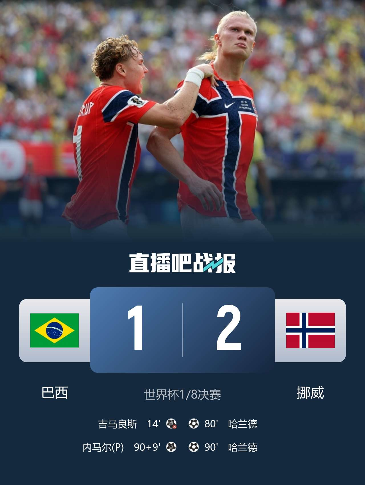
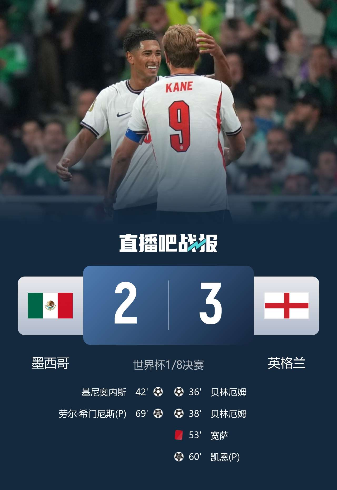

# 哈兰德双响！挪威2-1淘汰巴西！梅西里程碑！阿根廷3-2加时胜！贝林双响10人英格兰3-2墨西哥！摩洛哥3-0加拿大！

> 📊 **世界杯1/8决赛第4-6比赛日，7场生死战！** 埃及点球5-3澳大利亚晋级！梅西连续8场世界杯进球，阿根廷加时3-2佛得角惊险过关！哥伦比亚1-0加纳！摩洛哥3-0加拿大将战法国！法国1-0巴拉圭，姆巴佩世界杯第19球！哈兰德双响挪威2-1淘汰五星巴西！贝林厄姆双响+凯恩点射，十人英格兰3-2墨西哥晋级！

世界杯1/8决赛第4-6比赛日，这是属于**爆冷**、**加时**与**绝对巨星**的三天——梅西连续8场世界杯进球，阿根廷加时3-2险胜佛得角，梅西的世界杯总进球数达到21球！哈兰德梅开二度，挪威2-1淘汰五星巴西，巴西创下近20年世界杯最差战绩！贝林厄姆2分钟2球，十人英格兰3-2客场击败墨西哥！摩洛哥3-0完胜加拿大，法国1-0小胜巴拉圭，摩洛哥与法国将在1/4决赛上演非洲vs欧洲的巅峰对决！埃及点球大战5-3淘汰澳大利亚，哥伦比亚1-0击败加纳！

今天我们来做赛后复盘，验证上一轮的预测。

---

## 📊 本轮总览（7场全部结束）

| 日期 | 比赛 | 比分 | 关键词 |
|------|------|------|--------|
| 7/4 | 🇦🇺 澳大利亚 vs 🇪🇬 埃及 | 1-1（点球2-4） | **点杀！** 埃及点球5-3淘汰澳大利亚晋级16强！ |
| 7/4 | 🇦🇷 阿根廷 vs 🇨🇻 佛得角 | 3-2（加时） | **进球大战！** 梅西连续8场世界杯进球+个人第20/21球！ |
| 7/4 | 🇨🇴 哥伦比亚 vs 🇬🇭 加纳 | 1-0 | **完胜！** 阿里亚斯制胜+迪亚斯失单刀！ |
| 7/5 | 🇨🇦 加拿大 vs 🇲🇦 摩洛哥 | 0-3 | **完胜！** 乌纳希双响+迪亚斯两助，摩洛哥晋级8强将战法国！ |
| 7/5 | 🇵🇾 巴拉圭 vs 🇫🇷 法国 | 0-1 | **点射！** 姆巴佩点球制胜+世界杯第19球！ |
| 7/6 | 🇧🇷 巴西 vs 🇳🇴 挪威 | 1-2 | **爆冷！** 哈兰德双响+谢尔德鲁普两助，挪威首进8强！ |
| 7/6 | 🇲🇽 墨西哥 vs 🏴󠁧󠁢󠁥󠁮󠁧󠁿 英格兰 | 2-3 | **红牌+点球！** 贝林双响+凯恩点射+宽萨直红，十人英格兰险胜！ |

---

## ⚽ 比赛一：🇦🇺 澳大利亚 1-1（点球2-4）🇪🇬 埃及——点杀！埃及点球淘汰澳大利亚晋级16强！

> **开球时间**：北京时间 7月4日 凌晨 2:00
> **比赛场地**：AT&T体育场（美国）
> **比赛阶段**：1/16决赛
> **模型预测**：🇪🇬 **埃及胜**
> **高僧预测**：🇪🇬 **埃及胜**
> **🐷 YOYO 预测**：🇦🇺 **澳大利亚胜**
> **实际比分**：🇦🇺 澳大利亚 **1 - 1** 🇪🇬 埃及（点球2-4，总比分3-5）

### ⚽ 进球时间线

```
14' ⚽ 阿舒尔（Ashour）！哈菲兹右路挑传，阿舒尔后点头球破门
    → 🇪🇬 埃及 1-0 🇦🇺 澳大利亚
    → 首开纪录！哈菲兹助攻，阿舒尔头球顶入！

54' ⚽ 哈尼（Hany）乌龙！澳大利亚前场任意球，奥尼尔挑传，哈尼不慎将球顶进自家球门
    → 🇦🇺 澳大利亚 1-1 🇪🇬 埃及
    → 乌龙球！澳大利亚幸运扳平！

119' 🔄 澳大利亚门将更换！瑞安替补登场换下比奇，为点球大战做准备！
```

### ⚽ 点球大战

| 轮次 | 澳大利亚 | 埃及 |
|------|---------|------|
| 第1轮 | ❌ 苏塔踢飞 | ✅ 萨比尔命中 |
| 第2轮 | ✅ 杰克逊·欧文 | ✅ 拉比亚 |
| 第3轮 | ✅ 马比尔 | ✅ 萨拉赫 |
| 第4轮 | ❌ 赫林顿 | ✅ 阿卜杜勒马吉德 |
| **结果** | **2-4 ❌** | **4-2 ✅ 晋级！** |

> 埃及点球大战4-2胜出，总比分5-3淘汰澳大利亚！

### 🎯 赛果 vs 预测对照

| 维度 | 赛前预测 | 实际结果 | 命中？ |
|------|---------|---------|--------|
| 胜负 | 埃及胜（模型+高僧）/ 澳大利亚胜（YOYO） | 🇪🇬 埃及点球晋级 | ✅ 模型+高僧命中 |

### 🔍 比赛关键节点

- **5'** 💥 沃尔帕托禁区弧顶远射击中横梁！澳大利亚险些闪击！
- **14'** ⚽ **阿舒尔头球破门！** 哈菲兹右路挑传，阿舒尔后点顶入，埃及1-0！
- **21'** 🇪🇬 齐库前插拿球突入禁区低射打偏，边裁举旗越位
- **36'** 🇦🇺 贝希奇禁区前沿低射被门将没收
- **45+2'** 🇦🇺 沃尔帕托内切兜射打偏
- **49'** 🇪🇬 哈尼头部撞到对方肩膀，倒地不起，队医进场检查后无大碍
- **54'** ❌⚽ **哈尼乌龙！** 澳大利亚任意球，奥尼尔挑传，哈尼自摆乌龙，1-1！
- **90+4'** 🇪🇬 萨拉赫挑传，拉比亚头球攻门，比奇托出横梁！
- **90'** 常规时间1-1，进入加时赛！
- **93'** 🇪🇬 澳大利亚禁区内解围失误，萨拉赫右侧爆射打高！
- **105'** 🟨 哈桑后场拉人犯规，吃到黄牌
- **108'** 🇪🇬 阿提亚禁区前沿远射被没收
- **119'** 🔄 **澳大利亚换门将！** 瑞安换下比奇，为点球做准备！
- **120'** 加时赛无进球，进入点球大战！
- ⚽ **点球大战埃及4-2胜出，总比分5-3晋级！**

> **精算师辣评**：埃及这场赢得惊心动魄！阿舒尔第14分钟头球打破僵局，哈尼的乌龙让澳大利亚扳平。119分钟澳大利亚换门将的操作也没能改变命运——苏塔第一轮踢飞，赫林顿第四轮罚丢，埃及四罚全中！萨拉赫稳稳命中第三轮点球，法老首场淘汰赛就带队过关。模型和高僧预测埃及胜命中，YOYO押澳大利亚翻车。埃及下一场将对阵阿根廷！

---

## ⚽ 比赛二：🇦🇷 阿根廷 3-2（加时）🇨🇻 佛得角——进球大战！梅西连续8场世界杯进球+个人第20/21球！

> **开球时间**：北京时间 7月4日 早上 6:00
> **比赛场地**：迈阿密体育场（美国）
> **比赛阶段**：1/16决赛
> **模型预测**：🇦🇷 **阿根廷胜**
> **高僧预测**：🇦🇷 **阿根廷胜**
> **🐷 YOYO 预测**：🇦🇷 **阿根廷胜**
> **实际比分**：🇦🇷 阿根廷 **3 - 2** 🇨🇻 佛得角（加时）

### ⚽ 进球时间线

```
28' ⚽ 梅西（Messi）！利桑德罗长传，梅西反越位卸球后巧射上角破门
    → 🇦🇷 阿根廷 1-0 🇨🇻 佛得角
    → 里程碑！梅西连续8场世界杯进球+个人世界杯第20球！

59' ⚽ 拉罗斯·杜阿尔特（L. Duarte）！莱恩·门德斯穿裆横传，杜阿尔特转身扫射破门
    → 🇦🇷 阿根廷 1-1 🇨🇻 佛得角
    → 扳平！佛得角顽强扳回一城！

93' ⚽ 利桑德罗（L. Martinez）！梅西角球，麦卡利斯特头球摆渡，利桑德罗爆射得手
    → 🇦🇷 阿根廷 2-1 🇨🇻 佛得角
    → 加时领先！利桑德罗加时破门！

103' ⚽ 卡布拉尔（Cabral）！卡布拉尔左路内切兜出超级世界波，直钻死角
    → 🇦🇷 阿根廷 2-2 🇨🇻 佛得角
    → 世界波！卡布拉尔无解弧线，冲上看台与家人庆祝！

111' ⚽ 罗梅罗造乌龙！梅西角球，罗梅罗头球打在迪内·博尔热斯身上折射入网
    → 🇦🇷 阿根廷 3-2 🇨🇻 佛得角
    → 乌龙球！罗梅罗头球造乌龙，阿根廷再次领先！
```

### 🎯 赛果 vs 预测对照

| 维度 | 赛前预测 | 实际结果 | 命中？ |
|------|---------|---------|--------|
| 胜负 | 阿根廷胜（三方全部预测） | 🇦🇷 阿根廷 3-2 加时胜 | ✅ 三方全部命中！ |

### 🔍 比赛关键节点

- **9'** 🇨🇻 沃齐尼亚停高空球后颠球，晃过劳塔罗前场逼抢——佛得角门将秀翻全场！
- **15'** 🇦🇷 劳塔罗回敲，梅西禁区左侧低射滑门而过
- **19'** 🇨🇻 沃齐尼亚小禁区内带球，面对逼抢的劳塔罗再次虚晃过掉——本届世界杯门将名场面预定！
- **28'** ⚽ **梅西破纪录！** 利桑德罗中场长传，梅西反越位卸球后巧射上角！连续8场世界杯进球+个人世界杯第20球！阿根廷1-0！
- **43'** 🇨🇻 沃齐尼亚和劳塔罗对抗倒地
- **45'** 🇦🇷 恩佐禁区前沿远射被沃齐尼亚扑出
- **54'** 🇨🇻 德罗伊·杜阿尔特外围远射被大马丁化解
- **59'** ⚽ **佛得角扳平！** 莱恩·门德斯穿裆横传，拉罗斯·杜阿尔特转身扫射破门！1-1！
- **63'** 🇦🇷 **梅西单刀被扑！** 劳塔罗做球，梅西单刀杀入禁区打门被沃齐尼亚挡出！
- **68'** 🟨 凯文·皮纳拉拽梅西，吃到黄牌
- **73'** 🇦🇷 **梅西任意球被神扑！** 梅西主罚任意球偷袭后角，沃齐尼亚反应神速救险！
- **81'** 🇦🇷 莫利纳左路扫向后点，罗伯托·洛佩斯解围险些乌龙
- **89'** 🟩 麦卡利斯特头球顶在罗伯托·洛佩斯手臂上，VAR检查后无点球
- **90'** 90分钟1-1，进入加时！
- **93'** ⚽ **利桑德罗加时领先！** 梅西角球，麦卡利斯特头球摆渡，利桑德罗调整爆射得手！VAR确认塔利亚菲科不越位，进球有效！2-1！
- **103'** 💥⚽ **卡布拉尔超级世界波！** 左路内切兜出神级弧线直钻死角，大马丁望尘莫及！卡布拉尔冲上看台与家人相拥！2-2！
- **105+1'** 🇦🇷 梅西禁区前沿推射被沃齐尼亚扑出
- **111'** ⚽ **罗梅罗头球造乌龙！** 梅西角球，罗梅罗头球打在迪内·博尔热斯身上折射入网！3-2！
- **120+'** 阿根廷3-2惊险晋级，1/8决赛将对阵埃及！

> **精算师辣评**：这场球**跌宕起伏、荡气回肠**！梅西第28分钟打入个人世界杯第20球，连续8场世界杯进球，成为世界杯历史上首位达成这一神迹的球员！但佛得角绝非等闲之辈——门将沃齐尼亚全场开挂，各种戏耍阿根廷前锋，梅西单刀和任意球都被他拒之门外！加时赛更加刺激：利桑德罗第93分钟头球摆渡爆射破门，卡布拉尔第103分钟轰出本届世界杯最强行云流水世界波，直接冲上看台与家人庆祝！最终还是**梅西的角球助攻罗梅罗造乌龙**锁定了胜局。三方预测全部命中阿根廷胜。沃齐尼亚虽败犹荣，卡布拉尔的世界波绝对值得反复观看！阿根廷将在1/8决赛对阵埃及，梅西vs萨拉赫——法老之战！

---

## ⚽ 比赛三：🇨🇴 哥伦比亚 1-0 🇬🇭 加纳——完胜！阿里亚斯制胜+迪亚斯失单刀！

> **开球时间**：北京时间 7月4日 早上 9:30
> **比赛场地**：箭头体育场（美国）
> **比赛阶段**：1/16决赛
> **模型预测**：🇨🇴 **哥伦比亚胜**
> **高僧预测**：🇨🇴 **哥伦比亚胜**
> **🐷 YOYO 预测**：🇬🇭 **加纳胜**
> **实际比分**：🇨🇴 哥伦比亚 **1 - 0** 🇬🇭 加纳

### ⚽ 进球时间线

```
14' ⚽ 阿里亚斯（Arias）！路易斯·苏亚雷斯边路突破传中，阿里亚斯后点推射破门
    → 🇨🇴 哥伦比亚 1-0 🇬🇭 加纳
    → 首开纪录！阿里亚斯推射得手！
```

### 🎯 赛果 vs 预测对照

| 维度 | 赛前预测 | 实际结果 | 命中？ |
|------|---------|---------|--------|
| 胜负 | 哥伦比亚胜（模型+高僧）/ 加纳胜（YOYO） | 🇨🇴 哥伦比亚 1-0 胜 | ✅ 模型+高僧命中 |

### 🔍 比赛关键节点

- **1'** 🇬🇭 托马斯开场远射打偏
- **7'** 🇨🇴 奥波库与科尔多瓦对抗，球衣被扯烂到场边更换——强度拉满！
- **8'** 🔄 科尔多瓦因伤被换下，路易斯·苏亚雷斯登场
- **9'** 🇨🇴 迪亚斯被塞纳亚放倒
- **12'** 🟨 阿里亚斯踩踏伊尼亚基，吃到黄牌
- **14'** ⚽ **阿里亚斯破门！** 路易斯·苏亚雷斯边路突破传中，无人防守的阿里亚斯后点推射得手！1-0！
- **39'** 🇨🇴 加纳后卫解围失误，迪亚斯抡一脚偏出球门
- **40'** 🇬🇭 伊尼亚基外围兜射打高
- **42'** 🇨🇴 莱尔马传球，苏亚雷斯头球顶偏
- **45+1'** 🇨🇴 莫西卡头球攻门，齐吉极限扑救！
- **49'** 🇨🇴 里奥斯打门滑门而过
- **54'** 🇬🇭 塞梅尼奥突破到底线横扫门前，无人接应
- **55'** 🇨🇴 普埃尔塔兜射，齐吉精彩扑救
- **57'** ❌ **迪亚斯破门被吹！** 铲射破门但越位在先，进球无效！
- **58'** 💥 **迪亚斯失单刀！** 无人防守直面门将，打门太正被扑出！
- **66'** 🟨 法塔乌危险动作吃到黄牌
- **78'** 🟨 里奥斯撞人吃到黄牌
- **84'** 🇨🇴 金特罗远射擦着立柱出底线，颇具威胁
- **90+6'** 全场结束，哥伦比亚1-0力克加纳！

> **精算师辣评**：哥伦比亚1-0稳稳拿下加纳，阿里亚斯第14分钟的制胜球足够带走胜利。全场最让人意外的是**路易斯·迪亚斯的状态**——先是一粒越位进球被吹，然后第58分钟无人防守直面门将竟然打得太正被扑出！黄潜球星要是抓住那次机会，比赛早就杀死了。哥伦比亚的防守做得相当稳固，加纳全场没创造出太多绝对机会。模型和高僧命中哥伦比亚胜，YOYO押加纳翻车。哥伦比亚将在1/4决赛对阵瑞士！

---

## ⚽ 比赛四：🇨🇦 加拿大 0-3 🇲🇦 摩洛哥——完胜！乌纳希双响+迪亚斯两助，摩洛哥晋级8强！

> **开球时间**：北京时间 7月5日 凌晨 1:00
> **比赛场地**：NRG体育场（美国）
> **比赛阶段**：1/8决赛
> **模型预测**：🇲🇦 **摩洛哥胜**
> **高僧预测**：🇲🇦 **摩洛哥胜**
> **🐷 YOYO 预测**：🇲🇦 **摩洛哥胜**
> **实际比分**：🇨🇦 加拿大 **0 - 3** 🇲🇦 摩洛哥

### ⚽ 进球时间线

```
50' ⚽ 乌纳希（Ounahi）！阿什拉夫定位球横传，乌纳希弧顶远射贴地斩破门
    → 🇨🇦 加拿大 0-1 🇲🇦 摩洛哥
    → 打破僵局！阿什拉夫助攻，乌纳希贴地斩得手！

81' ⚽ 乌纳希（Ounahi）！迪亚斯反击推进倒三角，乌纳希点球点抽射破门
    → 🇨🇦 加拿大 0-2 🇲🇦 摩洛哥
    → 梅开二度！迪亚斯助攻，乌纳希抽射再下一城！

90+8' ⚽ 拉希米（Rahimi）！迪亚斯反击斜传，拉希米轻松推射破门
    → 🇨🇦 加拿大 0-3 🇲🇦 摩洛哥
    → 锁定胜局！迪亚斯两助，拉希米推射得手！
```

### 🎯 赛果 vs 预测对照

| 维度 | 赛前预测 | 实际结果 | 命中？ |
|------|---------|---------|--------|
| 胜负 | 摩洛哥胜（三方全部预测） | 🇲🇦 摩洛哥 3-0 胜 | ✅ 三方全部命中！ |

### 🔍 比赛关键节点

- **4'** 🇨🇦 德富热罗勒头球摆渡，戴维小角度打门被布努封堵
- **10'** 🇨🇦 奥卢瓦塞伊接直塞转身低射被布努神勇扑出——布努表现抢眼！
- **20'** 🔄 赛巴里腿部受伤无法坚持，被拉希米换下
- **28'** 🇲🇦 前场反抢成功，拉希米远射太正被克雷波没收
- **40'** 🟨 阿什拉夫和拉雷拉发生冲突，双双被黄牌警告
- **上半场** 加拿大0-0摩洛哥，摩洛哥仅1射门，裁判出示6张黄牌——火药味十足！
- **50'** ⚽ **乌纳希打破僵局！** 阿什拉夫定位球横传，乌纳希弧顶远射贴地斩破门！0-1！
- **60'** 🇨🇦 布坎南右路突破被放倒，裁判吹罚越位在先
- **77'** 🇨🇦 戴维中路弧顶定位球搓射打高
- **78'** 🇨🇦 布坎南弧顶突施冷箭远射被布努扑出
- **81'** ⚽ **乌纳希梅开二度！** 迪亚斯反击推进到禁区倒三角，乌纳希跟进抽射破门！0-2！
- **84'** 💥 阿什拉夫传中，拉希米高高跃起头球吊射击中横梁！
- **90+8'** ⚽ **拉希米锁定胜局！** 迪亚斯反击斜传，拉希米轻松推射破门！0-3！
- 摩洛哥3-0完胜晋级8强，将对阵法国！

> **精算师辣评**：摩洛哥这场**下半场完全爆发**！上半场双方火药味十足，裁判出示6张黄牌，摩洛哥仅1次射门。但下半场阿什拉夫定位球助攻乌纳希贴地斩打破僵局，随后迪亚斯接管比赛——两次反击助攻乌纳希和拉希米破门，展现了超级替补的价值！布努的两次关键扑救也功不可没。加拿大全场控球占优但效率低下，阿方索·戴维斯因伤缺席明显影响了进攻火力。三方全部命中摩洛哥胜，毫无悬念。摩洛哥将在1/4决赛对阵法国——2022世界杯半决赛重演，上届摩洛哥0-2输给法国，这次能否复仇？

---

## ⚽ 比赛五：🇵🇾 巴拉圭 0-1 🇫🇷 法国——点射！姆巴佩点球制胜+世界杯第19球！

> **开球时间**：北京时间 7月5日 凌晨 5:00
> **比赛场地**：林肯金融球场（美国）
> **比赛阶段**：1/8决赛
> **模型预测**：🇫🇷 **法国胜**
> **高僧预测**：🇫🇷 **法国胜**
> **🐷 YOYO 预测**：🇫🇷 **法国胜**
> **实际比分**：🇵🇾 巴拉圭 **0 - 1** 🇫🇷 法国

### ⚽ 进球时间线

```
66' ⚽ 姆巴佩（Mbappé）！杜埃造点，姆巴佩主罚命中
    → 🇫🇷 法国 1-0 🇵🇾 巴拉圭
    → 点射破门！姆巴佩世界杯第19球，仅次于梅西的20球！
```

### 🎯 赛果 vs 预测对照

| 维度 | 赛前预测 | 实际结果 | 命中？ |
|------|---------|---------|--------|
| 胜负 | 法国胜（三方全部预测） | 🇫🇷 法国 1-0 胜 | ✅ 三方全部命中！ |

### 🔍 比赛关键节点

- **19'** 🟨 巴尔科拉中场拼抢踢倒胡安·卡塞雷斯，吃到黄牌
- **22'** 🇫🇷 科内禁区前沿远射打偏
- **29'** 🇵🇾 胡尼奥尔·阿隆索远射被扑出，迭戈·戈麦斯补射打偏
- **31'** 🇫🇷 姆巴佩头球攻门没有争顶到皮球
- **33'** 🇫🇷 拉比奥远射稍稍高出横梁
- **35'** 😤 姆巴佩带球突破被库巴斯拉倒，双方发生冲突推搡，主裁判没有出牌！
- **38'** 🇫🇷 姆巴佩直塞登贝莱，登贝莱内切兜射偏出立柱。姆巴佩带球时被甩手击打胸口，裁判没有表示——争议判罚！
- **上半场** 双方0-0，两队都没有射正——半场最沉闷的45分钟！
- **49'** 🇫🇷 拉比奥远射打高
- **51'** 🇫🇷 姆巴佩单刀突入禁区左侧打门被抢先捅出，登贝莱小角度捅射打在边网上
- **55'** 🇫🇷 科内远射被门将托出横梁
- **66'** ⚽ **杜埃造点！** 替补登场的杜埃禁区左侧内切被迭戈·戈麦斯绊倒，VAR介入后主裁判判罚点球！**姆巴佩主罚命中**！法国1-0！
- **82'** 🟨 科内铲倒胡安·卡塞雷斯，吃到黄牌
- **89'** 🇫🇷 姆巴佩突破到禁区边缘抽射被扑出
- **90+5'** 🇫🇷 姆巴佩中路打门被扑出，补射也被没收
- 法国1-0巴拉圭，晋级8强将对阵摩洛哥！

> **精算师辣评**：这场球可以说是本轮**最沉闷但也最有争议**的比赛！上半场两队零射正，场面极其乏味。争议集中在判罚——第35分钟姆巴佩被库巴斯拉倒，双方爆发冲突但主裁判没出牌；第38分钟姆巴佩被甩手击打胸口也没吹。最终第66分钟替补登场的杜埃造点，姆巴佩主罚命中，打入了个人世界杯第19球！巴拉圭全场小动作不断但一张黄牌都没吃到，乌兹别克斯坦主裁判坦塔舍夫的判罚引发法国球迷不满。三方全部命中法国胜。法国将在1/4决赛对阵摩洛哥，这是上届世界杯半决赛的重演！

---

## ⚽ 比赛六：🇧🇷 巴西 1-2 🇳🇴 挪威——爆冷！哈兰德双响+谢尔德鲁普两助，挪威首次晋级8强！

> **开球时间**：北京时间 7月6日 凌晨 4:00
> **比赛场地**：新泽西体育场（美国）
> **比赛阶段**：1/8决赛
> **模型预测**：🇧🇷 **巴西胜** ❌
> **高僧预测**：🇳🇴 **挪威胜** ✅
> **🐷 YOYO 预测**：🇧🇷 **巴西胜** ❌
> **实际比分**：🇧🇷 巴西 **1 - 2** 🇳🇴 挪威



### ⚽ 进球时间线

```
79' ⚽ 哈兰德（Haaland）！谢尔德鲁普左路突破传中，哈兰德力压加布里埃尔头球破门
    → 🇧🇷 巴西 0-1 🇳🇴 挪威
    → 头球破门！哈兰德力压后卫，挪威领先！

90' ⚽ 哈兰德（Haaland）！谢尔德鲁普横传，哈兰德原地摆腿贴地斩破门
    → 🇧🇷 巴西 0-2 🇳🇴 挪威
    → 梅开二度！哈兰德贴地斩直钻死角，挪威锁定胜局！

90+8' ⚽ 内马尔（Neymar）！卡塞米罗造点，内马尔主罚命中
    → 🇧🇷 巴西 1-2 🇳🇴 挪威
    → 补时点射！内马尔扳回一城，但为时已晚！
```

### 🎯 赛果 vs 预测对照

| 维度 | 赛前预测 | 实际结果 | 命中？ |
|------|---------|---------|--------|
| 胜负 | 巴西胜（模型+YOYO）/ 挪威胜（高僧） | 🇳🇴 挪威 2-1 胜 | ❌ 模型+YOYO错误，✅ 高僧命中！ |

### 🔍 比赛关键节点

- **3'** ❌ 挪威闪击进球越位！厄德高直塞，瑟洛特回敲，贝格推射破门被吹越位无效！
- **10'** 🇧🇷 **库尼亚造点！** 禁区内被阿耶尔铲倒，VAR判罚点球！
- ⚽ **吉马良斯失点！** 维尼修斯把点球交给吉马良斯，吉马良斯主罚被尼兰扑出！0-0！
- **18'** 🇧🇷 维尼修斯传中被解围
- **24'** 🇧🇷 库尼亚强行突破倒地，裁判没有表示
- **35'** 🇳🇴 厄德高禁区内转身扫射打在边网上
- **41'** 🇧🇷 维尼修斯晃开角度打门被尼兰化解——尼兰状态神勇！
- **42'** 🇳🇴 哈兰德直塞，厄德高小角度打门被挡出
- **45+3'** 💥 **厄德高失良机！** 哈兰德遭双人拦截，厄德高绝佳机会射门被阿利松摁在身下！
- **58'** 🔄 恩德里克换下库尼亚
- **59'** 💥 **恩德里克失单刀！** 维尼修斯精妙直塞，恩德里克单刀捅射打偏！
- **62'** 🇧🇷 拉扬凌空抽射被尼兰化解
- **66'** 🇳🇴 阿耶尔横传后点，哈兰德包抄没能碰到
- **68'** 🔄 内马尔替补登场！
- **75'** 🇳🇴 哈兰德横敲，谢尔德鲁普劲射被阿利松扑出
- **79'** ⚽ **哈兰德头球破门！** 谢尔德鲁普左路突破传中，哈兰德力压加布里埃尔头球破门！巴西0-1挪威！
- **85'** 🇳🇴 挪威解围失误，直奔自家球门，尼兰飞身扑救撞到门柱——拼了！
- **87'** 🇧🇷 卡塞米罗小角度似传似射偏出右门柱
- **90'** ⚽ **哈兰德梅开二度！** 谢尔德鲁普横传，哈兰德原地摆腿打出贴地斩，直钻网窝死角！巴西0-2挪威！
- **90+8'** ⚽ 厄斯蒂高禁区内肘击卡塞米罗，裁判判罚点球，**内马尔主罚命中**！巴西1-2挪威！
- **全场比赛结束！** 挪威2-1巴西，队史首次晋级世界杯8强！

> **精算师辣评**：**本轮最大爆冷！五星巴西回家了！** 这场球的剧情简直是大片级别——巴西第10分钟就获得点球，但吉马良斯主罚被尼兰神勇扑出！随后巴西疯狂围攻，恩德里克第59分钟错过单刀，全场创造超过20次射门却始终无法破门。挪威全场被动防守，却在第79分钟**哈兰德力压加布里埃尔头球破门**！第90分钟**谢尔德鲁普横传，哈兰德原地摆腿贴地斩锁定胜局**！内马尔第90+8分钟点射扳回一城但为时已晚。挪威创造了历史——**队史首次晋级世界杯8强**！谢尔德鲁普两送助攻全场最佳，尼兰扑点+多次神扑是胜利的隐形功臣。高僧精准押中挪威胜，模型和YOYO押巴西全部翻车！巴西20年来首次止步16强，桑巴足球需反思。

---

## ⚽ 比赛七：🇲🇽 墨西哥 2-3 🏴󠁧󠁢󠁥󠁮󠁧󠁿 英格兰——红牌+点球！贝林双响+凯恩点射，十人英格兰惊险晋级！

> **开球时间**：北京时间 7月6日 早上 8:00
> **比赛场地**：阿兹特克体育场（墨西哥城）
> **比赛阶段**：1/8决赛
> **模型预测**：🏴󠁧󠁢󠁥󠁮󠁧󠁿 **英格兰胜**
> **高僧预测**：🇲🇽 **墨西哥胜**
> **🐷 YOYO 预测**：🏴󠁧󠁢󠁥󠁮󠁧󠁿 **英格兰胜**
> **实际比分**：🇲🇽 墨西哥 **2 - 3** 🏴󠁧󠁢󠁥󠁮󠁧󠁿 英格兰



### ⚽ 进球时间线

```
36' ⚽ 贝林厄姆（Bellingham）！萨卡右路传中，贝林厄姆鱼跃冲顶破门
    → 🏴󠁧󠁢󠁥󠁮󠁧󠁿 英格兰 1-0 🇲🇽 墨西哥
    → 首开纪录！萨卡助攻，贝林厄姆冲顶得手！

38' ⚽ 贝林厄姆（Bellingham）！凯恩横敲，贝林厄姆小禁区包抄破门
    → 🏴󠁧󠁢󠁥󠁮󠁧󠁿 英格兰 2-0 🇲🇽 墨西哥
    → 2分钟2球！贝林厄姆双响！英格兰梦幻开局！

42' ⚽ 基尼奥内斯（Quiñones）！任意球传中，基尼奥内斯凌空爆射破门
    → 🇲🇽 墨西哥 1-2 🏴󠁧󠁢󠁥󠁮󠁧󠁿 英格兰
    → 扳回一城！墨西哥顽强反击！

58' ⚽ 凯恩（Kane）！戈登造点，凯恩点射破门
    → 🏴󠁧󠁢󠁥󠁮󠁧󠁿 英格兰 3-1 🇲🇽 墨西哥
    → 点射！凯恩点球命中，十人英格兰扩大比分！

69' ⚽ 劳尔·希门尼斯（R. Jiménez）！凯恩解围送点，希门尼斯点射变奏破门
    → 🇲🇽 墨西哥 2-3 🏴󠁧󠁢󠁥󠁮󠁧󠁿 英格兰
    → 点球！凯恩解围送点，墨西哥再扳一球！
```

### 🎯 赛果 vs 预测对照

| 维度 | 赛前预测 | 实际结果 | 命中？ |
|------|---------|---------|--------|
| 胜负 | 英格兰胜（模型+YOYO）/ 墨西哥胜（高僧） | 🏴󠁧󠁢󠁥󠁮󠁧󠁿 英格兰 3-2 胜 | ✅ 模型+YOYO命中 |

### 🔍 比赛关键节点

- **1'** 🟨 赖斯开场抬脚过高，吃到黄牌——开场闪电黄牌！
- **9'** 🇬🇧 战术角球，萨卡左路传中飞到后点，无人接应
- **13'** 🇬🇧 萨卡前插尝试停球失败，与单刀失之交臂
- **15'** 🇲🇽 劳尔·希门尼斯鱼跃头球冲顶，皮克福德神扑！
- **26'** 🇬🇧 戈登左路底线过掉对手兜射被没收
- **36'** ⚽ **贝林厄姆首开纪录！** 萨卡右路传中，贝林厄姆门前鱼跃冲顶破门！1-0！
- **38'** ⚽ **贝林厄姆2分钟2球！** 反击中贝林厄姆分球右侧，凯恩横敲门前，贝林厄姆小禁区包抄破门！2-0！
- **42'** ⚽ **基尼奥内斯扳回一城！** 任意球传中，小禁区内球落到基尼奥内斯面前，右脚凌空爆射破门！1-2！
- **45+3'** 🇲🇽 劳尔·希门尼斯头球攻门，皮克福德再献神扑！
- **45+4'** 💥 墨西哥角球，蒙特斯胸部停球即将射门！**贝林厄姆关键补防解围！** 半场攻防两端都是贝林！
- **53'** 🟥 **宽萨直红！** 亮鞋底飞铲加利亚多小腿，VAR介入后主裁判直接红牌罚下！英格兰10人应战！
- **56'** 💥 奥赖利凌空抽射打中贝林厄姆变线，击中右侧门柱弹出！墨西哥差点扳平！
- **58'** ⚽ **凯恩点射！** 皮克福德大脚开球，凯恩头球一点，戈登杀入禁区被门将放倒，主裁判判罚点球，凯恩点射命中！十人英格兰3-1！
- **69'** ⚽ **凯恩解围送点！** 禁区内解围踢倒对手，VAR回看后判罚点球，凯恩吃到黄牌。劳尔·希门尼斯点球变奏破门！2-3！
- **89'** 🇲🇽 菲达尔戈远射，皮克福德没收
- 英格兰3-2惊险晋级，1/4决赛将对阵挪威！

> **精算师辣评**：这场球是**真正的拉锯战**！贝林厄姆第36和38分钟2分钟2球打懵墨西哥，但随后剧情急转直下——基尼奥内斯扳回一城，下半场**宽萨亮鞋底飞铲被直红罚下**，英格兰10打11！但英格兰展现了大心脏——皮克福德大脚助攻，戈登造点，凯恩点射稳住局面！虽然凯恩随后解围送点再丢一球，但英格兰最终守住3-2的胜果。**贝林厄姆是本场MVP**——2分钟2球+半场结束前门线解围，攻防两端都是定海神针！阿兹特克体育场堪称魔鬼主场，英格兰能在这里赢球含金量极高。模型和YOYO命中英格兰胜，高僧押墨西哥翻车。英格兰将在1/4决赛对阵挪威，贝林厄姆vs哈兰德——皇马双子星的内战！

---

## 🤖 模型战绩

| 比赛 | 预测 | 实际 | 结果 |
|------|------|------|------|
| 🇦🇺 澳大利亚 vs 🇪🇬 埃及 | 埃及胜 | 埃及点球5-3晋级 | ✅ |
| 🇦🇷 阿根廷 vs 🇨🇻 佛得角 | 阿根廷胜 | 3-2 阿根廷胜（加时） | ✅ |
| 🇨🇴 哥伦比亚 vs 🇬🇭 加纳 | 哥伦比亚胜 | 1-0 哥伦比亚胜 | ✅ |
| 🇨🇦 加拿大 vs 🇲🇦 摩洛哥 | 摩洛哥胜 | 3-0 摩洛哥胜 | ✅ |
| 🇵🇾 巴拉圭 vs 🇫🇷 法国 | 法国胜 | 1-0 法国胜 | ✅ |
| 🇧🇷 巴西 vs 🇳🇴 挪威 | 巴西胜 | 2-1 挪威胜 | ❌ |
| 🇲🇽 墨西哥 vs 🏴󠁧󠁢󠁥󠁮󠁧󠁿 英格兰 | 英格兰胜 | 3-2 英格兰胜 | ✅ |

**本轮战绩**：模型 **6/7（86%）**

**累计战绩**：模型 **57/92（62%）**

---

### 🙏 高僧战绩

| 比赛 | 预测 | 实际 | 结果 |
|------|------|------|------|
| 🇦🇺 澳大利亚 vs 🇪🇬 埃及 | 埃及胜 | 埃及点球5-3晋级 | ✅ |
| 🇦🇷 阿根廷 vs 🇨🇻 佛得角 | 阿根廷胜 | 3-2 阿根廷胜（加时） | ✅ |
| 🇨🇴 哥伦比亚 vs 🇬🇭 加纳 | 哥伦比亚胜 | 1-0 哥伦比亚胜 | ✅ |
| 🇨🇦 加拿大 vs 🇲🇦 摩洛哥 | 摩洛哥胜 | 3-0 摩洛哥胜 | ✅ |
| 🇵🇾 巴拉圭 vs 🇫🇷 法国 | 法国胜 | 1-0 法国胜 | ✅ |
| 🇧🇷 巴西 vs 🇳🇴 挪威 | 挪威胜 | 2-1 挪威胜 | ✅ |
| 🇲🇽 墨西哥 vs 🏴󠁧󠁢󠁥󠁮󠁧󠁿 英格兰 | 墨西哥胜 | 3-2 英格兰胜 | ❌ |

**本轮战绩**：高僧 **6/7（86%）**

**累计战绩**：高僧 **63/92（68%）**

---

### 🐷 YOYO 战绩

| 比赛 | 预测 | 实际 | 结果 |
|------|------|------|------|
| 🇦🇺 澳大利亚 vs 🇪🇬 埃及 | 澳大利亚胜 | 埃及点球5-3晋级 | ❌ |
| 🇦🇷 阿根廷 vs 🇨🇻 佛得角 | 阿根廷胜 | 3-2 阿根廷胜（加时） | ✅ |
| 🇨🇴 哥伦比亚 vs 🇬🇭 加纳 | 加纳胜 | 1-0 哥伦比亚胜 | ❌ |
| 🇨🇦 加拿大 vs 🇲🇦 摩洛哥 | 摩洛哥胜 | 3-0 摩洛哥胜 | ✅ |
| 🇵🇾 巴拉圭 vs 🇫🇷 法国 | 法国胜 | 1-0 法国胜 | ✅ |
| 🇧🇷 巴西 vs 🇳🇴 挪威 | 巴西胜 | 2-1 挪威胜 | ❌ |
| 🇲🇽 墨西哥 vs 🏴󠁧󠁢󠁥󠁮󠁧󠁿 英格兰 | 英格兰胜 | 3-2 英格兰胜 | ✅ |

**本轮战绩**：YOYO **4/7（57%）**

**累计战绩**：YOYO **51/92（55%）**

---

## 📊 本轮总结

### 🎯 本轮亮点

1. **哈兰德双响淘汰巴西**：挪威2-1淘汰五星巴西，哈兰德梅开二度+谢尔德鲁普两助，挪威队史首次晋级世界杯8强！巴西20年来首次止步16强。
2. **梅西里程碑之夜**：连续8场世界杯进球+个人世界杯第21球，阿根廷加时3-2险胜佛得角，卡布拉尔的超级世界波必将成为本届世界杯经典镜头。
3. **贝林厄姆2分钟2球**：十人英格兰客场3-2击败墨西哥，贝林厄姆攻防两端统治级表现，宽萨直红让比赛充满戏剧性。
4. **摩洛哥完胜加拿大**：3-0晋级8强，乌纳希双响+迪亚斯两助，摩洛哥vs法国即将上演上届半决赛重演！
5. **埃及点杀澳大利亚**：埃及点球大战4-2胜出，梅西vs萨拉赫将在1/8决赛上演法老对决！
6. **姆巴佩点射**：法国1-0巴拉圭，姆巴佩世界杯第19球，法国将在1/4决赛对阵摩洛哥。

### 📈 模型战绩更新

| 排名 | 预测方 | 本轮战绩 | 累计战绩 | 命中率 |
|------|--------|---------|---------|--------|
| 🥇 | 🙏 高僧 | 6/7 | 63/92 | **68%** |
| 🥈 | 🤖 模型 | 6/7 | 57/92 | **62%** |
| 🥉 | 🐷 YOYO | 4/7 | 51/92 | **55%** |

> **本轮最大话题**：挪威2-1巴西爆出本届世界杯最大冷门！哈兰德一战封神，挪威队史首次晋级8强！另外梅西连续8场世界杯进球的神迹也载入史册。埃及点杀澳大利亚后，1/8决赛将上演梅西vs萨拉赫的"法老对决"！高僧本轮6/7几乎封神（唯一翻车是押了墨西哥），模型同样6/7（翻车在巴西），YOYO 4/7较为平淡。

### 🏆 赌神模拟器第十五轮账单（7场全部结束）

**规则**：初始 $2,000，每场押 $200 猜胜/平/负，Bet365 赔率结算

| 排名 | 预测方 | 本轮战绩 | 本轮盈亏 | 累计余额 | 总盈亏 | 段位 |
|------|--------|---------|---------|---------|--------|------|
| 🥇 | 🙏 高僧 | 6/7 | **+$1,024** | **$5,864** | **+$3,864 💰💰💰** | 🎲 赌神 |
| 🥈 | 🤖 模型 | 6/7 | **+$664** | **$3,824** | **+$1,824 💰💰** | 🎲 赌徒 |
| 🥉 | 🐷 YOYO | 4/7 | **-$116** | **$3,564** | **+$1,564 💰💰** | 🎲 赌徒 |

**本轮详细盈亏（每场押 $200）**：

| 比赛 | 实际结果 | 高僧 | YOYO | 模型 | 赔率参考 |
|------|---------|------|------|------|---------|
| 🇦🇺 澳大利亚 vs 🇪🇬 埃及 | 埃及点球晋级 | ✅ +$220 | ❌ -$200 | ✅ +$220 | 埃及 2.10 |
| 🇦🇷 阿根廷 vs 🇨🇻 佛得角 | 阿根廷胜 | ✅ +$24 | ✅ +$24 | ✅ +$24 | 阿根廷 1.12 |
| 🇨🇴 哥伦比亚 vs 🇬🇭 加纳 | 哥伦比亚胜 | ✅ +$160 | ❌ -$200 | ✅ +$160 | 哥伦比亚 1.80 |
| 🇨🇦 加拿大 vs 🇲🇦 摩洛哥 | 摩洛哥胜 | ✅ +$200 | ✅ +$200 | ✅ +$200 | 摩洛哥 2.00 |
| 🇵🇾 巴拉圭 vs 🇫🇷 法国 | 法国胜 | ✅ +$100 | ✅ +$100 | ✅ +$100 | 法国 1.50 |
| 🇧🇷 巴西 vs 🇳🇴 挪威 | 挪威胜 | ✅ +$500 | ❌ -$200 | ❌ -$200 | 挪威 3.50 |
| 🇲🇽 墨西哥 vs 🏴󠁧󠁢󠁥󠁮󠁧󠁿 英格兰| 英格兰胜 | ❌ -$200 | ✅ +$140 | ✅ +$140 | 英格兰 1.70 |

> **高僧精准命中挪威爆冷，收割$500！** 本轮高僧6/7，精准押中挪威2-1巴西的大冷门（赔率3.50），单场收割$500！总余额$5,864稳坐赌神宝座！模型同样6/7但押巴西翻车，单轮盈利$664，累计$3,824跃升榜眼！YOYO 4/7表现平平，澳大利亚、加纳、巴西三场翻车，单轮亏损$116，累计$3,564退居第三。巴西vs挪威那场，只有高僧敢押挪威，结果哈兰德双响带走了$500大奖！

---

## 📅 下轮预告（7/7）

### 7月7日 1/4决赛

| 北京时间 | 比赛 | 看点 | 🤖 模型 | 🙏 高僧 | 🐷 YOYO |
|----------|------|------|---------|---------|---------|
| 7/7 03:00 | 🇵🇹 葡萄牙 vs 🇪🇸 西班牙 | 两牙开咬，谁先崩？伊比利亚德比！ | 🇪🇸 西班牙胜 | 🇪🇸 西班牙胜 | 🇪🇸 西班牙胜 |
| 7/7 08:00 | 🇺🇸 美国 vs 🇧🇪 比利时 | 丁丁历险记—北美篇 | 🇧🇪 比利时胜 | 🇺🇸 美国胜 | 🇧🇪 比利时胜 |

> **📌 本轮看点**：伊比利亚德比来了！西班牙vs葡萄牙，C罗与西班牙旧恨新仇，谁能晋级四强？美国vs比利时，东道主美国能否抵挡德布劳内领衔的欧洲红魔？


---

## 📸 图片来源

本文所有比赛图片来自[直播吧](https://news.zhibo8.com/)，仅供非商业用途。

---

> **Status Check**: 1/8决赛第4-6比赛日 **全部结束！** 埃及点球5-3澳大利亚晋级！阿根廷加时3-2佛得角！哥伦比亚1-0加纳！摩洛哥3-0加拿大！法国1-0巴拉圭！挪威2-1巴西！英格兰3-2墨西哥！
> - 🤖 **模型**：6/7 命中（86%），十五轮总 57/92（62%）！
> - 🙏 **高僧**：6/7 命中（86%），十五轮总 63/92（68%）！
> - 🐷 **YOYO**：4/7 命中（57%），十五轮总 51/92（55%）！
>
> **📅 下轮预告**：7/7 🇵🇹 葡萄牙 vs 🇪🇸 西班牙（1/4决赛）、🇺🇸 美国 vs 🇧🇪 比利时（1/8决赛）
>
> **📊 赌神模拟器总账**：高僧 $5,864（+$3,864 💰💰💰）| 模型 $3,824（+$1,824 💰💰）| YOYO $3,564（+$1,564 💰💰）

**AnfinsenYu** | 2026年7月6日
