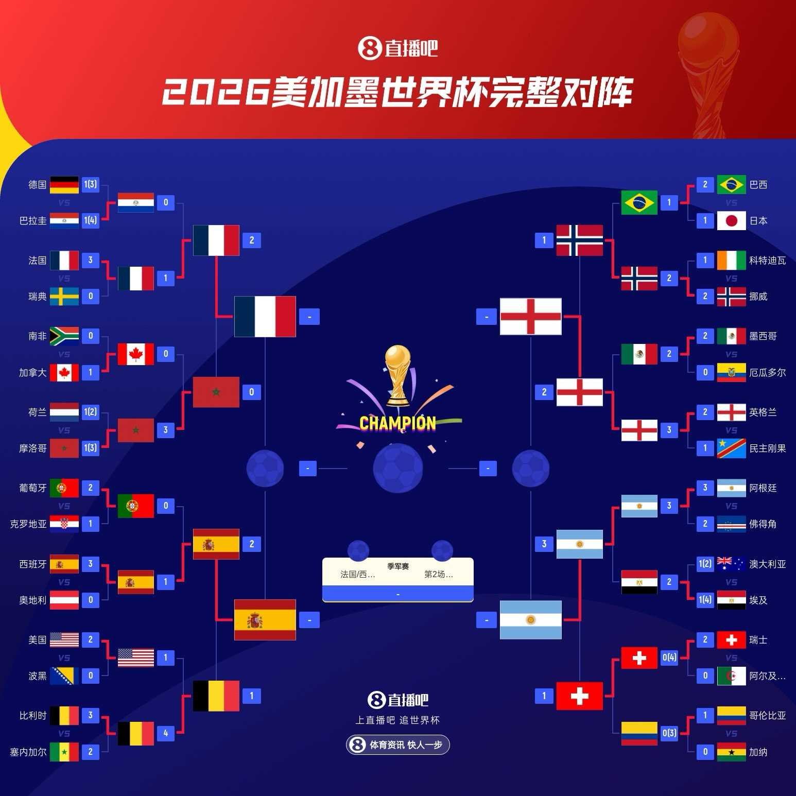

# 梅里诺再绝杀！西班牙2-1比利时晋级四强！贝林厄姆加时绝杀！英格兰2-1挪威！阿根廷3-1瑞士！半决赛：法国vs西班牙、英格兰vs阿根廷！

> 📊 **世界杯1/4决赛完美收官，3场比赛全部结束！** 梅里诺再次替补绝杀！西班牙2-1比利时晋级四强将战法国！贝林厄姆加时梅开二度！英格兰2-1挪威将与阿根廷会师半决赛！阿根廷加时赛阿尔瓦雷斯世界波+劳塔罗破门，3-1击败瑞士晋级！世界杯4强正式出炉：**法国🇫🇷、西班牙🇪🇸、英格兰🏴󠁧󠁢󠁥󠁮󠁧󠁿、阿根廷🇦🇷**！两场半决赛：7/15法国vs西班牙、7/16英格兰vs阿根廷！

世界杯1/4决赛最后一个比赛日，3场恶战为球迷奉献了极致的足球盛宴——**梅里诺再次替补绝杀，西班牙2-1比利时**，连续两场绝杀葡萄牙和比利时，诠释何为超级替补的定义！**英格兰加时2-1逆转挪威**，贝林厄姆加时第93分钟补射绝杀，连续两场淘汰赛进球，皇马双子星内战笑到最后！**阿根廷加时3-1击败瑞士**，恩博洛假摔染红成为转折点，阿尔瓦雷斯世界波+劳塔罗破门锁定胜局！今天我们来做赛后复盘，验证上一轮的预测，并送上半决赛前瞻！

---

## 📊 本轮总览（3场全部结束）

| 日期 | 比赛 | 比分 | 关键词 |
|------|------|------|--------|
| 7/11 | 🇪🇸 西班牙 vs 🇧🇪 比利时 | 2-1 | **再绝杀！** 梅里诺再次替补绝杀，西班牙连续两场绝杀晋级！ |
| 7/12 | 🇳🇴 挪威 vs 🏴󠁧󠁢󠁥󠁮󠁧󠁿 英格兰 | 1-2（加时） | **加时逆转！** 贝林厄姆加时93分钟绝杀，皇马双子星内战英格兰胜！ |
| 7/12 | 🇦🇷 阿根廷 vs 🇨🇭 瑞士 | 3-1（加时） | **假摔转折！** 恩博洛两黄变一红离场，阿尔瓦雷斯世界波杀死比赛！ |

---

## ⚽ 比赛一：🇪🇸 西班牙 2-1 🇧🇪 比利时——再绝杀！梅里诺再次替补破门，西班牙连续两场绝杀晋级！

> **开球时间**：北京时间 7月11日 凌晨 3:00
> **比赛场地**：AT&T体育场（美国）
> **比赛阶段**：1/4决赛
> **模型预测**：🇪🇸 **西班牙胜** ✅
> **高僧预测**：🇪🇸 **西班牙胜** ✅
> **🐷 YOYO 预测**：🇪🇸 **西班牙胜** ✅
> **实际比分**：🇪🇸 西班牙 **2 - 1** 🇧🇪 比利时

### ⚽ 进球时间线

```
21' ⚽ 法比安·鲁伊斯（Fabián）！奥尔莫包抄打门被扑出，法比安跟进补射破门
    → 🇪🇸 西班牙 1-0 🇧🇪 比利时
    → 首开纪录！西班牙闪电开局！

40' ⚽ 德凯特拉雷（De Ketelaere）！角球进攻，德凯特拉雷力压后卫头球破门
    → 🇪🇸 西班牙 1-1 🇧🇪 比利时
    → CDK头球扳平！比利时还以颜色！

85' ⚽ 梅里诺（Merino）！库巴西远射造门将脱手，梅里诺跟进补射绝杀
    → 🇪🇸 西班牙 2-1 🇧🇪 比利时
    → 再次绝杀！梅里诺连续两场淘汰赛进球！锁定胜局！
```

### 🎯 赛果 vs 预测对照

| 维度 | 赛前预测 | 实际结果 | 命中？ |
|------|---------|---------|--------|
| 胜负 | 西班牙胜（模型+高僧+YOYO） | 🇪🇸 西班牙 2-1 胜 | ✅ 三方全部命中 |

### 🔍 比赛关键节点

- **6'** 🇪🇸 佩德里禁区前沿远射被库尔图瓦没收
- **11'** 🇧🇪 卢克巴基奥左路内切兜射打偏
- **21'** ⚽ **西班牙首开纪录！** 奥尔莫包抄打门被库尔图瓦神勇扑出，法比安·鲁伊斯跟进补射破门！**西班牙1-0！**
- **27'** 🇪🇸 费兰·托雷斯弧顶凌空抽射，库尔图瓦稳稳抱住
- **33'** 🟨 巴埃纳战术犯规，吃到黄牌
- **40'** ⚽ **CDK头球扳平！** 角球进攻，比利时前点漏过，德凯特拉雷后点头球破门！**1-1！德凯特拉雷本届世界杯第3球！**
- **45'** 🇪🇸 奥尔莫弧顶远射被库尔图瓦扑出
- **55'** 🇧🇪 蒂尔曼禁区弧顶远射打偏
- **57'** 🇧🇪 卢克巴基奥左路内切打门，皮球折射后被拉亚没收
- **62'** 🟨 拉波尔特推人犯规，吃到黄牌
- **65'** 🇪🇸 梅里诺换下奥尔莫——**西班牙的绝杀伏笔！**
- **68'** 🇪🇸 费兰·托雷斯右路传中，梅里诺后点头球攻门被库尔图瓦扑出！
- **75'** 🇪🇸 西班牙围攻！梅里诺禁区前沿抽射打高
- **79'** 🟨 巴埃纳踢倒卢克巴基奥，两黄变一红被罚下！西班牙少打一人！
- **80'** 🇪🇸 梅里诺被库巴西换下——绝杀英雄再次下场休息！
- **83'** 🟨 库巴西战术犯规，吃到黄牌
- **85'** ⚽ **梅里诺再次绝杀！** 库巴西禁区前沿远射，库尔图瓦扑救脱手！**梅里诺跟进补射破门！** 西班牙2-1！**梅里诺本届世界杯第2球，连续两场淘汰赛绝杀！**
- **90+2'** 🇧🇪 卢克巴基奥头球攻门，拉亚飞身扑出——比利时最后机会！
- **全场结束！** 西班牙2-1比利时晋级四强，半决赛将对阵法国！

> **精算师辣评**：西班牙的替补神兵**梅里诺再次发威**！第85分钟，库巴西远射造成库尔图瓦脱手，梅里诺跟进冷静补射——**连续两场淘汰赛绝杀！** 继上一轮91分钟绝杀葡萄牙之后，梅里诺这场比赛再次成为西班牙的英雄！上半场德凯特拉雷头球扳平，险些让比利时翻盘。第79分钟巴埃纳两黄变一红，西班牙少打一人，形势危急——但梅里诺从不让人失望！全场最佳球员给了梅里诺，绝杀先生名不虚传。比利时虽然由CDK头球扳平，但防线在关键时刻犯错，最终1-2饮恨出局。三方全部预测命中，毫无悬念！西班牙半决赛将对阵法国——这将是2022世界杯半决赛的重演！

---

## ⚽ 比赛二：🇳🇴 挪威 1-2（加时）🏴󠁧󠁢󠁥󠁮󠁧󠁿 英格兰——加时逆转！贝林厄姆93分钟绝杀！皇马双子星内战英格兰笑到最后！

> **开球时间**：北京时间 7月12日 凌晨 5:00
> **比赛场地**：迈阿密硬石体育场（美国）
> **比赛阶段**：1/4决赛
> **模型预测**：🏴󠁧󠁢󠁥󠁮󠁧󠁿 **英格兰胜** ✅
> **高僧预测**：🇳🇴 **挪威胜** ❌
> **🐷 YOYO 预测**：🏴󠁧󠁢󠁥󠁮󠁧󠁿 **英格兰胜** ✅
> **实际比分**：🇳🇴 挪威 **1 - 2** 🏴󠁧󠁢󠁥󠁮󠁧󠁿 英格兰（加时）


### ⚽ 进球时间线

```
35' ⚽ 谢尔德鲁普（Sjøstrand）！厄德高分球，谢尔德鲁普弧顶似传似射直钻死角
    → 🇳🇴 挪威 1-0 🏴󠁧󠁢󠁥󠁮󠁧󠁿 英格兰
    → 世界波！谢尔德鲁普打出无解弧线，尼兰毫无反应！

45+2' ⚽ 贝林厄姆（Bellingham）！戈登左路传中，贝林厄姆前插推射远角破门
    → 🇳🇴 挪威 1-1 🏴󠁧󠁢󠁥󠁮󠁧󠁿 英格兰
    → 扳平！半场读秒，贝林厄姆为英格兰续命！

93' ⚽ 贝林厄姆（Bellingham）！罗杰斯远射被扑，贝林厄姆跟进补射破门
    → 🇳🇴 挪威 1-2 🏴󠁧󠁢󠁥󠁮󠁧󠁿 英格兰
    → 加时绝杀！贝林厄姆梅开二度！英格兰反超晋级！
```

### 🎯 赛果 vs 预测对照

| 维度 | 赛前预测 | 实际结果 | 命中？ |
|------|---------|---------|--------|
| 胜负 | 英格兰胜（模型+YOYO）/ 挪威胜（高僧） | 🏴󠁧󠁢󠁥󠁮󠁧󠁿 英格兰 2-1 胜 | ✅ 模型+YOYO命中 |

### 🔍 比赛关键节点

- **8'** 🇬🇧 安德森斜长传找马杜埃凯，单刀越位在先——图赫尔颇为惋惜
- **16'** 🇬🇧 戈登带球内切强吃吕尔松，突入禁区传中被挡出
- **20'** 🇬🇧 安德森左路传中，贝林厄姆前插抢点头球攻门顶偏
- **23'** 🇬🇧 马杜埃凯禁区内下底横传，后门柱奥赖利停球过大未能形成射门
- **29'** 🇳🇴 凯恩主罚弧顶任意球爆射打高——两队第一次射门
- **35'** ⚽ **谢尔德鲁普世界波！** 厄德高策动分球，谢尔德鲁普弧顶得球起脚似传似射，皮球划出无解弧线直钻球门右上角！**尼兰毫无反应！挪威1-0！** 这一脚，简直是本届世界杯最佳进球候选！
- **45+2'** ⚽ **贝林厄姆读秒扳平！** 戈登左路传中，贝林厄姆前插到禁区推射远角破门！**1-1！英格兰在半场读秒将比分扳平！**
- **45+4'** 💥 凯恩单刀挑射破门——越位在先，进球无效！挪威险些再下一城！
- **52'** 🇳🇴 瑟洛特右路传中，皮球直奔球门近角，皮克福德不敢怠慢将球击出
- **53'** 🇳🇴 吕尔松右路传中，哈兰德抢点头球攻门被皮克福德神勇扑出！
- **55'** ⚽ **哈兰德进球无效！** 角球进攻，黑格姆补射破门！主裁判蒂尔潘回看VAR——**判定哈兰德对安德森犯规在先！进球无效！** VAR还英格兰一个公道！
- **68'** 🔄 努萨换下谢尔德鲁普
- **76'** 🇳🇴 角球制造威胁，奥尔斯内斯横扫，沃尔费头球接力中楣！哈兰德补射稍稍偏出！
- **85'** 🇬🇧 努萨禁区弧顶内切闪出角度打门，皮克福德没收
- **87'** 🇬🇧 萨卡突入禁区横传，奥尔斯内斯抢在埃泽射门前将球解围
- **90'** 两队1-1进入加时赛！
- **93'** ⚽ **贝林厄姆加时绝杀！** 罗杰斯禁区弧顶远射，尼兰扑救脱手！**贝林厄姆跟进补射破门！** 挪威1-2英格兰！英格兰加时反超！
- **99'** 💥 斯彭斯突入禁区被鲍勃绊倒，主裁判第一时间判罚点球！VAR介入后**取消点球判罚**——斯彭斯越位在先！
- **109'** 🇳🇴 帕特里克·贝格远射擦横梁飞出——挪威险些扳平！
- **110'** 🇬🇧 斯彭斯禁区前沿远射被扑，萨卡补射再被尼兰挡出！
- **106'** 🔄 哈兰德被拉森换下——头号球星耗尽体能离场
- **120'** 全场比赛结束！英格兰2-1加时逆转挪威，晋级四强！

> **精算师辣评**：这场球是**皇马双子星的正面交锋**！谢尔德鲁普开场第35分钟就用一脚无解弧线世界波为挪威首开记录——那一脚，简直是艺术品，尼兰完全没有任何反应！贝林厄姆上半场读秒头球扳平，为英格兰续命。下半场哈兰德第55分钟进球被VAR判定无效——主裁判蒂尔潘看了半天，判定哈兰德对安德森犯规，**这次VAR判罚拯救了英格兰**！进入加时赛，第93分钟，**贝林厄姆跟进补射完成绝杀**！贝林厄姆本届世界杯第4球，连续两场淘汰赛进球！哈兰德则在这场硬仗中耗尽了体能，106分钟被换下，最终无力回天。**皇马双子星内战，笑到最后的是贝林厄姆**！英格兰将在半决赛对阵阿根廷，贝林厄姆和梅西的正面对决——值得期待！模型和YOYO命中英格兰胜，高僧押挪威翻车。英格兰四强将对阵阿根廷，梅西vs贝林厄姆——新旧球王的对决！

---

## ⚽ 比赛三：🇦🇷 阿根廷 3-1（加时）🇨🇭 瑞士——假摔转折！恩博洛染红！阿尔瓦雷斯世界波！阿根廷晋级四强！

> **开球时间**：北京时间 7月12日 早上 9:00
> **比赛场地**：堪萨斯城箭头体育场（美国）
> **比赛阶段**：1/4决赛
> **模型预测**：🇦🇷 **阿根廷胜** ✅
> **高僧预测**：🇨🇭 **瑞士胜** ❌
> **🐷 YOYO 预测**：🇦🇷 **阿根廷胜** ✅
> **实际比分**：🇦🇷 阿根廷 **3 - 1** 🇨🇭 瑞士（加时）

### ⚽ 进球时间线

```
10' ⚽ 麦卡利斯特（McAllister）！梅西开出角球，麦卡利斯特前点头球攻门破网
    → 🇦🇷 阿根廷 1-0 🇨🇭 瑞士
    → 闪击！梅西角球助攻，麦卡利斯特头球破门！

68' ⚽ 恩多耶（Ndoye）！扎卡策动，R罗与恩多耶撞墙配合，恩多耶推射打大马丁小门得手
    → 🇦🇷 阿根廷 1-1 🇨🇭 瑞士
    → 扳平！恩多耶穿大马丁小门，瑞士扳平比分！

70' 🟥 恩博洛假摔！主裁第一时间判帕雷德斯犯规，VAR介入后改判恩博洛假摔，两黄变一红！
    → 瑞士10人应战！比赛转折点！

112' ⚽ 阿尔瓦雷斯（Alvarez）！何塞·洛佩斯助攻，阿尔瓦雷斯禁区外兜射世界波破门
    → 🇦🇷 阿根廷 2-1 🇨🇭 瑞士
    → 世界波！小蜘蛛发炮！阿根廷加时再次领先！

120+1' ⚽ 劳塔罗（Lautaro）！阿尔马达突破造威胁，劳塔罗跟进补射空门破网
    → 🇦🇷 阿根廷 3-1 🇨🇭 瑞士
    → 锁定胜局！劳塔罗杀死比赛！阿根廷晋级四强！
```

### 🎯 赛果 vs 预测对照

| 维度 | 赛前预测 | 实际结果 | 命中？ |
|------|---------|---------|--------|
| 胜负 | 阿根廷胜（模型+YOYO）/ 瑞士胜（高僧） | 🇦🇷 阿根廷 3-1 胜 | ✅ 模型+YOYO命中 |

### 🔍 比赛关键节点

- **7'** 🇨🇭 瑞士连续进攻，扎卡远射打飞——开局瑞士反客为主
- **9'** 🇦🇷 梅西横传做球，麦卡利斯特弧顶打门被挡出
- **10'** ⚽ **阿根廷闪击！** 梅西右路角球开出，麦卡利斯特前点甩头攻门！皮球飞入球门！**阿根廷1-0！**
- **20'** 🇨🇭 恩博洛单刀突入禁区，大马丁及时出击化险为夷！
- **31'** 🇨🇭 索乌远射，大马丁稳稳抱住
- **44'** 🇦🇷 梅西与主裁激烈交流——对判罚表达不满
- **51'** 🇨🇭 恩博洛横传，恩多耶直面大马丁，调整一步后打门被封堵
- **63'** 🇨🇭 瑞士连续多脚打门！恩多耶头球和扎卡远射均被大马丁扑出——瑞士围攻！
- **68'** ⚽ **瑞士扳平！** 扎卡策动，R罗和恩多耶撞墙配合，恩多耶突入禁区推射——**打穿大马丁小门！1-1！**
- **70'** 💥🟥 **恩博洛假摔染红！** 恩博洛禁区内倒地，主裁判第一时间判帕雷德斯犯规——阿根廷球迷惊出一身冷汗！**VAR介入，主裁亲自观看回放后改判：恩博洛假摔！两黄变一红！瑞士10人应战！**
- **73'** 🔄 冈萨雷斯换下塔利亚菲科——阿根廷放手一搏
- **78'** 🔄 蒙铁尔换下莫利纳
- **85'** 💥 **梅西单刀挑射！** 反击中梅西获得单刀机会，挑射攻门被科贝尔神勇扑出！
- **86'** 🔄 劳塔罗换下德保罗
- **90'** 冈萨雷斯底线极限传中，麦卡利斯特近距离头球顶飞——错失绝杀！
- **90+9'** 💥 **利马侧勾攻门！** 科贝尔奉献神扑——力保瑞士城门不失！90分钟1-1，进入加时赛！
- **91'** 🔄 阿尔马达换下恩佐
- **104'** 🇨🇭 亚沙里从身后踩倒冈萨雷斯，随后又一脚踩在冈萨雷斯脚踝上——危险动作！主裁判观看VAR后没有出牌，瑞士球员已经心态失衡！
- **110'** 🔄 何塞·洛佩斯换下帕雷德斯
- **112'** ⚽ **阿尔瓦雷斯世界波！** 何塞·洛佩斯送出直塞，阿尔瓦雷斯禁区外起脚兜射——**无解弧线！科贝尔无能为力！阿根廷2-1！**
- **120+1'** ⚽ **劳塔罗锁定胜局！** 阿尔马达一路突进杀入禁区，低射被科贝尔挡出！**劳塔罗跟进补射空门！阿根廷3-1！杀死比赛！**
- **全场结束！** 阿根廷3-1击败瑞士，晋级四强！半决赛将对阵英格兰！

> **精算师辣评**：这场比赛的**最大转折点不是进球，而是红牌**！恩博洛第70分钟那次"假摔"直接改变了比赛走向——主裁判第一时间判帕雷德斯犯规，瑞士获得点球机会！但VAR介入了……主裁判亲自观看回放后改判：**恩博洛假摔！两黄变一红！瑞士少打一人！** 从天堂到地狱，恩博洛的表情应该是懵了。瑞士扳平比分后士气正旺，却因为这张红牌陷入被动。阿根廷此后围攻无果，90分钟1-1。进入加时赛，**第112分钟，阿尔瓦雷斯禁区外一记无解兜射世界波**——这球，简直是本届世界杯最佳进球候选！第120+1分钟劳塔罗锁定胜局。梅西眼眶在比赛中受伤出血，轻伤不下火线——这就是球王精神！模型和YOYO命中阿根廷胜，高僧押瑞士翻车。阿根廷半决赛将对阵英格兰，梅西vs贝林厄姆——这将是本届世界杯最受关注的对决之一！

---

## 🤖 模型战绩

| 比赛 | 预测 | 实际 | 结果 |
|------|------|------|------|
| 🇪🇸 西班牙 vs 🇧🇪 比利时 | 西班牙胜 | 2-1 西班牙胜 | ✅ |
| 🇳🇴 挪威 vs 🏴󠁧󠁢󠁥󠁮󠁧󠁿 英格兰 | 英格兰胜 | 2-1 英格兰胜（加时） | ✅ |
| 🇦🇷 阿根廷 vs 🇨🇭 瑞士 | 阿根廷胜 | 3-1 阿根廷胜（加时） | ✅ |

**本轮战绩**：模型 **3/3（100%）**

**累计战绩**：模型 **65/101（64%）**

---

### 🙏 高僧战绩

| 比赛 | 预测 | 实际 | 结果 |
|------|------|------|------|
| 🇪🇸 西班牙 vs 🇧🇪 比利时 | 西班牙胜 | 2-1 西班牙胜 | ✅ |
| 🇳🇴 挪威 vs 🏴󠁧󠁢󠁥󠁮󠁧󠁿 英格兰 | 挪威胜 | 2-1 英格兰胜（加时） | ❌ |
| 🇦🇷 阿根廷 vs 🇨🇭 瑞士 | 瑞士胜 | 3-1 阿根廷胜（加时） | ❌ |

**本轮战绩**：高僧 **1/3（33%）**

**累计战绩**：高僧 **70/101（69%）**

---

### 🐷 YOYO 战绩

| 比赛 | 预测 | 实际 | 结果 |
|------|------|------|------|
| 🇪🇸 西班牙 vs 🇧🇪 比利时 | 西班牙胜 | 2-1 西班牙胜 | ✅ |
| 🇳🇴 挪威 vs 🏴󠁧󠁢󠁥󠁮󠁧󠁿 英格兰 | 英格兰胜 | 2-1 英格兰胜（加时） | ✅ |
| 🇦🇷 阿根廷 vs 🇨🇭 瑞士 | 阿根廷胜 | 3-1 阿根廷胜（加时） | ✅ |

**本轮战绩**：YOYO **3/3（100%）**

**累计战绩**：YOYO **59/101（58%）**

---

## 📊 本轮总结

### 🎯 本轮亮点

1. **梅里诺连续两场绝杀！** 从91分钟绝杀葡萄牙到第85分钟绝杀比利时，梅里诺两场比赛替补出场打进绝杀进球，是西班牙晋级四强的最大功臣！
2. **谢尔德鲁普世界波！** 挪威中场第35分钟的弧线球堪称艺术品，直钻球门右上死角，让皮克福德毫无反应——本届世界杯最佳进球候选！
3. **贝林厄姆加时绝杀挪威！** 皇马双子星正面交锋，贝林厄姆半场读秒扳平+加时第93分钟补射绝杀，梅开二度连续两场淘汰赛进球！哈兰德虽败犹荣。
4. **恩博洛假摔染红转折比赛！** 第70分钟恩博洛假摔被VAR改判两黄变一红，瑞士10人应战，阿根廷此后围攻得手。
5. **阿尔瓦雷斯世界波！** 加时赛第112分钟小蜘蛛禁区外无解兜射破门，又一记本届最佳进球候选！
6. **梅西眼眶受伤出血，轻伤不下火线！** 比赛中梅西眼眶被撞出血，场边简单治疗后继续出战——这就是球王精神！

### 📈 模型战绩更新

| 排名 | 预测方 | 本轮战绩 | 累计战绩 | 命中率 |
|------|--------|---------|---------|--------|
| 🥇 | 🙏 高僧 | 1/3 | 70/101 | **69%** |
| 🥈 | 🤖 模型 | 3/3 | 65/101 | **64%** |
| 🥉 | 🐷 YOYO | 3/3 | 59/101 | **58%** |

> **本轮最大话题**：世界杯4强正式出炉——法国、西班牙、英格兰、阿根廷！两场半决赛：法国vs西班牙（2022世界杯半决赛重演），英格兰vs阿根廷（梅西vs贝林厄姆的新旧球王对决）！本轮最大冷门：高僧独押挪威和瑞士，结果双双翻车——四强赛高僧遭遇当头棒喝，1/3收场。YOYO本轮3/3爆发，模型同样3/3，三方在四强赛预测上即将迎来终极对决！

### 🏆 赌神模拟器第十九轮账单（3场全部结束）

**规则**：初始 $2,000，每场押 $200 猜胜/平/负，Bet365 赔率结算

| 排名 | 预测方 | 本轮战绩 | 本轮盈亏 | 累计余额 | 总盈亏 | 段位 |
|------|--------|---------|---------|---------|--------|------|
| 🥇 | 🙏 高僧 | 1/3 | **+$360** | **$6,594** | **+$4,594 💰💰💰💰** | 🎲 赌神 |
| 🥈 | 🤖 模型 | 3/3 | **+$400** | **$5,144** | **+$3,144 💰💰💰** | 🎲 赌神 |
| 🥉 | 🐷 YOYO | 3/3 | **+$220** | **$4,314** | **+$2,314 💰💰** | 🎲 赌徒 |

**本轮详细盈亏（每场押 $200）**：

| 比赛 | 实际结果 | 高僧 | YOYO | 模型 | 赔率参考 |
|------|---------|------|------|------|---------|
| 🇪🇸 西班牙 vs 🇧🇪 比利时 | 西班牙胜 | ✅ +$200 | ✅ +$200 | ✅ +$200 | 西班牙 2.00 |
| 🇳🇴 挪威 vs 🏴󠁧󠁢󠁥󠁮󠁧󠁿 英格兰 | 英格兰胜 | ❌ -$200 | ✅ +$140 | ✅ +$140 | 英格兰 1.70 |
| 🇦🇷 阿根廷 vs 🇨🇭 瑞士 | 阿根廷胜 | ❌ -$200 | ✅ +$220 | ✅ +$220 | 阿根廷 2.10 |

> **高僧本轮1/3**——押中西班牙（+$200），但押挪威（-$200）和瑞士（-$200）双双翻车，高僧的黑马直觉本轮失灵了！YOYO本轮3/3爆发——精准命中西班牙（+$200）、英格兰（+$140）、阿根廷（+$220），本轮净赚$560，爆发之夜！模型同样3/3，精准命中三场，各收$200/$140/$220，本轮盈利$560，与YOYO并驾齐驱！高僧虽然1/3，但因为押中西班牙（高赔率2.00），单轮仍有$360净赚，继续领跑。YOYO爆发后与模型差距缩小。

---

## 🏆 世界杯4强对阵图



---

## ⏳ 半决赛前瞻

---

## 🇫🇷 法国 vs 🇪🇸 西班牙——2022世界杯半决赛重演！高卢雄鸡能否复仇？

> **开球时间**：北京时间 7月15日 凌晨 3:00
> **比赛阶段**：半决赛
> **🤖 模型预测**：🇫🇷 **法国胜**
> **🙏 高僧预测**：🇪🇸 **西班牙胜**
> **🐷 YOYO 预测**：🇫🇷 **法国胜**

### 🧵 交锋背景

这是2022年卡塔尔世界杯半决赛的重演——四年前，法国在半决赛中2-0淘汰摩洛哥，而西班牙则在另一场半决赛中被摩洛哥爆冷淘汰。如今，法国已经率先晋级，西班牙则连续绝杀葡萄牙和比利时晋级。两支球队在1/4决赛都展现了极强的竞争力——法国2-0击败摩洛哥，姆巴佩传射+失点又自我救赎；西班牙2-1击败比利时，梅里诺再次绝杀。

### 🔥 关键对决

- **姆巴佩 vs 西班牙后防**：姆巴佩本届世界杯已打进20球，距梅西21球仅差1球。西班牙的拉波尔特+库巴西组合能否限制姆巴佩的速度？
- **梅里诺 vs 法国防线**：连续两场绝杀的梅里诺，法国需要重点盯防这位超级替补。
- **法国防守 vs 西班牙传控**：西班牙的控球率向来恐怖，但法国的反击效率极高。姆巴佩、登贝莱的速度是西班牙后防的噩梦。

### 🎯 预测：🇫🇷 法国胜

模型和YOYO一致看法国！法国整体实力更胜一筹，姆巴佩的世界杯总进球数即将超越梅西。西班牙虽然连续绝杀，但后防不稳（1/4决赛巴埃纳染红）是隐患。不过——梅里诺已经证明，足球场上一切皆有可能。

---

## 🏴󠁧󠁢󠁥󠁮󠁧󠁿 英格兰 vs 🇦🇷 阿根廷——梅西vs贝林厄姆！新旧球王正面对决！

> **开球时间**：北京时间 7月16日 凌晨 3:00
> **比赛阶段**：半决赛
> **🤖 模型预测**：🏴󠁧󠁢󠁥󠁮󠁧󠁿 **英格兰胜**
> **🙏 高僧预测**：🏴󠁧󠁢󠁥󠁮󠁧󠁿 **英格兰胜**
> **🐷 YOYO 预测**：🇦🇷 **阿根廷胜**

### 🧵 交锋背景

这是本届世界杯最受关注的比赛——**梅西 vs 贝林厄姆，新旧球王正面对决**！梅西本届世界杯已打进21球，连续8场世界杯进球，是世界杯历史最佳射手。贝林厄姆则连续两场淘汰赛进球，皇马双子星中本轮正面交锋完胜哈兰德。英格兰在1/4决赛加时2-1逆转挪威，贝林厄姆加时绝杀。

阿根廷则在1/4决赛3-1击败瑞士，阿尔瓦雷斯世界波+劳塔罗破门。两只淘汰赛表现最为强势的球队，将在半决赛正面交锋。

### 🔥 关键对决

- **梅西 vs 贝林厄姆**：新老两代皇马7号的正面对决。梅西本届21球领跑射手榜，贝林厄姆4球状态火热。谁能在直接对话中胜出？
- **阿尔瓦雷斯 vs 英格兰后防**：小蜘蛛连续进球，1/4决赛轰出世界波。英格兰的皮克福德和格伊能否限制他？
- **大马丁 vs 凯恩**：阿根廷门神大马丁能否零封英格兰？凯恩本届世界杯已打进6球。

### 🎯 预测：🏴󠁧󠁢󠁥󠁮󠁧󠁿 英格兰胜

高僧和模型一致看英格兰，YOYO押阿根廷！英格兰本届世界杯的表现越踢越好——1/8决赛3-2险胜墨西哥，1/4决赛加时逆转挪威。贝林厄姆的统治力肉眼可见，加上英格兰的整体防守体系更加稳固。但阿根廷的逆转能力同样恐怖——0-2落后佛得角翻盘，0-2落后埃及翻盘——这支阿根廷从不放弃。梅西的个人能力是最大的X因素。如果梅西发挥，阿根廷赢面更大；如果贝林厄姆carry全场，英格兰晋级。无论结果如何，这将是一场载入史册的对决。

---

## 📅 半决赛赛程

| 比赛日 | 北京时间 | 对决 | 看点 | 🤖 模型 | 🙏 高僧 | 🐷 YOYO |
|-------|---------|------|------|---------|---------|---------|
| **7/15 🔥** | 03:00 | 🇫🇷 法国 vs 🇪🇸 西班牙 | 2022世界杯半决赛重演！ | 法国 | 西班牙 | 法国 |
| **7/16 💥** | 03:00 | 🏴󠁧󠁢󠁥󠁮󠁧󠁿 英格兰 vs 🇦🇷 阿根廷 | 梅西vs贝林厄姆！新旧球王对决！ | 英格兰 | 英格兰 | 阿根廷 |

---

## 🎯 今日推介

> 🔥 **最值得熬夜看**：英格兰 vs 阿根廷（7/16 03:00）——梅西vs贝林厄姆，新旧球王的正面交锋，绝对不能错过！
> 🔥 **同样值得熬夜**：法国 vs 西班牙（7/15 03:00）——2022世界杯半决赛重演，姆巴佩冲击世界杯第21球！
> 🤯 **最大分歧**：英格兰 vs 阿根廷——高僧和模型押英格兰，YOYO押阿根廷。三方分歧最大的一场！

---

## 📸 图片来源

本文所有比赛图片来自[直播吧](https://news.zhibo8.com/)，仅供非商业用途。

---

> **Status Check**: 世界杯1/4决赛 **全部结束！** 4强出炉：法国🇫🇷、西班牙🇪🇸、英格兰🏴󠁧󠁢󠁥󠁮󠁧󠁿、阿根廷🇦🇷！
> - 🤖 **模型**：本轮 3/3（100%），十九轮总 65/101（64%）！
> - 🙏 **高僧**：本轮 1/3（33%），十九轮总 70/101（69%）！
> - 🐷 **YOYO**：本轮 3/3（100%），十九轮总 59/101（58%）！
>
> **📅 半决赛赛程**：7/15 🇫🇷法国vs🇪🇸西班牙 | 7/16 🏴󠁧󠁢󠁥󠁮󠁧󠁿英格兰vs🇦🇷阿根廷
>
> **📊 赌神模拟器总账**：高僧 $6,594（+$4,594 💰💰💰💰）| 模型 $5,144（+$3,144 💰💰💰）| YOYO $4,314（+$2,314 💰💰）

**AnfinsenYu** | 2026年7月13日
