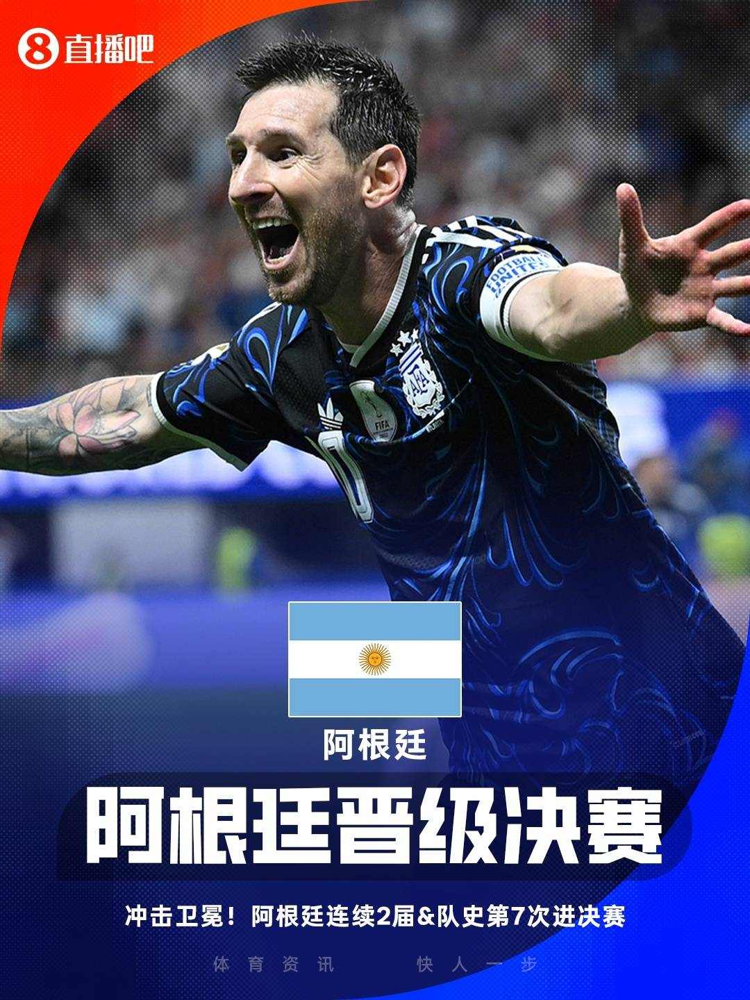
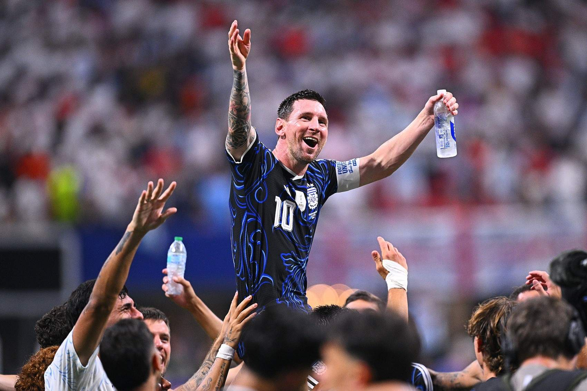
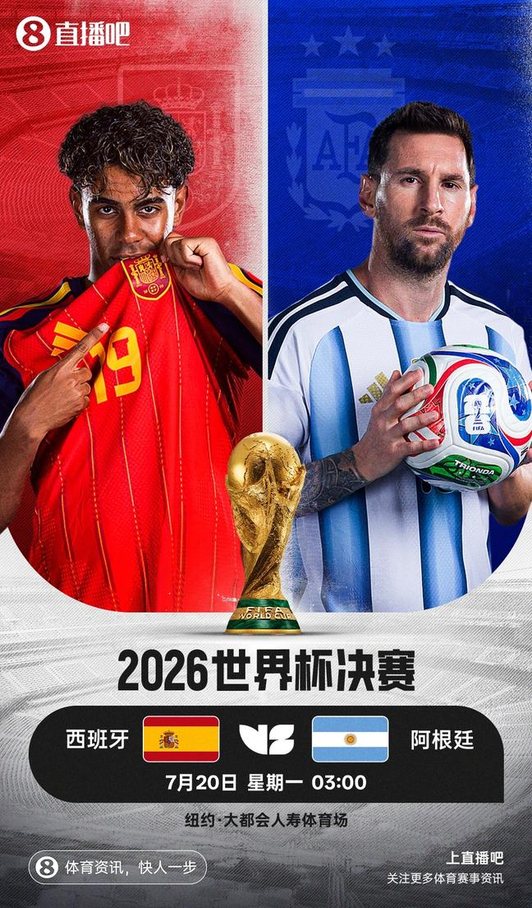
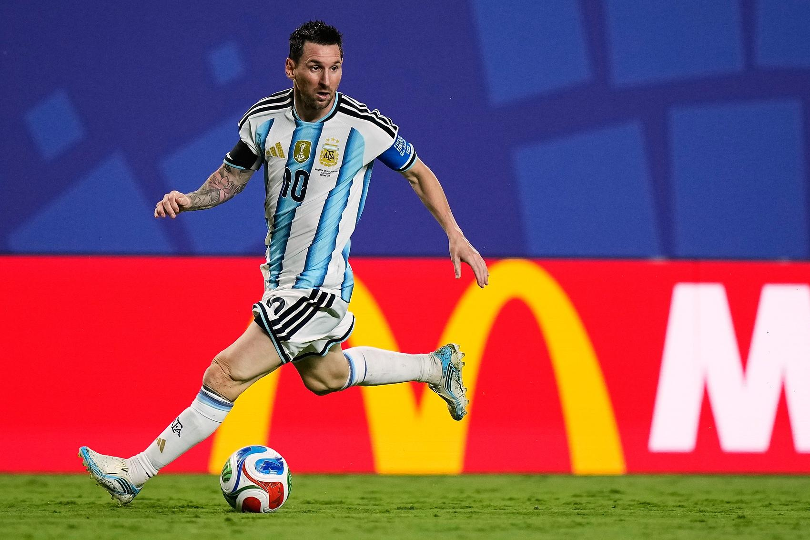

# 🐐 39岁梅西两助攻导演逆转！阿根廷——逆转！连续两届世界杯杀进决赛！

> 📊 **世界杯半决赛完美收官，两场对决两种剧本！** 西班牙2-0法国，奥亚萨瓦尔点球+波罗单刀，斗牛士三杀法国时隔16年再进世界杯决赛！阿根廷2-1英格兰，戈登首开纪录后恩佐世界波扳平，劳塔罗92分钟头球绝杀！梅西两助攻带队逆转，连续两届晋级决赛！世界杯决赛对阵正式出炉：**西班牙🇪🇸 vs 阿根廷🇦🇷**——欧洲冠军vs美洲冠军，巴萨两代10号对决，39岁梅西PK19岁亚马尔！季军赛7/19法国vs英格兰，三方一致预测法国胜！决赛7/20，模型最终预测：**阿根廷胜**！

世界杯半决赛，两个夜晚，两种疯狂——**西班牙2-0法国**，迪涅禁区送点，萨利巴无对抗伤退，波罗单刀破门，斗牛士完成对法国的大赛三杀，时隔16年再进决赛！**阿根廷2-1英格兰**，戈登首开纪录，恩佐86分钟世界波扳平，劳塔罗92分钟头球绝杀！梅西两记助攻导演逆转，39岁球王再次封神！今天我们来做赛后复盘，验证半决赛预测，并送上季军赛和决赛终极前瞻！

---

## 📊 本轮总览（2场全部结束）

| 日期 | 比赛 | 比分 | 关键词 |
|------|------|------|--------|
| 7/15 | 🇫🇷 法国 vs 🇪🇸 西班牙 | 0-2 | **三杀！** 奥亚萨瓦尔点球+波罗单刀，西班牙三杀法国进决赛！ |
| 7/16 | 🏴󠁧󠁢󠁥󠁮󠁧󠁿 英格兰 vs 🇦🇷 阿根廷 | 1-2 | **逆转！** 恩佐世界波+劳塔罗92分钟绝杀，梅西两助攻！ |

---

## ⚽ 比赛一：🇫🇷 法国 0-2 🇪🇸 西班牙——三杀！奥亚萨瓦尔点球+波罗单刀，斗牛士时隔16年再进决赛！

> **开球时间**：北京时间 7月15日 凌晨 3:00
> **比赛场地**：AT&T体育场（美国）
> **比赛阶段**：半决赛
> **模型预测**：🇫🇷 **法国胜** ❌
> **高僧预测**：🇪🇸 **西班牙胜** ✅
> **🐷 YOYO 预测**：🇫🇷 **法国胜** ❌
> **实际比分**：🇫🇷 法国 **0 - 2** 🇪🇸 西班牙

### ⚽ 进球时间线

```
20' ⚽ 迪涅禁区送点！迪涅背身解围踢倒突然杀出的亚马尔，主裁判指向点球点！
    → 法国送点！奥亚萨瓦尔主罚！

22' ⚽ 奥亚萨瓦尔（Oyarzabal）！主罚点球推射球门右下角，迈尼昂判断对方向但无力回天！
    → 🇫🇷 法国 0-1 🇪🇸 西班牙
    → 首开纪录！西班牙客场先拔头筹！

29' 💔 萨利巴伤退！无对抗状态下萨利巴突然坐倒在地，拉克鲁瓦紧急替补登场！
    → 法国后防告急！萨利巴作为主力中卫离场！

59' ⚽ 波罗（Porro）！奥尔莫禁区前沿倚住于帕梅卡诺做球，波罗单刀推射破门！
    → 🇫🇷 法国 0-2 🇪🇸 西班牙
    → 杀死比赛！奥尔莫手术刀做球，波罗单刀锁定胜局！
```

### 🎯 赛果 vs 预测对照

| 维度 | 赛前预测 | 实际结果 | 命中？ |
|------|---------|---------|--------|
| 胜负 | 法国胜（模型+YOYO）/ 西班牙胜（高僧） | 🇪🇸 西班牙 2-0 胜 | ✅ 高僧命中 |

### 🔍 比赛关键节点

- **10'** 🇫🇷 拉比奥禁区线附近踩到奥尔莫脚面，主裁判判任意球+黄牌，巴埃纳主罚击中人墙
- **20'** 💥 **迪涅禁区送点！** 迪涅背身解围时身后突然杀出亚马尔将球挡走，迪涅来不及收脚将年仅19岁的小将踢倒在禁区内！主裁判果断指向点球点！
- **22'** ⚽ **奥亚萨瓦尔点球命中！** 奥亚萨瓦尔操刀推射右下角，迈尼昂判断对方向但球速太快无能为力！**西班牙1-0！斗牛士客场先拔头筹！**
- **29'** 💔 **萨利巴伤退！** 无对抗状态下法国主力中卫萨利巴突然坐倒在地无法坚持，拉克鲁瓦紧急入替！**法国后防遭遇重大打击！**
- **31'** 🟨 库库雷利亚边路肘击奥利塞，被黄牌警告
- **33'** 🇪🇸 西班牙禁区前精彩配合，奥尔莫脚后跟磕球做给亚马尔，后者横传门前，法比安包抄打门被于帕梅卡诺挡出
- **38'** 🇫🇷 法国快速反击，姆巴佩左路突破至禁区前沿，乌奈·西蒙大范围出击到禁区外将球铲球解围
- **42'** 🇫🇷 拉比奥直塞，姆巴佩加速向前冲击，乌奈·西蒙再次出击化险为夷
- **45+2'** 博尔特现身看台观战，与美国短跑名将莱尔斯合影
- **55'** 🇪🇸 波罗直传，亚马尔杀入禁区右侧，但角度过小打门被挡出，边裁举旗示意越位
- **59'** ⚽ **波罗单刀杀死比赛！** 奥尔莫禁区前沿倚住于帕梅卡诺，手术刀般做球！波罗高速插上形成单刀，面对迈尼昂冷静推射破门！**法国0-2！西班牙锁定胜局！**
- **61'** 💥 亚马尔接直塞杀入禁区扣过迪涅，左脚兜射破门——边裁举旗越位在先！巴萨17岁小将再次闪耀全场！
- **67'** 🇫🇷 姆巴佩禁区前沿低射，皮球被库库雷利亚挡了一下后稍稍偏出左侧门柱——法国全场最有威胁的射门！
- **77'** 🇫🇷 姆巴佩边路带球被年仅17岁的亚马尔从侧后方铲倒——这场"新人见面会"让姆巴佩踢得异常郁闷
- **81'** 🇫🇷 法国队挑传打身后，乌奈·西蒙出击失误！杜埃得球调整过久，被已经追回禁区的西蒙挡下
- **86'** 🟨 姆巴佩肘部击打乌奈·西蒙脖子，被黄牌警告——姆巴佩本场情绪失控
- **90+5'** 🇫🇷 登贝莱禁区内右侧左脚攻门，乌奈·西蒙稳稳抱住——法国最后的挣扎
- **全场结束！** 西班牙2-0击败法国，晋级世界杯决赛！

> **精算师辣评**：这场比赛的法语叫**"Dénia"，迪涅成了法国输球的"第一功臣"**！第20分钟那脚禁区内的送点，直接把法国送进了深渊——迪涅背身解围时完全没有观察身后，突然杀出的19岁小将亚马尔将球一挡，迪涅收脚不及踢倒了自家未来队友！点球没商量，奥亚萨瓦尔稳稳命中，法国0-1落后屋漏偏逢连夜雨。第29分钟，主力中卫萨利巴无对抗状态下受伤离场——拉克鲁瓦替补登场，法国后防再遭打击！此后姆巴佩全场踢得极其郁闷，多次被年仅17岁的对手放倒，情绪失控肘击西蒙染黄。**第59分钟，奥尔莫禁区前沿倚住于帕梅卡诺做球，波罗单刀推射破门，0-2，比赛彻底失去悬念！** 西班牙完成了对法国的大赛三杀——2024欧洲杯半决赛、2025欧国联半决赛、2026世界杯半决赛，全是半决赛，全是淘汰赛，全是法国回家！高僧预测西班牙笑到最后，押对了！模型和YOYO押法国，本轮双双翻车！西班牙时隔16年再进世界杯决赛，上一次是2010年，那年他们夺冠——2026年，斗牛士能否重现辉煌？

---

## ⚽ 比赛二：🏴󠁧󠁢󠁥󠁮󠁧󠁿 英格兰 1-2 🇦🇷 阿根廷——逆转！恩佐世界波+劳塔罗92分钟绝杀！梅西两助攻导演逆转！



> **开球时间**：北京时间 7月16日 凌晨 3:00
> **比赛场地**：亚特兰大体育场（美国）
> **比赛阶段**：半决赛
> **模型预测**：🏴󠁧󠁢󠁥󠁮󠁧󠁿 **英格兰胜** ❌
> **高僧预测**：🏴󠁧󠁢󠁥󠁮󠁧󠁿 **英格兰胜** ❌
> **🐷 YOYO 预测**：🇦🇷 **阿根廷胜** ✅
> **实际比分**：🏴󠁧󠁢󠁥󠁮󠁧󠁿 英格兰 **1 - 2** 🇦🇷 阿根廷

### ⚽ 进球时间线

```
3' 💥 火药味！恩佐与安德森拼抢中发生冲突，贝林厄姆和帕雷德斯也卷入其中！
    → 双方球员迅速围拢，开场火药味十足！

37' 🟨 安德森阻挡梅西突破染黄，双方再次爆发口角！

55' ⚽ 戈登（Gordon）！英格兰长传被利桑德罗解围不远，罗杰斯右路继续传中，戈登门前包抄抢射破门
    → 🏴󠁧󠁢󠁥󠁮󠁧󠁿 英格兰 1-0 🇦🇷 阿根廷
    → 首开纪录！罗杰斯右路传中落点精准，戈登抢点得手！

69' ⚽ 梅西45度角传中！冈萨雷斯头球攻门被皮克福德神勇化解！
    → 阿根廷反扑！大马丁门球发起反击！

75' ⚽ 麦卡利斯特头球中柱！德保罗传中，麦卡利斯特门前头球砸在立柱上！
    → 运气欠佳！阿根廷距离扳平只差一个门柱！

86' ⚽ 恩佐（Enzo）！阿根廷战术角球，梅西右路横传，无人盯防的恩佐禁区弧顶远射世界波破门！
    → 🏴󠁧󠁢󠁥󠁮󠁧󠁿 英格兰 1-1 🇦🇷 阿根廷
    → 世界波！恩佐轰出无解弧线！皮克福德望球兴叹！扳平！

90+2' ⚽ 劳塔罗（Lautaro）！斯彭斯解围被梅西拿到，梅西右路下底送出过顶传中，劳塔罗后点头球破门！
    → 🏴󠁧󠁢󠁥󠁮󠁧󠁿 英格兰 1-2 🇦🇷 阿根廷
    → 绝杀！劳塔罗头球砸死角！阿根廷逆转！晋级决赛！
```

### 🎯 赛果 vs 预测对照

| 维度 | 赛前预测 | 实际结果 | 命中？ |
|------|---------|---------|--------|
| 胜负 | 英格兰胜（模型+高僧）/ 阿根廷胜（YOYO） | 🇦🇷 阿根廷 2-1 胜 | ✅ YOYO命中 |

### 🔍 比赛关键节点

- **3'** 💥 开场火药味十足！恩佐与安德森拼抢中打到对方头部，双方球员迅速围拢，贝林厄姆和帕雷德斯也发生口角——半决赛的紧张氛围从第一分钟就开始了！
- **7'** 小西蒙尼上抢踢到安德森脚踝
- **12'** 安德森与恩佐对抗中手臂和大腿缠在一起，双双倒地
- **23'** 贝林厄姆上抢踢倒麦卡利斯特
- **29'** 里斯·詹姆斯倒地，裁判没有表示，图赫尔在场边暴怒怒吼第四官员
- **47'** 阿尔瓦雷斯杀入禁区打门被皮克福德扑出，随后再射门击中边网
- **52'** 罗梅罗战术犯规抱住贝林厄姆，染黄
- **55'** ⚽ **英格兰首开纪录！** 英格兰长传被利桑德罗解围不远，罗杰斯右路继续传中，落点精准！戈登门前包抄抢射破门！**英格兰1-0！阿根廷落后！**
- **63'** 🔄 冈萨雷斯换下塔利亚菲科——阿根廷放手一搏！
- **69'** ⚽ **梅西45度角传中！** 冈萨雷斯头球攻门被皮克福德神勇化解！阿根廷连续施压！
- **72'** 🔄 德保罗换下西蒙尼，蒙铁尔换下莫利纳——阿根廷孤注一掷！
- **75'** ⚽ **麦卡利斯特头球中柱！** 德保罗右路传中，麦卡利斯特门前头球——皮球重重砸在立柱上弹出！**运气欠佳！阿根廷距离扳平只差一个门柱！**
- **86'** ⚽ **恩佐世界波扳平！** 阿根廷获得战术角球机会！梅西右路横传，恩佐在禁区弧顶无人盯防——起脚！**无解弧线！世界波！皮克福德飞扑也无可奈何！英格兰1-1阿根廷！** 这一刻，整个亚特兰大都在颤抖！
- **90+9'** 💥 梅西被贝林厄姆撞倒，两队再次爆发大规模争执！
- **90+2'** ⚽ **劳塔罗绝杀！** 斯彭斯解围被梅西拿到！梅西右路随之下底，冷静送出过顶传中！后点！**劳塔罗高高跃起，力压孔萨头球破门！1-2！阿根廷逆转！绝杀！杀死比赛！**
- **全场结束！** 阿根廷2-1逆转英格兰，连续两届晋级世界杯决赛！



> **精算师辣评**：这场比赛诠释了什么叫**"球王不需要进球，照样carry全场"**！梅西本届世界杯个人进球数停留在了8个——但没关系，**两记助攻，同样价值连城**！开场第3分钟就充满火药味，恩佐和安德森的冲突预示着这将是一场绞肉机式的对决。英格兰第55分钟由戈登首开纪录——罗杰斯的传中落点完美，戈登抢点破门！阿根廷此后陷入困境，但大马丁的门球发起反击，阿根廷连续围攻！第75分钟麦卡利斯特头球中柱——运气欠佳！然而，第86分钟，**梅西右路开出战术角球，恩佐禁区弧顶无人盯防——一记无解世界波！英格兰1-1！** 这一脚，整个英格兰的防线都在问：为什么没有人上去贴恩佐？第90+2分钟，**斯彭斯解围失误！梅西拿到球权，右路下底送出致命传中！后点劳塔罗力压孔萨头球砸入死角！2-1！阿根廷逆转！绝杀！杀死比赛！** 全场沸腾！梅西赛后激情握拳怒吼——这将是39岁球王的最后一届世界杯决赛！劳塔罗本届世界杯打进制胜球，连续两届世界杯决赛都有进球！**模型和高僧押英格兰翻车，YOYO押阿根廷命中！三方各1/2，YOYO成为本轮最大赢家！** 阿根廷将在决赛对阵西班牙——梅西能否卫冕世界杯？让我们拭目以待！

---

## 🤖 模型战绩

| 比赛 | 预测 | 实际 | 结果 |
|------|------|------|------|
| 🇫🇷 法国 vs 🇪🇸 西班牙 | 法国胜 | 0-2 西班牙胜 | ❌ |
| 🏴󠁧󠁢󠁥󠁮󠁧󠁿 英格兰 vs 🇦🇷 阿根廷 | 英格兰胜 | 1-2 阿根廷胜 | ❌ |

**本轮战绩**：模型 **0/2（0%）**

**累计战绩**：模型 **65/103（63%）**

---

### 🙏 高僧战绩

| 比赛 | 预测 | 实际 | 结果 |
|------|------|------|------|
| 🇫🇷 法国 vs 🇪🇸 西班牙 | 西班牙胜 | 0-2 西班牙胜 | ✅ |
| 🏴󠁧󠁢󠁥󠁮󠁧󠁿 英格兰 vs 🇦🇷 阿根廷 | 英格兰胜 | 1-2 阿根廷胜 | ❌ |

**本轮战绩**：高僧 **1/2（50%）**

**累计战绩**：高僧 **71/103（69%）**

---

### 🐷 YOYO 战绩

| 比赛 | 预测 | 实际 | 结果 |
|------|------|------|------|
| 🇫🇷 法国 vs 🇪🇸 西班牙 | 法国胜 | 0-2 西班牙胜 | ❌ |
| 🏴󠁧󠁢󠁥󠁮󠁧󠁿 英格兰 vs 🇦🇷 阿根廷 | 阿根廷胜 | 1-2 阿根廷胜 | ✅ |

**本轮战绩**：YOYO **1/2（50%）**

**累计战绩**：YOYO **61/103（59%）**

---

## 📊 本轮总结

### 🎯 本轮亮点

1. **迪涅送点成转折**：第20分钟迪涅禁区送点，奥亚萨瓦尔主罚命中，直接改写比赛走向！
2. **萨利巴无对抗伤退**：第29分钟法国主力中卫萨利巴无对抗状态下受伤离场，法国后防连续遭受打击！
3. **奥尔莫做球+波罗单刀**：第59分钟奥尔莫禁区前沿手术刀做球，波罗单刀推射锁定胜局——西班牙进攻美如画！
4. **西班牙三杀法国**：2024欧洲杯半决赛、2025欧国联半决赛、2026世界杯半决赛——西班牙在大赛三杀法国，全是半决赛，全是淘汰赛！
5. **恩佐世界波**：第86分钟恩佐禁区弧顶无人盯防，轰出无解世界波扳平——阿根廷吹响反击号角！
6. **劳塔罗92分钟头球绝杀**：第90+2分钟劳塔罗后点头球砸死角，92分钟绝杀——连续两届世界杯决赛都有进球！
7. **梅西两助攻封神**：39岁煤球王贡献两记助攻导演逆转，本届世界杯8球4助，连续两届带队进决赛！

### 📈 模型战绩更新

| 排名 | 预测方 | 本轮战绩 | 累计战绩 | 命中率 |
|------|--------|---------|---------|--------|
| 🥇 | 🙏 高僧 | 1/2 | 71/103 | **69%** |
| 🥈 | 🤖 模型 | 0/2 | 65/103 | **63%** |
| 🥉 | 🐷 YOYO | 1/2 | 61/103 | **59%** |

> **本轮最大话题**：世界杯决赛对阵正式出炉——**西班牙🇪🇸 vs 阿根廷🇦🇷**！欧洲冠军vs美洲冠军，2010年冠军vs2022年冠军！巴萨两代10号对决：19岁亚马尔PK39岁梅西！两场半决赛，YOYO押阿根廷命中，高僧押西班牙命中，模型两场全错——0/2，这是模型本届世界杯最差单轮表现！阿根廷连续两届晋级决赛，将向队史第4座世界杯冠军发起冲击！梅西能否以卫冕之姿完成最后一舞？西班牙能否16年后再捧大力神杯？一切，7月20日见分晓！

### 🏆 赌神模拟器第二十轮账单（2场全部结束）

**规则**：初始 $2,000，每场押 $200 猜胜/平/负，Bet365 赔率结算

| 排名 | 预测方 | 本轮战绩 | 本轮盈亏 | 累计余额 | 总盈亏 | 段位 |
|------|--------|---------|---------|---------|--------|------|
| 🥇 | 🙏 高僧 | 1/2 | **+$380** | **$6,974** | **+$4,974 💰💰💰💰** | 🎲 赌神 |
| 🥈 | 🤖 模型 | 0/2 | **-$400** | **$4,744** | **+$2,744 💰💰** | 🎲 赌徒 |
| 🥉 | 🐷 YOYO | 1/2 | **+$340** | **$4,654** | **+$2,654 💰💰** | 🎲 赌徒 |

**本轮详细盈亏（每场押 $200）**：

| 比赛 | 实际结果 | 高僧 | YOYO | 模型 | 赔率参考 |
|------|---------|------|------|------|---------|
| 🇫🇷 法国 vs 🇪🇸 西班牙 | 西班牙胜 | ✅ +$140 | ❌ -$200 | ❌ -$200 | 西班牙 1.70 |
| 🏴󠁧󠁢󠁥󠁮󠁧󠁿 英格兰 vs 🇦🇷 阿根廷 | 阿根廷胜 | ❌ -$200 | ✅ +$200 | ❌ -$200 | 阿根廷 2.00 |

> **本轮1胜1负！** 高僧押中西班牙（+$140），但押英格兰（-$200）翻车，单轮净赚$380，累计余额逼近$7,000大关！模型本轮0/2最惨——押法国（-$200）和押英格兰（-$200）双双打水漂，本轮亏损$400，余额跌破$5,000！YOYO押阿根廷命中（+$200），押法国（-$200），单轮净赚$340，余额回升至$4,654。半决赛的高赔率特性再次体现——精准押中一场高赔率比赛，收益远超普通赔率！模型半决赛遭遇滑铁卢，0/2创下本届最差单轮战绩。

---

## 🏆 世界杯决赛对阵图



---

## ⏳ 季军赛+决赛终极前瞻

---

## 🥉 🇫🇷 法国 vs 🏴󠁧󠁢󠁥󠁮󠁧󠁿 英格兰——"英子，开门，三四名决赛！" 三方一致看法国！

> **开球时间**：北京时间 7月19日 凌晨 5:00
> **比赛场地**：大都会人寿体育场（美国）
> **比赛阶段**：季军赛
> **🤖 模型预测**：🇫🇷 **法国胜**
> **🙏 高僧预测**：🇫🇷 **法国胜**
> **🐷 YOYO 预测**：🇫🇷 **法国胜**

### 🧵 交锋背景

两支球队都在半决赛中输球——法国0-2不敌西班牙，英格兰1-2不敌阿根廷。季军赛的滋味都不好受，但三四名决赛往往能踢出意想不到的精彩对攻大战，毕竟没有包袱，只有荣耀。法国和英格兰曾在小组赛有过交锋，法国2-1击败英格兰。此番三四名决赛，法国能否再次战胜英格兰，拿到本届世界杯第三名？

### 🔥 关键对决

- **姆巴佩 vs 英格兰后防**：半决赛被西班牙防得毫无脾气，季军赛是姆巴佩刷数据的好机会。
- **英格兰的救赎**：连续两届世界杯半决赛失利，英格兰需要用一场胜利结束本届征程，避免"千年老二"的标签更加牢固。
- **姆巴佩 vs 贝林厄姆**：同为皇马球员，季军赛两人都无包袱，进攻火力预计拉满。

### 🎯 预测：🇫🇷 法国胜

三方一致看法国！半决赛法国虽然输球，但整体表现并不差——迪涅的送点是意外，萨利巴的伤退才是真正的转折。季军赛没有包袱，姆巴佩势必要用进球来结束本届世界杯之旅。英格兰连续两届半决赛失利，心气受损。不过——三四名决赛历来都是对攻大战，什么都可能发生。

---

## 🏆 🇪🇸 西班牙 vs 🇦🇷 阿根廷——欧洲冠军vs美洲冠军！梅西vs亚马尔！世界杯终极对决！

> **开球时间**：北京时间 7月20日 凌晨 3:00
> **比赛场地**：大都会人寿体育场（美国）
> **比赛阶段**：决赛
> **🤖 模型预测**：🇦🇷 **阿根廷胜**
> **🙏 高僧预测**：🇪🇸 **西班牙胜**
> **🐷 YOYO 预测**：🇪🇸 **西班牙胜**



### 🧵 交锋背景

这是世界杯决赛历史上最具话题性的对决之一——**欧洲冠军对阵美洲冠军，2010年冠军对阵2022年冠军，巴萨两代10号正面对决**！19岁的**亚马尔**本届世界杯发挥惊艳，已经打进5球，是西班牙最锐利的进攻武器；39岁的**梅西**本届世界杯8球4助，连续两届带队进决赛，冲击卫冕。双方的晋级之路都充满坎坷——西班牙连续绝杀葡萄牙和比利时，半决赛三杀法国；阿根廷则在多场比赛中上演逆转，1/4决赛逆转瑞士，半决赛逆转英格兰。

两队曾在1966年世界杯小组赛交手，当时阿根廷2-1击败西班牙。此番是双方第二次在世界杯相遇，也是历史第15次交手，此前战绩为6胜2平6负，完全平分秋色。

### 🔥 关键对决

- **梅西 vs 西班牙后防**：39岁煤球王本届8球4助，连续两届进决赛。西班牙的库巴西+拉波尔特组合能否限制这位球王？
- **劳塔罗 vs 西班牙后防**：劳塔罗本届世界杯发挥出色，打进5球。半决赛92分钟头球绝杀，状态火热。能否在决赛再进球？
- **奥尔莫 vs 阿根廷中场**：奥尔莫本届世界杯4球3助，是西班牙进攻的核心发动机。他能否撕开阿根廷的防线？
- **大马丁 vs 西班牙进攻**：阿根廷门神大马丁本届世界杯多次神扑，决赛能否零封西班牙？

### 🎯 预测：🇦🇷 **阿根廷胜**

高僧和YOYO一致看西班牙！西班牙本届世界杯的表现无可挑剔——连续绝杀葡萄牙和比利时，半决赛三杀法国，进攻火力凶猛。奥尔莫+波罗+奥亚萨瓦尔的进攻组合状态火热。

模型押阿根廷！理由：阿根廷拥有本届世界杯最强的逆转DNA——从0-2落后佛得角翻盘，到0-2落后埃及翻盘，再到半决赛逆转英格兰——这支球队从不放弃，越到绝境越强！**劳塔罗本届世界杯5球，连续两届决赛都有进球**，他的存在是阿根廷最大的进攻保障。而**梅西——39岁的球王，本届世界杯已经贡献8球4助**，两记助攻导演半决赛逆转，决赛是他的最后一舞，也是冲击卫冕的最好机会。如果梅西能以卫冕之姿捧起大力神杯，这将是最完美的剧本——**球王谢幕，完美收官！**

无论最终结果如何，这将是一场载入史册的世界杯决赛：**欧洲冠军vs美洲冠军，梅西vs亚马尔，新老两代球王的对决！**

---

## 📅 决赛周赛程

| 比赛日 | 北京时间 | 对决 | 看点 | 🤖 模型 | 🙏 高僧 | 🐷 YOYO |
|-------|---------|------|------|---------|---------|---------|
| **7/19 🥉** | 05:00 | 🇫🇷 法国 vs 🏴󠁧󠁢󠁥󠁮󠁧󠁿 英格兰 | 三四名决赛 英子，开门！ | 法国 | 法国 | 法国 |
| **7/20 🏆** | 03:00 | 🇪🇸 西班牙 vs 🇦🇷 阿根廷 | 决赛！梅西vs亚马尔！球王最后一舞？ | 阿根廷 | 西班牙 | 西班牙 |

---

## 🎯 今日推介

> 🔥 **最值得熬夜看**：世界杯决赛西班牙vs阿根廷（7/20 03:00）——梅西vs亚马尔，欧洲vs美洲，球王最后一舞，错过等四年！
> 🏅 **同样值得关注**：季军赛法国vs英格兰（7/19 05:00）——三四名决赛无包袱，预计对攻大战！
> 🤯 **最大悬念**：决赛——高僧和YOYO押西班牙，模型押阿根廷。三方分歧最大的一场！

---

## 📸 图片来源

本文所有比赛图片来自[直播吧](https://news.zhibo8.com/)，仅供非商业用途。

---

> **Status Check**: 世界杯半决赛 **全部结束！** 决赛对阵：西班牙🇪🇸 vs 阿根廷🇦🇷！季军赛：法国🇫🇷 vs 英格兰🏴󠁧󠁢󠁥󠁮󠁧󠁿！
> - 🤖 **模型**：本轮 0/2（0%），二十轮总 65/103（63%）！决赛预测：**阿根廷胜**！
> - 🙏 **高僧**：本轮 1/2（50%），二十轮总 71/103（69%）！决赛预测：西班牙胜！
> - 🐷 **YOYO**：本轮 1/2（50%），二十轮总 61/103（59%）！决赛预测：西班牙胜！
>
> **📅 决赛周赛程**：7/19 🇫🇷法国vs🏴󠁧󠁢󠁥󠁮󠁧󠁿英格兰（季军赛）| 7/20 🇪🇸西班牙vs🇦🇷阿根廷（决赛）
>
> **📊 赌神模拟器总账**：高僧 $6,974（+$4,974 💰💰💰💰）| 模型 $4,744（+$2,744 💰💰）| YOYO $4,654（+$2,654 💰💰）
>
> **🏆 终极预测**：模型押阿根廷卫冕——梅西最后一舞，完美收官！

**AnfinsenYu** | 2026年7月16日
