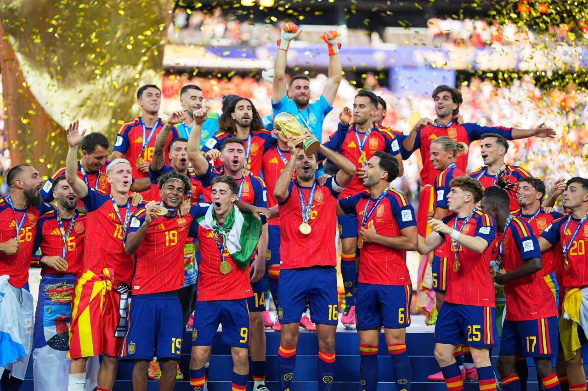
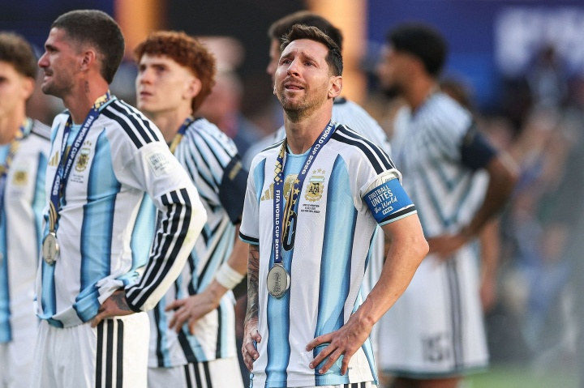
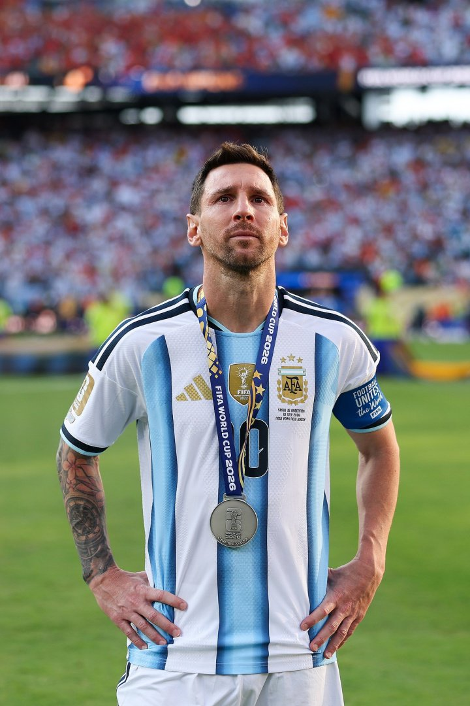

# 🏆 西班牙加时1-0阿根廷！费兰106分钟凌空抽射！斗牛士16年后再捧大力神杯！球王谢幕，梅西独自望向远方……

> 📊 **世界杯大结局！两场比赛，两种悲喜！** 季军赛英格兰6-4法国，萨卡戴帽贝林厄姆建功，英格兰创近60年最佳战绩！决赛西班牙加时1-0阿根廷，费兰106分钟凌空抽射制胜！恩佐90+3分钟两黄变一红，十人阿根廷惨遭压制全场仅2脚射门！39岁梅西的世界杯最后一舞——谢幕战以失利告终，梅西赛后独自站立望向远方……**西班牙时隔16年再夺世界杯冠军，队史第二冠！** 今天我们来做世界杯最终章复盘，验证决赛预测，并为这届精彩绝伦的世界杯画上句号！

世界杯最后一个夜晚，两场大戏同时上演——**英格兰6-4法国**，萨卡帽子戏法，姆巴佩双响+1助攻，四冠王法国惨成进攻表演的背景板，英格兰创造近60年最佳战绩！**西班牙1-0阿根廷**，加时赛费兰凌空抽射制胜，十人阿根廷全场仅2脚射门被彻底压制，39岁梅西的世界杯最后一舞以失利告终——赛后煤球王独自站立，望向远方，久久不愿离去……今天，让我们为这届史上最精彩的世界杯之一，画上句号。

---

## 📊 世界杯最终章总览（2场全部结束）

| 日期 | 比赛 | 比分 | 关键词 |
|------|------|------|--------|
| 7/19 | 🏴󠁧󠁢󠁥󠁮󠁧󠁿 英格兰 vs 🇫🇷 法国 | 6-4 | **对攻大战！** 萨卡戴帽贝林厄姆建功，英格兰创近60年最佳战绩！ |
| 7/20 | 🇪🇸 西班牙 vs 🇦🇷 阿根廷 | 1-0（加时） | **冠军！** 费兰106分钟制胜，恩佐染红，西班牙夺冠，梅西谢幕！ |

---

## 🥉 比赛一：🏴󠁧󠁢󠁥󠁮󠁧󠁿 英格兰 6-4 🇫🇷 法国——对攻大战！萨卡帽子戏法！英格兰创近60年最佳战绩！

> **开球时间**：北京时间 7月19日 凌晨 5:00
> **比赛场地**：硬石体育场（美国）
> **比赛阶段**：季军赛
> **🤖 模型预测**：🇫🇷 **法国胜** ❌
> **🙏 高僧预测**：🇫🇷 **法国胜** ❌
> **🐷 YOYO 预测**：🇫🇷 **法国胜** ❌
> **实际比分**：🏴󠁧󠁢󠁥󠁮󠁧󠁿 英格兰 **6 - 4** 🇫🇷 法国

### ⚽ 进球时间线

```
 3' ⚽ 赖斯（Rice）！带球推进至禁区前沿，跑动中起脚兜射破门！
    → 🏴󠁧󠁢󠁥󠁮󠁧󠁿 英格兰 1-0 🇫🇷 法国
    → 闪击！赖斯开场即破门！英格兰先拔头筹！

19' ⚽ 孔萨（Colwill）！赖斯左路角球传中，孔萨前点跃起甩头攻门！
    → 🏴󠁧󠁢󠁥󠁮󠁧󠁿 英格兰 2-0 🇫🇷 法国
    → 角球战术！赖斯角球助攻，孔萨头球破门！

37' ⚽ 萨卡（Saka）！拉什福德左路前插传中，萨卡跟进低射破门！
    → 🏴󠁧󠁢󠁥󠁮󠁧󠁿 英格兰 3-0 🇫🇷 法国
    → 梅开二度！萨卡两分钟内双响！英格兰半场三球领先！

45+1' ⚽ 萨卡（Saka）！埃泽直传，萨卡包抄至禁区弧顶，低射破门！
    → 🏴󠁧󠁢󠁥󠁮󠁧󠁿 英格兰 4-0 🇫🇷 法国
    → 半场戴帽！英格兰4-0法国！法国后防被打成筛子！

48' ⚽ 姆巴佩（Mbappé）！于帕梅卡诺抢断横传，姆巴佩前插推射破门！
    → 🏴󠁧󠁢󠁥󠁮󠁧󠁿 英格兰 4-1 🇫🇷 法国
    → 法国反击！姆巴佩吹响反攻号角！

54' ⚽ 巴尔科拉（Barcola）！姆巴佩直塞，巴尔科拉内切摆脱低射破门！
    → 🏴󠁧󠁢󠁥󠁮󠁧󠁿 英格兰 4-2 🇫🇷 法国
    → 法国连续追分！巴尔科拉破门！4球差距缩至2球！

67' ⚽ 姆巴佩（Mbappé）！奥利塞与姆巴佩撞墙配合，姆巴佩中路低射破门！
    → 🏴󠁧󠁢󠁥󠁮󠁧󠁿 英格兰 4-3 🇫🇷 法国
    → 双响！姆巴佩本场第2球！法国连追三球！

86' ⚽ 萨卡（Saka）！斯彭斯造点，萨卡主罚命中！
    → 🏴󠁧󠁢󠁥󠁮󠁧󠁿 英格兰 5-3 🇫🇷 法国
    → 帽子戏法！萨卡点球命中，英格兰再次拉开差距！

90+6' ⚽ 登贝莱（Dembélé）！于帕梅卡诺抢断直塞，登贝莱内切兜射破门！
    → 🏴󠁧󠁢󠁥󠁮󠁧󠁿 英格兰 5-4 🇫🇷 法国
    → 法国再追一球！登贝莱破门！

90+8' ⚽ 贝林厄姆（Bellingham）！反击中带球突入禁区，低射破门！
    → 🏴󠁧󠁢󠁥󠁮󠁧󠁿 英格兰 6-4 🇫🇷 法国
    → 锁定胜局！贝林厄姆建功！英格兰大胜法国！
```

### 🎯 赛果 vs 预测对照

| 维度 | 赛前预测 | 实际结果 | 命中？ |
|------|---------|---------|--------|
| 胜负 | 法国胜（三方一致） | 🏴󠁧󠁢󠁥󠁮󠁧󠁿 英格兰 6-4 胜 | ❌ 三方全部翻车 |

> **精算师辣评**：这场比赛就是一场**进攻表演赛**！三方赛前一致看好法国——理由是季军赛法国更有经验，姆巴佩需要用进球收官……结果开场3分钟，赖斯就用一记精彩兜射给了所有人一记响亮的耳光！英格兰的青春风暴从上半场一开始就势不可挡：赖斯远射首开记录→赖斯角球助攻孔萨→萨卡两分钟内双响→半场结束前萨卡再下一城——**4-0！半场戴帽！** 法国后防被打成了筛子！下半场姆巴佩终于发威，双响+1助攻，帮助法国连追三球，一度把比分追到4-3！第86分钟萨卡点球命中上演帽子戏法，再次拉开差距！登贝莱和贝林厄姆在补时阶段各入一球，**最终6-4！这是一场永远不会被遗忘的季军赛！** 三方押法国全军覆没——这也告诉我们：三四名决赛，永远别押谁赢……无包袱的进攻，才是最可怕的！英格兰最终获得本届世界杯季军，创造了近60年（1966年亚军以来）的最佳战绩！**德尚执教法国14年谢幕，最后一舞收获殿军。**

---

## 🏆 比赛二：🇪🇸 西班牙 1-0（加时）🇦🇷 阿根廷——加时制胜！费兰106分钟凌空抽射！西班牙16年后再夺世界杯冠军！梅西谢幕……

> **开球时间**：北京时间 7月20日 凌晨 3:00
> **比赛场地**：纽约新泽西体育场（美国）
> **比赛阶段**：决赛
> **🤖 模型预测**：🇦🇷 **阿根廷胜** ❌
> **🙏 高僧预测**：🇪🇸 **西班牙胜** ✅
> **🐷 YOYO 预测**：🇪🇸 **西班牙胜** ✅
> **实际比分**：🇪🇸 西班牙 **1 - 0** 🇦🇷 阿根廷（加时）

### ⚽ 进球时间线

```
44' 💔 利马伤退！利桑德罗受伤无法坚持，奥塔门迪紧急替补登场！
    → 阿根廷后防告急！主力中卫带伤离场！

82' 🟨 恩佐抱怨！恩佐前插被撞倒，裁判没有吹犯规，恩佐抱怨吃到第一张黄牌！
    → 隐患埋下！恩佐身背黄牌，防守动作受限！

90+3' 🟨🟥 恩佐染红！恩佐大动作踢翻库巴西，两黄变一红被罚出场！
    → 十人阿根廷！恩佐本届世界杯第三次染黄，也是最致命的一次！

96' ❌ 尼科进球被吹！波罗右路传中，梅里诺打门被大马丁挡出，尼科补射破门！
    → 但裁判吹罚梅里诺对奥塔门迪犯规在先！进球无效！阿根廷逃过一劫！

106' ⚽ 费兰（Ferran）！波罗右路传中，尼科后点头球摆渡，费兰跟进凌空抽射破门！
    → 🇪🇸 西班牙 1-0 🇦🇷 阿根廷
    → 制胜球！费兰凌空抽射直挂死角！大马丁无能为力！西班牙领先！
```


### 🔍 比赛关键节点

- **5'** 🇪🇸 奥尔莫背身做球，亚马尔小角度打门被大马丁没收——开场西班牙就展示进攻欲望
- **6'** 💥 **梅西险些单刀！** 梅西即将形成单刀，乌奈·西蒙出击拦截——这是阿根廷全场最有威胁的进攻！
- **14'** 🇦🇷 麦卡利斯特飞铲奥尔莫，裁判没有出牌——开场火药味十足
- **16'** 🇪🇸 巴埃纳背后顶翻梅西，裁判吹罚犯规
- **23'** 🇦🇷 梅西中场带球突破被罗德里拉拽，裁判吹停进入补水时间
- **29'** 🇪🇸 亚马尔边路轻巧卸球摆脱塔利亚菲科，传中被大马丁没收
- **39'** 🇪🇸 西班牙连续一脚传递，奥亚萨瓦尔禁区前沿扫射被大马丁没收
- **41'** 🟨 **利桑德罗染黄！** 利桑德罗身后拉拽奥亚萨瓦尔，主裁出示本场第一张黄牌
- **44'** 💔 **利马伤退！** 利桑德罗无法坚持，奥塔门迪紧急入替！阿根廷后防遭受重大打击！
- **45+3'** 🇪🇸 奥亚萨瓦尔拼抢踢到梅西膝盖，随后向梅西表达歉意
- **46'** 🔄 帕雷德斯换下尼古拉斯·冈萨雷斯——阿根廷调整中场
- **52'** 🟨 **帕雷德斯推倒罗德里染黄！** 无球故意推人，双方有些冲突
- **58'** 🔄 莫利纳换下蒙铁尔——阿根廷换人调整
- **62'** 🔄 佩德里和费兰换下法比安和奥亚萨瓦尔——西班牙换上生力军
- **64'** 🇪🇸 奥尔莫突施冷箭造成大马丁扑球脱手
- **67'** 🇪🇸 亚马尔1V2突破下底传中，费兰头球攻门被大马丁没收
- **70'** 🔄 罗梅罗和德保罗下场，梅迪纳和朱利亚诺·西蒙尼登场——阿根廷再次被动换人
- **75'** 🔄 梅里诺和尼科换下奥尔莫和巴埃纳——西班牙加时赛前最后调整
- **82'** 🟨 **恩佐吃到第一张黄牌！** 恩佐前插被撞倒，抱怨裁判吃黄！身背黄牌！
- **90'** 常规时间结束，0-0！比赛进入加时赛！
- **90+3'** 🟨🟥 **恩佐染红！** 恩佐大动作踢翻库巴西，两黄变一红！阿根廷少打一人！**比赛转折点！**
- **90+6'** 🟨 帕雷德斯禁区前沿放倒费兰，身背黄牌
- **90+8'** 🇪🇸 亚马尔主罚任意球射门，大马丁飞身扑出
- **93'** 🇪🇸 尼科近距离头球，大马丁神扑力保城门不失！**大马丁决赛最佳扑救！**
- **96'** ❌ **尼科进球被吹！** 波罗右路传中，梅里诺打门被大马丁挡出，尼科补射破门！但裁判吹罚梅里诺对奥塔门迪犯规在先！**进球无效！**
- **99'** 🔄 罗德里和拉波尔特下场，埃里克·加西亚和苏维门迪登场
- **102'** 🔄 阿尔瓦雷斯被塞内西换下——**劳塔罗决赛全程枯坐替补席！**
- **106'** ⚽ **费兰制胜球！** 波罗右路传中，尼科后点头球摆渡，费兰跟进凌空抽射——**皮球直挂死角！大马丁无可奈何！西班牙1-0！**
- **113'** ❌ 费兰单刀推射破门，裁判秒吹越位无效——差一点杀死比赛
- **117'** 🇦🇷 梅西凌空抽射击中梅里诺面部
- **120+1'** 🇦🇷 梅西主罚角球，朱利亚诺·西蒙尼点球点打门高出横梁——阿根廷最后的进攻机会
- **全场结束！** **西班牙1-0十人阿根廷！西班牙夺冠！**
- **赛后** 🟥 帕雷德斯锁喉加西亚+怒推加维，被直红罚下！

> **精算师辣评**：这场比赛的主题只有一个词——**"压制"**！西班牙从第一分钟开始就展示了什么叫欧洲冠军的统治力！阿根廷全场只有**2脚射门**——是的，你没看错，**决赛只有2脚射门**！梅西第6分钟险些形成单刀被乌奈·西蒙出击拦截，这是阿根廷全场最有威胁的进攻——也是最后一次真正的威胁！此后90分钟，阿根廷几乎被西班牙压在半场动弹不得！大马丁成了全场最忙的人，一次又一次用神扑拯救阿根廷——第93分钟扑出尼科近距离头球，简直是本届世界杯最佳扑救！**第90+3分钟，恩佐两黄变一红被罚下——阿根廷雪上加霜，十人应战！** 进入加时赛，第96分钟尼科补射破门但被吹无效——奥塔门迪用身体挡住了西班牙的进攻！**第106分钟，费兰凌空抽射——制胜球！西班牙1-0！** 这一球，值一座世界杯冠军！费兰本届世界杯决赛一剑封喉，尼科的摆渡助攻同样功不可没！**赛后，帕雷德斯锁喉加西亚被直红罚下，阿根廷又一人被罚下……** 
>



> 而赛后，镜头捕捉到了最让人心碎的一幕——**39岁的梅西独自站立，望向远方，久久不愿离去……他没有与任何人庆祝，没有举起大力神杯，只是静静地站在那里，望向那片他为之奋斗了一生的绿茵场……这一刻，足球没有输家。**
>
> **高僧和YOYO押西班牙命中！模型押阿根廷失利！** 2026年世界杯冠军——**西班牙**！时隔16年，斗牛士再捧大力神杯！队史第二冠！

---

## 🤖 模型战绩

| 比赛 | 预测 | 实际 | 结果 |
|------|------|------|------|
| 🏴󠁧󠁢󠁥󠁮󠁧󠁿 英格兰 vs 🇫🇷 法国 | 法国胜 | 6-4 英格兰胜 | ❌ |
| 🇪🇸 西班牙 vs 🇦🇷 阿根廷 | 阿根廷胜 | 1-0 西班牙胜（加时） | ❌ |

**本轮战绩**：模型 **0/2（0%）**

**累计战绩**：模型 **65/105（62%）**

---

### 🙏 高僧战绩

| 比赛 | 预测 | 实际 | 结果 |
|------|------|------|------|
| 🏴󠁧󠁢󠁥󠁮󠁧󠁿 英格兰 vs 🇫🇷 法国 | 法国胜 | 6-4 英格兰胜 | ❌ |
| 🇪🇸 西班牙 vs 🇦🇷 阿根廷 | 西班牙胜 | 1-0 西班牙胜（加时） | ✅ |

**本轮战绩**：高僧 **1/2（50%）**

**累计战绩**：高僧 **73/105（70%）**

---

### 🐷 YOYO 战绩

| 比赛 | 预测 | 实际 | 结果 |
|------|------|------|------|
| 🏴󠁧󠁢󠁥󠁮󠁧󠁿 英格兰 vs 🇫🇷 法国 | 法国胜 | 6-4 英格兰胜 | ❌ |
| 🇪🇸 西班牙 vs 🇦🇷 阿根廷 | 西班牙胜 | 1-0 西班牙胜（加时） | ✅ |

**本轮战绩**：YOYO **1/2（50%）**

**累计战绩**：YOYO **63/105（60%）**

---

## 📊 本届世界杯最终预测战绩总榜

| 排名 | 预测方 | 最终战绩 | 命中率 | 备注 |
|------|--------|---------|--------|------|
| 🥇 | 🙏 **高僧** | **73/105** | **70%** | 本届预测王！笑到最后！ |
| 🥈 | 🤖 **模型** | **65/105** | **62%** | 决赛惜败阿根廷 |
| 🥉 | 🐷 **YOYO** | **63/105** | **60%** | 决赛押中西班牙 |

> **高僧登顶本届预测王！** 73/105，70%命中率，笑傲江湖！模型决赛功亏一篑，押阿根廷卫冕失败，但整体62%命中率依然稳健。YOYO决赛押中西班牙，虽整体战绩略逊，但决赛命中足以令人骄傲！**高僧以70%命中率成为本届世界杯最强预测王！**

---

## 🏆 赌神模拟器最终账单

**规则**：初始 $2,000，每场押 $200 猜胜/平/负，Bet365 赔率结算

| 排名 | 预测方 | 本轮战绩 | 本轮盈亏 | 最终余额 | 总盈亏 | 段位 |
|------|--------|---------|---------|---------|--------|------|
| 🥇 | 🙏 高僧 | 1/2 | **+$580** | **$7,554** | **+$5,554 💰💰💰💰💰** | 🎲 赌神 |
| 🥈 | 🤖 模型 | 0/2 | **-$400** | **$4,344** | **+$2,344 💰💰** | 🎲 赌徒 |
| 🥉 | 🐷 YOYO | 1/2 | **+$580** | **$5,234** | **+$3,234 💰💰💰** | 🎲 赌神 |

**本轮详细盈亏（每场押 $200）**：

| 比赛 | 实际结果 | 高僧 | YOYO | 模型 | 赔率参考 |
|------|---------|------|------|------|---------|
| 🏴󠁧󠁢󠁥󠁮󠁧󠁿 英格兰 vs 🇫🇷 法国 | 英格兰胜 | ❌ -$200 | ❌ -$200 | ❌ -$200 | 英格兰 2.50 |
| 🇪🇸 西班牙 vs 🇦🇷 阿根廷 | 西班牙胜（加时） | ✅ +$220 | ✅ +$220 | ❌ -$200 | 西班牙 1.90 |

> **高僧笑傲江湖！** 季军赛押法国翻车（-$200），但决赛押西班牙命中（+$220），单轮净赚$580！最终余额$7,554，总盈利**$5,554**——本届世界杯当之无愧的赌神！YOYO同样单轮净赚$580（押法国-$200，押西班牙+$220），最终余额$5,234，总盈利$3,234，成功晋级赌神段位！模型本轮0/2，亏损$400，最终余额$4,344，总盈利$2,344，遗憾未能跻身赌神之列。**赔率再次证明了一切——押对决赛，一场顶两场！**

---

## 🏆 2026年美加墨世界杯最终排名

| 名次 | 球队 | 战绩 |
|------|------|------|
| 🥇 冠军 | 🇪🇸 **西班牙** | 7胜1负 |
| 🥈 亚军 | 🇦🇷 **阿根廷** | 6胜1平1负 |
| 🥉 季军 | 🏴󠁧󠁢󠁥󠁮󠁧󠁿 **英格兰** | 6胜2负 |
| 殿军 | 🇫🇷 **法国** | 5胜3负 |

---

## 🏆 世界杯最终章：属于斗牛士的荣耀，属于球王的告别

### 冠军之路：西班牙——从绝杀到压制，完美的夺冠剧本

西班牙本届世界杯的夺冠之路，堪称**完美剧本**：
- **1/8决赛**：1-0绝杀葡萄牙，梅里诺91分钟绝杀
- **1/4决赛**：2-1绝杀比利时，梅里诺85分钟再绝杀
- **半决赛**：2-0击败法国，奥亚萨瓦尔点球+波罗单刀
- **决赛**：1-0击败阿根廷（加时），费兰106分钟制胜

**连续三届大赛淘汰法国**——2024欧洲杯半决赛、2025欧国联半决赛、2026世界杯半决赛，斗牛士在大赛半决赛中对法国完成三杀！**这支年轻的西班牙，平均年龄不到25岁，奥尔莫、尼科、费兰、库巴西……未来可期！**

### 球王谢幕：梅西的世界杯最后一舞

39岁的梅西，世界杯最后一舞——**没有冠军，没有金球奖，没有完美结局**。

但谁在乎呢？

从2006年德国的青涩少年，到2010年南非的失落天才，到2014年里约的咫尺之遥，到2018年莫斯科的黯然离场，再到2022年卡塔尔的封王之路……**2026年，39岁的梅西再次站在世界杯决赛的舞台上，用一己之力带领阿根廷杀入决赛。**

这一路走来，他承载了太多——马拉多纳离世的悲痛，职业生涯早期的伤病，外界的质疑与嘲讽……但他从未放弃，从未妥协，从未停止奔跑。

**这届世界杯**，他打进8球（本届射手榜第二），贡献4次助攻（本届助攻榜第一），连续两届带队杀入决赛——**即使以失利告终，这依然是历史上最伟大的世界杯谢幕演出之一。**

赛后，当镜头捕捉到梅西独自站立望向远方的画面时——整个世界都安静了。那一刻，足球没有输家。只有一个即将离开这片他深爱了一生的球场的男人，在用最后的目光，与他的青春告别。



**谢谢你，里奥。**

谢谢你用二十年的时光，告诉我们什么是天赋，什么是坚持，什么是伟大。


**球王谢幕，传奇永存。**

---

## 📸 图片来源

本文所有比赛图片来自[直播吧](https://news.zhibo8.com/)，仅供非商业用途。

---

> **Status Check**: 🏆 世界杯完美收官！🏆
>
> **🥇 冠军**：西班牙🇪🇸（时隔16年，队史第二冠！）
> **🥈 亚军**：阿根廷🇦🇷（梅西谢幕！）
> **🥉 季军**：英格兰🏴󠁧󠁢󠁥󠁮󠁧󠁿（创近60年最佳战绩！）
> **殿军**：法国🇫🇷（德尚14年执教谢幕！）
>
> **📊 最终预测战绩**：
> - 🙏 **高僧**：73/105（**70%**）🥇 预测王！
> - 🤖 **模型**：65/105（62%）
> - 🐷 **YOYO**：63/105（60%）
>
> **📊 赌神模拟器最终账本**：
> - 🙏 **高僧**：$7,554（+$5,554 💰💰💰💰💰）🎲 **赌神**！
> - 🤖 **模型**：$4,344（+$2,344 💰💰）🎲 赌徒
> - 🐷 **YOYO**：$5,234（+$3,234 💰💰💰）🎲 **赌神**！
>
> **下一届世界杯**：2026年美加墨世界杯完美收官，下一届我们相约在西班牙葡萄牙摩洛哥世界杯见！
>
> **再见，梅西。球王谢幕，传奇永存。**

**AnfinsenYu** | 2026年7月20日
