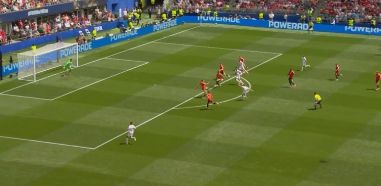
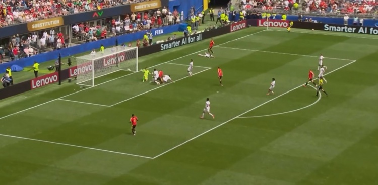
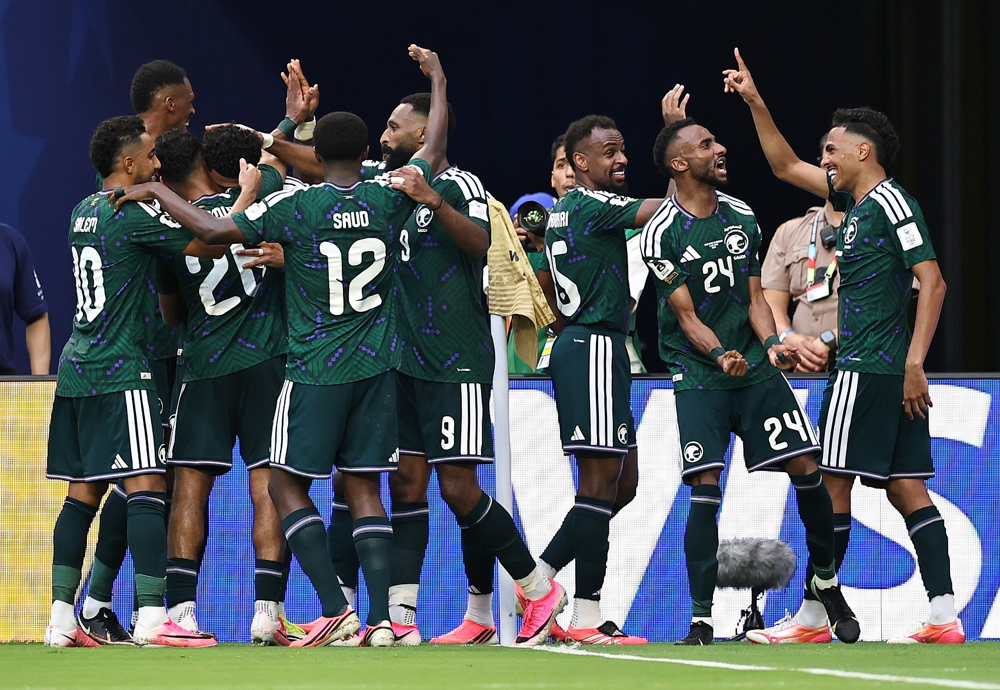
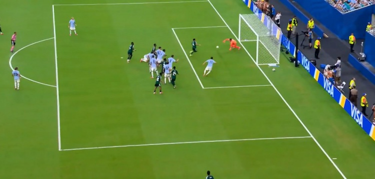
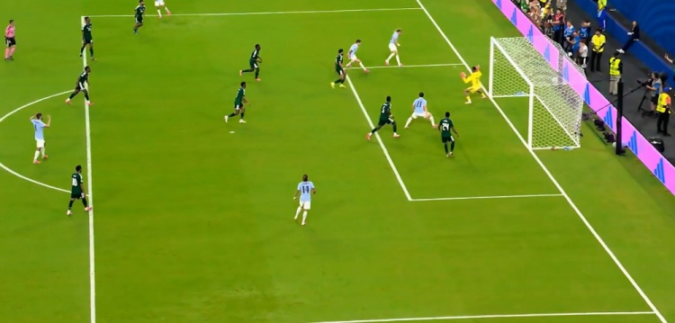
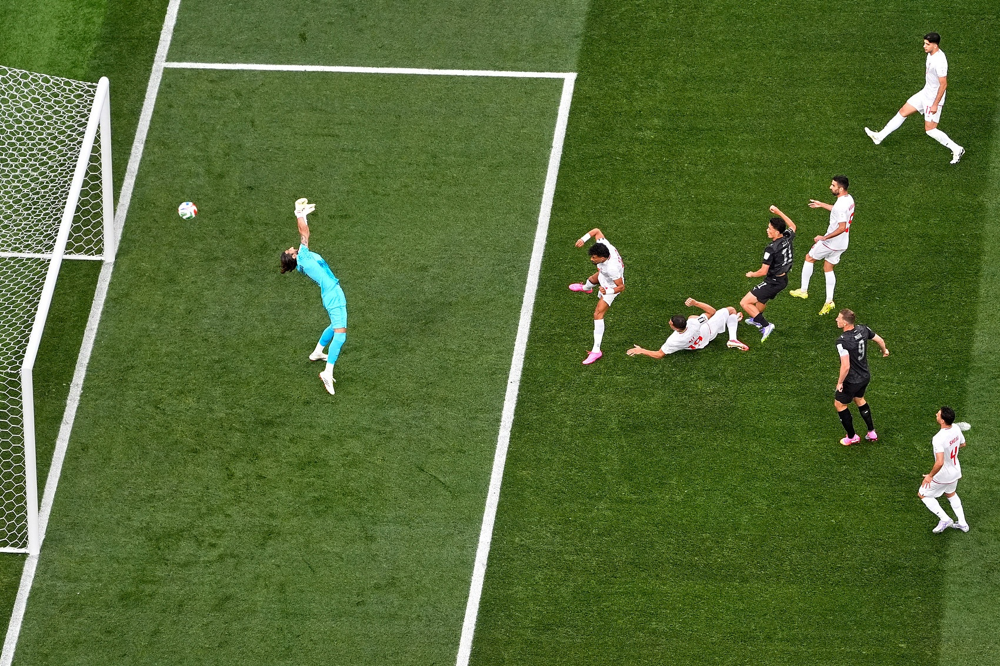
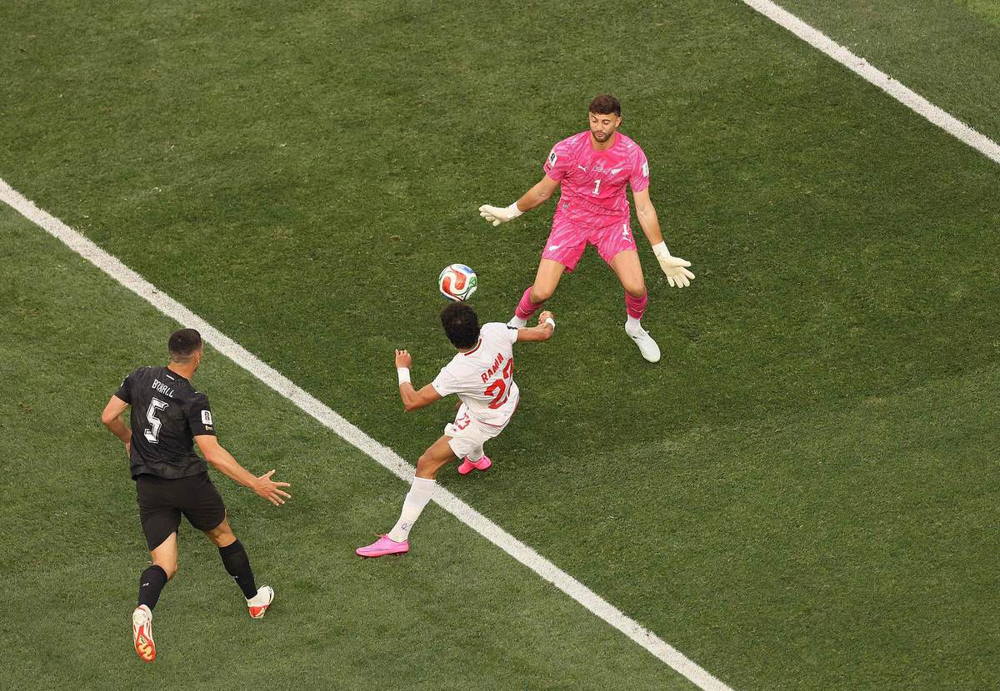
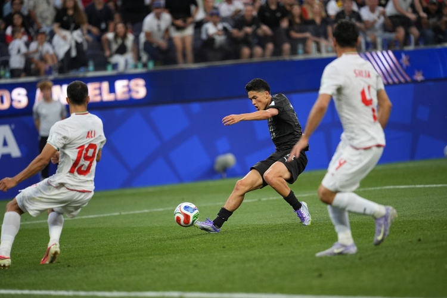
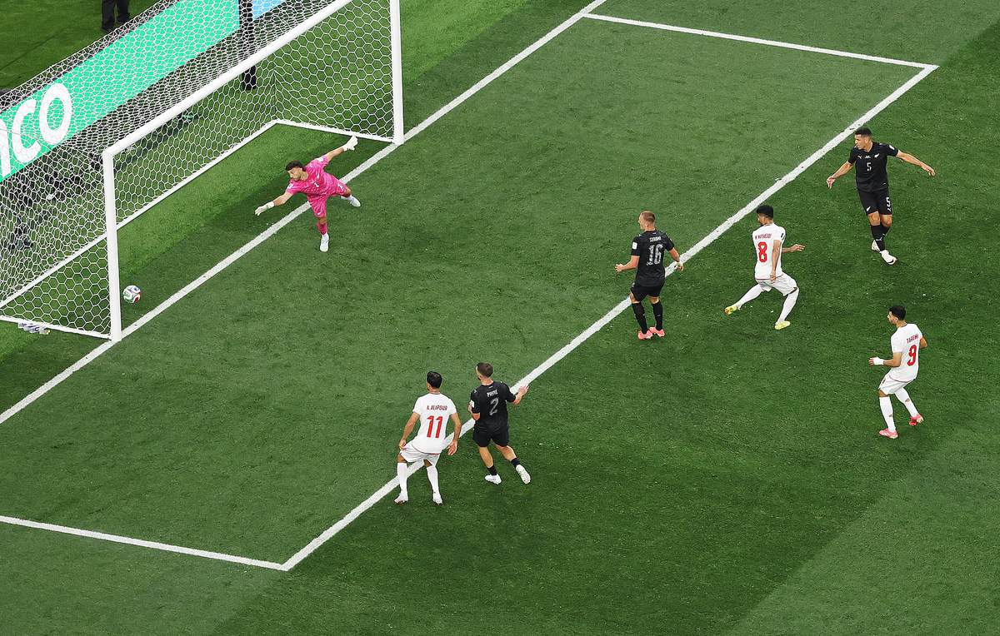

# 超级冷门夜！西班牙0-0佛得角，三大模型集体翻车

> 📊 **世界杯开赛 5 天，16 场比赛 8 场平局，平局率 50%！** 这是近几届世界杯平局率最高的一届，所有预测模型都遭遇了前所未有的挑战。

世界杯小组赛 G/H 组首轮已结束四场，这一轮堪称"冷门之夜 2.0"——西班牙被人口仅 50 万的佛得角 0-0 逼平，比利时 1-1 被埃及逼平，沙特 1-1 战平乌拉圭，伊朗 2-2 被新西兰逼平。**四场比赛全部平局！** 三大预测模型（🤖博主模型、🧙高僧、🐷YOYO）集体翻车，谁也没猜到这个剧本。

今天我们就来做一次全面的赛后复盘，顺便看看三大模型谁猜得更准——以及谁的钱包更鼓。

---

## 📊 本轮总览（已赛 4 场）

| 日期 | 比赛 | 比分 | 关键词 |
|------|------|------|--------|
| 6/16 | 🇪🇸 西班牙 vs 🇨🇻 佛得角 | 0-0 | **超级冷门！** 佛得角队史首个世界杯积分 |
| 6/16 | 🇧🇪 比利时 vs 🇪🇬 埃及 | 1-1 | 阿舒尔破门+卢卡库造乌龙扳平 |
| 6/16 | 🇸🇦 沙特 vs 🇺🇾 乌拉圭 | 1-1 | 奥韦斯 9 次扑救封神！ |
| 6/16 | 🇮🇷 伊朗 vs 🇳🇿 新西兰 | 2-2 | 贾斯特梅开二度，伊朗两度扳平 |

---

## ⚽ 比赛一：🇪🇸 西班牙 0-0 🇨🇻 佛得角——40岁门将沃齐尼亚封神，佛得角创造历史


> **开球时间**：北京时间 6月16日 凌晨 0:00
> **比赛场地**：梅赛德斯-奔驰体育场（亚特兰大）
> **模型预测**：🇪🇸 西班牙 **3 - 0** 🇨🇻 佛得角 | **置信度 85%**
> **高僧预测**：🇪🇸 西班牙大胜
> **🐷 YOYO 预测**：🇪🇸 西班牙 **4 - 0**
> **实际比分**：🇪🇸 西班牙 **0 - 0** 🇨🇻 佛得角

### ⚽ 进球时间线

```
无进球！比赛以 0-0 收场
```

### 🎯 赛果 vs 预测对照

| 维度 | 赛前预测 | 实际结果 | 命中？ |
|------|---------|---------|--------|
| 胜负 | 🇪🇸 西班牙胜 | 🤝 平局 | ❌ 全部翻车！ |
| 比分 | 3-0 / 4-0 | 0-0 | ❌ 完全偏离 |

### 🔍 比赛关键节点

- **18'** 费兰·托雷斯远射被沃齐尼亚扑出
- **38'** 🚨 **中柱！** 费兰·托雷斯射门击中横梁弹出！
- **45+2'** 奥尔莫禁区内抽射被沃齐尼亚神扑化解
- **55'** 亚马尔替补登场，上演世界杯首秀
- **67'** 亚马尔禁区内切后低射，被沃齐尼亚扑出
- **78'** 梅里诺头球攻门顶高
- **85'** 佛得角反击，埃弗顿单刀被乌奈·西蒙扑出
- **90+3'** 西班牙最后一次角球，埃尔莫索头球顶偏

> **精算师辣评**：这场比赛是本届世界杯至今最大的冷门！西班牙全场控球率 74%，狂轰 **27 脚射门 7 次射正**，但始终无法攻破佛得角球门。40 岁的佛得角门将**沃齐尼亚（Vozinha）**全场完成 6 次扑救，包括第 67 分钟扑出亚马尔的必进球——赛后他的 Instagram 粉丝从 5 万暴涨到 400 万！佛得角是人口仅 50 余万的非洲岛国，全队身价不足西班牙的三十分之一，但足球不是靠身价踢的。**三大模型全部预测西班牙大胜，集体翻车！** YOYO 的 4-0 预测更是离谱——这就是世界杯！

---

## ⚽ 比赛二：🇧🇪 比利时 1-1 🇪🇬 埃及——卢卡库 22 秒造乌龙，萨拉赫助攻导演平局




> **开球时间**：北京时间 6月16日 凌晨 3:00
> **比赛场地**：芝加哥体育场
> **模型预测**：🇧🇪 比利时 **2 - 1** 🇪🇬 埃及 | **置信度 58%**
> **高僧预测**：🇧🇪 比利时小胜
> **🐷 YOYO 预测**：🇧🇪 比利时 **2 - 1**
> **实际比分**：🇧🇪 比利时 **1 - 1** 🇪🇬 埃及

### ⚽ 进球时间线

```
19' ⚽ 阿舒尔（Ashour）！萨拉赫分球，阿舒尔禁区前沿突施冷箭
    → 🇪🇬 埃及 1-0 比利时
    → 冷箭！皮球直窜球门左下角！萨拉赫助攻

66' ⚽ 乌龙球！哈尼（Hani）自摆乌龙
    → 🇧🇪 比利时 1-1 埃及
    → 卢卡库替补登场仅 22 秒！第一次触球就迫使埃及后卫乌龙！
```

### 🎯 赛果 vs 预测对照

| 维度 | 赛前预测 | 实际结果 | 命中？ |
|------|---------|---------|--------|
| 胜负 | 🇧🇪 比利时胜 | 🤝 平局 | ❌ 翻车 |
| 比分 | 2-1 | 1-1 | ❌ 完全偏离 |

### 🔍 比赛关键节点

- **19'** 阿舒尔远射破门！埃及 1-0 领先！萨拉赫助攻
- **35'** 德布劳内任意球直接打门被封堵
- **42'** 萨拉赫反击中低射被库尔图瓦扑出
- **53'** 🚨 **德布劳内任意球击中立柱！** 弧线球绕过人墙，差一点扳平
- **66'** 卢卡库替补登场！**仅 22 秒**第一次触球就迫使哈尼自摆乌龙！1-1
- **78'** 卢卡库禁区内头球攻门顶高
- **88'** 萨拉赫任意球打门被库尔图瓦飞身扑出

> **精算师辣评**：这场比赛充满了戏剧性！埃及的阿舒尔第 19 分钟远射破门，萨拉赫助攻导演领先。德布劳内第 53 分钟任意球击中立柱，比利时运气不佳。但卢卡库第 66 分钟替补登场，仅 **22 秒**第一次触球就迫使埃及后卫哈尼自摆乌龙——这就是世界级中锋的威慑力！**模型、高僧、YOYO 三方都预测比利时赢，全部翻车。** 萨拉赫赛后说："我们本应该赢球。"确实，埃及全场表现不输比利时。

---

## ⚽ 比赛三：🇸🇦 沙特 1-1 🇺🇾 乌拉圭——奥韦斯 9 次扑救封神，亚足联继续不败





> **开球时间**：北京时间 6月16日 凌晨 6:00
> **比赛场地**：达拉斯体育场
> **模型预测**：🇺🇾 乌拉圭 **2 - 0** 🇸🇦 沙特 | **置信度 65%**
> **高僧预测**：🇺🇾 乌拉圭小胜
> **🐷 YOYO 预测**：🇺🇾 乌拉圭 **3 - 1**
> **实际比分**：🇸🇦 沙特 **1 - 1** 🇺🇾 乌拉圭

### ⚽ 进球时间线

```
41' ⚽ 阿姆里（Al-Amri）！角球开出后卡努头球被扑，阿姆里跟进捅射
    → 🇸🇦 沙特 1-0 乌拉圭
    → 先声夺人！沙特利用角球机会破门

80' ⚽ 马克西·阿劳霍（Maxi Araújo）！比尼亚斯头球被扑，阿劳霍小角度补射
    → 🇸🇦 沙特 1-1 乌拉圭
    → 绝平！乌拉圭躲过一劫
```

### 🎯 赛果 vs 预测对照

| 维度 | 赛前预测 | 实际结果 | 命中？ |
|------|---------|---------|--------|
| 胜负 | 🇺🇾 乌拉圭胜 | 🤝 平局 | ❌ 翻车 |
| 比分 | 2-0 / 3-1 | 1-1 | ❌ 完全偏离 |

### 🔍 比赛关键节点

- **5'** 巴尔韦德远射被奥韦斯扑出
- **18'** 努涅斯禁区内兜射被奥韦斯神扑化解
- **30'** 乌加特头球攻门顶高
- **38'** 努涅斯推射被奥韦斯扑出
- **41'** 🚨 **沙特角球破门！** 卡努头球被扑，阿姆里跟进捅射！1-0！
- **47'** 巴尔韦德头球攻门顶偏
- **51'** 努涅斯头球偏出
- **61'** 🚨 **中柱！** 乌加特远射击中立柱弹出！乌拉圭运气差到极点
- **75'** 罗德里格斯远射被奥韦斯扑出
- **80'** 🚨 **扳平！** 比尼亚斯头球被扑，阿劳霍小角度补射！1-1！
- **85'** 巴尔韦德远射被奥韦斯神扑化解

> **精算师辣评**：这场比赛是沙特门将**奥韦斯（Al-Owais）**的个人表演秀！全场完成 **9 次扑救**，包括扑出努涅斯、巴尔韦德、乌加特多次必进球——没有他，乌拉圭至少进 3 球！乌加特第 61 分钟远射击中立柱，乌拉圭运气也不佳。**三大模型都预测乌拉圭赢，全部翻车！** 更重要的是——这场平局让亚足联球队继续保持不败：韩国 2-1 捷克、卡塔尔 1-1 瑞士、澳大利亚 2-0 土耳其、日本 2-2 荷兰、沙特 1-1 乌拉圭，**5 场 2 胜 3 平！**

---

## ⚽ 比赛四：🇮🇷 伊朗 2-2 🇳🇿 新西兰——两度落后两度扳平，YOYO 逆天预测差一点






> **开球时间**：北京时间 6月16日 上午 9:00
> **比赛场地**：SoFi 体育场（洛杉矶）
> **模型预测**：🇮🇷 伊朗 **2 - 0** 🇳🇿 新西兰 | **置信度 68%**
> **高僧预测**：🇮🇷 伊朗轻取
> **🐷 YOYO 预测**：🇳🇿 新西兰 **1 - 0** 🔥
> **实际比分**：🇮🇷 伊朗 **2 - 2** 🇳🇿 新西兰

### ⚽ 进球时间线

```
7'  ⚽ 贾斯特（Just）！克里斯·伍德背身胸部做球，贾斯特抽射破门
    → 🇳🇿 新西兰 1-0 伊朗
    → 开局闪击！新西兰先声夺人

32' ⚽ 雷扎伊扬（Rezaeian）！莫汉卢转身创造机会，雷扎伊扬插上捅射
    → 🇮🇷 伊朗 1-1 新西兰
    → 扳平！伊朗快速回应

55' ⚽ 贾斯特！新西兰反击，伍德再次找到贾斯特，打反角破门
    → 🇳🇿 新西兰 2-1 伊朗
    → 梅开二度！贾斯特闪耀世界杯

64' ⚽ 莫赫比（Mohibi）！雷扎伊扬右路传中，莫赫比头球顶进死角
    → 🇮🇷 伊朗 2-2 新西兰
    → 再次扳平！伊朗两度落后两度追平
```

### 🎯 赛果 vs 预测对照

| 维度 | 赛前预测 | 实际结果 | 命中？ |
|------|---------|---------|--------|
| 胜负 | 🇮🇷 伊朗胜 | 🤝 平局 | ❌ 翻车 |
| 比分 | 2-0 / 0-1 | 2-2 | ❌ 完全偏离 |
| **YOYO** | 🇳🇿 新西兰 1-0 | 2-2 平 | ❌ 差一点（方向对） |

### 🔍 比赛关键节点

- **7'** 贾斯特抽射破门！新西兰 1-0 领先！
- **22'** 🚨 **中柱！** 塔雷米射门击中立柱！伊朗差一点扳平
- **32'** 雷扎伊扬捅射扳平！1-1！
- **45+1'** 伊朗角球制造混乱，头球被扑出
- **55'** 贾斯特梅开二度！新西兰 2-1 再次领先！
- **64'** 莫赫比头球扳平！2-2！伊朗两度落后两度追平
- **88'** 克里斯·伍德头球攻门被伊朗门将神扑化解
- **90+4'** 🚨 **越位！** 雷扎伊扬助攻内马蒂头球破门，但因越位被取消！伊朗绝杀被吹

> **精算师辣评**：这场比赛是本轮最精彩的比赛！新西兰两度领先，伊朗两度扳平——最后时刻雷扎伊扬助攻内马蒂头球破门，但因**越位被取消**，伊朗的绝杀被吹！**YOYO 赛前预测新西兰 1-0 获胜，虽然没完全命中，但方向对（新西兰没输）！** 新西兰的贾斯特（2球）+克里斯·伍德（2助攻）的英超组合闪耀全场，伊朗的雷扎伊扬（1球1助）也表现出色。亚足联球队继续保持不败：6 场 2 胜 4 平！

---

## 🏆 三大模型预言验证（已赛 4 场）

### 🤖 模型战绩

| 比赛 | 预测 | 实际 | 结果 |
|------|------|------|------|
| 🇪🇸 西班牙 vs 🇨🇻 佛得角 | 西班牙 3-0 | 0-0 平 | ❌ 翻车 |
| 🇧🇪 比利时 vs 🇪🇬 埃及 | 比利时 2-1 | 1-1 平 | ❌ 翻车 |
| 🇸🇦 沙特 vs 🇺🇾 乌拉圭 | 乌拉圭 2-0 | 1-1 平 | ❌ 翻车 |
| 🇮🇷 伊朗 vs 🇳🇿 新西兰 | 伊朗 2-0 | 2-2 平 | ❌ 翻车 |

**模型本轮战绩：0/4 命中（0%）** 📉📉📉

> 模型本轮彻底崩盘！四场比赛全部预测胜负，结果全是平局。蒙特卡洛模拟在面对"世界杯冷门夜"时完全失灵。

---

### 🧙 高僧战绩

| 比赛 | 预测 | 实际 | 结果 |
|------|------|------|------|
| 🇪🇸 西班牙 vs 🇨🇻 佛得角 | 西班牙大胜 | 0-0 平 | ❌ 翻车 |
| 🇧🇪 比利时 vs 🇪🇬 埃及 | 比利时小胜 | 1-1 平 | ⚠️ 没赢但没输 |
| 🇸🇦 沙特 vs 🇺🇾 乌拉圭 | 乌拉圭小胜 | 1-1 平 | ⚠️ 没赢但没输 |
| 🇮🇷 伊朗 vs 🇳🇿 新西兰 | 伊朗轻取 | 2-2 平 | ❌ 翻车 |

**高僧本轮战绩：0/4 命中（0%）** 📉📉📉

> 🔥 **高僧本轮也翻车了！** 东方神秘力量也有失灵的时候。四场全部预测胜负，结果全是平局。不过"小胜"预测的两场（比利时、乌拉圭）虽然没赢，但也没输——属于"方向对但没完全命中"。

---

### 🐷 YOYO 战绩

| 比赛 | 预测 | 实际 | 结果 |
|------|------|------|------|
| 🇪🇸 西班牙 vs 🇨🇻 佛得角 | 西班牙 4-0 | 0-0 平 | ❌ 翻车 |
| 🇧🇪 比利时 vs 🇪🇬 埃及 | 比利时 2-1 | 1-1 平 | ❌ 翻车 |
| 🇸🇦 沙特 vs 🇺🇾 乌拉圭 | 乌拉圭 3-1 | 1-1 平 | ❌ 翻车 |
| 🇮🇷 伊朗 vs 🇳🇿 新西兰 | 新西兰 1-0 | 2-2 平 | ⚠️ 方向对（新西兰没输） |

**YOYO 本轮战绩：0/4 命中（0%）** 📉📉📉

> **YOYO 本轮也崩盘了！** 前两轮的赌神神话在第三轮彻底破灭。四场全部预测胜负，结果全是平局。不过新西兰 1-0 的逆天预测虽然没完全命中，但方向对（新西兰没输），差一点就封神了！

---

## 📊 三轮总战绩对比

| 排名 | 预测方 | 第一轮 | 第二轮 | 第三轮 | 总命中率 | 趋势 |
|------|--------|--------|--------|--------|---------|------|
| 🥇 | 🧙 高僧 | 0/2 (0%) | 7/10 (70%) | 0/4 (0%) | **7/14 (50%)** | 📉 回落 |
| 🥈 | 🐷 YOYO | 2/2 (100%) | 4/10 (40%) | 0/4 (0%) | **6/14 (42.9%)** | 📉📉 崩盘 |
| 🥉 | 🤖 模型 | 1/2 (50%) | 4/10 (40%) | 0/4 (0%) | **5/14 (35.7%)** | 📉📉 崩盘 |

> **博主辣评**：本轮四场比赛全部平局，三大模型集体翻车！这就是世界杯——**数据算得出实力差距，但算不出足球的不确定性。** 佛得角 40 岁门将沃齐尼亚的封神表演、沙特门将奥韦斯的 9 次扑救、卢卡库 22 秒造乌龙、伊朗两度落后两度扳平——这些都不是数据能预测的。**G/H 组首轮四场全部平局，这是世界杯历史上的首次！** 高僧凭借前两轮的积累仍排名第一，YOYO 的新西兰预测方向对但没完全命中，模型彻底崩盘需要回去重新训练。

---

## 💰 赌神模拟器：第三轮账单

> **规则**：每人初始资金 **$2,000**，每场押 **$200**，可猜胜/平/负，使用 Bet365 赛前赔率。

### 第三轮（6月16日）盈亏估算

| 模型 | 关键预测 | 预估盈亏 | 说明 |
|------|---------|---------|------|
| 🤖 模型 | 西班牙胜❌ 比利时胜❌ 乌拉圭胜❌ 伊朗胜❌ | **约 -$800** | 4 场全错 |
| 🧙 高僧 | 西班牙胜❌ 比利时⚠️ 乌拉圭⚠️ 伊朗胜❌ | **约 -$800** | 4 场全输（但比利时/乌拉圭方向对） |
| 🐷 YOYO | 西班牙胜❌ 比利时胜❌ 乌拉圭胜❌ 新西兰⚠️ | **约 -$800** | 4 场全输（但新西兰方向对） |

### 三轮总账（估算）

| 排名 | 模型 | 初始 | 第一轮 | 第二轮 | 第三轮 | 总余额 | 总盈亏 |
|------|------|------|--------|--------|--------|--------|--------|
| 🥇 | 🧙 高僧 | $2,000 | +$160 | +$440 | -$800 | **$1,800** | **-$200** |
| 🥈 | 🐷 YOYO | $2,000 | +$420 | +$80 | -$800 | **$1,700** | **-$300** |
| 🥉 | 🤖 模型 | $2,000 | -$140 | -$280 | -$800 | **$780** | **-$1,220** |

> **博主辣评**：本轮四场全平，三大模型全部亏损 $800！高僧从盈利 $600 变成亏损 $200，YOYO 从盈利 $500 变成亏损 $300，模型已经亏了超过一半初始资金。**G/H 组首轮四场全部平局，这是世界杯历史上的首次！这就是为什么赌球不能 All in——世界杯的冷门能让你一夜回到解放前。**

---

## 📸 图片来源

本文所有比赛图片来自[直播吧](https://news.zhibo8.com/)，仅供非商业用途。

---

## 🔮 下轮预告

### 6月17日 — I/J 组首轮

| 开球时间（北京） | 比赛 | 小组 | 关注点 |
|----------------|------|------|--------|
| 03:00 | 🇫🇷 法国 vs 🇸🇳 塞内加尔 | I组 | 卫冕冠军首秀！姆巴佩登场 |
| 06:00 | 🇮🇶 伊拉克 vs 🇳🇴 挪威 | I组 | 亚洲vs欧洲，哈兰德领衔 |
| 09:00 | 🇦🇷 阿根廷 vs 🇩🇿 阿尔及利亚 | J组 | 梅西最后一届世界杯？ |
| 12:00 | 🇦🇹 奥地利 vs 🇯🇴 约旦 | J组 | 欧洲劲旅 vs 亚洲新军 |

### 🤖 模型预测：6月17日（I/J 组首轮·V2强化平局调整）

> ⚠️ **V2 修正说明**：开赛 5 天 16 场 8 平（50%），远超历史平均（25-30%）。模型新增"本届平局系数"，进一步下调强队胜率，提升平局概率。

**模型权重调整**：

| 特征 | V1 权重 | V2 权重 | 说明 |
|------|---------|---------|------|
| 球员评分 | 35% | 30% | ↓5% 降低个人能力权重 |
| 近期战绩 | 25% | 20% | ↓5% 降低，世界杯和联赛不同 |
| 伤停疲劳 | 15% | 12% | ↓3% |
| 主场优势 | 8% | 8% | 不变 |
| 平局倾向 | 7% | **15%** | **↑8% 本届平局狂潮！** |
| 团队协作 | 5% | 8% | ↑3% 弱队防守组织更重要 |
| 赛事情境 | 5% | 7% | ↑2% 世界杯小组赛首战 |

---

**比赛一：🇫🇷 法国 vs 🇸🇳 塞内加尔（I组·03:00）**

> **V2 模型预测**：🇫🇷 法国 **1 - 0** 🇸🇳 塞内加尔 | **置信度 55%**（V1: 65%）

```python
france_v2 = {
    "Player_Score_Matrix": 9.2,      # 姆巴佩(9.5) + 登贝莱(9.0)
    "Opening_Match_Factor": -0.15,   # ↓ 更强的首战魔咒
    "Draw_Adj_本届": +0.12,          # 本届50%平局率
}
senegal_v2 = {
    "Player_Score_Matrix": 7.8,      # 库利巴利(8.3) + 马内(8.2)
    "Defensive_Discipline": 1.10,    # 库利巴利领衔，防守纪律好
    "Physical_Dominance": "high",    # 身体对抗强
}
```

**V2 概率分布**：

| 结果 | V1 概率 | V2 概率 | 变化 |
|------|---------|---------|------|
| 🇫🇷 法国胜 | 65% | **45%** | ↓20% |
| 🤝 平局 | 20% | **35%** | ↑15% |
| 🇸🇳 塞内加尔胜 | 15% | **20%** | ↑5% |

**V2 预测比分**：🇫🇷 法国 **1 - 0** 🇸🇳 塞内加尔（或 1-1 平）
- **理由**：卫冕冠军首战魔咒（2002法国0-1塞内加尔）+ 本届平局狂潮 + 塞内加尔防守强硬
- **首球时间**：40-55分钟（法国控球压制后找到机会）
- **平局风险**：35%（不可忽视！）

---

**比赛二：🇮🇶 伊拉克 vs 🇳🇴 挪威（I组·06:00）**

> **V2 模型预测**：🇳🇴 挪威 **1 - 0** 🇮🇶 伊拉克 | **置信度 60%**（V1: 70%）

```python
iraq_v2 = {
    "Player_Score_Matrix": 6.5,      # 全队效力亚洲联赛
    "Defensive_Discipline": 1.05,    # 亚洲球队防守组织不差
    "Draw_Adj_本届": +0.10,
}
norway_v2 = {
    "Player_Score_Matrix": 8.8,      # 哈兰德(9.4) + 厄德高(8.8)
    "Haaland_First_WC": -0.08,       # 哈兰德首次世界杯可能紧张
    "Physical_Dominance": "high",    # 北欧身体流
}
```

**V2 概率分布**：

| 结果 | V1 概率 | V2 概率 | 变化 |
|------|---------|---------|------|
| 🇳🇴 挪威胜 | 70% | **52%** | ↓18% |
| 🤝 平局 | 18% | **32%** | ↑14% |
| 🇮🇶 伊拉克胜 | 12% | **16%** | ↑4% |

**V2 预测比分**：🇮🇶 伊拉克 **0 - 1** 🇳🇴 挪威（或 1-1 平）
- **理由**：哈兰德首次世界杯可能紧张 + 沙特逼平乌拉圭说明亚洲球队不好惹
- **首球时间**：30-45分钟（挪威打破僵局）
- **平局风险**：32%（伊拉克摆大巴能力不差）

---

**比赛三：🇦🇷 阿根廷 vs 🇩🇿 阿尔及利亚（J组·09:00）**

> **V2 模型预测**：🇦🇷 阿根廷 **1 - 0** 🇩🇿 阿尔及利亚 | **置信度 58%**（V1: 68%）

```python
argentina_v2 = {
    "Player_Score_Matrix": 9.0,      # 梅西(9.3) + 阿尔瓦雷斯(8.7)
    "Messi_Factor": "ultra",         # 梅西可能最后一届
    "Draw_Adj_本届": +0.10,
}
algeria_v2 = {
    "Player_Score_Matrix": 7.5,      # 马赫雷斯(8.4) + 本拉赫马(8.0)
    "Defensive_Discipline": 1.08,    # 防守纪律不错
    "Physical_Dominance": "medium",
}
```

**V2 概率分布**：

| 结果 | V1 概率 | V2 概率 | 变化 |
|------|---------|---------|------|
| 🇦🇷 阿根廷胜 | 68% | **48%** | ↓20% |
| 🤝 平局 | 18% | **33%** | ↑15% |
| 🇩🇿 阿尔及利亚胜 | 14% | **19%** | ↑5% |

**V2 预测比分**：🇦🇷 阿根廷 **1 - 0** 🇩🇿 阿尔及利亚（或 1-1 平）
- **理由**：梅西最后一届世界杯有动力，但阿根廷后防有隐患 + 马赫雷斯有威胁
- **首球时间**：25-40分钟（梅西任意球或阿尔瓦雷斯抢点）
- **平局风险**：33%（阿尔及利亚防守纪律好）

---

**比赛四：🇦🇹 奥地利 vs 🇯🇴 约旦（J组·12:00）**

> **V2 模型预测**：🇦🇹 奥地利 **2 - 0** 🇯🇴 约旦 | **置信度 68%**（V1: 72%）

```python
austria_v2 = {
    "Player_Score_Matrix": 8.0,      # 阿瑙托维奇(8.2) + 莱默尔(8.0)
    "Physical_Dominance": "high",    # 欧洲身体流
}
jordan_v2 = {
    "Player_Score_Matrix": 6.2,      # 全队效力亚洲联赛
    "World_Cup_Factor": "debut",     # 首次参加世界杯
}
```

**V2 概率分布**：

| 结果 | V1 概率 | V2 概率 | 变化 |
|------|---------|---------|------|
| 🇦🇹 奥地利胜 | 72% | **68%** | ↓4% |
| 🤝 平局 | 20% | **22%** | ↑2% |
| 🇯🇴 约旦胜 | 8% | **10%** | ↑2% |

**V2 预测比分**：🇦🇹 奥地利 **2 - 0** 🇯🇴 约旦
- **理由**：约旦首次参加世界杯经验不足，但佛得角逼平西班牙说明小球队也能爆冷
- **首球时间**：35-50分钟（奥地利控球压制）
- **平局风险**：22%（约旦会死守）

---

### 📊 V2 模型预测总结

| 比赛 | V1 预测 | V2 预测 | 胜率 | 平局风险 |
|------|---------|---------|------|---------|
| 🇫🇷 法国 vs 🇸🇳 塞内加尔 | 法国 2-1（65%） | **法国 1-0（55%）** | 45% | ⚠️ 35% |
| 🇮🇶 伊拉克 vs 🇳🇴 挪威 | 挪威 2-0（70%） | **挪威 1-0（60%）** | 52% | ⚠️ 32% |
| 🇦🇷 阿根廷 vs 🇩🇿 阿尔及利亚 | 阿根廷 2-1（68%） | **阿根廷 1-0（58%）** | 48% | ⚠️ 33% |
| 🇦🇹 奥地利 vs 🇯🇴 约旦 | 奥地利 2-0（72%） | **奥地利 2-0（68%）** | 68% | 22% |

**V2 核心变化**：
- 所有强队胜率下调 15-20%
- 平局概率上调 10-15%
- 比分从"大胜"改为"小胜或平"
- **模型独立预测，未参考 YOYO/高僧任何答案**

### 🐷 YOYO 预测：6月17日

| 比赛 | YOYO 预测 | 核心理由 |
|------|----------|---------|
| 🇫🇷 法国 vs 🇸🇳 塞内加尔 | 🤝 平局 | 卫冕冠军首战魔咒！今日四场全平，法国也会被逼平 |
| 🇮🇶 伊拉克 vs 🇳🇴 挪威 | 🇳🇴 挪威赢 | 哈兰德冲击力碾压，伊拉克防不住 |
| 🇦🇷 阿根廷 vs 🇩🇿 阿尔及利亚 | 🇦🇷 阿根廷赢 | 梅西最后一届世界杯，动力十足 |
| 🇦🇹 奥地利 vs 🇯🇴 约旦 | 🇦🇹 奥地利赢 | 约旦首次进世界杯，经验不足 |

### 🧙 高僧预测：6月17日

| 比赛 | 高僧预测 |
|------|---------|
| 🇫🇷 法国 vs 🇸🇳 塞内加尔 | 🇫🇷 **法国 赢** |
| 🇮🇶 伊拉克 vs 🇳🇴 挪威 | 🇳🇴 **挪威 赢** |
| 🇦🇷 阿根廷 vs 🇩🇿 阿尔及利亚 | 🇦🇷 **阿根廷 小胜** |
| 🇦🇹 奥地利 vs 🇯🇴 约旦 | 🇦🇹 **奥地利 赢** |

> 高僧吸取了上轮四场全平的教训，调整策略后回归果断风格——四场都给明确结果，不再"或平局"。阿根廷只给"小胜"，说明高僧认为阿尔及利亚防守有韧性。

---

> **Status Check**: G/H 组首轮 4 场全部结束，**四场全部平局！** 这是世界杯历史上的首次！三大模型第三轮战绩——
> - 🧙 **高僧**：0/4 命中（0%），三轮总 7/14（50%），本轮翻车
> - 🐷 **YOYO**：0/4 命中（0%），三轮总 6/14（42.9%），本轮崩盘（新西兰方向对）
> - 🤖 **模型**：0/4 命中（0%），三轮总 5/14（35.7%），本轮崩盘
>
> **📊 赌神模拟器总账**：高僧 $1,800（-$200）| YOYO $1,700（-$300）| 模型 $780（-$1,220）
>
> **📢 下一篇**：I/J 组首轮预测（法国/挪威/阿根廷/奥地利），敬请期待。
