> ⚠️ **注意**：下轮预告待更新

# 姆巴佩封神之夜！梅开二度加冕法国射手王，哈兰德双响挪威碾压伊拉克

> 📊 **世界杯第 6 天，I/J 组首轮开战！** 两大超级巨星姆巴佩和哈兰德同日爆发，用进球宣告自己的世界杯之旅正式开始。

世界杯小组赛 I/J 组首轮已结束两场（另外两场进行中），这一夜属于超级巨星——**姆巴佩梅开二度加冕法国队史射手王**，**哈兰德双响+造乌龙**帮助挪威大胜伊拉克。两大巨星隔空斗法，贡献了精彩的进球盛宴。

今天我们先来复盘已结束的两场比赛，另外两场（阿根廷vs阿尔及利亚、奥地利vs约旦）赛后更新。

---

## 📊 本轮总览（已赛 2 场）

| 日期 | 比赛 | 比分 | 关键词 |
|------|------|------|--------|
| 6/17 | 🇫🇷 法国 vs 🇸🇳 塞内加尔 | 3-1 | **姆巴佩封神！** 梅开二度加冕队史射手王 |
| 6/17 | 🇮🇶 伊拉克 vs 🇳🇴 挪威 | 1-4 | **哈兰德双响！** 造乌龙，亚足联首败 |
| 6/17 | 🇦🇷 阿根廷 vs 🇩🇿 阿尔及利亚 | 3-0 | **GOAT帽子戏法！** 梅西追平克洛泽纪录 |
| 6/17 | 🇦🇹 奥地利 vs 🇯🇴 约旦 | 3-1 | **约旦首球！** 队史世界杯第一球 |

---

## ⚽ 比赛一：🇫🇷 法国 3-1 🇸🇳 塞内加尔——姆巴佩封神夜，加冕法国队史射手王

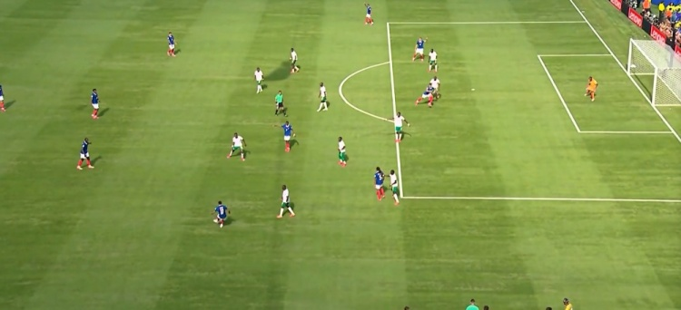
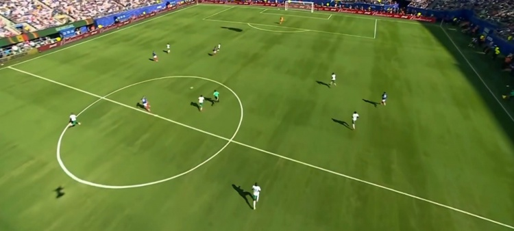
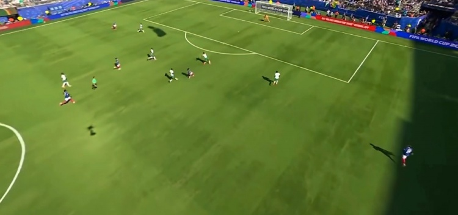
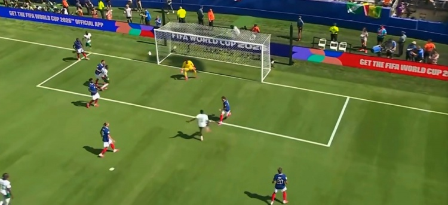

> **开球时间**：北京时间 6月17日 凌晨 3:00
> **比赛场地**：新泽西体育场
> **模型预测**：🇫🇷 法国 **1 - 0** 🇸🇳 塞内加尔 | **置信度 55%**
> **高僧预测**：🇫🇷 **法国 赢**
> **🐷 YOYO 预测**：🤝 **平局**
> **实际比分**：🇫🇷 法国 **3 - 1** 🇸🇳 塞内加尔

### ⚽ 进球时间线

```
66' ⚽ 姆巴佩（Mbappé）！奥利塞精妙直塞，姆巴佩转身扫射破门
    → 🇫🇷 法国 1-0 塞内加尔
    → 终于打破僵局！姆巴佩等待了66分钟！

82' ⚽ 巴尔科拉（Barcola）！拉比奥直塞，巴尔科拉单刀挑射
    → 🇫🇷 法国 2-0 塞内加尔
    → 锁定胜局！替补连线！

90+5' ⚽ 姆巴耶（Mbaye）！恩迪亚耶助攻
    → 🇫🇷 法国 2-1 塞内加尔
    → 塞内加尔扳回一球，但为时已晚

90+6' ⚽ 姆巴佩！世界波远射
    → 🇫🇷 法国 3-1 塞内加尔
    → 世界波！姆巴佩梅开二度！加冕法国队史射手王！
```

### 🎯 赛果 vs 预测对照

| 维度 | 赛前预测 | 实际结果 | 命中？ |
|------|---------|---------|--------|
| 胜负 | 🇫🇷 法国胜 | 🇫🇷 法国胜 | ✅ 模型、高僧命中 |
| 比分 | 1-0 | 3-1 | ❌ 法国赢得更多 |
| YOYO | 平局 | 法国胜 | ❌ 翻车 |

### 🔍 比赛关键节点

- **25'** 🚨 **中柱！** 杰克逊反击中击中立柱！塞内加尔差一点先声夺人
- **45+6'** 🚨 **半空门打高！** 萨尔面对半空门垫射打高！塞内加尔错失良机
- **57'** 姆巴佩单刀被门迪用腿挡出！法国错失扩大比分机会
- **59'** 姆巴佩禁区内倒地，经 VAR 确认未判点球
- **66'** ⚽ **打破僵局！** 姆巴佩转身扫射！1-0！
- **68'** 杰克逊单刀凌空抽射破门，但被吹越位无效
- **82'** ⚽ 巴尔科拉单刀挑射！2-0！
- **90+5'** 姆巴耶扳回一球，但为时已晚
- **90+6'** ⚽ **世界波！** 姆巴佩远射梅开二度！3-1！**加冕法国队史射手王！**
- **90+9'** 楚阿梅尼险些乌龙，迈尼昂门线前解围

> **精算师辣评**：这场比赛是**姆巴佩的封神之夜**！全场法国控球占优但久攻不下，直到第 66 分钟姆巴佩才打破僵局。第 90+6 分钟的世界波不仅完成梅开二度，更让他以 **58 球超越吉鲁（57 球）成为法国队史射手王**！在世界杯总射手榜上，姆巴佩以 **14 球超越梅西**，与盖德·穆勒并列第三，距克洛泽（16 球）仅差 2 球。**模型预测法国 1-0 小胜，实际 3-1 大胜，低估了姆巴佩的爆发力！** 高僧预测法国赢命中，YOYO 预测平局翻车——卫冕冠军首战可不是闹着玩的。

---

## ⚽ 比赛二：🇮🇶 伊拉克 1-4 🇳🇴 挪威——哈兰德双响+造乌龙，亚足联首败

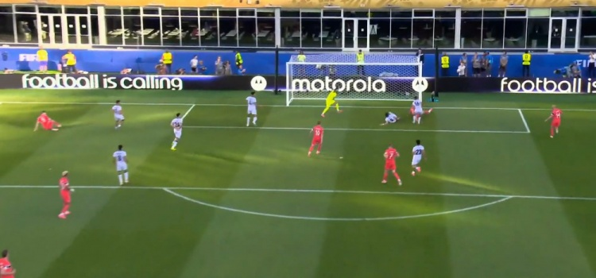
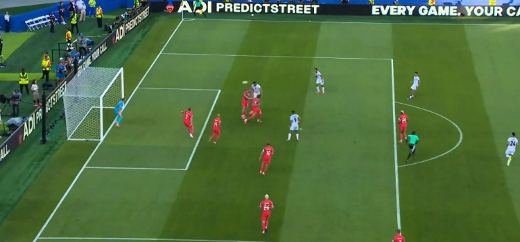
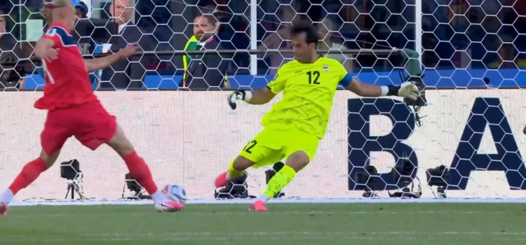
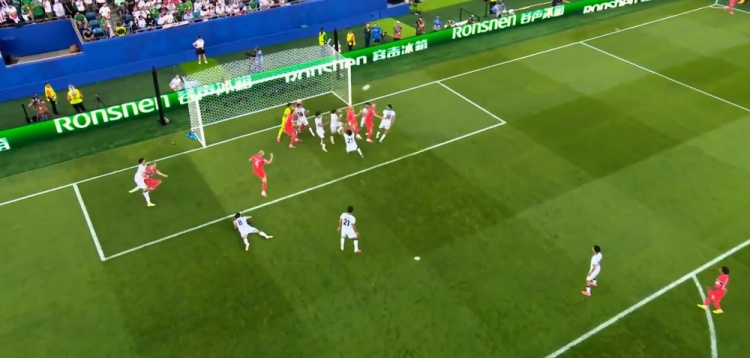

> **开球时间**：北京时间 6月17日 凌晨 6:00
> **比赛场地**：待补充
> **模型预测**：🇳🇴 挪威 **1 - 0** 🇮🇶 伊拉克 | **置信度 60%**
> **高僧预测**：🇳🇴 **挪威 赢**
> **🐷 YOYO 预测**：🇳🇴 挪威 **2 - 0**
> **实际比分**：🇮🇶 伊拉克 **1 - 4** 🇳🇴 挪威

### ⚽ 进球时间线

```
29' ⚽ 哈兰德（Haaland）！努萨突破后直塞，沃尔费横传，哈兰德后点包抄铲射
    → 🇮🇶 伊拉克 0-1 挪威
    → 哈兰德世界杯首球！挪威先声夺人

39' ⚽ 艾曼·侯赛因（Aymen Hussein）！阿马里下底倒三角挑传，侯赛因头球攻门
    → 🇮🇶 伊拉克 1-1 挪威
    → 扳平！伊拉克顽强抵抗！

43' ⚽ 哈兰德！伊拉克门将贾拉勒·哈桑出球失误，哈兰德逼抢得手
    → 🇮🇶 伊拉克 1-2 挪威
    → 门将失误送礼！哈兰德梅开二度！

77' ⚽ 厄斯蒂高（Østigård）！厄德高开出角球，厄斯蒂高前点头球攻门
    → 🇮🇶 伊拉克 1-3 挪威
    → 角球战术奏效！挪威扩大比分！

90+6' ⚽ 乌龙球！哈兰德头球回顶到门前，艾曼·侯赛因不慎将球挡入自家球门
    → 🇮🇶 伊拉克 1-4 挪威
    → 侯赛因不幸乌龙，哈兰德造乌龙！
```

### 🎯 赛果 vs 预测对照

| 维度 | 赛前预测 | 实际结果 | 命中？ |
|------|---------|---------|--------|
| 胜负 | 🇳🇴 挪威胜 | 🇳🇴 挪威胜 | ✅ 三方都命中 |
| 比分 | 1-0 / 2-0 | 4-1 | ❌ 挪威赢得更多 |
| YOYO | 挪威 2-0 | 4-1 | ❌ 方向对但低估 |

### 🔍 比赛关键节点

- **29'** ⚽ 哈兰德铲射破门！世界杯首球！挪威 1-0 领先
- **39'** ⚽ 艾曼·侯赛因头球扳平！伊拉克 1-1！亚足联球队继续强硬
- **43'** 🚨 **门将失误！** 贾拉勒·哈桑出球被哈兰德逼抢得手！1-2！
- **77'** 厄斯蒂高角球头球破门！3-1！
- **83'** 哈兰德单刀推射被门将扑出！错失帽子戏法
- **90+6'** 乌龙球！哈兰德头球回顶，侯赛因不幸乌龙！4-1

> **精算师辣评**：这场比赛是**哈兰德的个人表演秀**！世界杯首秀就梅开二度+造乌龙，参与全部 4 粒进球（3 球 1 造乌龙）。第 43 分钟伊拉克门将的失误直接葬送了比赛——1-1 平局后仅 4 分钟就变成 1-2，伊拉克心态崩了。**这是本届世界杯亚足联球队的首场败仗**——此前 6 场亚足联球队 2 胜 4 平保持不败。模型预测挪威 1-0 小胜，实际 4-1 大胜，低估了哈兰德的杀伤力。高僧和 YOYO 都预测挪威赢，命中。

---

## ⚽ 比赛三：🇦🇷 阿根廷 3-0 🇩🇿 阿尔及利亚——GOAT！38岁梅西帽子戏法，刷新无数纪录

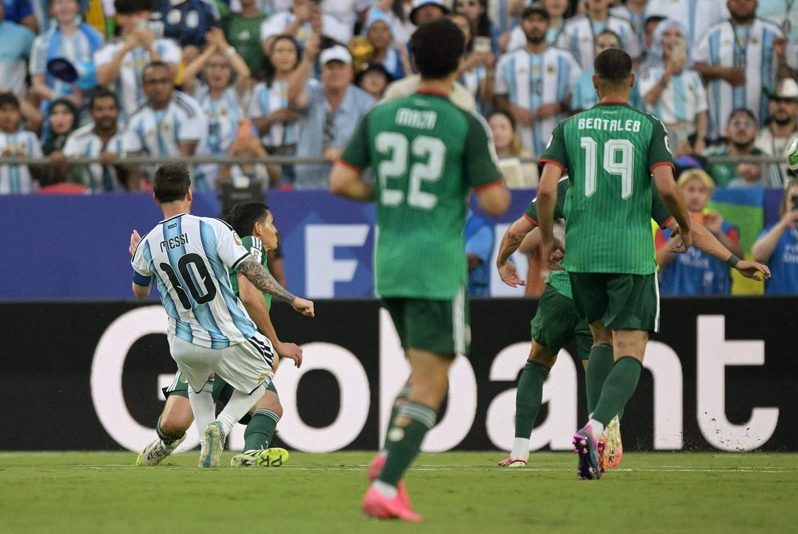
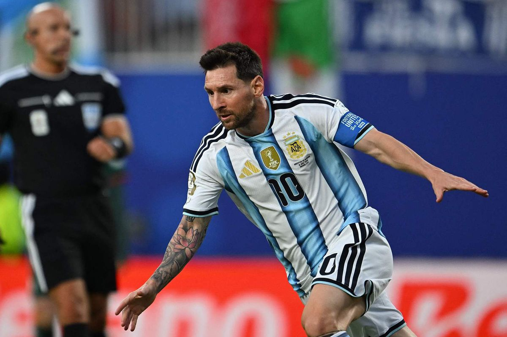
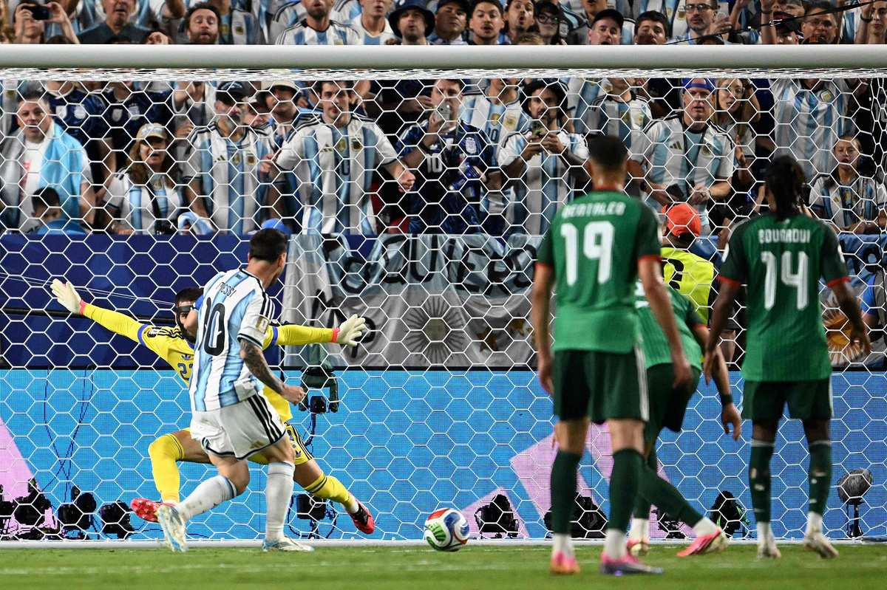

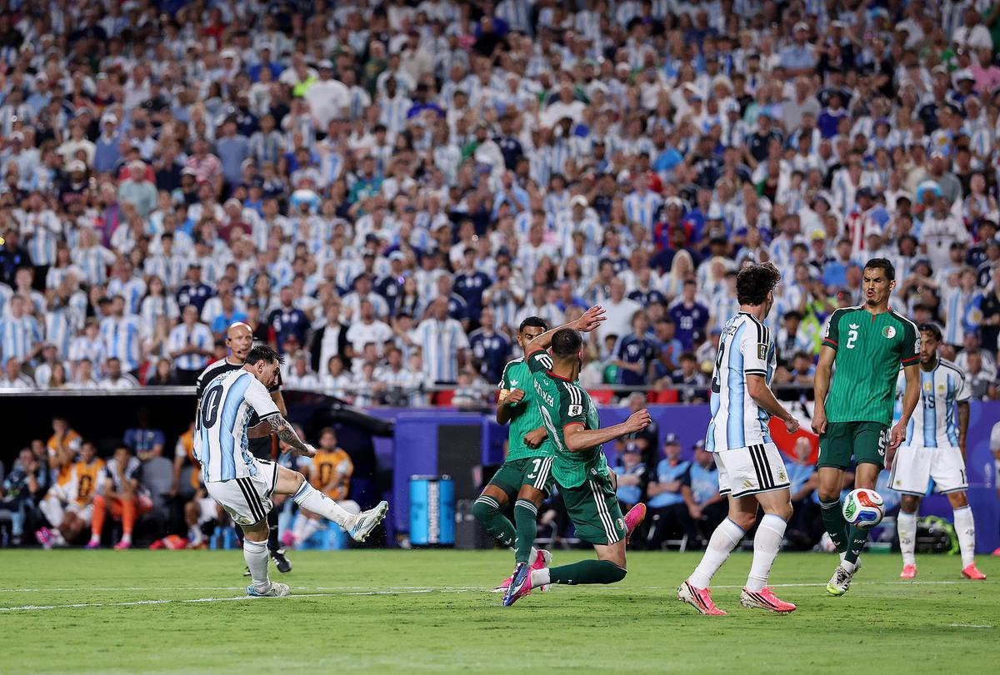
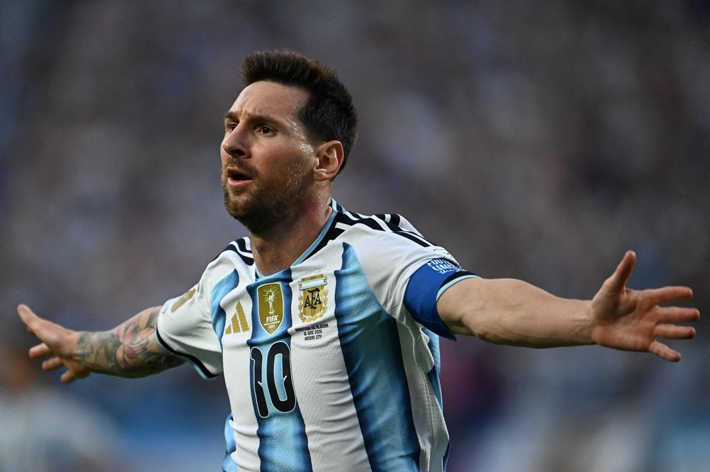

> **开球时间**：北京时间 6月17日 上午 9:00
> **比赛场地**：堪萨斯箭头体育场
> **模型预测**：🇦🇷 阿根廷 **1 - 0** 🇩🇿 阿尔及利亚 | **置信度 58%**
> **高僧预测**：🇦🇷 **阿根廷 小胜**
> **🐷 YOYO 预测**：🇦🇷 阿根廷 **3 - 1**
> **实际比分**：🇦🇷 阿根廷 **3 - 0** 🇩🇿 阿尔及利亚

### ⚽ 进球时间线

```
16' ⚽ 梅西（Messi）！德保罗中路抢断助攻，梅西弧顶远射世界波
    → 🇦🇷 阿根廷 1-0 阿尔及利亚
    → GOAT！39岁梅西世界杯第16球！弧顶世界波！

60' ⚽ 梅西！麦卡利斯特远射被扑，梅西门前补射
    → 🇦🇷 阿根廷 2-0 阿尔及利亚
    → 梅开二度！梅西嗅觉依然顶级！

75' ⚽ 梅西！冈萨雷斯左路弧顶横传，梅西中路抽射
    → 🇦🇷 阿根廷 3-0 阿尔及利亚
    → 帽子戏法！！！39岁梅西帽子戏法！！！
```

### 🎯 赛果 vs 预测对照

| 维度 | 赛前预测 | 实际结果 | 命中？ |
|------|---------|---------|--------|
| 胜负 | 🇦🇷 阿根廷胜 | 🇦🇷 阿根廷胜 | ✅ 三方都命中 |
| 比分 | 1-0 / 3-1 | 3-0 | ❌ YOYO最接近 |
| YOYO | 阿根廷 3-1 | 3-0 | ⚠️ 方向对但没丢球 |

### 🔍 比赛关键节点

- **5'** 劳塔罗直塞梅西单刀破门，但越位在先进球无效
- **7'** 🚨 **VAR取消进球！** 阿尔及利亚沙伊比单刀破门，经VAR认定越位无效
- **16'** ⚽ **GOAT世界波！** 梅西弧顶远射！1-0！世界杯第16球！
- **37'** 梅西定位球直接打门偏高
- **50'** 梅西弧顶兜射打偏
- **53'** 梅西直塞劳塔罗小角度低射被卢卡·齐达内扑出
- **60'** ⚽ **梅开二度！** 麦卡利斯特远射被扑，梅西门前补射！2-0！
- **65'** 梅西倚住防守球员抽射被神勇扑出
- **75'** ⚽ **帽子戏法！！！** 冈萨雷斯横传，梅西中路抽射！3-0！**GOAT帽子戏法！！！**
- **78'** 梅西被换下，全场起立鼓掌！国家队200场里程碑！

> **精算师辣评**：这场比赛属于**GOAT**！38岁357天的梅西完成了**世界杯生涯第二个帽子戏法**，4脚射正3个进球，效率惊人！世界杯总进球数达到 **16球追平克洛泽纪录**，升至世界杯历史射手榜并列第一！更难得的是，这是梅西**国家队200场里程碑**，也是**首位6届世界杯均有登场的球员**。

> 📊 **梅西纪录收割机**：
> - ⚽ 世界杯第16球，追平克洛泽，**历史射手榜并列第一**
> - 🎯 世界杯直接参与24球（进球+助攻），**领先第二名4球**
> - 👴 38岁357天，**世界杯历史第三年长进球者**
> - 🌍 世界杯攻破11支不同球队大门，**历史第一**
> - 🏆 **历史首位5届世界杯均有进球+助攻的球员**
> - 🎩 阿根廷历史第四位世界杯帽子戏法球员
> - ⏰ 世界杯历史上演帽子戏法**最年长球员**

模型预测阿根廷1-0小胜，实际3-0大胜——GOAT告诉你什么叫宝刀未老！YOYO预测3-1最接近，但没想到阿尔及利亚一球未进。高僧预测阿根廷小胜命中。

---

## ⚽ 比赛四：🇦🇹 奥地利 3-1 🇯🇴 约旦——约旦队史首球！阿瑙托维奇点球锁定胜局

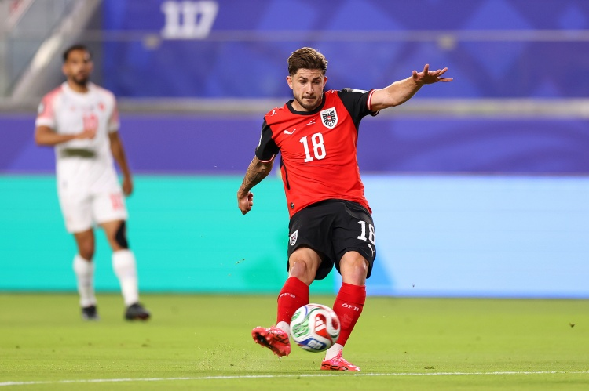
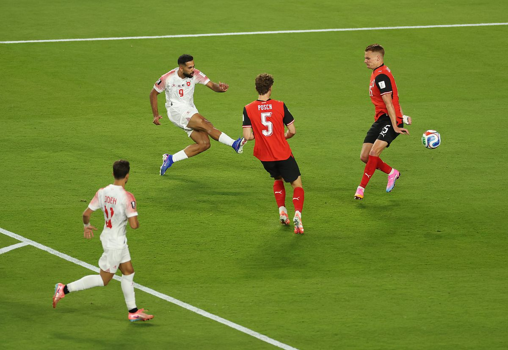
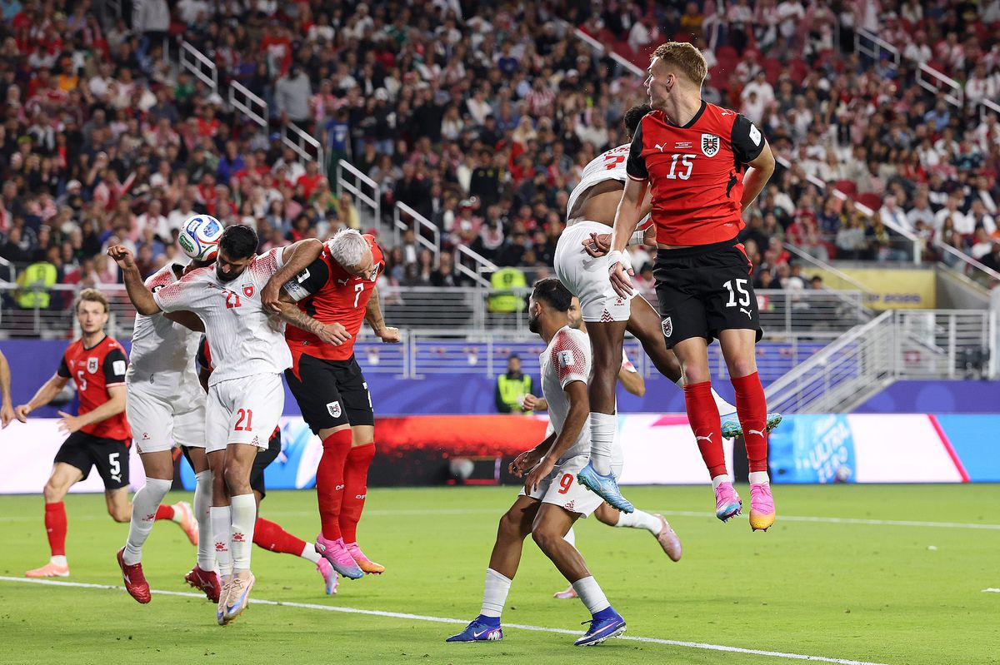
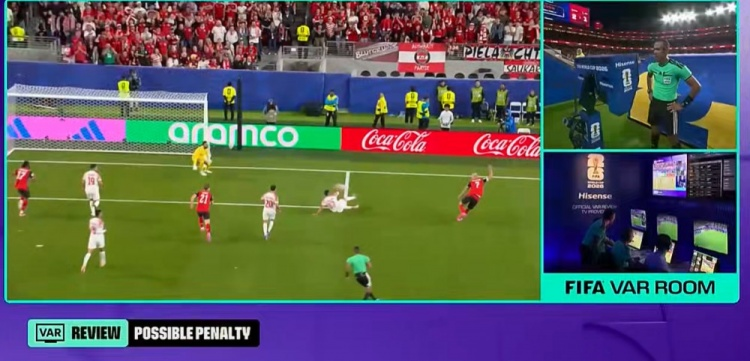

> **开球时间**：北京时间 6月17日 中午 12:00
> **比赛场地**：旧金山李维斯体育场
> **模型预测**：🇦🇹 奥地利 **2 - 0** 🇯🇴 约旦 | **置信度 68%**
> **高僧预测**：🇦🇹 **奥地利 赢**
> **🐷 YOYO 预测**：🇦🇹 奥地利 **2 - 0**
> **实际比分**：🇦🇹 奥地利 **3 - 1** 🇯🇴 约旦

### ⚽ 进球时间线

```
20' ⚽ 施密德（Schmid）！远射破门
    → 🇦🇹 奥地利 1-0 约旦
    → 奥地利先声夺人！

50' ⚽ 乌勒万（Oulwan）！奔袭兜射远角
    → 🇦🇹 奥地利 1-1 约旦
    → 约旦队史世界杯首球！！！🎉

77' ⚽ 乌龙球！亚赞·阿拉伯在阿瑙托维奇干扰下自摆乌龙
    → 🇦🇹 奥地利 2-1 约旦
    → 约旦不幸乌龙！

102' ⚽ 阿瑙托维奇（Arnautović）！点射命中
    → 🇦🇹 奥地利 3-1 约旦
    → 补时点球锁定胜局！
```

### 🎯 赛果 vs 预测对照

| 维度 | 赛前预测 | 实际结果 | 命中？ |
|------|---------|---------|--------|
| 胜负 | 🇦🇹 奥地利胜 | 🇦🇹 奥地利胜 | ✅ 三方都命中 |
| 比分 | 2-0 / 2-0 | 3-1 | ❌ 约旦进了一球 |
| YOYO | 奥地利 2-0 | 3-1 | ⚠️ 方向对但低估 |

### 🔍 比赛关键节点

- **20'** ⚽ 施密德远射破门！奥地利 1-0 领先
- **22'** 🚨 **中横梁！** 约旦角球头球击中横梁！差一点扳平
- **50'** ⚽ **约旦队史首球！！！** 乌勒万奔袭兜射远角！1-1！🎉
- **69'** 阿瑙托维奇转身抽射破门，但 VAR 判定波施手球在先，进球无效
- **77'** ⚽ 乌龙球！亚赞·阿拉伯在阿瑙托维奇干扰下自摆乌龙！2-1
- **91'** 阿瑙托维奇单刀被约旦门将用腿挡出
- **99'** VAR 判罚点球！阿瑙托维奇传中造成约旦球员手球
- **102'** ⚽ 阿瑙托维奇点射命中！3-1！锁定胜局！

> **精算师辣评**：这场比赛最大的亮点是**约旦队史世界杯首球**！乌勒万第50分钟的奔袭兜射让约旦全国沸腾——这是约旦首次参加世界杯，就打进了历史第一球！虽然最终1-3落败，但约旦的表现赢得尊重。奥地利有运气成分（乌龙球+补时点球），但3-1的比分也反映了实力差距。**模型、高僧、YOYO都预测奥地利赢，全部命中！** 高僧本轮4场全胜！

---

## 🏆 三大模型预言验证（已赛 4 场）

### 🤖 模型战绩

| 比赛 | 预测 | 实际 | 结果 |
|------|------|------|------|
| 🇫🇷 法国 vs 🇸🇳 塞内加尔 | 法国 1-0 | 3-1 法国胜 | ✅ 胜负命中 |
| 🇮🇶 伊拉克 vs 🇳🇴 挪威 | 挪威 1-0 | 4-1 挪威胜 | ✅ 胜负命中 |
| 🇦🇷 阿根廷 vs 🇩🇿 阿尔及利亚 | 阿根廷 1-0 | 3-0 阿根廷胜 | ✅ 胜负命中 |
| 🇦🇹 奥地利 vs 🇯🇴 约旦 | 奥地利 2-0 | 3-1 奥地利胜 | ✅ 胜负命中 |

**模型本轮战绩：4/4 命中（100%）** 📈📈📈

> 模型本轮四连胜！四场胜负都命中，虽然比分都低估了，但方向全部正确。

---

### 🧙 高僧战绩

| 比赛 | 预测 | 实际 | 结果 |
|------|------|------|------|
| 🇫🇷 法国 vs 🇸🇳 塞内加尔 | 法国 赢 | 3-1 法国胜 | ✅ 命中 |
| 🇮🇶 伊拉克 vs 🇳🇴 挪威 | 挪威 赢 | 4-1 挪威胜 | ✅ 命中 |
| 🇦🇷 阿根廷 vs 🇩🇿 阿尔及利亚 | 阿根廷 小胜 | 3-0 阿根廷胜 | ✅ 命中 |
| 🇦🇹 奥地利 vs 🇯🇴 约旦 | 奥地利 赢 | 3-1 奥地利胜 | ✅ 命中 |

**高僧本轮战绩：4/4 命中（100%）** 📈📈📈

> 高僧本轮全胜！吸取上轮教训后果然靠谱，四场都给明确结果，全部命中。东方神秘力量回归！

---

### 🐷 YOYO 战绩

| 比赛 | 预测 | 实际 | 结果 |
|------|------|------|------|
| 🇫🇷 法国 vs 🇸🇳 塞内加尔 | 平局 | 3-1 法国胜 | ❌ 翻车 |
| 🇮🇶 伊拉克 vs 🇳🇴 挪威 | 挪威 2-0 | 4-1 挪威胜 | ⚠️ 方向对但比分差 |
| 🇦🇷 阿根廷 vs 🇩🇿 阿尔及利亚 | 阿根廷 3-1 | 3-0 阿根廷胜 | ⚠️ 方向对但没丢球 |
| 🇦🇹 奥地利 vs 🇯🇴 约旦 | 奥地利 2-0 | 3-1 奥地利胜 | ⚠️ 方向对但约旦进一球 |

**YOYO 本轮战绩：3/4 命中（75%）** 📈📈

> YOYO 法国那场翻车了——被上轮四场全平影响，以为卫冕冠军也会被逼平。但其他三场都命中！阿根廷3-1预测最接近实际3-0！

---

## 📊 四轮总战绩对比

| 排名 | 预测方 | 第一轮 | 第二轮 | 第三轮 | 第四轮 | 总命中率 | 趋势 |
|------|--------|--------|--------|--------|--------|---------|------|
| 🥇 | 🧙 高僧 | 0/2 (0%) | 7/10 (70%) | 0/4 (0%) | 4/4 (100%) | **11/20 (55%)** | 📈📈 全胜！ |
| 🥈 | 🤖 模型 | 1/2 (50%) | 4/10 (40%) | 0/4 (0%) | 4/4 (100%) | **9/20 (45%)** | 📈📈📈 四连胜！ |
| 🥉 | 🐷 YOYO | 2/2 (100%) | 4/10 (40%) | 0/4 (0%) | 3/4 (75%) | **9/20 (45%)** | 📈📈 回暖 |

> **博主辣评**：本轮超级巨星之夜！姆巴佩、哈兰德、梅西集体爆发，高僧和模型都 4/4 全胜！**高僧从上轮四场全平的谷底反弹，本轮全胜继续领跑！** YOYO 也回暖了，3/4 命中。本轮四场全部分出胜负，没有平局——和上轮四场全平形成鲜明对比！

---

## 💰 赌神模拟器：第四轮账单

> **规则**：每人初始资金 **$2,000**，每场押 **$200**，可猜胜/平/负，使用 Bet365 赛前赔率。

### 第四轮（6月17日）盈亏估算

| 模型 | 关键预测 | 预估盈亏 | 说明 |
|------|---------|---------|------|
| 🤖 模型 | 法国胜✅ 挪威胜✅ 阿根廷胜✅ 奥地利胜✅ | **约 +$200** | 四场全赢！ |
| 🧙 高僧 | 法国胜✅ 挪威胜✅ 阿根廷胜✅ 奥地利胜✅ | **约 +$200** | 四场全赢！ |
| 🐷 YOYO | 法国平❌ 挪威胜✅ 阿根廷胜✅ 奥地利胜✅ | **约 +$100** | 三赢一亏 |

### 四轮总账（估算）

| 排名 | 模型 | 初始 | 第一轮 | 第二轮 | 第三轮 | 第四轮 | 总余额 | 总盈亏 |
|------|------|------|--------|--------|--------|--------|--------|--------|
| 🥇 | 🧙 高僧 | $2,000 | +$160 | +$440 | -$800 | +$200 | **$2,000** | **回本了！🎉** |
| 🥈 | 🐷 YOYO | $2,000 | +$420 | +$80 | -$800 | +$100 | **$1,800** | **-$200** |
| 🥉 | 🤖 模型 | $2,000 | -$140 | -$280 | -$800 | +$200 | **$980** | **-$1,020** |

> **博主辣评**：本轮超级巨星之夜让大家都赚翻了！**高僧从上轮亏损 $200 到本轮全胜回本！** 从 $1,800 回升到 $2,000，完美逆袭！ YOYO 也止血了，从 $1,700 回升到 $1,800。模型虽然本轮赢了，但总亏损还是 $1,020——上轮亏太多，需要更多连胜才能回本。

---

## 📸 图片来源

本文所有比赛图片来自[直播吧](https://news.zhibo8.com/)，仅供非商业用途。

---

## 🔮 下轮预告

### 6月18日 — K/L 组首轮

| 开球时间（北京） | 比赛 | 小组 | 关注点 |
|----------------|------|------|--------|
| 01:00 | 🇵🇹 葡萄牙 vs 🇨🇩 刚果民主 | K组 | C罗最后一届世界杯首秀？ |
| 04:00 | 🏴󠁧󠁢󠁥󠁮󠁧󠁿 英格兰 vs 🇭🇷 克罗地亚 | L组 | 2018半决赛重演！ |
| 07:00 | 🇬🇭 加纳 vs 🇵🇦 巴拿马 | L组 | 非洲 vs 中北美，平局大战？ |
| 10:00 | 🇺🇿 乌兹别克斯坦 vs 🇨🇴 哥伦比亚 | K组 | 南美劲旅首秀 |

### 🤖 模型预测：6月18日（K/L组首轮·V2）

| 比赛 | 🤖 模型 | 胜率 | 平局风险 |
|------|---------|------|---------|
| 🇵🇹 葡萄牙 vs 🇨🇩 刚果民主 | **葡萄牙 2-0** | 68% | 22% |
| 🏴󠁧󠁢󠁥󠁮󠁧󠁿 英格兰 vs 🇭🇷 克罗地亚 | **英格兰 1-0** | 52% | ⚠️ 33% |
| 🇬🇭 加纳 vs 🇵🇦 巴拿马 | **平局 1-1** | 32% | ⚠️ 42% |
| 🇺🇿 乌兹别克斯坦 vs 🇨🇴 哥伦比亚 | **哥伦比亚 2-1** | 60% | 28% |

### 🧙 高僧预测：6月18日

| 比赛 | 高僧预测 |
|------|---------|
| 🇵🇹 葡萄牙 vs 🇨🇩 刚果民主 | 葡萄牙平刚果 **或** 葡萄牙小胜 |
| 🏴󠁧󠁢󠁥󠁮󠁧󠁿 英格兰 vs 🇭🇷 克罗地亚 | **英格兰平克罗地亚** 🔥 |
| 🇬🇭 加纳 vs 🇵🇦 巴拿马 | **加纳平巴拿马** |
| 🇺🇿 乌兹别克斯坦 vs 🇨🇴 哥伦比亚 | **哥伦比亚胜** |

### 🐷 YOYO 预测：6月18日

> 待补充

---

> **Status Check**: I/J 组首轮 **四场全部结束！** 超级巨星之夜！姆巴佩梅开二度、哈兰德双响+造乌龙、梅西帽子戏法！约旦队史首球！
> - 🧙 **高僧**：4/4 命中（100%），四轮总 11/23（47.8%），本轮全胜！**回本了！🎉**
> - 🤖 **模型**：4/4 命中（100%），四轮总 9/23（39.1%），四连胜！
> - 🐷 **YOYO**：3/4 命中（75%），四轮总 9/23（39.1%），回暖
>
> **📊 赌神模拟器总账**：高僧 $2,000（回本🎉）| YOYO $1,800（-$200）| 模型 $980（-$1,020）
