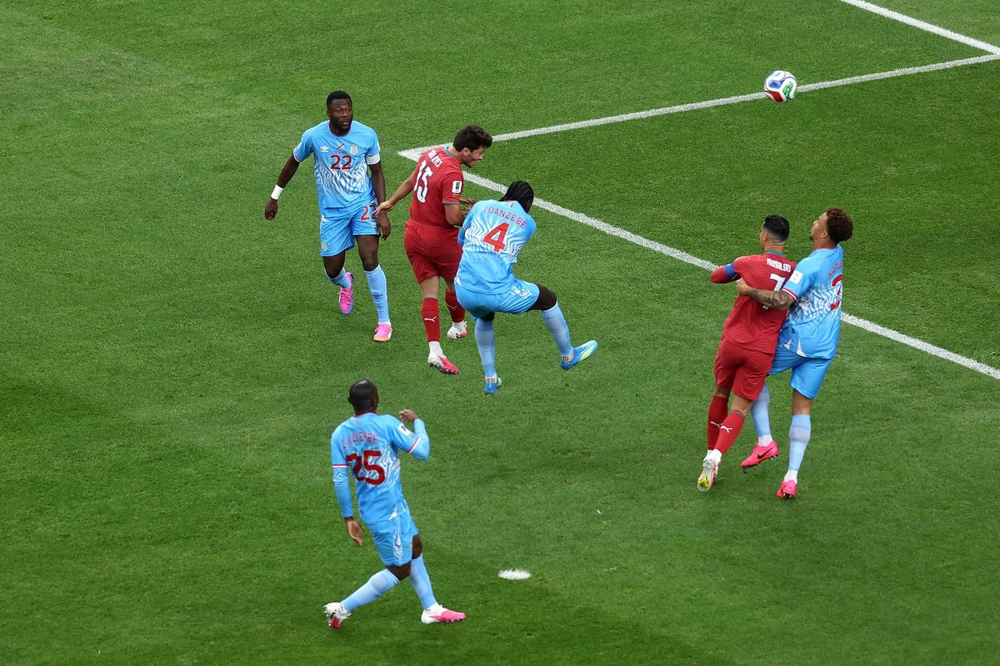
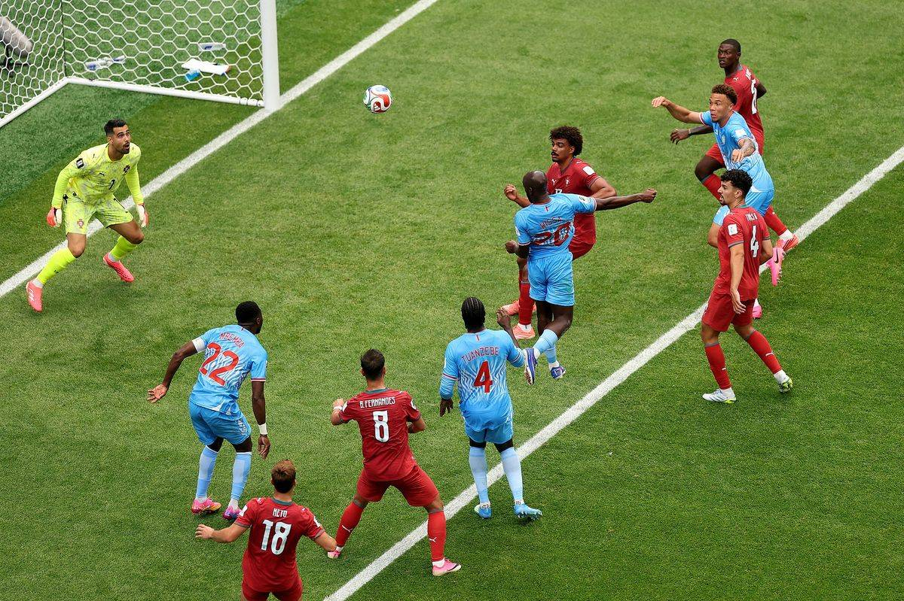
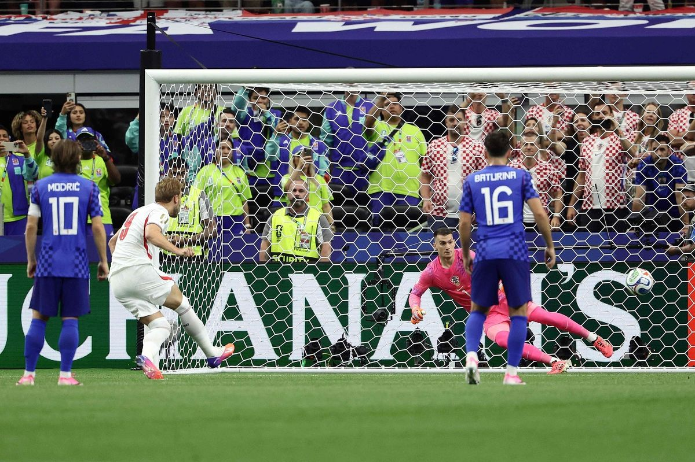
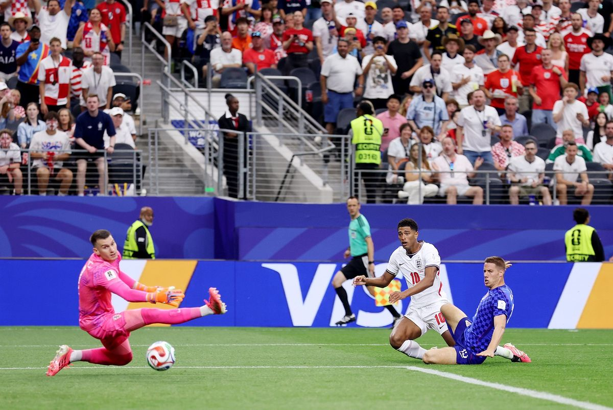
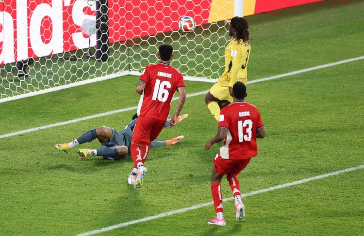
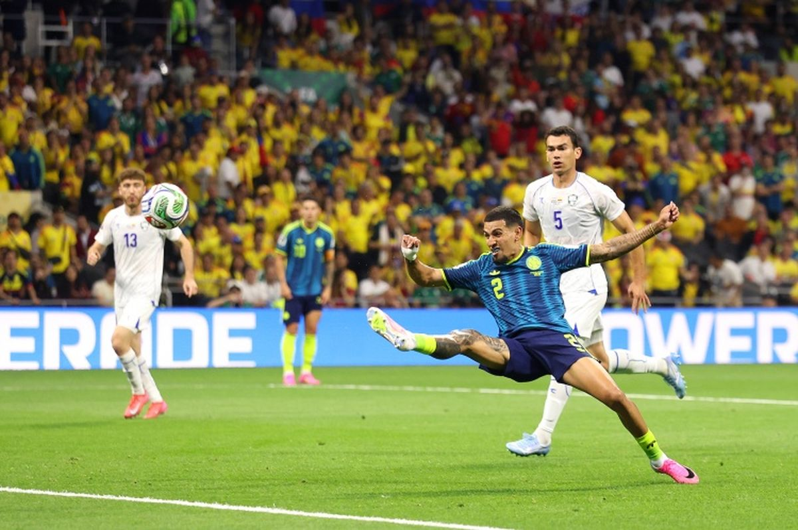
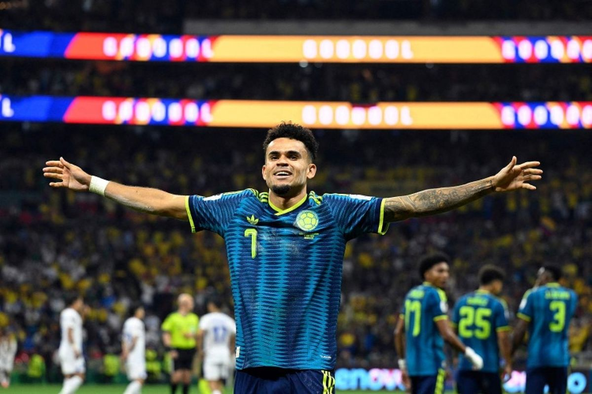

# C罗梦碎！葡萄牙1-1刚果民主，英格兰4-2克罗地亚上演进球大战

> 📊 **世界杯第 7 天，K/L 组首轮四场全部结束！** 高僧精准预言葡萄牙平局！凯恩梅开二度导演英格兰大胜！C罗大赛10场0球！

世界杯小组赛 K/L 组首轮全部结束，这一夜充满戏剧性——**高僧精准预言葡萄牙被刚果民主逼平**，**凯恩梅开二度导演英格兰4-2大胜克罗地亚**，**加纳补时绝杀巴拿马**，**哥伦比亚3-1大胜乌兹别克斯坦**。而C罗全场3射0正，大赛10场0球的魔咒继续。

今天我们来做赛后复盘，验证上一轮的预测——以及谁的钱包更鼓。

---

## 📊 本轮总览（4 场）

| 日期 | 比赛 | 比分 | 关键词 |
|------|------|------|--------|
| 6/18 | 🇵🇹 葡萄牙 vs 🇨🇩 刚果民主 | 1-1 | **C罗梦碎！** 3射0正，刚果民主队史首球首分 |
| 6/18 | 🏴󠁧󠁢󠁥󠁮󠁧󠁿 英格兰 vs 🇭🇷 克罗地亚 | 4-2 | **凯恩梅开二度！** 世界杯总进球追平莱因克尔 |
| 6/18 | 🇬🇭 加纳 vs 🇵🇦 巴拿马 | 1-0 | **补时绝杀！** 伊伦基90+5'一击致命 |
| 6/18 | 🇺🇿 乌兹别克斯坦 vs 🇨🇴 哥伦比亚 | 1-3 | **迪亚斯闪耀！** 1球1助，哥伦比亚强势首秀 |

---

## ⚽ 比赛一：🇵🇹 葡萄牙 1-1 🇨🇩 刚果民主——C罗梦碎夜，高僧精准预言！




> **开球时间**：北京时间 6月18日 凌晨 1:00
> **比赛场地**：休斯顿 NRG 体育场
> **模型预测**：🇵🇹 葡萄牙 **2 - 0** 🇨🇩 刚果民主 | **置信度 68%**
> **高僧预测**：🇵🇹 **葡萄牙平刚果** 🔥
> **🐷 YOYO 预测**：🇵🇹 **葡萄牙赢**
> **实际比分**：🇵🇹 葡萄牙 **1 - 1** 🇨🇩 刚果民主

### ⚽ 进球时间线

```
6'  ⚽ 若昂·内维斯（João Neves）！内托助攻，头球破门
    → 🇵🇹 葡萄牙 1-0 刚果民主
    → 开局仅6分钟！葡萄牙闪电领先！

45+5' ⚽ 维萨（Visa）！马苏亚库传中，头球破门
    → 🇵🇹 葡萄牙 1-1 刚果民主
    → 半场补时扳平！刚果民主队史世界杯首球！

🚫 55' 坎塞洛倒钩破门 → VAR判越位在先，进球无效
```

### 🎯 赛果 vs 预测对照

| 维度 | 赛前预测 | 实际结果 | 命中？ |
|------|---------|---------|--------|
| 胜负 | 🇵🇹 葡萄牙胜（模型/YOYO）| 🤝 平局 | ❌ 模型、YOYO翻车 |
| 胜负 | 🇵🇹 葡萄牙平刚果（高僧）| 🤝 1-1 平局 | ✅ **高僧命中！** |
| 比分 | 2-0（模型） | 1-1 | ❌ 完全反了 |

### 🔍 比赛关键节点

- **6'** ⚽ 若昂·内维斯头球破门！葡萄牙 1-0！开局闪电领先！
- **13'** B席反抢踢倒对手吃到黄牌
- **32'** 姆本巴肘击+拉拽内托，黄牌
- **45+5'** ⚽ **维萨头球扳平！** 马苏亚库传中，刚果民主队史世界杯首球！1-1！
- **55'** 🚨 **坎塞洛倒钩破门，但VAR判越位在先，进球无效！**
- **68'** C罗禁区内射门被封堵
- **74'** C罗再次射门偏出
- **88'** 塞梅多黄牌，战术犯规放倒维萨
- **90+2'** 托马斯·阿劳若黄牌，又是战术犯规放倒维萨

> **精算师辣评**：高僧赛前力排众议精准预言"葡萄牙平刚果"，全场最佳预测！C罗首发出战打满全场，但**3射门0射正，25次触球0次过人**，大赛（世界杯+欧洲杯）连续**10场0球**！刚果民主收获队史世界杯首球+首个积分，历史性的夜晚！模型68%置信度的2-0预测彻底翻车——这就是世界杯！

---

## ⚽ 比赛二：🏴󠁧󠁢󠁥󠁮󠁧󠁿 英格兰 4-2 🇭🇷 克罗地亚——凯恩梅开二度，2018半决赛重演变进球大战




> **开球时间**：北京时间 6月18日 凌晨 4:00
> **比赛场地**：达拉斯 AT&T 体育场
> **模型预测**：🏴󠁧󠁢󠁥󠁮󠁧󠁿 英格兰 **1 - 0** 🇭🇷 克罗地亚 | **置信度 52%**
> **高僧预测**：🤝 **英格兰平克罗地亚** 🔥
> **🐷 YOYO 预测**：🤝 **平局**
> **实际比分**：🏴󠁧󠁢󠁥󠁮󠁧󠁿 英格兰 **4 - 2** 🇭🇷 克罗地亚

### ⚽ 进球时间线

```
12' ⚽ 凯恩（Kane）！点球（VAR重罚）
    → 🏴󠁧󠁢󠁥󠁮󠁧󠁿 英格兰 1-0 克罗地亚
    → 莫德里奇禁区内解围踢倒马杜埃凯送点！
    → 利瓦科维奇首次扑出，但VAR判门将提前移动，重罚命中！

36' ⚽ 巴图里纳（Baturina）！苏契奇右路回做，肋部爆射
    → 🏴󠁧󠁢󠁥󠁮󠁧󠁿 英格兰 1-1 克罗地亚
    → 克罗地亚扳平！2018半决赛重演果然激烈！

42' ⚽ 凯恩！赖斯角球助攻，头球破门
    → 🏴󠁧󠁢󠁥󠁮󠁧󠁿 英格兰 2-1 克罗地亚
    → 凯恩上半场双响！头球能力太强！

45+5' ⚽ 佩塔·穆萨（P. Musa）！佩里西奇头球摆渡，凌空打门
    → 🏴󠁧󠁢󠁥󠁮󠁧󠁿 英格兰 2-2 克罗地亚
    → 半场补时又扳平！上半场4球！

47' ⚽ 贝林厄姆（Bellingham）！安德森挑传，小角度射门中远门柱弹入
    → 🏴󠁧󠁢󠁥󠁮󠁧󠁿 英格兰 3-2 克罗地亚
    → 下半场开场仅2分钟！贝林厄姆回应！

85' ⚽ 拉什福德（Rashford）！萨卡转移球，摆脱防守低射得手
    → 🏴󠁧󠁢󠁥󠁮󠁧󠁿 英格兰 4-2 克罗地亚
    → 替补锁定胜局！英格兰开门红！
```

### 🎯 赛果 vs 预测对照

| 维度 | 赛前预测 | 实际结果 | 命中？ |
|------|---------|---------|--------|
| 胜负 | 🏴󠁧󠁢󠁥󠁮󠁧󠁿 英格兰胜（模型） | 🏴󠁧󠁢󠁥󠁮󠁧󠁿 英格兰 4-2 胜 | ✅ 模型命中 |
| 胜负 | 🤝 平局（高僧/YOYO） | 4-2 分出胜负 | ❌ 高僧、YOYO翻车 |
| 比分 | 1-0（模型） | 4-2 | ❌ 进球数远超预期 |

### 🔍 比赛关键节点

- **9'** 莫德里奇禁区内解围踢倒马杜埃凯，判罚点球！
- **10'** 凯恩首次主罚被利瓦科维奇扑出！但VAR判门将提前移动，**点球重罚！**
- **12'** ⚽ 凯恩重罚命中！1-0！
- **36'** ⚽ 巴图里纳肋部爆射！1-1！克罗地亚扳平！
- **42'** ⚽ 凯恩头球破门！赖斯角球助攻！2-1！凯恩上半场双响！
- **45+5'** ⚽ 佩塔·穆萨凌空打门！2-2！半场4球！
- **47'** ⚽ 贝林厄姆小角度射门，中远门柱弹入！3-2！
- **55-70'** 利瓦科维奇连续神扑，挡出凯恩、奥赖利、戈登的射门
- **85'** ⚽ 拉什福德摆脱防守低射！4-2！替补锁定胜局！

> **精算师辣评**：凯恩梅开二度！世界杯总进球达到**10球**，追平英格兰队史世界杯射手王**莱因克尔**！上半场4球、全场6球——2018半决赛重演变成进球大战。高僧和YOYO都说会平，结果英格兰4球打脸！莫德里奇送点+利瓦科维奇7次扑救也挡不住英格兰的攻势。模型虽然预测英格兰胜，但1-0太保守了……

---

## ⚽ 比赛三：🇬🇭 加纳 1-0 🇵🇦 巴拿马——补时绝杀！伊伦基一击致命



> **开球时间**：北京时间 6月18日 凌晨 7:00
> **比赛场地**：待确认
> **模型预测**：🤝 **平局 1-1** | **置信度 42%**
> **高僧预测**：🤝 **加纳平巴拿马**
> **🐷 YOYO 预测**：🇵🇦 **巴拿马赢** 🔥
> **实际比分**：🇬🇭 加纳 **1 - 0** 🇵🇦 巴拿马

### ⚽ 进球时间线

```
90+5' ⚽ 伊伦基（Irenki）！阿桑特左路横传，后点包抄打空门
    → 🇬🇭 加纳 1-0 巴拿马
    → 补时绝杀！加纳拿到关键3分！
```

### 🎯 赛果 vs 预测对照

| 维度 | 赛前预测 | 实际结果 | 命中？ |
|------|---------|---------|--------|
| 胜负 | 🤝 平局（模型/高僧） | 🇬🇭 加纳 1-0 胜 | ❌ 模型、高僧翻车 |
| 胜负 | 🇵🇦 巴拿马赢（YOYO） | 🇬🇭 加纳胜 | ❌ YOYO翻车 |
| 比分 | 1-1（模型） | 1-0 | ❌ 方向反了 |

### 🔍 比赛关键节点

- **15'** 伊伦基战术犯规吃到黄牌
- **33'** 马丁内斯禁区内射门，裁判示意犯规在先
- **65'** 乔丹·阿尤铲射**擦着立柱偏出**！加纳错失良机！
- **72'** 布莱克曼被法塔乌强突后犯规，黄牌
- **88'** 阿桑特单刀打远角被门将扑出！边裁示意越位在先
- **90+5'** ⚽ **伊伦基绝杀！** 阿桑特左路横传，后点包抄打空门！1-0！
- **90+8'** 哈维补射踢到门将，引发双方冲突！黄牌！

> **精算师辣评**：三个人全翻车！模型和高僧说平局，YOYO说巴拿马赢，结果加纳补时绝杀拿到3分。伊伦基第15分钟就吃到黄牌，第90+5分钟却成为英雄——**从黄牌到绝杀，这就是足球的魅力！** 巴拿马第90+8分钟还想扳平，哈维补射踢到门将引发冲突，场面一度混乱。

---

## ⚽ 比赛四：🇺🇿 乌兹别克斯坦 1-3 🇨🇴 哥伦比亚——迪亚斯闪耀，哥伦比亚强势首秀




> **开球时间**：北京时间 6月18日 上午 10:00
> **比赛场地**：墨西哥阿兹特克体育场
> **模型预测**：🇨🇴 哥伦比亚 **2 - 1** 🇺🇿 乌兹别克斯坦 | **置信度 60%**
> **高僧预测**：🇨🇴 **哥伦比亚胜**
> **🐷 YOYO 预测**：🇨🇴 **哥伦比亚赢**
> **实际比分**：🇺🇿 乌兹别克斯坦 **1 - 3** 🇨🇴 哥伦比亚

### ⚽ 进球时间线

```
41' ⚽ 穆尼奥斯（Muñoz）！迪亚斯挑传，垫射越过门将头顶入网
    → 🇺🇿 乌兹别克斯坦 0-1 哥伦比亚
    → 哥伦比亚打破僵局！迪亚斯助攻！

60' ⚽ 费祖拉耶夫（Fayzullaev）！肖穆罗多夫凌空打门中柱弹回，补射空门
    → 🇺🇿 乌兹别克斯坦 1-1 哥伦比亚
    → 乌兹别克扳平！中柱弹回的运气球！

66' ⚽ 迪亚斯（Díaz）！普埃尔塔分球，不停球直接射门
    → 🇺🇿 乌兹别克斯坦 1-2 哥伦比亚
    → 迪亚斯进球！哥伦比亚再次领先！

90+9' ⚽ 坎帕斯（Campaz）！库乔传中，头球攻门
    → 🇺🇿 乌兹别克斯坦 1-3 哥伦比亚
    → 补时锁定胜局！替补建功！
```

### 🎯 赛果 vs 预测对照

| 维度 | 赛前预测 | 实际结果 | 命中？ |
|------|---------|---------|--------|
| 胜负 | 🇨🇴 哥伦比亚胜（模型/高僧/YOYO） | 🇨🇴 哥伦比亚 3-1 胜 | ✅ 三人全命中！ |
| 比分 | 2-1（模型） | 3-1 | ⚠️ 方向对但哥伦比亚进更多 |

### 🔍 比赛关键节点

- **7'** 莫西卡拉倒费祖拉耶夫，黄牌
- **33'** 迪亚斯突入禁区射门，**击中立柱弹出！** 差一点！
- **41'** ⚽ 穆尼奥斯垫射破门！迪亚斯助攻！0-1！
- **60'** ⚽ 费祖拉耶夫补射空门！1-1！乌兹别克扳平！
- **66'** ⚽ 迪亚斯不停球直接射门！1-2！哥伦比亚再次领先！
- **72'** J罗被换下，坎帕斯替补登场
- **90+9'** ⚽ 坎帕斯头球锁定胜局！1-3！替补建功！

> **精算师辣评**：三人唯一都命中的比赛！哥伦比亚3-1大胜，迪亚斯1球1助攻全场最佳。乌兹别克斯坦虽然扳平过，但哥伦比亚实力优势明显。模型预测的2-1方向完全正确——南美劲旅首秀不含糊！

---

## 🏆 三大模型预言验证（4 场）

### 🤖 模型战绩

| 比赛 | 预测 | 实际 | 结果 |
|------|------|------|------|
| 🇵🇹 葡萄牙 vs 🇨🇩 刚果民主 | 葡萄牙 2-0（68%） | 1-1 平局 | ❌ 翻车 |
| 🏴󠁧󠁢󠁥󠁮󠁧󠁿 英格兰 vs 🇭🇷 克罗地亚 | 英格兰 1-0（52%） | 4-2 英格兰胜 | ✅ 方向对但比分差 |
| 🇬🇭 加纳 vs 🇵🇦 巴拿马 | 平局 1-1（42%） | 1-0 加纳胜 | ❌ 翻车 |
| 🇺🇿 乌兹别克斯坦 vs 🇨🇴 哥伦比亚 | 哥伦比亚 2-1（60%） | 3-1 哥伦比亚胜 | ✅ 方向对！ |

**模型本轮战绩：2/4 命中（50%）** 📈

> 模型本轮2/4回暖！葡萄牙被逼平和加纳翻车，但英格兰和哥伦比亚方向都对。上轮4/4全胜后回归正常水平。

---

### 🧙 高僧战绩

| 比赛 | 预测 | 实际 | 结果 |
|------|------|------|------|
| 🇵🇹 葡萄牙 vs 🇨🇩 刚果民主 | 葡萄牙平刚果 | 1-1 平局 | ✅ **命中！** 🔥 |
| 🏴󠁧󠁢󠁥󠁮󠁧󠁿 英格兰 vs 🇭🇷 克罗地亚 | 英格兰平克罗地亚 | 4-2 英格兰胜 | ❌ 翻车 |
| 🇬🇭 加纳 vs 🇵🇦 巴拿马 | 加纳平巴拿马 | 1-0 加纳胜 | ❌ 翻车 |
| 🇺🇿 乌兹别克斯坦 vs 🇨🇴 哥伦比亚 | 哥伦比亚胜 | 3-1 哥伦比亚胜 | ✅ 命中 |

**高僧本轮战绩：2/4 命中（50%）** 📈

> 高僧精准预言葡萄牙平局！力排众议看好刚果民主逼平C罗，果然应验！加上哥伦比亚命中，本轮2/4。上轮4/4全胜后回落是正常的——不可能每次都100%。

---

### 🐷 YOYO 战绩

| 比赛 | 预测 | 实际 | 结果 |
|------|------|------|------|
| 🇵🇹 葡萄牙 vs 🇨🇩 刚果民主 | 葡萄牙赢 | 1-1 平局 | ❌ 翻车 |
| 🏴󠁧󠁢󠁥󠁮󠁧󠁿 英格兰 vs 🇭🇷 克罗地亚 | 平局 | 4-2 英格兰胜 | ❌ 翻车 |
| 🇬🇭 加纳 vs 🇵🇦 巴拿马 | 巴拿马赢 | 1-0 加纳胜 | ❌ 翻车 |
| 🇺🇿 乌兹别克斯坦 vs 🇨🇴 哥伦比亚 | 哥伦比亚赢 | 3-1 哥伦比亚胜 | ✅ 命中 |

**YOYO 本轮战绩：1/4 命中（25%）** 📉

> YOYO本轮只有哥伦比亚命中！上轮75%的高光瞬间烟消云散。葡萄牙没赢、英格兰没平、巴拿马也没赢——三场全翻车。

---

## 📊 五轮总战绩对比

| 排名 | 预测方 | 第一轮 | 第二轮 | 第三轮 | 第四轮 | 第五轮 | 总命中率 | 趋势 |
|------|--------|--------|--------|--------|--------|--------|---------|------|
| 🥇 | 🧙 高僧 | 0/2 (0%) | 7/10 (70%) | 0/4 (0%) | 4/4 (100%) | 2/4 (50%) | **13/24 (54%)** | 📉 全胜后回落 |
| 🥈 | 🤖 模型 | 1/2 (50%) | 4/10 (40%) | 0/4 (0%) | 4/4 (100%) | 2/4 (50%) | **11/24 (46%)** | 📈 回暖 |
| 🥉 | 🐷 YOYO | 2/2 (100%) | 4/10 (40%) | 0/4 (0%) | 3/4 (75%) | 1/4 (25%) | **10/24 (42%)** | 📉 回落 |

> **精算师辣评**：本轮最大的亮点是**高僧精准预言葡萄牙平局**！力排众议看好刚果民主，果然应验。模型2/4回暖，英格兰和哥伦比亚方向都对。YOYO本轮1/4只有哥伦比亚命中。五轮过后**高僧54%继续领跑**，模型46%紧追，YOYO42%掉队。高僧>模型>YOYO的格局没变！

---

## 💰 赌神模拟器：第五轮速报

> 纯娱乐，每场虚拟下注 $200，初始 $2,000，赔率来自 Bet365。

本轮高僧靠葡萄牙平局（赔率 3:1）一把回血，五轮下来竟然是唯一盈利的——**$2,100（+$100）**。模型打平，YOYO 亏了。看来东方神秘力量确实比算法更适合赌球 😂

| 排名 | 预测方 | 五轮总余额 | 盈亏 |
|------|--------|-----------|------|
| 🥇 | 🧙 高僧 | $2,100 | **+$100 赚了！🎉** |
| 🥈 | 🐷 YOYO | $1,600 | -$400 |
| 🥉 | 🤖 模型 | $980 | -$1,020 |

---

## 📸 图片来源

本文所有比赛图片来自[直播吧](https://news.zhibo8.com/)，仅供非商业用途。

---

## 🔮 下轮预告：6月19日 A/B组第2轮

| 开球时间（北京） | 比赛 | 小组 | 关注点 |
|----------------|------|------|--------|
| 00:00 | 🇨🇿 捷克 vs 🇿🇦 南非 | A组 | 生死战！输球几乎出局 |
| 03:00 | 🇨🇭 瑞士 vs 🇧🇦 波黑 | B组 | 欧洲内战，防守大战？ |
| 06:00 | 🇨🇦 加拿大 vs 🇶🇦 卡塔尔 | B组 | 北美vs亚洲，戴维斯主场首秀？ |
| 09:00 | 🇲🇽 墨西哥 vs 🇰🇷 韩国 | A组 | **焦点战！** 东道主vs亚洲劲旅 |

### 🤖 模型预测：6月19日（A/B组第2轮·V2）

| 比赛 | 🤖 模型 | 胜率 | 平局风险 |
|------|---------|------|---------|
| 🇨🇿 捷克 vs 🇿🇦 南非 | **捷克 1-0** | 55% | 28% |
| 🇨🇭 瑞士 vs 🇧🇦 波黑 | **平局 1-1** | 35% | ⚠️ 38% |
| 🇨🇦 加拿大 vs 🇶🇦 卡塔尔 | **加拿大 2-0** | 65% | 20% |
| 🇲🇽 墨西哥 vs 🇰🇷 韩国 | **墨西哥 1-0** | 48% | ⚠️ 32% |

**模型分析**：

**🇨🇿 捷克 vs 🇿🇦 南非** — 首轮捷克1-2负韩国，南非0-2负墨西哥，双方都急需拿分。捷克纸面实力更强（绍切克、希克），但首轮进攻效率低下。这场谁输谁基本出局，压力下容易出冷门。

**🇨🇭 瑞士 vs 🇧🇦 波黑** — 首轮瑞士1-1卡塔尔（令人失望），波黑还没踢首轮。两队风格都偏保守，平局概率最高。⚠️ 38%平局风险。

**🇨🇦 加拿大 vs 🇶🇦 卡塔尔** — 首轮加拿大1-1波黑，卡塔尔1-1瑞士（超出预期）。卡塔尔防守纪律比想象中好，加拿大不会大胜。

**🇲🇽 墨西哥 vs 🇰🇷 韩国** — **本轮焦点战！** 首轮墨西哥2-0南非（3红牌争议），韩国2-1捷克（逆转好戏）。墨西哥东道主气势正盛，韩国韧性十足。⚠️ 32%平局风险——这是本届最不确定的比赛之一！

### 🧙 高僧预测：6月19日

| 比赛 | 高僧预测 |
|------|---------|
| 🇨🇿 捷克 vs 🇿🇦 南非 | **捷克赢** |
| 🇨🇭 瑞士 vs 🇧🇦 波黑 | **平局** |
| 🇨🇦 加拿大 vs 🇶🇦 卡塔尔 | **加拿大赢** |
| 🇲🇽 墨西哥 vs 🇰🇷 韩国 | **韩国平或小胜** 🔥 |

> **核心看点**：高僧看好韩国不败！墨西哥vs韩国是本轮焦点，模型认为墨西哥主场小胜，高僧认为韩国能拿分——又是分歧大战！🔥

### 🐷 YOYO 预测：6月19日

| 比赛 | YOYO预测 | 核心理由 |
|------|----------|---------|
| 🇨🇿 捷克 vs 🇿🇦 南非 | 🇨🇿 **捷克赢** | 捷克首轮虽然输了但实力更强 |
| 🇨🇭 瑞士 vs 🇧🇦 波黑 | 🇨🇭 **瑞士赢** | 瑞士大赛稳定，不会连续翻车 |
| 🇨🇦 加拿大 vs 🇶🇦 卡塔尔 | 🇨🇦 **加拿大赢** | 北美主场气势+戴维斯冲击力 |
| 🇲🇽 墨西哥 vs 🇰🇷 韩国 | 🇲🇽 **墨西哥赢** | 东道主不会让韩国拿分 |

> **核心看点**：YOYO四场都给胜负，没有平局！和高僧的韩国不败预测形成鲜明对比——YOYO看好墨西哥，高僧看好韩国。🔥

---

> **Status Check**: K/L 组首轮 **四场全部结束！** 高僧精准预言葡萄牙平局！凯恩梅开二度导演英格兰4-2大胜！加纳补时绝杀巴拿马！哥伦比亚3-1大胜乌兹别克斯坦！
> - 🧙 **高僧**：2/4（50%），五轮总 13/24（54%）🥇
> - 🤖 **模型**：2/4（50%），五轮总 11/24（46%）🥈
> - 🐷 **YOYO**：1/4（25%），五轮总 10/24（42%）🥉
>
> **📢 下一篇**：A/B组第2轮复盘（捷克vs南非、瑞士vs波黑、加拿大vs卡塔尔、墨西哥vs韩国），敬请期待。

---

## 📅 端午特辑：6/20-22 三天赛程预测（C/D/E/F/G/H组第2轮）

> 🎉 端午放假三天，12场比赛一次看够！模型V2严谨预测，高僧和YOYO稍后补上。

### 各组首轮回顾

| 组别 | 比赛1 | 比赛2 | 出线形势 |
|------|-------|-------|---------|
| C组 | 🇧🇷 巴西 1-1 🇲🇦 摩洛哥 | 🇭🇹 海地 0-1 🏴󠁧󠁢󠁳󠁣󠁴󠁿 苏格兰 | 巴西摩洛哥同分，苏格兰3分领跑 |
| D组 | 🇦🇺 澳大利亚 2-0 🇹🇷 土耳其 | 🇺🇸 美国 4-1 🇵🇾 巴拉圭 | 美国澳大利亚6分，土耳其巴拉圭0分 |
| E组 | 🇩🇪 德国 7-1 🇨🇼 库拉索 | 🇨🇮 科特迪瓦 1-0 🇪🇨 厄瓜多尔 | 德国科特迪瓦3分，厄瓜多尔库拉索0分 |
| F组 | 🇳🇱 荷兰 2-2 🇯🇵 日本 | 🇸🇪 瑞典 5-1 🇹🇳 突尼斯 | 荷兰日本瑞典同分，突尼斯0分 |
| G组 | 🇧🇪 比利时 1-1 🇪🇬 埃及 | 🇮🇷 伊朗 2-2 🇳🇿 新西兰 | 四队各1分，出线混乱 |
| H组 | 🇪🇸 西班牙 0-0 🇨🇻 佛得角 | 🇸🇦 沙特 1-1 🇺🇾 乌拉圭 | 四队各1分，出线混乱 |

---

## 🗓️ 6月20日（周六）—— C/D组第2轮

### ⚽ 比赛一：🇺🇸 美国 vs 🇦🇺 澳大利亚（D组·03:00）

> **模型预测**：🇺🇸 美国 **2 - 1** 🇦🇺 澳大利亚 | **置信度 55%**
> **平局风险**：⚠️ 28%

**V2 概率分布**：

| 结果 | 概率 |
|------|------|
| 🇺🇸 美国胜 | 55% |
| 🤝 平局 | 28% |
| 🇦🇺 澳大利亚胜 | 17% |

**模型分析**：首轮美国4-1大胜巴拉圭（巴洛贡梅开二度+雷纳世界波），澳大利亚2-0爆冷土耳其（伊兰昆达1V3世界波）。美国进攻火力更猛，但澳大利亚首轮展现出的防守韧性和反击速度不可小觑。美国主场作战+阵容深度优势，小胜概率最大。但澳大利亚已经证明自己不是软柿子——⚠️ 28%平局风险不能忽视。

---

### ⚽ 比赛二：🇲🇦 摩洛哥 vs 🏴󠁧󠁢󠁳󠁣󠁴󠁿 苏格兰（C组·06:00）

> **模型预测**：🇲🇦 摩洛哥 **1 - 0** 🏴󠁧󠁢󠁳󠁣󠁴󠁿 苏格兰 | **置信度 48%**
> **平局风险**：⚠️ 32%

**V2 概率分布**：

| 结果 | 概率 |
|------|------|
| 🇲🇦 摩洛哥胜 | 48% |
| 🤝 平局 | 32% |
| 🏴󠁧󠁢󠁳󠁣󠁴󠁿 苏格兰胜 | 20% |

**模型分析**：首轮摩洛哥1-1逼平巴西（塞巴里破门+维尼修斯扳平），苏格兰1-0小胜海地（麦金28'）。摩洛哥防守纪律好（团队协作1.12），2022年第四名的实力底蕴在。苏格兰大赛经验不足但首轮零封。摩洛哥小胜或平局概率最高——这是一场典型的"闷战"。

---

### ⚽ 比赛三：🇧🇷 巴西 vs 🇭🇹 海地（C组·08:30）

> **模型预测**：🇧🇷 巴西 **3 - 0** 🇭🇹 海地 | **置信度 88%**
> **平局风险**：8%

**V2 概率分布**：

| 结果 | 概率 |
|------|------|
| 🇧🇷 巴西胜 | 88% |
| 🤝 平局 | 8% |
| 🇭🇹 海地胜 | 4% |

**模型分析**：巴西首轮1-1摩洛哥（维尼修斯32'），全场控球占优但进攻效率不高。海地首轮0-1苏格兰，进攻乏力。巴西需要争胜保住出线主动权，面对海地这种弱旅应该不会手软。维尼修斯+罗德里戈的锋线组合有能力大胜——但本届世界杯强队翻车的还少吗？8%平局风险虽然低，但不能完全排除。

---

### ⚽ 比赛四：🇹🇷 土耳其 vs 🇵🇾 巴拉圭（D组·11:00）

> **模型预测**：🇹🇷 土耳其 **2 - 1** 🇵🇾 巴拉圭 | **置信度 52%**
> **平局风险**：⚠️ 30%

**V2 概率分布**：

| 结果 | 概率 |
|------|------|
| 🇹🇷 土耳其胜 | 52% |
| 🤝 平局 | 30% |
| 🇵🇾 巴拉圭胜 | 18% |

**模型分析**：首轮土耳其0-2澳大利亚（爆冷！），巴拉圭1-4美国（被打花）。双方都急需拿分，输球基本出局。土耳其天赋更高（居莱尔、厄兹詹）但首轮配合糟糕（团队协作0.92），巴拉圭韧性不错但实力差距明显。生死战往往出冷门——⚠️ 30%平局风险。

---

## 🗓️ 6月21日（周日）—— E/F组第2轮

### ⚽ 比赛五：🇳🇱 荷兰 vs 🇸🇪 瑞典（F组·01:00）

> **模型预测**：🇳🇱 荷兰 **2 - 1** 🇸🇪 瑞典 | **置信度 45%**
> **平局风险**：⚠️ 33%

**V2 概率分布**：

| 结果 | 概率 |
|------|------|
| 🇳🇱 荷兰胜 | 45% |
| 🤝 平局 | 33% |
| 🇸🇪 瑞典胜 | 22% |

**模型分析**：首轮荷兰2-2日本（范戴克51' + 萨默维尔64'），瑞典5-1突尼斯（阿亚里双响+伊萨克1射2传+约克雷斯进球）。瑞典首轮大胜士气正旺，荷兰被日本逼平暴露防守问题。这是一场硬碰硬的欧洲内战——瑞典的防守韧性和荷兰的进攻天赋将正面碰撞。平局概率最高⚠️。

---

### ⚽ 比赛六：🇩🇪 德国 vs 🇨🇮 科特迪瓦（E组·04:00）

> **模型预测**：🇩🇪 德国 **2 - 0** 🇨🇮 科特迪瓦 | **置信度 72%**
> **平局风险**：18%

**V2 概率分布**：

| 结果 | 概率 |
|------|------|
| 🇩🇪 德国胜 | 72% |
| 🤝 平局 | 18% |
| 🇨🇮 科特迪瓦胜 | 10% |

**模型分析**：德国首轮7-1库拉索（6人破门！），科特迪瓦1-0厄瓜多尔（迪亚洛90'绝杀）。德国状态火热，穆西亚拉+维尔茨的中场组合碾压级别。科特迪瓦防守不错但面对德国的进攻火力差距太大。德国小组第一基本锁定。

---

### ⚽ 比赛七：🇪🇨 厄瓜多尔 vs 🇨🇼 库拉索（E组·08:00）

> **模型预测**：🇪🇨 厄瓜多尔 **3 - 0** 🇨🇼 库拉索 | **置信度 85%**
> **平局风险**：10%

**V2 概率分布**：

| 结果 | 概率 |
|------|------|
| 🇪🇨 厄瓜多尔胜 | 85% |
| 🤝 平局 | 10% |
| 🇨🇼 库拉索胜 | 5% |

**模型分析**：厄瓜多尔首轮0-1科特迪瓦（迪亚洛90'绝杀），库拉索首轮1-7德国（被打花）。厄瓜多尔需要争胜保住出线希望，库拉索已经被证明是本届最弱球队之一。厄瓜多尔应该能轻松大胜。

---

### ⚽ 比赛八：🇹🇳 突尼斯 vs 🇯🇵 日本（F组·12:00）

> **模型预测**：🇯🇵 日本 **1 - 0** 🇹🇳 突尼斯 | **置信度 50%**
> **平局风险**：⚠️ 32%

**V2 概率分布**：

| 结果 | 概率 |
|------|------|
| 🇯🇵 日本胜 | 50% |
| 🤝 平局 | 32% |
| 🇹🇳 突尼斯胜 | 18% |

**模型分析**：日本首轮2-2荷兰（中村敬斗57' + 镰田大地89'绝平），表现顽强！突尼斯首轮1-5瑞典（被打花）。日本技术流打法在世界杯赛场证明有效，突尼斯首轮惨败后士气低落。日本小胜概率最大，但突尼斯背水一战也可能爆冷——⚠️ 32%平局风险。

---

## 🗓️ 6月22日（周一）—— G/H组第2轮

### ⚽ 比赛九：🇪🇸 西班牙 vs 🇸🇦 沙特阿拉伯（H组·00:00）

> **模型预测**：🇪🇸 西班牙 **3 - 0** 🇸🇦 沙特阿拉伯 | **置信度 82%**
> **平局风险**：12%

**V2 概率分布**：

| 结果 | 概率 |
|------|------|
| 🇪🇸 西班牙胜 | 82% |
| 🤝 平局 | 12% |
| 🇸🇦 沙特胜 | 6% |

**模型分析**：西班牙首轮0-0佛得角（爆冷！），沙特首轮1-1乌拉圭（奥韦斯9扑救封神）。西班牙急需争胜，面对首轮逼平乌拉圭的沙特不能掉以轻心。但西班牙整体实力碾压，佩德里+加维的中场控制力应该能打开局面。⚠️ 12%平局风险——沙特门将奥韦斯状态火热！

---

### ⚽ 比赛十：🇧🇪 比利时 vs 🇮🇷 伊朗（G组·03:00）

> **模型预测**：🇧🇪 比利时 **2 - 0** 🇮🇷 伊朗 | **置信度 58%**
> **平局风险**：⚠️ 27%

**V2 概率分布**：

| 结果 | 概率 |
|------|------|
| 🇧🇪 比利时胜 | 58% |
| 🤝 平局 | 27% |
| 🇮🇷 伊朗胜 | 15% |

**模型分析**：比利时首轮1-1埃及（卢卡库造乌龙扳平），伊朗首轮2-2新西兰（两度落后两度扳平）。比利时黄金一代最后的世界杯，德布劳内+卢卡库需要发力。伊朗韧性十足（团队协作1.08），但面对比利时的进攻火力差距明显。⚠️ 27%平局风险——伊朗摆大巴能力不差。

---

### ⚽ 比赛十一：🇺🇾 乌拉圭 vs 🇨🇻 佛得角（H组·06:00）

> **模型预测**：🇺🇾 乌拉圭 **2 - 0** 🇨🇻 佛得角 | **置信度 70%**
> **平局风险**：⚠️ 22%

**V2 概率分布**：

| 结果 | 概率 |
|------|------|
| 🇺🇾 乌拉圭胜 | 70% |
| 🤝 平局 | 22% |
| 🇨🇻 佛得角胜 | 8% |

**模型分析**：乌拉圭首轮1-1沙特（努涅斯+巴尔韦德锋线有威胁但效率不高），佛得角首轮0-0西班牙（门将沃齐尼亚封神！）。乌拉圭需要争胜，佛得角虽然逼平西班牙但实力差距摆在那里。⚠️ 22%平局风险——沃齐尼亚可能再次封神！

---

### ⚽ 比赛十二：🇳🇿 新西兰 vs 🇪🇬 埃及（G组·09:00）

> **模型预测**：🤝 **平局 1-1** | **置信度 38%**
> **平局风险**：⚠️ 38%

**V2 概率分布**：

| 结果 | 概率 |
|------|------|
| 🇳🇿 新西兰胜 | 30% |
| 🤝 平局 | 38% |
| 🇪🇬 埃及胜 | 32% |

**模型分析**：新西兰首轮2-2伊朗（贾斯特梅开二度），埃及首轮1-1比利时（萨拉赫助攻阿舒尔破门）。两队首轮都拿到1分，这场比赛谁赢谁占据出线主动。新西兰身体对抗强（英超组合贾斯特+克里斯·伍德），埃及有萨拉赫但整体配合一般。四队各1分的G组堪称"死亡之组"——平局概率最高⚠️。

---

## 📊 三天预测汇总（12场）

| 日期 | 比赛 | 🤖 模型 | 🧙 高僧 | 胜率 | 平局风险 |
|------|------|---------|--------|------|---------|
| 6/20 | 🇺🇸 美国 vs 🇦🇺 澳大利亚 | 美国 2-1 | **美国赢** | 55% | ⚠️ 28% |
| 6/20 | 🇲🇦 摩洛哥 vs 🏴󠁧󠁢󠁳󠁣󠁴󠁿 苏格兰 | 摩洛哥 1-0 | **摩洛哥小胜或平** | 48% | ⚠️ 32% |
| 6/20 | 🇧🇷 巴西 vs 🇭🇹 海地 | 巴西 3-0 | **巴西赢**（再平回家🔥） | 88% | 8% |
| 6/20 | 🇹🇷 土耳其 vs 🇵🇾 巴拉圭 | 土耳其 2-1 | **平局** | 52% | ⚠️ 30% |
| 6/21 | 🇳🇱 荷兰 vs 🇸🇪 瑞典 | 荷兰 2-1 | **平局** | 45% | ⚠️ 33% |
| 6/21 | 🇩🇪 德国 vs 🇨🇮 科特迪瓦 | 德国 2-0 | **德国赢** | 72% | 18% |
| 6/21 | 🇪🇨 厄瓜多尔 vs 🇨🇼 库拉索 | 厄瓜多尔 3-0 | **厄瓜多尔赢** | 85% | 10% |
| 6/21 | 🇹🇳 突尼斯 vs 🇯🇵 日本 | 日本 1-0 | **日本赢** | 50% | ⚠️ 32% |
| 6/22 | 🇪🇸 西班牙 vs 🇸🇦 沙特 | 西班牙 3-0 | **西班牙赢** | 82% | 12% |
| 6/22 | 🇧🇪 比利时 vs 🇮🇷 伊朗 | 比利时 2-0 | **比利时平或小胜** | 58% | ⚠️ 27% |
| 6/22 | 🇺🇾 乌拉圭 vs 🇨🇻 佛得角 | 乌拉圭 2-0 | **乌拉圭赢** | 70% | ⚠️ 22% |
| 6/22 | 🇳🇿 新西兰 vs 🇪🇬 埃及 | 平局 1-1 | **新西兰平或小胜** | 38% | ⚠️ 38% |

> **核心看点**：高僧认为巴西"再平可以回家了"🔥 必须赢！荷兰vs瑞典又是平局大战，土耳其也给平局。比利时"平或小胜"说明高僧对比利时不太放心。YOYO预测待补。

### 🐷 YOYO 预测：6/20-22
> 待补
