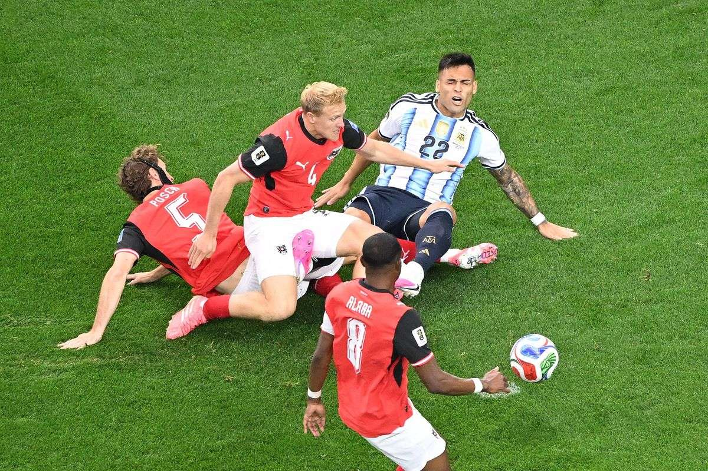
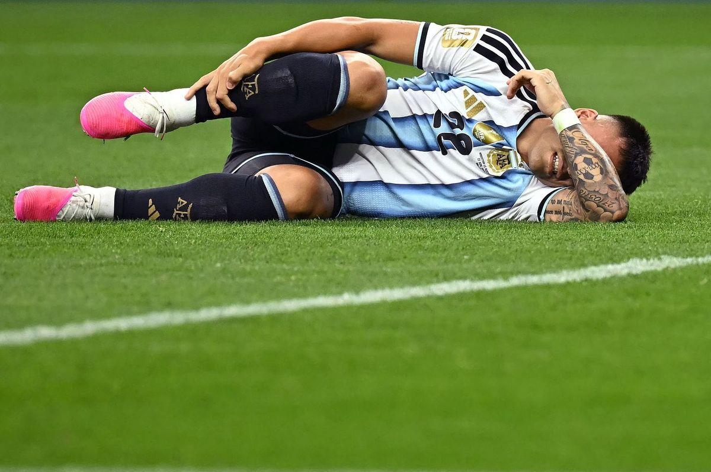
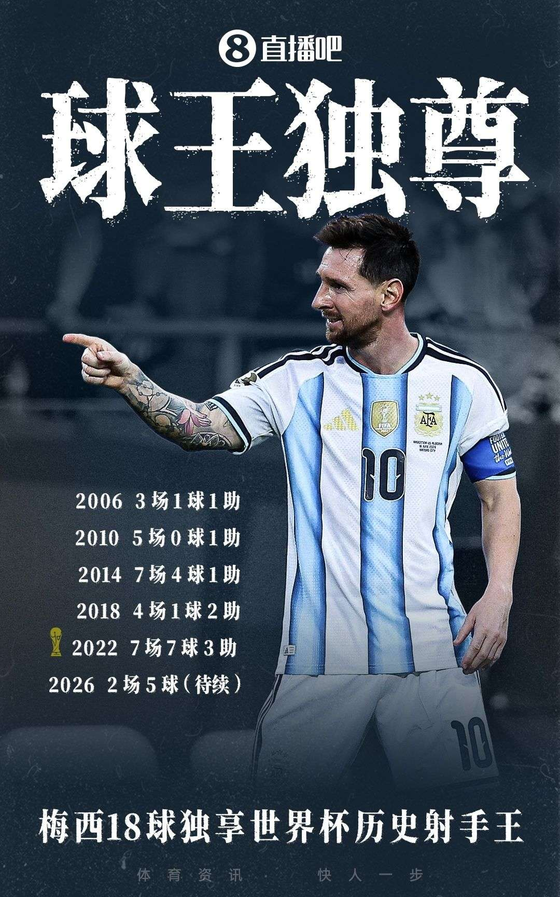
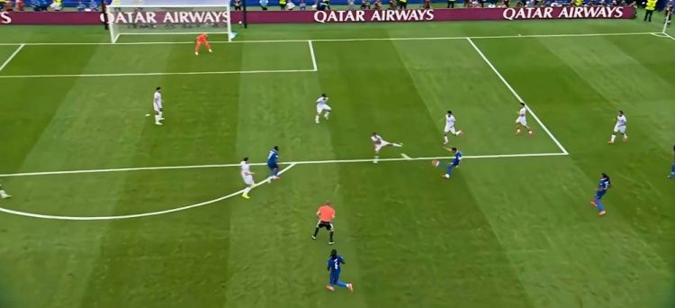
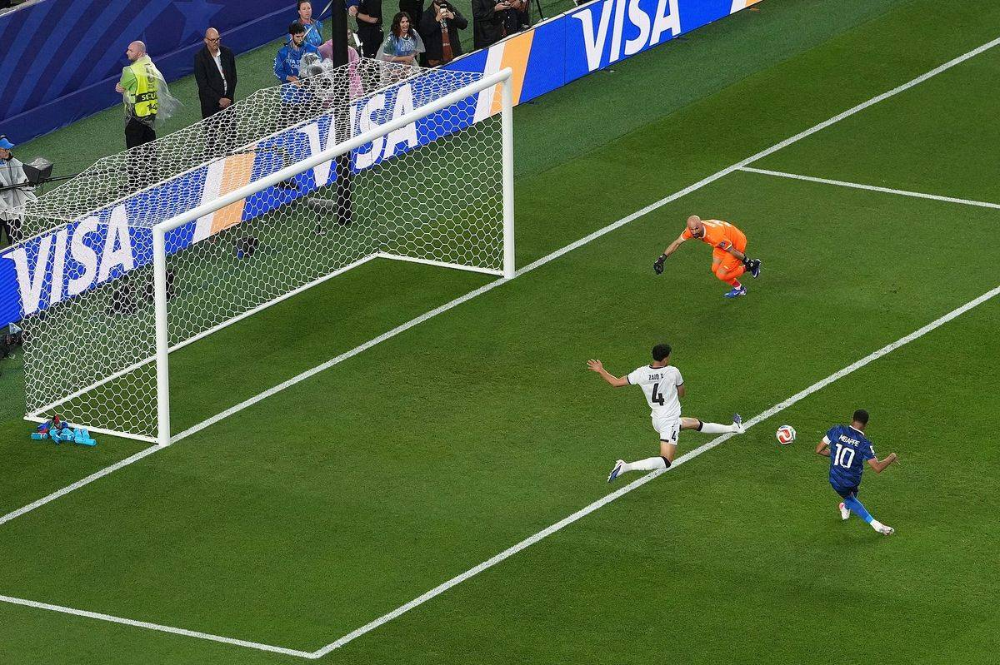
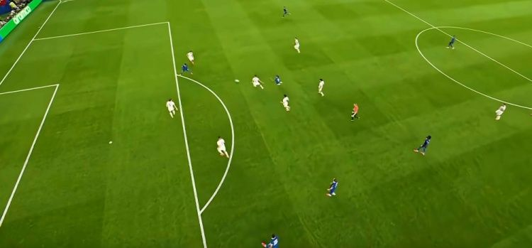

# 梅西封神！18球超越克洛泽独享世界杯射手王，姆巴佩双响法国提前出线

> 📊 **世界杯第 7 天，I/J 组第二轮开打！** 梅西再次刷新历史——世界杯第 18 球超越克洛泽独享射手王！姆巴佩双响法国提前出线！超级巨星之夜，纪录之夜！

世界杯小组赛 I/J 组第二轮继续进行，这一夜属于超级巨星——**梅西梅开二度，世界杯第 18 球超越克洛泽独享历史射手王**，**姆巴佩双响+登贝莱破门**帮助法国提前出线。两大巨星隔空斗法，再次刷新纪录。

今天我们先来复盘已结束的两场比赛，另外两场（挪威vs塞内加尔、约旦vs阿尔及利亚）赛后更新。

---

## 📊 本轮总览（已赛 2 场）

| 日期 | 比赛 | 比分 | 关键词 |
|------|------|------|--------|
| 6/23 | 🇦🇷 阿根廷 vs 🇦🇹 奥地利 | 2-0 | **梅西封神！** 18球超越克洛泽独享射手王 |
| 6/23 | 🇫🇷 法国 vs 🇮🇶 伊拉克 | 3-0 | **姆巴佩双响！** 雷暴中断2小时，法国提前出线 |
| 6/23 | 🇳🇴 挪威 vs 🇸🇳 塞内加尔 | ⏳ 待赛 | 哈兰德 vs 马内 |
| 6/23 | 🇯🇴 约旦 vs 🇩🇿 阿尔及利亚 | ⏳ 待赛 | 生死战 |

---

## ⚽ 比赛一：🇦🇷 阿根廷 2-0 🇦🇹 奥地利——梅西封神！18球超越克洛泽独享射手王





> **开球时间**：北京时间 6月23日 凌晨 1:00
> **比赛场地**：AT&T体育场
> **模型预测**：🇦🇷 阿根廷 **2 - 0** 🇦🇹 奥地利 | **置信度 75%**
> **高僧预测**：🇦🇷 **阿根廷胜**
> **🐷 YOYO 预测**：🇦🇷 **阿根廷胜**
> **实际比分**：🇦🇷 阿根廷 **2 - 0** 🇦🇹 奥地利

### ⚽ 进球时间线

```
7'  🚨 点球！劳塔罗禁区内被放倒，经VAR判罚点球
    → 梅西主罚打偏！错失良机！

38' ⚽ 梅西（Messi）！梅迪纳左路倒三角传中，阿尔马达前点一漏，梅西后点推射
    → 🇦🇷 阿根廷 1-0 奥地利
    → 世界杯第17球！梅西超越克洛泽独享历史射手王！🎉

90+4' ⚽ 梅西！阿尔瓦雷斯单刀被扑，帕雷德斯横传梅西抽射被挡，梅西补射
    → 🇦🇷 阿根廷 2-0 奥地利
    → 世界杯第18球！梅西锁定胜局！
```

### 🎯 赛果 vs 预测对照

| 维度 | 赛前预测 | 实际结果 | 命中？ |
|------|---------|---------|--------|
| 胜负 | 🇦🇷 阿根廷胜（模型/高僧/YOYO）| 🇦🇷 阿根廷 2-0 胜 | ✅ 三人全中！ |
| 比分 | 2-0（模型） | 2-0 | ✅ **完美命中！** |

### 🔍 比赛关键节点

- **7'** 🚨 **点球！** 劳塔罗禁区内被放倒，VAR判罚点球！梅西主罚打偏！
- **18'** 梅西单刀被阿拉巴解围！错失良机
- **38'** ⚽ **梅西破门！** 梅迪纳倒三角传中，阿尔马达一漏，梅西后点推射！1-0！**世界杯第17球！超越克洛泽独享历史射手王！**
- **54'** 萨比策定位球被马丁内斯飞身扑出！
- **86'** 冈萨雷斯禁区内切射门被丹索封堵
- **90+4'** ⚽ **梅西补射破门！** 阿尔瓦雷斯单刀被扑，帕雷德斯横传，梅西补射！2-0！**世界杯第18球！**

> **精算师辣评**：这场比赛是**梅西的封神之夜**！世界杯第 18 球超越克洛泽独享历史射手王，连续 6 场世界杯赛事进球，第 28 次世界杯出场继续刷新纪录。7 次射门 4 次射正，3 次成功过人，媒体评分 9.2 全场最高。梅西用实际行动证明，38 岁的他依然是世界最佳球员！模型预测 2-0 完美命中！三人全中！

### 📊 梅西世界杯九大纪录

1. 🥇 **世界杯历史射手王** — 18球，超越克洛泽
2. ⚽ **连续6场世界杯进球** — 追平雅伊尔津霍（1970）和方丹（1958）
3. 🏆 **世界杯出场王** — 28场，继续刷新纪录
4. 👨‍✈️ **队长出场王** — 21场，继续刷新纪录
5. 🎯 **直接参与进球王** — 26球（18球8助攻），领先第二名6球
6. ⏱️ **出场时间里程碑** — 2,484分钟
7. 🏆 **世界杯胜场王** — 18胜，超越克洛泽（17胜）
8. 🌟 **全场最佳王** — 13次，遥遥领先
9. ✅ **从小组赛出局** — 俱乐部+国家队34次小组赛全部晋级

---

## ⚽ 比赛二：🇫🇷 法国 3-0 🇮🇶 伊拉克——姆巴佩双响！雷暴中断2小时，法国提前出线





> **开球时间**：北京时间 6月23日 凌晨 5:00
> **比赛场地**：费城体育场
> **模型预测**：🇫🇷 法国 **3 - 0** 🇮🇶 伊拉克 | **置信度 85%**
> **高僧预测**：🇫🇷 **法国胜**
> **🐷 YOYO 预测**：🇫🇷 **法国胜**
> **实际比分**：🇫🇷 法国 **3 - 0** 🇮🇶 伊拉克

### ⚽ 进球时间线

```
14' ⚽ 姆巴佩（Mbappé）！奥利塞横传，禁区前沿左脚重炮世界波
    → 🇫🇷 法国 1-0 伊拉克
    → 姆巴佩世界杯第16球！追平克洛泽并列历史第二！

54' ⚽ 姆巴佩！伊拉克后场传球失误，登贝莱断球横传，姆巴佩推射空门
    → 🇫🇷 法国 2-0 伊拉克
    → 姆巴佩世界杯第17球！距梅西仅差1球！

66' ⚽ 登贝莱（Dembélé）！奥利塞摆脱后直塞，登贝莱转身低射
    → 🇫🇷 法国 3-0 伊拉克
    → 登贝莱世界杯处子球！
```

### ⚡ 雷暴中断事件

```
45+2' ⛈️ 雷暴天气！比赛中断
    → 下半场推迟约2小时
    → 北京时间8点恢复下半场
    → 球员在更衣室等待，法国球迷雨中坚守
```

### 🎯 赛果 vs 预测对照

| 维度 | 赛前预测 | 实际结果 | 命中？ |
|------|---------|---------|--------|
| 胜负 | 🇫🇷 法国胜（模型/高僧/YOYO）| 🇫🇷 法国 3-0 胜 | ✅ 三人全中！ |
| 比分 | 3-0（模型） | 3-0 | ✅ **完美命中！** |

### 🔍 比赛关键节点

- **14'** ⚽ **姆巴佩世界波！** 奥利塞横传，禁区前沿左脚重炮！1-0！世界杯第16球追平克洛泽！
- **42'** 姆巴佩马赛回旋杀入禁区被拦截！
- **45+2'** ⛈️ **雷暴中断！** 下半场推迟约2小时
- **54'** ⚽ **姆巴佩双响！** 伊拉克后场失误，登贝莱断球横传，推射空门！2-0！世界杯第17球距梅西仅差1球！
- **58'** 奥利塞吊射击中横梁！
- **59'** 登贝莱劲射被扑，拉比奥头球补射顶偏
- **66'** ⚽ **登贝莱破门！** 奥利塞直塞，登贝莱转身低射！3-0！世界杯处子球！
- **76'** 哈马迪铲射打偏
- **90'** 姆巴佩劲射打高

> **精算师辣评**：这场比赛是**姆巴佩的里程碑之夜**！法国国家队百场庆典+世界杯双响，姆巴佩世界杯进球升至 17 球，距梅西仅差 1 球！雷暴中断 2 小时是本届世界杯首次，法国球迷在雨中坚守的场面太暖心。登贝莱世界杯处子球锁定胜局，奥利塞 1 球 2 助攻全场最佳。法国两连胜提前出线，I 组一骑绝尘。模型预测 3-0 完美命中！三人全中！

---

## 🏆 三大模型预言验证（已赛 2 场）

### 🤖 模型战绩

| 比赛 | 预测 | 实际 | 结果 |
|------|------|------|------|
| 🇦🇷 阿根廷 vs 🇦🇹 奥地利 | 阿根廷 2-0 | 2-0 阿根廷胜 | ✅ **完美命中！** |
| 🇫🇷 法国 vs 🇮🇶 伊拉克 | 法国 3-0 | 3-0 法国胜 | ✅ **完美命中！** |

**模型本轮战绩：2/2 命中（100%）** 📈📈📈

> 模型本轮两连胜！两场比分都完美命中！

---

### 🧙 高僧战绩

| 比赛 | 预测 | 实际 | 结果 |
|------|------|------|------|
| 🇦🇷 阿根廷 vs 🇦🇹 奥地利 | 阿根廷胜 | 2-0 阿根廷胜 | ✅ 命中 |
| 🇫🇷 法国 vs 🇮🇶 伊拉克 | 法国胜 | 3-0 法国胜 | ✅ 命中 |

**高僧本轮战绩：2/2 命中（100%）** 📈📈📈

> 高僧本轮全胜！东方神秘力量持续发力！

---

### 🐷 YOYO 战绩

| 比赛 | 预测 | 实际 | 结果 |
|------|------|------|------|
| 🇦🇷 阿根廷 vs 🇦🇹 奥地利 | 阿根廷胜 | 2-0 阿根廷胜 | ✅ 命中 |
| 🇫🇷 法国 vs 🇮🇶 伊拉克 | 法国胜 | 3-0 法国胜 | ✅ 命中 |

**YOYO 本轮战绩：2/2 命中（100%）** 📈📈📈

> YOYO 本轮全胜！超级巨星之夜没有冷门！

---

## 📊 本轮战绩统计（已赛 2 场）

| 模型 | 命中 | 总场次 | 命中率 | 本轮亮点 |
|------|------|--------|--------|---------|
| 🤖 模型 | 2 | 2 | **100%** | 两场比分完美命中！ |
| 🧙 高僧 | 2 | 2 | **100%** | 全胜！ |
| 🐷 YOYO | 2 | 2 | **100%** | 全胜！ |

**本轮 MVP**：🏆 梅西！世界杯第 18 球超越克洛泽独享历史射手王！

> 📌 **七轮总战绩（已赛 42 场）**：高僧 25/42（60%）🥇 | 模型 23/42（55%）🥈 | YOYO 20/42（48%）🥉

---

## 💰 赌神模拟器：第七轮账单（已赛 2 场）

> **规则**：每人初始资金 **$2,000**，每场押 **$200**，可猜胜/平/负，使用 Bet365 赛前赔率。

### 第七轮（6月23日）盈亏估算

| 模型 | 关键预测 | 预估盈亏 | 说明 |
|------|---------|---------|------|
| 🤖 模型 | 阿根廷胜✅ 法国胜✅ | **约 +$100** | 两场全赢！ |
| 🧙 高僧 | 阿根廷胜✅ 法国胜✅ | **约 +$100** | 两场全赢！ |
| 🐷 YOYO | 阿根廷胜✅ 法国胜✅ | **约 +$100** | 两场全赢！ |

### 七轮总账（估算）

| 排名 | 模型 | 初始 | 前六轮 | 第七轮 | 总余额 | 总盈亏 |
|------|------|------|--------|--------|--------|--------|
| 🥇 | 🧙 高僧 | $2,000 | +$100 | +$100 | **$2,200** | **+$200 💰** |
| 🥈 | 🐷 YOYO | $2,000 | -$400 | +$100 | **$1,700** | **-$300** |
| 🥉 | 🤖 模型 | $2,000 | -$920 | +$100 | **$1,180** | **-$820** |

> **博主辣评**：超级巨星之夜大家都赚翻了！高僧总收益升至 +$200，稳坐赌神宝座！YOYO 也止血了，从 $1,600 回升到 $1,700。模型虽然两场完美命中，但总亏损还是 $820——上几轮亏太多，需要更多连胜才能回本。

---

## 📸 图片来源

本文所有比赛图片来自[直播吧](https://news.zhibo8.com/)，仅供非商业用途。

---

## 🔮 下轮预告（I/J组第2轮·待赛）

| 北京时间 | 比赛 | 🤖 模型 | 🧙 高僧 | 🐷 YOYO |
|---------|------|---------|---------|---------|
| 6/23 08:00 | 🇳🇴 挪威 vs 🇸🇳 塞内加尔 | 挪威 2-1（55%） | **挪威小胜或平** | 🇸🇳 **塞内加尔胜** 🔥 |
| 6/23 11:00 | 🇯🇴 约旦 vs 🇩🇿 阿尔及利亚 | 平局 1-1（38%） | **阿尔及利亚胜** 🔥 | 🇩🇿 **阿尔及利亚胜** 🔥 |

**核心看点**：
- 🇳🇴 **哈兰德 vs 马内**：挪威首轮 4-1 大胜伊拉克，哈兰德双响+造乌龙。塞内加尔首轮 1-3 法国，但马内状态不错。高僧认为挪威小胜或平，比较谨慎。YOYO 大胆预测塞内加尔胜！
- 🇯🇴 **约旦 vs 🇩🇿 阿尔及利亚**：两队首轮都输了，这场谁赢谁保留出线希望。高僧和 YOYO 都力排众议！

> ⏳ **比赛进行中**，赛后更新到本文

---

## 🔮 明日赛事预测（K/L组第2轮·6/24）

| 北京时间 | 比赛 | 🤖 模型 | 🧙 高僧 | 🐷 YOYO |
|----------|------|---------|---------|---------|
| 6/24 01:00 | 🇵🇹 葡萄牙 vs 🇺🇿 乌兹别克斯坦 | 葡萄牙 2-0（65%） | **葡萄牙胜** | 待补 |
| 6/24 04:00 | 🏴󠁧󠁢󠁥󠁮󠁧󠁿 英格兰 vs 🇬🇭 加纳 | 英格兰 2-1（58%） | **英格兰小胜或平** | 待补 |
| 6/24 07:00 | 🇵🇦 巴拿马 vs 🇭🇷 克罗地亚 | 克罗地亚 2-1（55%） | **克罗地亚胜** | 待补 |
| 6/24 10:00 | 🇨🇴 哥伦比亚 vs 🇨🇩 刚果民主 | 哥伦比亚 2-0（62%） | **哥伦比亚胜** | 待补 |

**核心看点**：
- 🇵🇹 **C罗能否打破进球荒**：首轮1-1刚果民主，C罗3射0正！乌兹别克斯坦首轮1-3哥伦比亚，葡萄牙必须赢球！
- 🏴󠁧󠁢󠁥󠁮󠁧󠁿 **英格兰冲击两连胜**：首轮4-2克罗地亚，凯恩梅开二度。加纳首轮1-0巴拿马，补时绝杀。高僧认为英格兰小胜或平，比较谨慎！
- 🇭🇷 **克罗地亚生死战**：首轮2-4英格兰，克罗地亚必须赢！巴拿马首轮0-1加纳，实力差距明显。
- 🇨🇴 **哥伦比亚冲击两连胜**：首轮3-1乌兹别克斯坦，迪亚斯1球1助攻。刚果民主首轮1-1葡萄牙，防守顽强！

> ⏳ **YOYO 预测待补**，赛后更新到本文

---

> **Status Check**: I/J 组第二轮 **已赛 2 场！** 超级巨星之夜！梅西 18 球超越克洛泽独享射手王！姆巴佩双响法国提前出线！
> - 🧙 **高僧**：2/2 命中（100%），七轮总 25/42（60%），继续领跑！
> - 🤖 **模型**：2/2 命中（100%），七轮总 23/42（55%），两场比分完美命中！
> - 🐷 **YOYO**：2/2 命中（100%），七轮总 20/42（48%），回暖
>
> **📊 赌神模拟器总账**：高僧 $2,200（+$200 💰）| YOYO $1,700（-$300）| 模型 $1,180（-$820）
