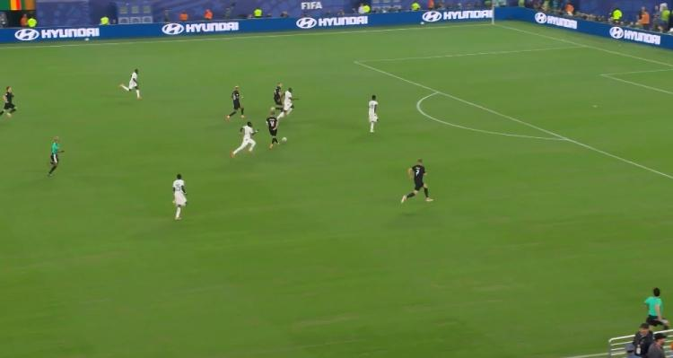
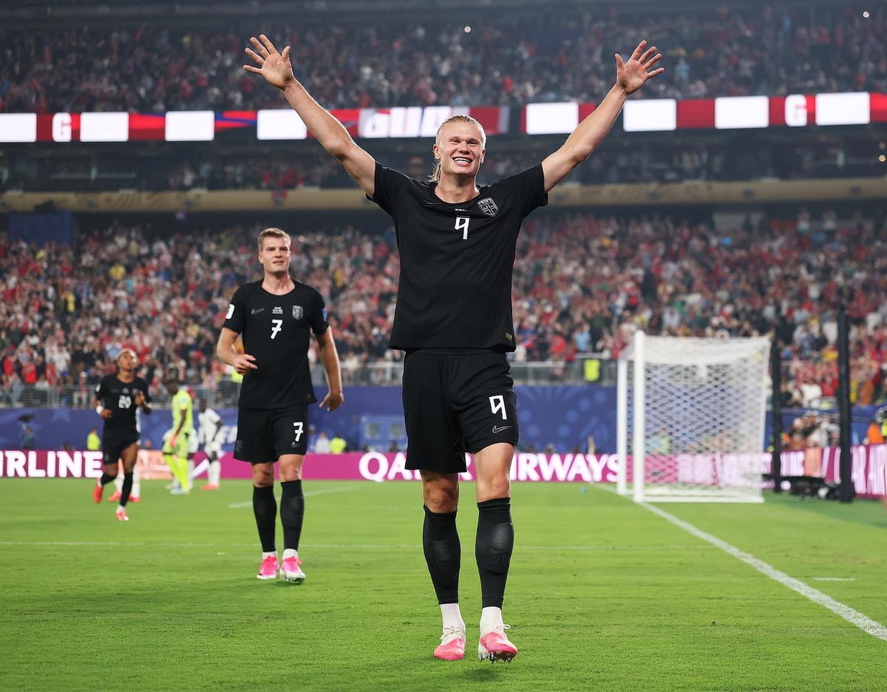
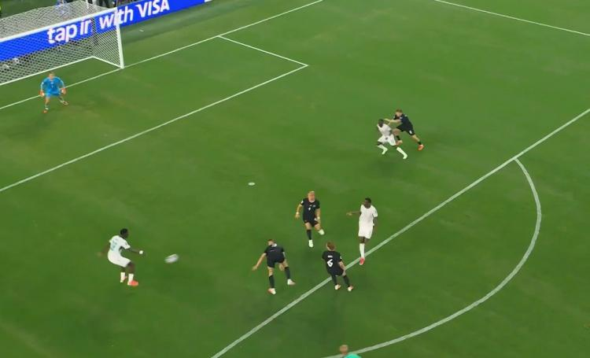

# 梅西封神！18球超越克洛泽独享世界杯射手王，姆巴佩双响法国提前出线

> 📊 **世界杯第 7 天，I/J 组第二轮开打！** 梅西再次刷新历史——世界杯第 18 球超越克洛泽独享射手王！姆巴佩双响法国提前出线！超级巨星之夜，纪录之夜！

世界杯小组赛 I/J 组第二轮继续进行，这一夜属于超级巨星——**梅西梅开二度，世界杯第 18 球超越克洛泽独享历史射手王**，**姆巴佩双响+登贝莱破门**帮助法国提前出线。两大巨星隔空斗法，再次刷新纪录。

今天我们先来复盘已结束的两场比赛，另外两场（挪威vs塞内加尔、约旦vs阿尔及利亚）赛后更新。

---

## 📊 本轮总览（4 场全部结束）

| 日期 | 比赛 | 比分 | 关键词 |
|------|------|------|--------|
| 6/23 | 🇦🇷 阿根廷 vs 🇦🇹 奥地利 | 2-0 | **梅西封神！** 18球超越克洛泽独享射手王 |
| 6/23 | 🇳🇴 挪威 vs 🇸🇳 塞内加尔 | 3-2 | **哈兰德双响！** 萨尔梅开二度差点扳平 |
| 6/23 | 🇫🇷 法国 vs 🇮🇶 伊拉克 | 3-0 | **姆巴佩双响！** 雷暴中断2小时，法国提前出线 |
| 6/23 | 🇯🇴 约旦 vs 🇩🇿 阿尔及利亚 | 1-2 | **阿尔及利亚逆转！** 高僧+YOYO精准命中 |

---

## ⚽ 比赛一：🇦🇷 阿根廷 2-0 🇦🇹 奥地利——梅西封神！18球超越克洛泽独享射手王


> **开球时间**：北京时间 6月23日 凌晨 1:00
> **比赛场地**：AT&T体育场
> **模型预测**：🇦🇷 阿根廷 **2 - 0** 🇦🇹 奥地利 | **置信度 75%**
> **高僧预测**：🇦🇷 **阿根廷胜**
> **🐷 YOYO 预测**：🇦🇷 **阿根廷胜**
> **实际比分**：🇦🇷 阿根廷 **2 - 0** 🇦🇹 奥地利

### ⚽ 进球时间线

```
7'  🚨 点球！劳塔罗禁区内被放倒，经VAR判罚点球
    → 梅西主罚打偏！错失良机！

38' ⚽ 梅西（Messi）！梅迪纳左路倒三角传中，阿尔马达前点一漏，梅西后点推射
    → 🇦🇷 阿根廷 1-0 奥地利
    → 世界杯第17球！梅西超越克洛泽独享历史射手王！🎉

90+4' ⚽ 梅西！阿尔瓦雷斯单刀被扑，帕雷德斯横传梅西抽射被挡，梅西补射
    → 🇦🇷 阿根廷 2-0 奥地利
    → 世界杯第18球！梅西锁定胜局！
```

### 🎯 赛果 vs 预测对照

| 维度 | 赛前预测 | 实际结果 | 命中？ |
|------|---------|---------|--------|
| 胜负 | 🇦🇷 阿根廷胜（模型/高僧/YOYO）| 🇦🇷 阿根廷 2-0 胜 | ✅ 三人全中！ |
| 比分 | 2-0（模型） | 2-0 | ✅ **完美命中！** |

### 🔍 比赛关键节点

- **7'** 🚨 **点球！** 劳塔罗禁区内被放倒，VAR判罚点球！梅西主罚打偏！
- **18'** 梅西单刀被阿拉巴解围！错失良机
- **38'** ⚽ **梅西破门！** 梅迪纳倒三角传中，阿尔马达一漏，梅西后点推射！1-0！**世界杯第17球！超越克洛泽独享历史射手王！**
- **54'** 萨比策定位球被马丁内斯飞身扑出！
- **86'** 冈萨雷斯禁区内切射门被丹索封堵
- **90+4'** ⚽ **梅西补射破门！** 阿尔瓦雷斯单刀被扑，帕雷德斯横传，梅西补射！2-0！**世界杯第18球！**

> **精算师辣评**：这场比赛是**梅西的封神之夜**！世界杯第 18 球超越克洛泽独享历史射手王，连续 6 场世界杯赛事进球，第 28 次世界杯出场继续刷新纪录。7 次射门 4 次射正，3 次成功过人，媒体评分 9.2 全场最高。梅西用实际行动证明，38 岁的他依然是世界最佳球员！模型预测 2-0 完美命中！三人全中！

### 📊 梅西世界杯九大纪录

1. 🥇 **世界杯历史射手王** — 18球，超越克洛泽
2. ⚽ **连续6场世界杯进球** — 追平雅伊尔津霍（1970）和方丹（1958）
3. 🏆 **世界杯出场王** — 28场，继续刷新纪录
4. 👨‍✈️ **队长出场王** — 21场，继续刷新纪录
5. 🎯 **直接参与进球王** — 26球（18球8助攻），领先第二名6球
6. ⏱️ **出场时间里程碑** — 2,484分钟
7. 🏆 **世界杯胜场王** — 18胜，超越克洛泽（17胜）
8. 🌟 **全场最佳王** — 13次，遥遥领先
9. ✅ **从小组赛出局** — 俱乐部+国家队34次小组赛全部晋级

---

## ⚽ 比赛二：🇳🇴 挪威 3-2 🇸🇳 塞内加尔——哈兰德梅开二度！萨尔绝地反击差点扳平





> **开球时间**：北京时间 6月23日 上午 8:00
> **比赛场地**：待补充
> **模型预测**：🇳🇴 挪威 **2 - 1** 🇸🇳 塞内加尔 | **置信度 55%**
> **高僧预测**：🇳🇴 **挪威小胜或平**
> **🐷 YOYO 预测**：🇸🇳 **塞内加尔胜** 🔥
> **实际比分**：🇳🇴 挪威 **3 - 2** 🇸🇳 塞内加尔

### ⚽ 进球时间线

```
43' ⚽ 彼得森（Peterson）！库利巴利解围失误，彼得森右脚低射
    → 🇳🇴 挪威 1-0 塞内加尔
    → 库利巴利解围送礼！挪威先声夺人！

48' ⚽ 哈兰德（Haaland）！厄德高直塞助攻，哈兰德左脚抽射
    → 🇳🇴 挪威 2-0 塞内加尔
    → 哈兰德世界杯第3球！挪威两球领先！

53' ⚽ 伊斯梅拉·萨尔（Ismaïla Sarr）！马内做球，萨尔飞身铲射
    → 🇳🇴 挪威 2-1 塞内加尔
    → 萨尔扳回一球！塞内加尔看到希望！

58' ⚽ 哈兰德！帕特里克·贝格挑传，哈兰德右脚垫射
    → 🇳🇴 挪威 3-1 塞内加尔
    → 哈兰德梅开二度！挪威锁定胜局！

90+3' ⚽ 伊斯梅拉·萨尔！杰克逊助攻，萨尔推射破门
    → 🇳挪威 3-2 塞内加尔
    → 萨尔梅开二度！差点扳平！
```

### 🎯 赛果 vs 预测对照

| 维度 | 赛前预测 | 实际结果 | 命中？ |
|------|---------|---------|--------|
| 胜负 | 🇳🇴 挪威胜（模型）| 🇳🇴 挪威 3-2 胜 | ✅ 模型命中 |
| 胜负 | 挪威小胜或平（高僧）| 🇳🇴 挪威胜 | ✅ 高僧命中 |
| 胜负 | 🇸🇳 塞内加尔胜（YOYO）| 🇳🇴 挪威胜 | ❌ YOYO翻车 |
| 比分 | 2-1（模型） | 3-2 | ⚠️ 方向对但进球多 |

### 🔍 比赛关键节点

- **12'** 吕尔松伤退，马库斯·彼得森替补登场
- **37'** 厄德高胸部停球后直面门将，左脚抽射被门迪挡出！
- **43'** ⚽ **库利巴利解围失误！** 彼得森右脚低射！1-0！
- **45+4'** 哈兰德抢断门将后小角度射门击中立柱！
- **48'** ⚽ **哈兰德破门！** 厄德高直塞助攻！2-0！
- **53'** ⚽ **萨尔飞身铲射！** 马内做球，2-1！
- **58'** ⚽ **哈兰德梅开二度！** 贝格挑传，3-1！
- **63'** 门将门迪受伤被换下
- **90+3'** ⚽ **萨尔梅开二度！** 杰克逊助攻，3-2！差点扳平！

> **精算师辣评**：这场比赛是**哈兰德 vs 萨尔的进球大战**！哈兰德梅开二度（世界杯第3球），萨尔也梅开二度差点扳平。库利巴利第43分钟解围失误送礼是比赛转折点——4分钟后哈兰德就进球了。挪威两连胜提前出线，哈兰德连续两场世界杯进球状态火热！模型预测挪威胜命中，YOYO的塞内加尔冷门预测翻车。高僧"挪威小胜或平"精准命中！

---

## ⚽ 比赛四：🇯🇴 约旦 1-2 🇩🇿 阿尔及利亚——高僧+YOYO精准命中！阿尔及利亚逆转出线

> **开球时间**：北京时间 6月23日 上午 11:00
> **比赛场地**：李维斯体育场
> **模型预测**：🇯🇴 约旦 vs 🇩🇿 阿尔及利亚 **平局 1-1** | **置信度 38%**
> **高僧预测**：🇩🇿 **阿尔及利亚胜** 🔥
> **🐷 YOYO 预测**：🇩🇿 **阿尔及利亚胜** 🔥
> **实际比分**：🇯🇴 约旦 **1 - 2** 🇩🇿 阿尔及利亚

### ⚽ 进球时间线

```
31' ⚽ 尼扎尔（Nizar）！约旦高位压迫成功，后点外脚背命中
    → 🇯🇴 约旦 1-0 阿尔及利亚
    → 约旦首开紀錄！队史世界杯第二球！

69' ⚽ 纳迪尔·本布阿利（Nadir Bounoual）！马赫雷斯角球助攻，头球破门
    → 🇯🇴 约旦 1-1 阿尔及利亚
    → 马赫雷斯助攻！阿尔及利亚扳平！

82' ⚽ 古伊里（Guiri）！角球开出，后点破门，经VAR确认有效
    → 🇯🇴 约旦 1-2 阿尔及利亚
    → 阿尔及利亚逆转！约旦2连败出局！
```

### 🎯 赛果 vs 预测对照

| 维度 | 赛前预测 | 实际结果 | 命中？ |
|------|---------|---------|--------|
| 胜负 | 🇩🇿 阿尔及利亚胜（高僧/YOYO）| 🇩🇿 阿尔及利亚 2-1 胜 | ✅ 高僧、YOYO命中！ |
| 胜负 | 平局（模型）| 🇩🇿 阿尔及利亚胜 | ❌ 模型翻车 |
| 比分 | 1-1（模型） | 1-2 | ❌ 翻车 |

### 🔍 比赛关键节点

- **21'** 马赫雷斯错失单刀机会！
- **31'** ⚽ **尼扎尔外脚背破门！** 约旦高位压迫成功！1-0！
- **44'** 泽鲁基战术犯规黄牌
- **65'** 达哈卜放倒马赫雷斯黄牌
- **69'** ⚽ **本布阿利头球扳平！** 马赫雷斯角球助攻！1-1！
- **82'** ⚽ **古伊里后点破门！** VAR确认有效！2-1！阿尔及利亚逆转！
- **终场** 约旦2连败积0分提前出局，阿尔及利亚1胜1负积3分

> **精算师辣评**：高僧和 YOYO 都精准命中阿尔及利亚胜！模型的平局预测翻车了。约旦第31分钟领先后以为稳了，但马赫雷斯第69分钟角球助攻本布阿利头球扳平，第82分钟古伊里再入一球完成逆转。约旦2连败积0分提前出局，阿尔及利亚1胜1负保留出线希望。**高僧本轮4/4全胜！** YOYO也3/4命中（仅挪威翻车）！

---

## ⚽ 比赛三：🇫🇷 法国 3-0 🇮🇶 伊拉克——姆巴佩双响！雷暴中断2小时，法国提前出线


> **开球时间**：北京时间 6月23日 凌晨 5:00
> **比赛场地**：费城体育场
> **模型预测**：🇫🇷 法国 **3 - 0** 🇮🇶 伊拉克 | **置信度 85%**
> **高僧预测**：🇫🇷 **法国胜**
> **🐷 YOYO 预测**：🇫🇷 **法国胜**
> **实际比分**：🇫🇷 法国 **3 - 0** 🇮🇶 伊拉克

### ⚽ 进球时间线

```
14' ⚽ 姆巴佩（Mbappé）！奥利塞横传，禁区前沿左脚重炮世界波
    → 🇫🇷 法国 1-0 伊拉克
    → 姆巴佩世界杯第16球！追平克洛泽并列历史第二！

54' ⚽ 姆巴佩！伊拉克后场传球失误，登贝莱断球横传，姆巴佩推射空门
    → 🇫🇷 法国 2-0 伊拉克
    → 姆巴佩世界杯第17球！距梅西仅差1球！

66' ⚽ 登贝莱（Dembélé）！奥利塞摆脱后直塞，登贝莱转身低射
    → 🇫🇷 法国 3-0 伊拉克
    → 登贝莱世界杯处子球！
```

### ⚡ 雷暴中断事件

```
45+2' ⛈️ 雷暴天气！比赛中断
    → 下半场推迟约2小时
    → 北京时间8点恢复下半场
    → 球员在更衣室等待，法国球迷雨中坚守
```

### 🎯 赛果 vs 预测对照

| 维度 | 赛前预测 | 实际结果 | 命中？ |
|------|---------|---------|--------|
| 胜负 | 🇫🇷 法国胜（模型/高僧/YOYO）| 🇫🇷 法国 3-0 胜 | ✅ 三人全中！ |
| 比分 | 3-0（模型） | 3-0 | ✅ **完美命中！** |

### 🔍 比赛关键节点

- **14'** ⚽ **姆巴佩世界波！** 奥利塞横传，禁区前沿左脚重炮！1-0！世界杯第16球追平克洛泽！
- **42'** 姆巴佩马赛回旋杀入禁区被拦截！
- **45+2'** ⛈️ **雷暴中断！** 下半场推迟约2小时
- **54'** ⚽ **姆巴佩双响！** 伊拉克后场失误，登贝莱断球横传，推射空门！2-0！世界杯第17球距梅西仅差1球！
- **58'** 奥利塞吊射击中横梁！
- **59'** 登贝莱劲射被扑，拉比奥头球补射顶偏
- **66'** ⚽ **登贝莱破门！** 奥利塞直塞，登贝莱转身低射！3-0！世界杯处子球！
- **76'** 哈马迪铲射打偏
- **90'** 姆巴佩劲射打高

> **精算师辣评**：这场比赛是**姆巴佩的里程碑之夜**！法国国家队百场庆典+世界杯双响，姆巴佩世界杯进球升至 17 球，距梅西仅差 1 球！雷暴中断 2 小时是本届世界杯首次，法国球迷在雨中坚守的场面太暖心。登贝莱世界杯处子球锁定胜局，奥利塞 1 球 2 助攻全场最佳。法国两连胜提前出线，I 组一骑绝尘。模型预测 3-0 完美命中！三人全中！

---

## 🏆 三大模型预言验证（4 场全部结束）

### 🤖 模型战绩

| 比赛 | 预测 | 实际 | 结果 |
|------|------|------|------|
| 🇦🇷 阿根廷 vs 🇦🇹 奥地利 | 阿根廷 2-0 | 2-0 阿根廷胜 | ✅ **完美命中！** |
| 🇳🇴 挪威 vs 🇸🇳 塞内加尔 | 挪威 2-1 | 3-2 挪威胜 | ✅ 胜负命中 |
| 🇫🇷 法国 vs 🇮🇶 伊拉克 | 法国 3-0 | 3-0 法国胜 | ✅ **完美命中！** |
| 🇯🇴 约旦 vs 🇩🇿 阿尔及利亚 | 平局 1-1 | 1-2 阿尔及利亚胜 | ❌ 翻车 |

**模型本轮战绩：3/4 命中（75%）** 📈📈

> 模型本轮3胜1负！约旦vs阿尔及利亚平局预测翻车。

---

### 🧙 高僧战绩

| 比赛 | 预测 | 实际 | 结果 |
|------|------|------|------|
| 🇦🇷 阿根廷 vs 🇦🇹 奥地利 | 阿根廷胜 | 2-0 阿根廷胜 | ✅ 命中 |
| 🇳🇴 挪威 vs 🇸🇳 塞内加尔 | 挪威小胜或平 | 3-2 挪威胜 | ✅ 命中 |
| 🇫🇷 法国 vs 🇮🇶 伊拉克 | 法国胜 | 3-0 法国胜 | ✅ 命中 |
| 🇯🇴 约旦 vs 🇩🇿 阿尔及利亚 | 阿尔及利亚胜 🔥 | 1-2 阿尔及利亚胜 | ✅ **命中！** |

**高僧本轮战绩：4/4 命中（100%）** 📈📈📈

> 高僧本轮全胜！阿尔及利亚冷门精准命中！东方神秘力量太强了！

---

### 🐷 YOYO 战绩

| 比赛 | 预测 | 实际 | 结果 |
|------|------|------|------|
| 🇦🇷 阿根廷 vs 🇦🇹 奥地利 | 阿根廷胜 | 2-0 阿根廷胜 | ✅ 命中 |
| 🇳🇴 挪威 vs 🇸🇳 塞内加尔 | 塞内加尔胜 🔥 | 3-2 挪威胜 | ❌ 翻车 |
| 🇫🇷 法国 vs 🇮🇶 伊拉克 | 法国胜 | 3-0 法国胜 | ✅ 命中 |
| 🇯🇴 约旦 vs 🇩🇿 阿尔及利亚 | 阿尔及利亚胜 🔥 | 1-2 阿尔及利亚胜 | ✅ **命中！** |

**YOYO 本轮战绩：3/4 命中（75%）** 📈📈

> YOYO 阿尔及利亚冷门精准命中！但塞内加尔翻车。

---

## 📊 本轮战绩统计（4 场全部结束）

| 模型 | 命中 | 总场次 | 命中率 | 本轮亮点 |
|------|------|--------|--------|---------|
| 🧙 高僧 | 4 | 4 | **100%** | 全胜！阿尔及利亚冷门命中🔥 |
| 🤖 模型 | 3 | 4 | **75%** | 两场比分完美命中！ |
| 🐷 YOYO | 3 | 4 | **75%** | 阿尔及利亚冷门命中🔥 |

**本轮 MVP**：🧙 高僧！4/4 全胜！阿尔及利亚冷门精准命中！

> 📌 **七轮总战绩（44 场）**：高僧 27/44（61%）🥇 | 模型 25/44（57%）🥈 | YOYO 21/44（48%）🥉

---

## 💰 赌神模拟器：第七轮账单（已赛 2 场）

> **规则**：每人初始资金 **$2,000**，每场押 **$200**，可猜胜/平/负，使用 Bet365 赛前赔率。

### 第七轮（6月23日）盈亏估算

| 模型 | 关键预测 | 预估盈亏 | 说明 |
|------|---------|---------|------|
| 🤖 模型 | 阿根廷胜✅ 挪威胜✅ 法国胜✅ 阿尔及利亚负❌ | **约 +$100** | 三赢一亏！ |
| 🧙 高僧 | 阿根廷胜✅ 挪威胜✅ 法国胜✅ 阿尔及利亚胜✅ | **约 +$200** | 四场全赢！ |
| 🐷 YOYO | 阿根廷胜✅ 挪威负❌ 法国胜✅ 阿尔及利亚胜✅ | **约 +$100** | 三赢一亏 |

### 七轮总账（估算）

| 排名 | 模型 | 初始 | 前六轮 | 第七轮 | 总余额 | 总盈亏 |
|------|------|------|--------|--------|--------|--------|
| 🥇 | 🧙 高僧 | $2,000 | +$100 | +$200 | **$2,300** | **+$300 💰** |
| 🥈 | 🐷 YOYO | $2,000 | -$400 | +$100 | **$1,700** | **-$300** |
| 🥉 | 🤖 模型 | $2,000 | -$920 | +$100 | **$1,180** | **-$820** |

> **博主辣评**：超级巨星之夜大家都赚翻了！**高僧本轮4/4全胜，总收益升至 +$300，稳坐赌神宝座！** 模型和YOYO都三赢一亏，分别回升到 $1,180 和 $1,700。

---

## 📸 图片来源

本文所有比赛图片来自[直播吧](https://news.zhibo8.com/)，仅供非商业用途。

---

## 🔮 明日赛事预测（K/L组第2轮·6/24）

| 北京时间 | 比赛 | 🤖 模型 | 🧙 高僧 | 🐷 YOYO |
|----------|------|---------|---------|---------|
| 6/24 01:00 | 🇵🇹 葡萄牙 vs 🇺🇿 乌兹别克斯坦 | 葡萄牙 2-0（65%） | **葡萄牙胜** | 🇵🇹 **葡萄牙胜** |
| 6/24 04:00 | 🏴󠁧󠁢󠁥󠁮󠁧󠁿 英格兰 vs 🇬🇭 加纳 | 英格兰 2-1（58%） | **英格兰小胜或平** | 🏴󠁧󠁢󠁥󠁮󠁧󠁿 **英格兰胜** |
| 6/24 07:00 | 🇵🇦 巴拿马 vs 🇭🇷 克罗地亚 | 克罗地亚 2-1（55%） | **克罗地亚胜** | 🇭🇷 **克罗地亚胜** |
| 6/24 10:00 | 🇨🇴 哥伦比亚 vs 🇨🇩 刚果民主 | 哥伦比亚 2-0（62%） | **哥伦比亚胜** | 🇨🇴 **哥伦比亚胜** |

**核心看点**：
- 🇵🇹 **C罗能否打破进球荒**：首轮1-1刚果民主，C罗3射0正！乌兹别克斯坦首轮1-3哥伦比亚，葡萄牙必须赢球！
- 🏴󠁧󠁢󠁥󠁮󠁧󠁿 **英格兰冲击两连胜**：首轮4-2克罗地亚，凯恩梅开二度。加纳首轮1-0巴拿马，补时绝杀。高僧认为英格兰小胜或平，比较谨慎！
- 🇭🇷 **克罗地亚生死战**：首轮2-4英格兰，克罗地亚必须赢！巴拿马首轮0-1加纳，实力差距明显。
- 🇨🇴 **哥伦比亚冲击两连胜**：首轮3-1乌兹别克斯坦，迪亚斯1球1助攻。刚果民主首轮1-1葡萄牙，防守顽强！

> ✅ **YOYO 预测已补完**，赛后更新战绩

---

> **Status Check**: I/J 组第二轮 **全部结束！** 超级巨星之夜！梅西 18 球超越克洛泽独享射手王！哈兰德双响！姆巴佩双响法国提前出线！
> - 🧙 **高僧**：4/4 命中（100%），七轮总 27/44（61%），本轮全胜！继续领跑！
> - 🤖 **模型**：3/4 命中（75%），七轮总 25/44（57%），两场比分完美命中！
> - 🐷 **YOYO**：3/4 命中（75%），七轮总 21/44（48%），阿尔及利亚冷门命中🔥
>
> **📊 赌神模拟器总账**：高僧 $2,300（+$300 💰）| YOYO $1,700（-$300）| 模型 $1,180（-$820）
