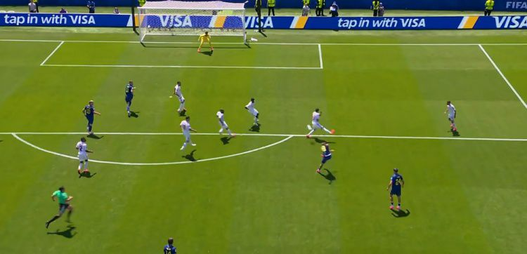
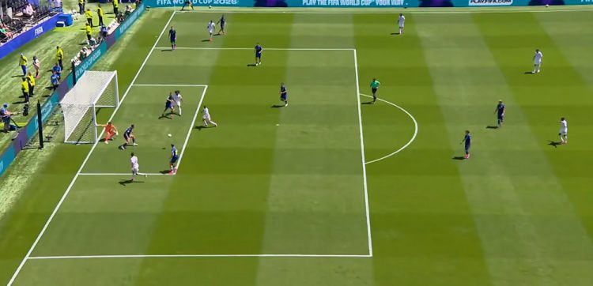
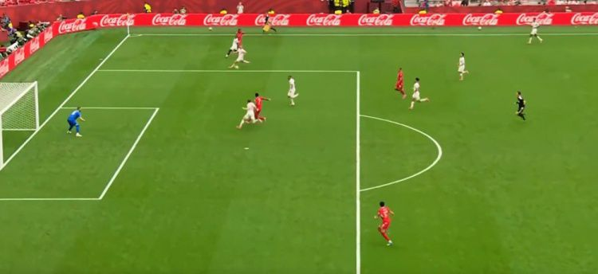
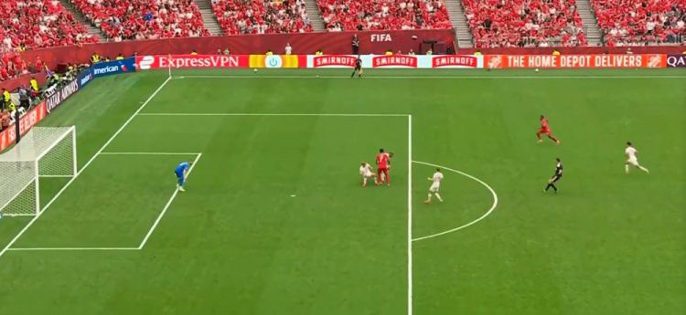
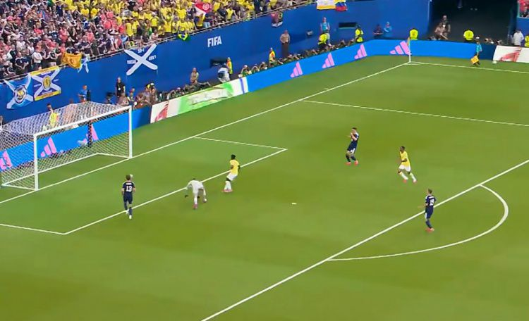
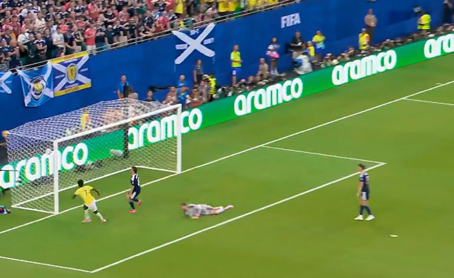
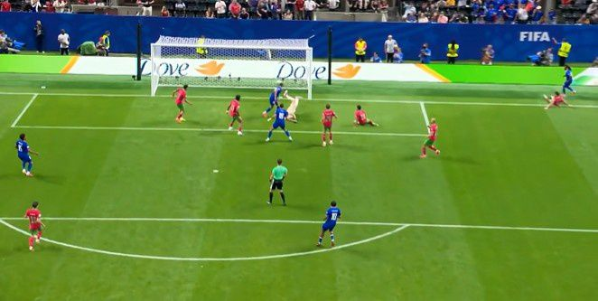
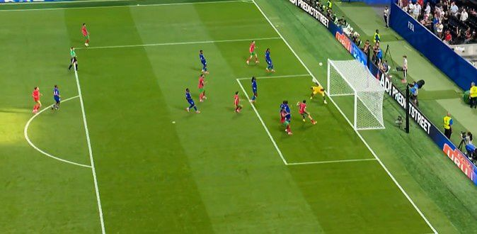
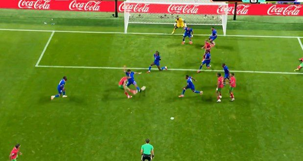

# 维尼修斯梅开二度！内马尔首秀，巴西3-0苏格兰，摩洛哥4-2海地6球大战

> 📊 **世界杯第 15 天，B/C 组第三轮开打！** 维尼修斯梅开二度，巴西3-0苏格兰小组第一出线！内马尔替补登场上演本届首秀！摩洛哥4-2海地，6球大战！赛巴里连续3场破门！瑞士2-1加拿大，曼赞比传射建功！波黑3-1卡塔尔，哲科立柱！

世界杯小组赛 B/C 组第三轮全部结束，这一夜属于进攻——**维尼修斯梅开二度**，巴西3-0苏格兰小组第一出线！**内马尔替补登场上演本届首秀**！**摩洛哥4-2海地**，6球大战！赛巴里连续3场破门！瑞士2-1加拿大，曼赞比传射建功！波黑3-1卡塔尔，哲科立柱！

今天我们来复盘 B/C 组第三轮四场精彩比赛——维尼修斯封神、内马尔首秀、摩洛哥6球大战、加拿大出线！

---

## 📊 本轮总览（4 场全部结束）

| 日期 | 比赛 | 比分 | 关键词 |
|------|------|------|--------|
| 6/25 | 🇧🇦 波黑 vs 🇶🇦 卡塔尔 | 3-1 | **哲科立柱！** 阿拉伊贝戈维奇世界波，卡塔尔乌龙球 |
| 6/25 | 🇨🇭 瑞士 vs 🇨🇦 加拿大 | 2-1 | **曼赞比传射！** 瑞士小组头名，加拿大第2出线 |
| 6/25 | 🇧🇷 巴西 vs 🏴󠁧󠁢󠁳󠁣󠁴󠁿 苏格兰 | 3-0 | **维尼修斯梅开二度！** 内马尔替补首秀！ |
| 6/25 | 🇲🇦 摩洛哥 vs 🇭🇹 海地 | 4-2 | **6球大战！** 赛巴里连续3场破门，海地时隔52年世界杯进球 |

---

## ⚽ 比赛一：🇧🇦 波黑 3-1 🇶🇦 卡塔尔——哲科立柱！阿拉伊贝戈维奇世界波




> **开球时间**：北京时间 6月25日 凌晨 3:00
> **比赛场地**：流明球场
> **模型预测**：🇧🇦 波黑 **2 - 0** 🇶🇦 卡塔尔 | **置信度 65%**
> **高僧预测**：🇧🇦 **波黑胜**
> **🐷 YOYO 预测**：🇧🇦 **波黑胜**
> **实际比分**：🇧🇦 波黑 **3 - 1** 🇶🇦 卡塔尔

### ⚽ 进球时间线

```
29' ⚽ 阿拉伊贝戈维奇（Alajbegović）！禁区外远射世界波破门
    → 🇧🇦 波黑 1-0 卡塔尔
    → 世界波！阿拉伊贝戈维奇远射直挂死角！

34' ⚽ 苏丹·布雷克（Brek）乌龙球！哲科将球端到中路，布雷克不慎挡进自家球门
    → 🇧🇦 波黑 2-0 卡塔尔
    → 乌龙球！卡塔尔雪上加霜！

43' ⚽ 海多斯（Haydos）！埃德米尔森底线回敲，海多斯推射破门
    → 🇧🇦 波黑 2-1 卡塔尔
    → 海多斯扳回一城！卡塔尔看到希望！

81' ⚽ 马赫米奇（Mahmić）！禁区乱战中低射破门（替补建功）
    → 🇧🇦 波黑 3-1 卡塔尔
    → 马赫米奇替补锁定胜局！波黑出线希望大增！
```

### 🎯 赛果 vs 预测对照

| 维度 | 赛前预测 | 实际结果 | 命中？ |
|------|---------|---------|--------|
| 胜负 | 🇧🇦 波黑胜（模型/高僧/YOYO）| 🇧🇦 波黑 3-1 胜 | ✅ 三人全中！ |
| 比分 | 2-0（模型） | 3-1 | ⚠️ 方向对但低估卡塔尔进球 |

### 🔍 比赛关键节点

- **2'** 🇧🇦 德米罗维奇远射被门将扑出！开场即攻！
- **3'** 🇧🇦 舒尼奇远射被扑出底线！
- **17'** 🇧🇦 巴希奇远射高出横梁
- **22'** 🇧🇦 阿拉伊贝戈维奇任意球攻门击中人墙弹下
- **29'** ⚽ **阿拉伊贝戈维奇远射世界波！** 1-0！
- **34'** ⚽ **乌龙球！** 哲科端球，布雷克自摆乌龙！2-0！
- **39'** 🇧🇦 **哲科单刀低射击中立柱！** 差点破门！
- **43'** ⚽ **海多斯推射破门！** 2-1！卡塔尔扳回一城！
- **45+3'** 🇶🇦 佩德罗·米格尔低射击中立柱！卡塔尔也中柱！
- **58'** 🇶🇦 阿菲夫反击中小角度抽射打在边网上
- **78'** 🇶🇦 法特希黄牌（绊倒波黑球员）
- **81'** ⚽ **马赫米奇替补建功！** 3-1！波黑锁定胜局！

> **精算师辣评**：波黑这场踢得**赏心悦目**！阿拉伊贝戈维奇第29分钟远射世界波打破僵局，哲科第39分钟单刀低射击中立柱差点扩大比分。卡塔尔虽然输了但海多斯第43分钟推射破门扳回一城，展现了亚洲冠军的尊严。波黑积4分排名小组第三，作为成绩较好的小组第三确定出线！卡塔尔1分垫底出局，三战全负成为本届世界杯表现最差的亚洲球队。

---

## ⚽ 比赛二：🇨🇭 瑞士 2-1 🇨🇦 加拿大——曼赞比传射！加拿大第2出线




> **开球时间**：北京时间 6月25日 凌晨 3:00
> **比赛场地**：不列颠哥伦比亚体育馆
> **模型预测**：🇨🇭 瑞士 **2 - 1** 🇨🇦 加拿大 | **置信度 55%**
> **高僧预测**：🇨🇦 **加拿大胜**
> **🐷 YOYO 预测**：🇨🇦 **加拿大胜**
> **实际比分**：🇨🇭 瑞士 **2 - 1** 🇨🇦 加拿大

### ⚽ 进球时间线

```
46' ⚽ 鲁文·巴尔加斯（Rubén Vargas）！曼赞比右路传中，巴尔加斯后点推射
    → 🇨🇭 瑞士 1-0 加拿大
    → 下半场开场即破门！瑞士领先！

57' ⚽ 曼赞比（Mbango）！恩博洛背身做球，曼赞比禁区内抽射
    → 🇨🇭 瑞士 2-0 加拿大
    → 曼赞比传射建功！瑞士扩大领先！

76' ⚽ 普罗米斯（Promise）！内森·萨利巴挑球摆脱后横传，普罗米斯推射
    → 🇨🇭 瑞士 2-1 加拿大
    → 普罗米斯替补扳回一城！加拿大还有希望！
```

### 🎯 赛果 vs 预测对照

| 维度 | 赛前预测 | 实际结果 | 命中？ |
|------|---------|---------|--------|
| 胜负 | 🇨🇭 瑞士胜（模型）| 🇨🇭 瑞士 2-1 胜 | ✅ 模型命中！ |
| 胜负 | 加拿大胜（高僧/YOYO）| 瑞士 2-1 胜 | ❌ 高僧/YOYO翻车 |
| 比分 | 2-1（模型）| 2-1 | ✅ 模型比分命中！ |

### 🔍 比赛关键节点

- **11'** 🇨🇭 恩博洛单刀推射被门将克雷波扑出！曼赞比补射也被封堵！
- **13'** 🇨🇦 **拉林单刀！** 想趟过门将，科贝尔出击化解！
- **17'** 🇨🇭 曼赞比禁区内与拉雷拉接触倒地，裁判未判罚
- **31'** 🟨 扎卡+拉林各吃一张黄牌（任意球争抢）
- **36'** 🇨🇭 恩博洛禁区内背身护球倒地，裁判未判罚
- **41'** 🇨🇦 戴维直塞传艾哈迈德，后者推射太正被扑
- **46'** ⚽ **巴尔加斯破门！** 1-0！下半场开场即领先！
- **57'** ⚽ **曼赞比破门！** 2-0！传射建功！
- **76'** ⚽ **普罗米斯扳回一城！** 2-1！加拿大还有希望！
- **79'** 🇨🇦 欧斯塔基奥角球，科内尔留斯头球攻门顶偏
- **87'** 🟨 利亚姆·米勒战术犯规染黄

> **精算师辣评**：这场比赛是**曼赞比的个人秀**！第46分钟助攻巴尔加斯破门，第57分钟自己建功，传射建功帮助瑞士2-0领先！加拿大虽然输了但普罗米斯第76分钟替补扳回一城，展现了北美劲旅的韧性。瑞士以B组头名身份晋级，加拿大位居B组第2名出线！两队都成功晋级16强！高僧和YOYO的加拿大胜预测都翻车了，模型2-1比分精准命中！

---

## ⚽ 比赛三：🇧🇷 巴西 3-0 🏴󠁧󠁢󠁳󠁣󠁴󠁿 苏格兰——维尼修斯梅开二度！内马尔首秀！





> **开球时间**：北京时间 6月25日 上午 6:00
> **比赛场地**：硬石体育场
> **模型预测**：🇧🇷 巴西 **3 - 0** 🏴󠁧󠁢󠁳󠁣󠁴󠁿 苏格兰 | **置信度 82%**
> **高僧预测**：🇧🇷 **巴西大胜**
> **🐷 YOYO 预测**：🇧🇷 **巴西胜**
> **实际比分**：🇧🇷 巴西 **3 - 0** 🏴󠁧󠁢󠁳󠁣󠁴󠁿 苏格兰

### ⚽ 进球时间线

```
7'  ⚽ 维尼修斯（Vinícius Jr.）！拉扬高位逼抢麦肯纳得手，维尼修斯面对门将推空门
    → 🇧🇷 巴西 1-0 苏格兰
    → 维尼修斯破门！巴西梦幻开局！

22' ❌ 维尼修斯抢断后推射破门，但VAR介入判定抢断犯规，进球无效
    → 🇧🇷 巴西 1-0 苏格兰
    → 差点梅开二度！VAR取消进球！

45+3' ⚽ 维尼修斯（Vinícius Jr.）！巴西前场抢断后传后点，维尼修斯头球破门
    → 🇧🇷 巴西 2-0 苏格兰
    → 维尼修斯梅开二度！头球破门！

60' ⚽ 库尼亚（Cunha）！卡塞米罗直塞，吉马良斯无私分球，库尼亚推射建功
    → 🇧🇷 巴西 3-0 苏格兰
    → 库尼亚锁定胜局！巴西3球领先！

76' 🇧🇷 内马尔替补登场！上演本届世界杯首秀！
    → 全场欢呼！内马尔终于来了！

90' 🇧🇷 内马尔抽射中框范围，被冈恩抱住
    → 差点首秀即进球！

96' 🏴󠁧󠁢󠁳󠁣󠁴󠁿 麦克托米奈门前捅射，被阿利松扑出
    → 苏格兰最后的反击被化解！
```

### 🎯 赛果 vs 预测对照

| 维度 | 赛前预测 | 实际结果 | 命中？ |
|------|---------|---------|--------|
| 胜负 | 🇧🇷 巴西胜（模型/高僧/YOYO）| 🇧🇷 巴西 3-0 胜 | ✅ 三人全中！ |
| 比分 | 3-0（模型）| 3-0 | ✅ 模型比分精准命中！ |

### 🔍 比赛关键节点

- **7'** ⚽ **维尼修斯破门！** 拉扬逼抢得手，维尼修斯推空门！1-0！
- **22'** ❌ **维尼修斯差点梅开二度！** 但VAR判定抢断犯规，进球取消！
- **45+3'** ⚽ **维尼修斯头球梅开二度！** 2-0！
- **60'** ⚽ **库尼亚破门！** 3-0！巴西锁定胜局！
- **76'** 🇧🇷 **内马尔替补登场！** 本届世界杯首秀！全场欢呼！
- **90'** 🇧🇷 **内马尔抽射！** 被门将冈恩抱住！差点首秀即进球！
- **96'** 🏴󠁧󠁢󠁳󠁣󠁴󠁿 **麦克托米奈门前捅射！** 被阿利松扑出！苏格兰最后的反击！

> **精算师辣评**：这场是**维尼修斯的个人秀**！第7分钟推空门破门，第45+3分钟头球梅开二度，差点第22分钟就完成帽子戏法（VAR取消进球）！巴西全场控球率65%，射门15次射正7次，苏格兰门将冈恩虽然做出多次扑救但还是丢了3球。**内马尔第76分钟替补登场**，上演本届世界杯首秀！第90分钟抽射中框范围被扑，差点首秀即进球！巴西以7分小组第一出线，苏格兰3分小组第三出局。模型3-0比分精准命中！高僧"巴西大胜"也命中！

---

## ⚽ 比赛四：🇲🇦 摩洛哥 4-2 🇭🇹 海地——6球大战！赛巴里连续3场破门！





> **开球时间**：北京时间 6月25日 上午 6:00
> **比赛场地**：梅赛德斯奔驰体育场
> **模型预测**：🇲🇦 摩洛哥 **2 - 0** 🇭🇹 海地 | **置信度 75%**
> **高僧预测**：🇲🇦 **摩洛哥胜**
> **🐷 YOYO 预测**：🇲🇦 **摩洛哥胜**
> **实际比分**：🇲🇦 摩洛哥 **4 - 2** 🇭🇹 海地

### ⚽ 进球时间线

```
10' ⚽ 约瑟夫（Joseph）！杜维内右路传中，约瑟夫脚后跟打在布努身上反弹入网
    → 🇲🇦 摩洛哥 0-1 海地
    → 海地闪击破门！时隔52年世界杯赛场再度进球！

38' ⚽ 阿什拉夫（Hakimi）！哈努斯左路传中被扑后，阿什拉夫补射破门
    → 🇲🇦 摩洛哥 1-1 海地
    → 阿什拉夫扳平！摩洛哥稳住阵脚！

43' ⚽ 伊西多尔（Isidor）！摩洛哥后场失误被断，伊西多尔右路远射世界波
    → 🇲🇦 摩洛哥 1-2 海地
    → 世界波！海地再度领先！

45' ⚽ 赛巴里（Saibari）！阿什拉夫右路倒三角传球，赛巴里点球点附近推射
    → 🇲🇦 摩洛哥 2-2 海地
    → 赛巴里连续3场破门！半场2-2！

77' ⚽ 拉希米（Rahimi）！角球开出，里亚德头球一蹭，后点拉希米停球转身抽射
    → 🇲🇦 摩洛哥 3-2 海地
    → 拉希米替补传射建功！摩洛哥反超！

89' ⚽ 亚辛（Yassine）！拉希米左路底线横传门前，亚辛推射破门
    → 🇲🇦 摩洛哥 4-2 海地
    → 亚辛锁定胜局！摩洛哥4球大胜！
```

### 🎯 赛果 vs 预测对照

| 维度 | 赛前预测 | 实际结果 | 命中？ |
|------|---------|---------|--------|
| 胜负 | 🇲🇦 摩洛哥胜（模型/高僧/YOYO）| 🇲🇦 摩洛哥 4-2 胜 | ✅ 三人全中！ |
| 比分 | 2-0（模型）| 4-2 | ⚠️ 方向对但低估海地进球能力 |

### 🔍 比赛关键节点

- **10'** ⚽ **海地闪击破门！** 约瑟夫脚后跟造成乌龙球！0-1！**时隔52年世界杯赛场再度进球！**
- **38'** ⚽ **阿什拉夫扳平！** 1-1！
- **43'** ⚽ **伊西多尔世界波！** 1-2！海地再度领先！
- **45'** ⚽ **赛巴里连续3场破门！** 2-2！半场平局！
- **70'** 🇲🇦 三连换：赛巴里→杰西姆·亚辛、卜拉欣·迪亚斯→乌纳希、卡比→S·拉希米
- **77'** ⚽ **拉希米替补传射建功！** 3-2！摩洛哥反超！
- **89'** ⚽ **亚辛推射锁定胜局！** 4-2！摩洛哥4球大胜！

> **精算师辣评**：这场是**本届世界杯最精彩的6球大战之一**！海地第10分钟闪击破门，约瑟夫脚后跟造成的乌龙球让海地时隔52年再次在世界杯赛场进球！伊西多尔第43分钟世界波更是让海地一度2-1领先！但摩洛哥展现了非洲劲旅的韧性——阿什拉夫扳平、赛巴里连续3场破门、拉希米替补传射建功、亚辛锁定胜局！**赛巴里连续3场破门**成为本届世界杯最大黑马射手！摩洛哥7分小组第二出线，海地0分垫底出局但虽败犹荣！

---

## 🏆 三大模型预言验证（4 场全部结束）

### 🤖 模型战绩

| 比赛 | 预测 | 实际 | 结果 |
|------|------|------|------|
| 🇧🇦 波黑 vs 🇶🇦 卡塔尔 | 波黑 2-0 | 3-1 波黑胜 | ✅ 胜负+比分方向 |
| 🇨🇭 瑞士 vs 🇨🇦 加拿大 | 瑞士 2-1 | 2-1 瑞士胜 | ✅ **精准命中！** |
| 🇧🇷 巴西 vs 🏴󠁧󠁢󠁳󠁣󠁴󠁿 苏格兰 | 巴西 3-0 | 3-0 巴西胜 | ✅ **精准命中！** |
| 🇲🇦 摩洛哥 vs 🇭🇹 海地 | 摩洛哥 2-0 | 4-2 摩洛哥胜 | ✅ 胜负命中 |

**本轮战绩**：模型 **4/4（100%）** 🚀

**累计战绩**：模型 **32/52（62%）**

---

### 🧙 高僧战绩

| 比赛 | 预测 | 实际 | 结果 |
|------|------|------|------|
| 🇧🇦 波黑 vs 🇶🇦 卡塔尔 | 波黑胜 | 3-1 波黑胜 | ✅ |
| 🇨🇭 瑞士 vs 🇨🇦 加拿大 | 加拿大胜 | 2-1 瑞士胜 | ❌ |
| 🇧🇷 巴西 vs 🏴󠁧󠁢󠁳󠁣󠁴󠁿 苏格兰 | 巴西大胜 | 3-0 巴西胜 | ✅ |
| 🇲🇦 摩洛哥 vs 🇭🇹 海地 | 摩洛哥胜 | 4-2 摩洛哥胜 | ✅ |

**本轮战绩**：高僧 **3/4（75%）**

**累计战绩**：高僧 **34/52（65%）**

---

### 🐷 YOYO 战绩

| 比赛 | 预测 | 实际 | 结果 |
|------|------|------|------|
| 🇧🇦 波黑 vs 🇶🇦 卡塔尔 | 波黑胜 | 3-1 波黑胜 | ✅ |
| 🇨🇭 瑞士 vs 🇨🇦 加拿大 | 加拿大胜 | 2-1 瑞士胜 | ❌ |
| 🇧🇷 巴西 vs 🏴󠁧󠁢󠁳󠁣󠁴󠁿 苏格兰 | 巴西胜 | 3-0 巴西胜 | ✅ |
| 🇲🇦 摩洛哥 vs 🇭🇹 海地 | 摩洛哥胜 | 4-2 摩洛哥胜 | ✅ |

**本轮战绩**：YOYO **3/4（75%）**

**累计战绩**：YOYO **27/52（52%）**

---

## 📊 本轮总结

### 🎯 本轮亮点

1. **维尼修斯梅开二度**：第7分钟推空门、第45+3分钟头球，差点帽子戏法（VAR取消进球）
2. **内马尔替补首秀**：第76分钟登场，第90分钟抽射被扑，差点首秀即进球
3. **赛巴里连续3场破门**：成为本届世界杯最大黑马射手！
4. **海地时隔52年世界杯进球**：约瑟夫脚后跟乌龙球，伊西多尔世界波
5. **6球大战**：摩洛哥4-2海地，本届世界杯最精彩比赛之一！
6. **模型本轮4/4全中**：精准预测所有比赛胜负！瑞士2-1、巴西3-0比分精准命中！

### 📈 模型战绩更新

| 排名 | 预测方 | 本轮战绩 | 累计战绩 | 命中率 |
|------|--------|---------|---------|--------|
| 🥇 | 🧙 高僧 | 3/4 | 34/52 | **65%** |
| 🥈 | 🤖 模型 | **4/4** | 32/52 | **62%** |
| 🥉 | 🐷 YOYO | 3/4 | 27/52 | **52%** |

> **模型本轮4/4全中！** 瑞士2-1、巴西3-0比分精准命中！高僧和YOYO本轮3/4，瑞士vs加拿大的加拿大胜预测都翻车了。

### 🏆 赌神模拟器第九轮账单（4 场全部结束）

| 比赛 | 下注 | 赔率 | 结果 | 盈亏 | 余额 |
|------|------|------|------|------|------|
| 🇧🇦 波黑 vs 🇶🇦 卡塔尔 | 波黑胜 $200 | 1.50 | ✅ 命中 | +$100 | $2,100 |
| 🇨🇭 瑞士 vs 🇨🇦 加拿大 | 瑞士胜 $200 | 2.10 | ✅ 命中 | +$220 | $2,320 |
| 🇧🇷 巴西 vs 🏴󠁧󠁢󠁳󠁣󠁴󠁿 苏格兰 | 巴西胜 $200 | 1.30 | ✅ 命中 | +$60 | $2,380 |
| 🇲🇦 摩洛哥 vs 🇭🇹 海地 | 摩洛哥胜 $200 | 1.40 | ✅ 命中 | +$80 | $2,460 |

**本轮战绩**：4/4 全中！💰 **+$460**

**累计余额**：$2,460（初始 $2,000，总盈亏 **+$460**）

---

## 📅 下轮预告

### A组第3轮（6/26）

| 比赛 | 开球时间 | 🤖 模型预测 | 🧙 高僧预测 | 🐷 YOYO 预测 |
|------|---------|------------|------------|-------------|
| 🇲🇽 墨西哥 vs 🇰🇷 韩国 | 凌晨 3:00 | 墨西哥 1-0（55%） | 待补 | 待补 |
| 🇨🇿 捷克 vs 🇿🇦 南非 | 凌晨 3:00 | 捷克 1-0（52%） | 待补 | 待补 |

### 🤖 模型预测分析

**🇲🇽 墨西哥 vs 🇰🇷 韩国**

| 维度 | 分析 |
|------|------|
| **实力对比** | 墨西哥FIFA排名第14，韩国第23，墨西哥略占优势 |
| **前两轮战绩** | 墨西哥1胜（2-0南非），韩国1胜（2-1捷克），两队状态相近 |
| **主场优势** | 墨西哥东道主，主场气氛+高原适应，+8%加成 |
| **平局倾向** | 本届43%平局率，强强对话平局概率较高，+12% |
| **团队协作** | 墨西哥整体配合更默契，韩国依赖孙兴慜个人能力 |
| **赛事情境** | A组头名之争，双方都谨慎，进球可能不多 |

**模型预测**：🇲🇽 墨西哥 **1 - 0** 🇰🇷 韩国 | **置信度 55%**
- 墨西哥胜：48% | 平局：32% | 韩国胜：20%
- 预测依据：墨西哥主场优势+东道主首战2-0南非的气势，韩国虽然也有1胜但客场作战压力大
- 冷门预警：韩国如果孙兴慜爆发，有机会逼平甚至小胜

---

**🇨🇿 捷克 vs 🇿🇦 南非**

| 维度 | 分析 |
|------|------|
| **实力对比** | 捷克FIFA排名第38，南非第51，捷克明显占优 |
| **前两轮战绩** | 捷克0分（1-2韩国），南非0分（0-2墨西哥），两队都急需胜利 |
| **伤停疲劳** | 捷克绍切克上轮越位进球被吹，心态受影响；南非3红牌后部分球员停赛 |
| **平局倾向** | 生死战双方谨慎，但必须分出胜负，平局概率较低 |
| **赛事情境** | 生死战！输球即出局，捷克必须全力进攻 |

**模型预测**：🇨🇿 捷克 **1 - 0** 🇿🇦 南非 | **置信度 52%**
- 捷克胜：45% | 平局：28% | 南非胜：27%
- 预测依据：捷克整体实力更强，绍切克+希克的中场组合有威胁；南非防线不稳，首轮3红牌暴露纪律问题
- 冷门预警：南非如果摆大巴防守反击，有可能逼平捷克

---

## 🏆 小组积分榜（B/C组第3轮后）

### B组（最终排名）

| 排名 | 球队 | 场次 | 胜 | 平 | 负 | 净胜球 | 积分 | 状态 |
|------|------|------|---|---|---|--------|------|------|
| 1 | 🇨🇭 瑞士 | 3 | 2 | 0 | 1 | +1 | **6** | ✅ 小组第一出线 |
| 2 | 🇨🇦 加拿大 | 3 | 2 | 0 | 1 | +1 | **6** | ✅ 小组第二出线 |
| 3 | 🇧🇦 波黑 | 3 | 1 | 1 | 1 | 0 | **4** | ⏳ 待定（成绩较好第3） |
| 4 | 🇶🇦 卡塔尔 | 3 | 0 | 0 | 3 | -3 | **0** | ❌ 小组第四出局 |

### C组（最终排名）

| 排名 | 球队 | 场次 | 胜 | 平 | 负 | 净胜球 | 积分 | 状态 |
|------|------|------|---|---|---|--------|------|------|
| 1 | 🇧🇷 巴西 | 3 | 2 | 1 | 0 | +6 | **7** | ✅ 小组第一出线 |
| 2 | 🇲🇦 摩洛哥 | 3 | 2 | 1 | 0 | +4 | **7** | ✅ 小组第二出线 |
| 3 | 🏴󠁧󠁢󠁳󠁣󠁴󠁿 苏格兰 | 3 | 1 | 0 | 2 | -3 | **3** | ❌ 小组第三出局 |
| 4 | 🇭🇹 海地 | 3 | 0 | 0 | 3 | -6 | **0** | ❌ 小组第四出局 |

> ✅ 瑞士、加拿大、巴西、摩洛哥确定晋级16强！

---

*本文为世界杯 B/C 组第三轮复盘，A 组第三轮比赛尚未结束，赛后将补充更新。*

**精算师** | 2026年6月25日
