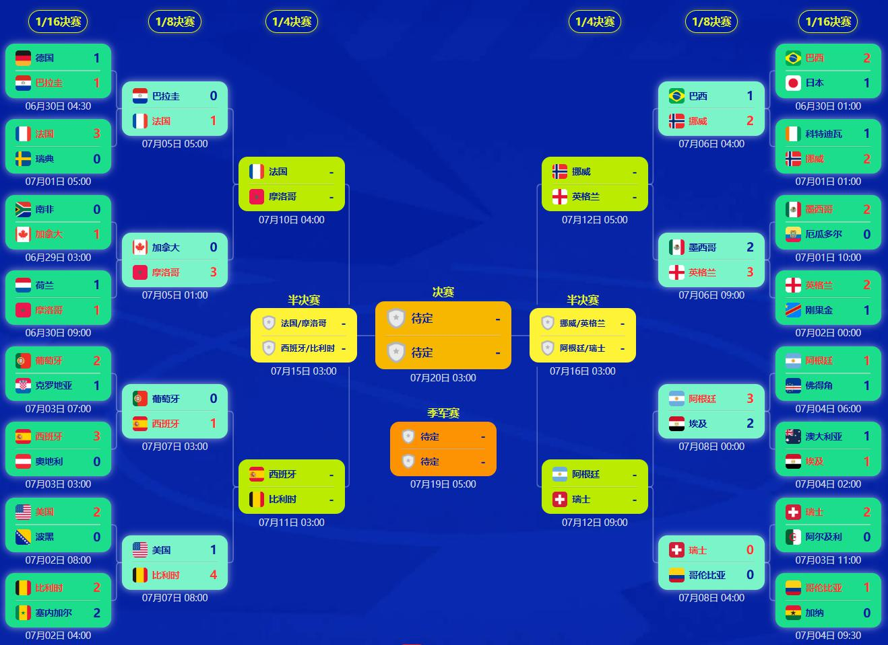

> 📊 **数据更新至**：2026年7月20日 | 🏆 **赛事阶段**：世界杯完美收官！西班牙1-0阿根廷夺队史第二冠，梅西谢幕！
>
> 🏆 **世界杯大结局！** 西班牙1-0加时胜阿根廷，队史第二冠！费兰106分钟制胜，恩佐染红，梅西谢幕！英格兰6-4法国获季军，萨卡帽子戏法！本届世界杯射手王：姆巴佩10球！助攻王：奥利塞7助攻（法国）！
>
> 📱 **数据来源**：[小红书世界杯专题](https://www.xiaohongshu.com/worldcup26/fixtures) | [直播吧数据频道](https://data.zhibo8.cc/pc_main_data/)

---

  

    <button class="tab-btn active" onclick="showTab('standings')">📊 积分榜</button>
    <button class="tab-btn" onclick="showTab('schedule')">📅 赛程</button>
    <button class="tab-btn" onclick="showTab('scorers')">⚽ 射手榜</button>
    <button class="tab-btn" onclick="showTab('history')">📜 历史射手榜</button>
    <button class="tab-btn" onclick="showTab('assists')">🎯 助攻榜</button>
    <button class="tab-btn" onclick="showTab('teams')">🏆 48强最终排名</button>
  

<!-- 积分榜 -->

A组（已结束）

<table>
<tr><th>排名</th><th>球队</th><th>场次</th><th>胜</th><th>平</th><th>负</th><th>净胜球</th><th>积分</th></tr>
<tr><td>1</td><td>🇲🇽 墨西哥</td><td>3</td><td>3</td><td>0</td><td>0</td><td>+6</td><td><b>9</b> ✅</td></tr>
<tr><td>2</td><td>🇿🇦 南非</td><td>3</td><td>1</td><td>1</td><td>1</td><td>-1</td><td><b>4</b> ✅</td></tr>
<tr><td>3</td><td>🇰🇷 韩国</td><td>3</td><td>1</td><td>0</td><td>2</td><td>-1</td><td><b>3</b> ⏳</td></tr>
<tr><td>4</td><td>🇨🇿 捷克</td><td>3</td><td>0</td><td>1</td><td>2</td><td>-4</td><td><b>1</b> ❌</td></tr>
</table>

B组（已结束）

<table>
<tr><th>排名</th><th>球队</th><th>场次</th><th>胜</th><th>平</th><th>负</th><th>净胜球</th><th>积分</th></tr>
<tr><td>1</td><td>🇨🇭 瑞士</td><td>3</td><td>2</td><td>0</td><td>1</td><td>+1</td><td><b>6</b> ✅</td></tr>
<tr><td>2</td><td>🇨🇦 加拿大</td><td>3</td><td>2</td><td>0</td><td>1</td><td>+1</td><td><b>6</b> ✅</td></tr>
<tr><td>3</td><td>🇧🇦 波黑</td><td>3</td><td>1</td><td>1</td><td>1</td><td>0</td><td><b>4</b> ⏳</td></tr>
<tr><td>4</td><td>🇶🇦 卡塔尔</td><td>3</td><td>0</td><td>0</td><td>3</td><td>-3</td><td><b>0</b> ❌</td></tr>
</table>

C组（已结束）

<table>
<tr><th>排名</th><th>球队</th><th>场次</th><th>胜</th><th>平</th><th>负</th><th>净胜球</th><th>积分</th></tr>
<tr><td>1</td><td>🇧🇷 巴西</td><td>3</td><td>2</td><td>1</td><td>0</td><td>+6</td><td><b>7</b> ✅</td></tr>
<tr><td>2</td><td>🇲🇦 摩洛哥</td><td>3</td><td>2</td><td>1</td><td>0</td><td>+4</td><td><b>7</b> ✅</td></tr>
<tr><td>3</td><td>🏴󠁧󠁢󠁳󠁣󠁴󠁿 苏格兰</td><td>3</td><td>1</td><td>0</td><td>2</td><td>-3</td><td><b>3</b> ⏳</td></tr>
<tr><td>4</td><td>🇭🇹 海地</td><td>3</td><td>0</td><td>0</td><td>3</td><td>-6</td><td><b>0</b> ❌</td></tr>
</table>

D组（已结束）

<table>
<tr><th>排名</th><th>球队</th><th>场次</th><th>胜</th><th>平</th><th>负</th><th>净胜球</th><th>积分</th></tr>
<tr><td>1</td><td>🇺🇸 美国</td><td>3</td><td>2</td><td>0</td><td>1</td><td>+3</td><td><b>6</b> ✅</td></tr>
<tr><td>2</td><td>🇦🇺 澳大利亚</td><td>3</td><td>1</td><td>2</td><td>0</td><td>0</td><td><b>4</b> ✅</td></tr>
<tr><td>3</td><td>🇵🇾 巴拉圭</td><td>3</td><td>1</td><td>1</td><td>1</td><td>-2</td><td><b>4</b> ⏳</td></tr>
<tr><td>4</td><td>🇹🇷 土耳其</td><td>3</td><td>1</td><td>0</td><td>2</td><td>-3</td><td><b>3</b> ❌</td></tr>
</table>

E组（已结束）

<table>
<tr><th>排名</th><th>球队</th><th>场次</th><th>胜</th><th>平</th><th>负</th><th>净胜球</th><th>积分</th></tr>
<tr><td>1</td><td>🇩🇪 德国</td><td>3</td><td>2</td><td>0</td><td>1</td><td>+6</td><td><b>6</b> ✅</td></tr>
<tr><td>2</td><td>🇨🇮 科特迪瓦</td><td>3</td><td>2</td><td>0</td><td>1</td><td>+2</td><td><b>6</b> ✅</td></tr>
<tr><td>3</td><td>🇪🇨 厄瓜多尔</td><td>3</td><td>1</td><td>1</td><td>1</td><td>0</td><td><b>4</b> ✅</td></tr>
<tr><td>4</td><td>🇨🇼 库拉索</td><td>3</td><td>0</td><td>1</td><td>2</td><td>-8</td><td><b>1</b> ❌</td></tr>
</table>

F组（已结束）

<table>
<tr><th>排名</th><th>球队</th><th>场次</th><th>胜</th><th>平</th><th>负</th><th>净胜球</th><th>积分</th></tr>
<tr><td>1</td><td>🇳🇱 荷兰</td><td>3</td><td>3</td><td>0</td><td>0</td><td>+7</td><td><b>9</b> ✅</td></tr>
<tr><td>2</td><td>🇯🇵 日本</td><td>3</td><td>1</td><td>2</td><td>0</td><td>+4</td><td><b>5</b> ✅</td></tr>
<tr><td>3</td><td>🇸🇪 瑞典</td><td>3</td><td>1</td><td>1</td><td>1</td><td>0</td><td><b>4</b> ✅</td></tr>
<tr><td>4</td><td>🇹🇳 突尼斯</td><td>3</td><td>0</td><td>0</td><td>3</td><td>-11</td><td><b>0</b> ❌</td></tr>
</table>

G组（已结束）

<table>
<tr><th>排名</th><th>球队</th><th>场次</th><th>胜</th><th>平</th><th>负</th><th>净胜球</th><th>积分</th></tr>
<tr><td>1</td><td>🇧🇪 比利时</td><td>3</td><td>1</td><td>2</td><td>0</td><td>+4</td><td><b>5</b> ✅</td></tr>
<tr><td>2</td><td>🇪🇬 埃及</td><td>3</td><td>1</td><td>1</td><td>1</td><td>+1</td><td><b>4</b> ✅</td></tr>
<tr><td>3</td><td>🇮🇷 伊朗</td><td>3</td><td>0</td><td>2</td><td>1</td><td>0</td><td><b>2</b> ⏳</td></tr>
<tr><td>4</td><td>🇳🇿 新西兰</td><td>3</td><td>0</td><td>1</td><td>2</td><td>-5</td><td><b>1</b> ❌</td></tr>
</table>

H组（已结束）

<table>
<tr><th>排名</th><th>球队</th><th>场次</th><th>胜</th><th>平</th><th>负</th><th>净胜球</th><th>积分</th></tr>
<tr><td>1</td><td>🇪🇸 西班牙</td><td>3</td><td>2</td><td>1</td><td>0</td><td>+5</td><td><b>7</b> ✅</td></tr>
<tr><td>2</td><td>🇺🇾 乌拉圭</td><td>3</td><td>0</td><td>2</td><td>1</td><td>-1</td><td><b>3</b> ✅</td></tr>
<tr><td>3</td><td>🇨🇻 佛得角</td><td>3</td><td>0</td><td>3</td><td>0</td><td>0</td><td><b>3</b> ✅</td></tr>
<tr><td>4</td><td>🇸🇦 沙特</td><td>3</td><td>0</td><td>1</td><td>2</td><td>-4</td><td><b>1</b> ❌</td></tr>
</table>

I组（已结束）

<table>
<tr><th>排名</th><th>球队</th><th>场次</th><th>胜</th><th>平</th><th>负</th><th>净胜球</th><th>积分</th></tr>
<tr><td>1</td><td>🇫🇷 法国</td><td>3</td><td>3</td><td>0</td><td>0</td><td>+6</td><td><b>9</b> ✅</td></tr>
<tr><td>2</td><td>🇳🇴 挪威</td><td>3</td><td>2</td><td>0</td><td>1</td><td>+5</td><td><b>6</b> ✅</td></tr>
<tr><td>3</td><td>🇸🇳 塞内加尔</td><td>3</td><td>1</td><td>0</td><td>2</td><td>+2</td><td><b>3</b> ✅</td></tr>
<tr><td>4</td><td>🇮🇶 伊拉克</td><td>3</td><td>0</td><td>0</td><td>3</td><td>-11</td><td><b>0</b> ❌</td></tr>
</table>

J组（已结束）

<table>
<tr><th>排名</th><th>球队</th><th>场次</th><th>胜</th><th>平</th><th>负</th><th>净胜球</th><th>积分</th></tr>
<tr><td>1</td><td>🇦🇷 阿根廷</td><td>3</td><td>3</td><td>0</td><td>0</td><td>+8</td><td><b>9</b> ✅</td></tr>
<tr><td>2</td><td>🇦🇹 奥地利</td><td>3</td><td>1</td><td>1</td><td>1</td><td>+1</td><td><b>4</b> ✅</td></tr>
<tr><td>3</td><td>🇩🇿 阿尔及利亚</td><td>3</td><td>1</td><td>1</td><td>1</td><td>-1</td><td><b>4</b> ✅</td></tr>
<tr><td>4</td><td>🇯🇴 约旦</td><td>3</td><td>0</td><td>0</td><td>3</td><td>-8</td><td><b>0</b> ❌</td></tr>
</table>

K组（已结束）

<table>
<tr><th>排名</th><th>球队</th><th>场次</th><th>胜</th><th>平</th><th>负</th><th>净胜球</th><th>积分</th></tr>
<tr><td>1</td><td>🇨🇴 哥伦比亚</td><td>3</td><td>3</td><td>0</td><td>0</td><td>+4</td><td><b>9</b> ✅</td></tr>
<tr><td>2</td><td>🇵🇹 葡萄牙</td><td>3</td><td>1</td><td>1</td><td>1</td><td>+3</td><td><b>4</b> ✅</td></tr>
<tr><td>3</td><td>🇨🇩 刚果民主</td><td>3</td><td>1</td><td>1</td><td>1</td><td>-1</td><td><b>4</b> ✅</td></tr>
<tr><td>4</td><td>🇺🇿 乌兹别克斯坦</td><td>3</td><td>0</td><td>0</td><td>3</td><td>-9</td><td><b>0</b> ❌</td></tr>
</table>

L组（已结束）

<table>
<tr><th>排名</th><th>球队</th><th>场次</th><th>胜</th><th>平</th><th>负</th><th>净胜球</th><th>积分</th></tr>
<tr><td>1</td><td>🏴󠁧󠁢󠁥󠁮󠁧󠁿 英格兰</td><td>3</td><td>2</td><td>1</td><td>0</td><td>+3</td><td><b>7</b> ✅</td></tr>
<tr><td>2</td><td>🇬🇭 加纳</td><td>3</td><td>1</td><td>2</td><td>0</td><td>+1</td><td><b>5</b> ✅</td></tr>
<tr><td>3</td><td>🇭🇷 克罗地亚</td><td>3</td><td>1</td><td>0</td><td>2</td><td>-2</td><td><b>3</b> ⏳</td></tr>
<tr><td>4</td><td>🇵🇦 巴拿马</td><td>3</td><td>0</td><td>0</td><td>3</td><td>-3</td><td><b>0</b> ❌</td></tr>
</table>

<!-- 赛程 -->

🏆 淘汰赛赛程（1/16决赛已全部结束）

<table>
<tr><th>日期</th><th>时间</th><th>比赛</th><th>轮次</th><th>状态</th></tr>
<tr><td>6/30</td><td>01:00</td><td>🇧🇷 巴西 vs 🇯🇵 日本</td><td>1/16</td><td>2-1</td></tr>
<tr><td>6/30</td><td>04:30</td><td>🇩🇪 德国 vs 🇵🇾 巴拉圭</td><td>1/16</td><td>点球4-5</td></tr>
<tr><td>6/30</td><td>09:00</td><td>🇳🇱 荷兰 vs 🇲🇦 摩洛哥</td><td>1/16</td><td>点球3-4</td></tr>
<tr><td>7/1</td><td>01:00</td><td>🇨🇮 科特迪瓦 vs 🇳🇴 挪威</td><td>1/16</td><td>1-2</td></tr>
<tr><td>7/1</td><td>05:00</td><td>🇫🇷 法国 vs 🇸🇪 瑞典</td><td>1/16</td><td>3-0</td></tr>
<tr><td>7/1</td><td>10:00</td><td>🇲🇽 墨西哥 vs 🇪🇨 厄瓜多尔</td><td>1/16</td><td>2-0</td></tr>
<tr><td>7/2</td><td>00:00</td><td>🏴󠁧󠁢󠁥󠁮󠁧󠁿 英格兰 vs 🇨🇩 民主刚果</td><td>1/16</td><td>2-1</td></tr>
<tr><td>7/2</td><td>04:00</td><td>🇧🇪 比利时 vs 🇸🇳 塞内加尔</td><td>1/16</td><td>3-2(加时)</td></tr>
<tr><td>7/2</td><td>08:00</td><td>🇺🇸 美国 vs 🇧🇦 波黑</td><td>1/16</td><td>2-0</td></tr>
<tr><td>7/3</td><td>03:00</td><td>🇪🇸 西班牙 vs 🇦🇹 奥地利</td><td>1/16</td><td>3-0</td></tr>
<tr><td>7/3</td><td>07:00</td><td>🇵🇹 葡萄牙 vs 🇭🇷 克罗地亚</td><td>1/16</td><td>2-1(加时)</td></tr>
<tr><td>7/3</td><td>11:00</td><td>🇨🇭 瑞士 vs 🇩🇿 阿尔及利亚</td><td>1/16</td><td>2-0</td></tr>
</table>

📅 1/8决赛赛程（已全部结束）

<table>
<tr><th>日期</th><th>时间</th><th>比赛</th><th>轮次</th><th>状态</th></tr>
<tr><td>7/4</td><td>03:00</td><td>🇦🇺 澳大利亚 vs 🇪🇬 埃及</td><td>1/8</td><td>1-1(点4-2)</td></tr>
<tr><td>7/4</td><td>07:00</td><td>🇦🇷 阿根廷 vs 🇨🇻 佛得角</td><td>1/8</td><td>3-2(加时)</td></tr>
<tr><td>7/4</td><td>11:00</td><td>🇨🇴 哥伦比亚 vs 🇬🇭 加纳</td><td>1/8</td><td>1-0</td></tr>
<tr><td>7/5</td><td>03:00</td><td>🇨🇦 加拿大 vs 🇲🇦 摩洛哥</td><td>1/8</td><td>0-3</td></tr>
<tr><td>7/5</td><td>07:00</td><td>🇵🇾 巴拉圭 vs 🇫🇷 法国</td><td>1/8</td><td>0-1</td></tr>
<tr><td>7/6</td><td>03:00</td><td>🇧🇷 巴西 vs 🇳🇴 挪威</td><td>1/8</td><td>1-2</td></tr>
<tr><td>7/6</td><td>07:00</td><td>🇲🇽 墨西哥 vs 🏴󠁧󠁢󠁥󠁮󠁧󠁿 英格兰</td><td>1/8</td><td>2-3</td></tr>
<tr><td>7/7</td><td>03:00</td><td>🇵🇹 葡萄牙 vs 🇪🇸 西班牙</td><td>1/8</td><td>0-1</td></tr>
<tr><td>7/7</td><td>08:00</td><td>🇺🇸 美国 vs 🇧🇪 比利时</td><td>1/8</td><td>1-4</td></tr>
<tr><td>7/8</td><td>00:00</td><td>🇦🇷 阿根廷 vs 🇪🇬 埃及</td><td>1/8</td><td>3-2</td></tr>
<tr><td>7/8</td><td>04:00</td><td>🇨🇭 瑞士 vs 🇨🇴 哥伦比亚</td><td>1/8</td><td>0-0(点4-3)</td></tr>
</table>

🏆 1/4决赛赛程（已全部结束）

<table>
<tr><th>日期</th><th>时间</th><th>比赛</th><th>轮次</th><th>状态</th></tr>
<tr><td>7/10</td><td>04:00</td><td>🇫🇷 法国 vs 🇲🇦 摩洛哥</td><td>1/4</td><td>2-0（姆巴佩传射+失点，登贝莱贴地斩）</td></tr>
<tr><td>7/11</td><td>03:00</td><td>🇪🇸 西班牙 vs 🇧🇪 比利时</td><td>1/4</td><td>2-1（梅里诺85分钟绝杀）</td></tr>
<tr><td>7/12</td><td>05:00</td><td>🇳🇴 挪威 vs 🏴󠁧󠁢󠁥󠁮󠁧󠁿 英格兰</td><td>1/4</td><td>1-2（贝林93分钟绝杀，加时）</td></tr>
<tr><td>7/12</td><td>09:00</td><td>🇦🇷 阿根廷 vs 🇨🇭 瑞士</td><td>1/4</td><td>3-1（加时，阿尔瓦雷斯世界波+劳塔罗破门）</td></tr>
</table>

🏆 半决赛赛程（已全部结束）

<table>
<tr><th>日期</th><th>时间</th><th>比赛</th><th>轮次</th><th>状态</th></tr>
<tr><td>7/15</td><td>03:00</td><td>🇫🇷 法国 vs 🇪🇸 西班牙</td><td>半决赛</td><td>0-2（奥亚萨瓦尔点球+波罗单刀）</td></tr>
<tr><td>7/16</td><td>03:00</td><td>🏴󠁧󠁢󠁥󠁮󠁧󠁿 英格兰 vs 🇦🇷 阿根廷</td><td>半决赛</td><td>1-2（恩佐世界波+劳塔罗92分钟绝杀）</td></tr>
</table>

🏆 决赛/季军赛（已全部结束）

<table>
<tr><th>日期</th><th>时间</th><th>比赛</th><th>轮次</th><th>状态</th></tr>
<tr><td>7/19</td><td>05:00</td><td>🏴󠁧󠁢󠁥󠁮󠁧󠁿 英格兰 vs 🇫🇷 法国</td><td>季军赛</td><td>6-4（萨卡帽子戏法）</td></tr>
<tr><td>7/20</td><td>03:00</td><td>🇪🇸 西班牙 vs 🇦🇷 阿根廷</td><td>决赛</td><td>1-0（加时，费兰106分钟制胜）🏆</td></tr>
</table>

📅 小组赛赛程

<table>
<tr><th>日期</th><th>时间</th><th>比赛</th><th>组别</th><th>状态</th></tr>
<tr><td>6/11</td><td>09:00</td><td>🇲🇽 墨西哥 vs 🇿🇦 南非</td><td>A组</td><td>2-0</td></tr>
<tr><td>6/11</td><td>12:00</td><td>🇰🇷 韩国 vs 🇨🇿 捷克</td><td>A组</td><td>2-1</td></tr>
<tr><td>6/12</td><td>03:00</td><td>🇨🇦 加拿大 vs 🇧🇦 波黑</td><td>B组</td><td>1-1</td></tr>
<tr><td>6/12</td><td>06:00</td><td>🇺🇸 美国 vs 🇵🇾 巴拉圭</td><td>B组</td><td>4-1</td></tr>
<tr><td>6/13</td><td>03:00</td><td>🇶🇦 卡塔尔 vs 🇨🇭 瑞士</td><td>C组</td><td>1-1</td></tr>
<tr><td>6/13</td><td>06:00</td><td>🇧🇷 巴西 vs 🇲🇦 摩洛哥</td><td>C组</td><td>1-1</td></tr>
<tr><td>6/13</td><td>09:00</td><td>🇭🇹 海地 vs 🏴󠁧󠁢󠁳󠁣󠁴󠁿 苏格兰</td><td>C组</td><td>0-1</td></tr>
<tr><td>6/14</td><td>03:00</td><td>🇦🇺 澳大利亚 vs 🇹🇷 土耳其</td><td>D组</td><td>2-0</td></tr>
<tr><td>6/14</td><td>06:00</td><td>🇨🇮 科特迪瓦 vs 🇪🇨 厄瓜多尔</td><td>E组</td><td>1-0</td></tr>
<tr><td>6/14</td><td>09:00</td><td>🇩🇪 德国 vs 🇨🇼 库拉索</td><td>E组</td><td>7-1</td></tr>
<tr><td>6/15</td><td>03:00</td><td>🇳🇱 荷兰 vs 🇯🇵 日本</td><td>F组</td><td>2-2</td></tr>
<tr><td>6/15</td><td>06:00</td><td>🇸🇪 瑞典 vs 🇹🇳 突尼斯</td><td>F组</td><td>5-1</td></tr>
<tr><td>6/16</td><td>03:00</td><td>🇪🇸 西班牙 vs 🇨🇻 佛得角</td><td>H组</td><td>0-0</td></tr>
<tr><td>6/16</td><td>06:00</td><td>🇧🇪 比利时 vs 🇪🇬 埃及</td><td>G组</td><td>1-1</td></tr>
<tr><td>6/16</td><td>09:00</td><td>🇸🇦 沙特 vs 🇺🇾 乌拉圭</td><td>H组</td><td>1-1</td></tr>
<tr><td>6/17</td><td>00:00</td><td>🇮🇷 伊朗 vs 🇳🇿 新西兰</td><td>G组</td><td>2-2</td></tr>
<tr><td>6/17</td><td>03:00</td><td>🇫🇷 法国 vs 🇸🇳 塞内加尔</td><td>I组</td><td>3-1</td></tr>
<tr><td>6/17</td><td>06:00</td><td>🇮🇶 伊拉克 vs 🇳🇴 挪威</td><td>I组</td><td>1-4</td></tr>
<tr><td>6/17</td><td>09:00</td><td>🇦🇷 阿根廷 vs 🇩🇿 阿尔及利亚</td><td>J组</td><td>3-0</td></tr>
<tr><td>6/18</td><td>03:00</td><td>🇦🇹 奥地利 vs 🇯🇴 约旦</td><td>J组</td><td>3-1</td></tr>
<tr><td>6/18</td><td>06:00</td><td>🇵🇹 葡萄牙 vs 🇨🇩 刚果民主</td><td>K组</td><td>1-1</td></tr>
<tr><td>6/18</td><td>09:00</td><td>🏴󠁧󠁢󠁥󠁮󠁧󠁿 英格兰 vs 🇭🇷 克罗地亚</td><td>L组</td><td>4-2</td></tr>
<tr><td>6/19</td><td>00:00</td><td>🇬🇭 加纳 vs 🇵🇦 巴拿马</td><td>L组</td><td>1-0</td></tr>
<tr><td>6/19</td><td>03:00</td><td>🇺🇿 乌兹别克斯坦 vs 🇨🇴 哥伦比亚</td><td>K组</td><td>1-3</td></tr>
<tr><td>6/25</td><td>03:00</td><td>🇧🇦 波黑 vs 🇶🇦 卡塔尔</td><td>B组</td><td>3-1</td></tr>
<tr><td>6/25</td><td>03:00</td><td>🇨🇭 瑞士 vs 🇨🇦 加拿大</td><td>B组</td><td>2-1</td></tr>
<tr><td>6/25</td><td>06:00</td><td>🇧🇷 巴西 vs 🏴󠁧󠁢󠁳󠁣󠁴󠁿 苏格兰</td><td>C组</td><td>3-0</td></tr>
<tr><td>6/25</td><td>06:00</td><td>🇲🇦 摩洛哥 vs 🇭🇹 海地</td><td>C组</td><td>4-2</td></tr>
<tr><td>6/25</td><td>03:00</td><td>🇲🇽 墨西哥 vs 🇰🇷 韩国</td><td>A组</td><td>1-0</td></tr>
<tr><td>6/25</td><td>03:00</td><td>🇨🇿 捷克 vs 🇿🇦 南非</td><td>A组</td><td>0-3</td></tr>
<tr><td>6/26</td><td>04:00</td><td>🇪🇨 厄瓜多尔 vs 🇩🇪 德国</td><td>E组</td><td>2-1</td></tr>
<tr><td>6/26</td><td>04:00</td><td>🇨🇼 库拉索 vs 🇨🇮 科特迪瓦</td><td>E组</td><td>0-2</td></tr>
<tr><td>6/26</td><td>07:00</td><td>🇹🇳 突尼斯 vs 🇳🇱 荷兰</td><td>F组</td><td>1-3</td></tr>
<tr><td>6/26</td><td>07:00</td><td>🇯🇵 日本 vs 🇸🇪 瑞典</td><td>F组</td><td>1-1</td></tr>
<tr><td>6/26</td><td>10:00</td><td>🇹🇷 土耳其 vs 🇺🇸 美国</td><td>D组</td><td>3-2</td></tr>
<tr><td>6/26</td><td>10:00</td><td>🇵🇾 巴拉圭 vs 🇦🇺 澳大利亚</td><td>D组</td><td>0-0</td></tr>
<tr><td>6/27</td><td>03:00</td><td>🇧🇪 比利时 vs 🇳🇿 新西兰</td><td>G组</td><td>5-1</td></tr>
<tr><td>6/27</td><td>03:00</td><td>🇪🇬 埃及 vs 🇮🇷 伊朗</td><td>G组</td><td>1-1</td></tr>
<tr><td>6/27</td><td>08:00</td><td>🇪🇸 西班牙 vs 🇺🇾 乌拉圭</td><td>H组</td><td>1-0</td></tr>
<tr><td>6/27</td><td>08:00</td><td>🇨🇻 佛得角 vs 🇸🇦 沙特</td><td>H组</td><td>0-0</td></tr>
<tr><td>6/27</td><td>03:00</td><td>🇳🇴 挪威 vs 🇫🇷 法国</td><td>I组</td><td>1-4</td></tr>
<tr><td>6/27</td><td>03:00</td><td>🇸🇳 塞内加尔 vs 🇮🇶 伊拉克</td><td>I组</td><td>5-0</td></tr>
<tr><td>6/28</td><td>05:00</td><td>🇵🇦 巴拿马 vs 🏴󠁧󠁢󠁥󠁮󠁧󠁿 英格兰</td><td>L组</td><td>0-2</td></tr>
<tr><td>6/28</td><td>05:00</td><td>🇭🇷 克罗地亚 vs 🇬🇭 加纳</td><td>L组</td><td>2-1</td></tr>
<tr><td>6/28</td><td>07:30</td><td>🇨🇴 哥伦比亚 vs 🇵🇹 葡萄牙</td><td>K组</td><td>0-0</td></tr>
<tr><td>6/28</td><td>07:30</td><td>🇨🇩 民主刚果 vs 🇺🇿 乌兹别克斯坦</td><td>K组</td><td>3-1</td></tr>
<tr><td>6/28</td><td>10:00</td><td>🇯🇴 约旦 vs 🇦🇷 阿根廷</td><td>J组</td><td>1-3</td></tr>
<tr><td>6/28</td><td>10:00</td><td>🇩🇿 阿尔及利亚 vs 🇦🇹 奥地利</td><td>J组</td><td>3-3</td></tr>
<tr><td>6/29</td><td>03:00</td><td>🇿🇦 南非 vs 🇨🇦 加拿大</td><td>B组</td><td>0-1</td></tr>
</table>

<!-- 射手榜 -->

<table>
<tr><th>排名</th><th>球员</th><th>球队</th><th>进球</th><th>点球</th></tr>
<tr><td>🥇</td><td>姆巴佩（Mbappé）</td><td>🇫🇷 法国</td><td><b>10</b></td><td>1</td></tr>
<tr><td>🥈</td><td>梅西（Messi）</td><td>🇦🇷 阿根廷</td><td><b>8</b></td><td>0</td></tr>
<tr><td>🥉</td><td>贝林厄姆（Bellingham）</td><td>🏴󠁧󠁢󠁥󠁮󠁧󠁿 英格兰</td><td><b>7</b></td><td>0</td></tr>
<tr><td>4</td><td>哈兰德（Haaland）</td><td>🇳🇴 挪威</td><td><b>7</b></td><td>0</td></tr>
<tr><td>5</td><td>登贝莱（Dembélé）</td><td>🇫🇷 法国</td><td><b>6</b></td><td>0</td></tr>
<tr><td>6</td><td>凯恩（Kane）</td><td>🏴󠁧󠁢󠁥󠁮󠁧󠁿 英格兰</td><td><b>6</b></td><td>2</td></tr>
<tr><td>6</td><td>萨卡（Saka）</td><td>🏴󠁧󠁢󠁥󠁮󠁧󠁿 英格兰</td><td><b>6</b></td><td>1</td></tr>
<tr><td>8</td><td>奥亚萨瓦尔（Oyarzabal）</td><td>🇪🇸 西班牙</td><td><b>5</b></td><td>1</td></tr>
<tr><td>9</td><td>基尼奥内斯（Quiñones）</td><td>🇲🇽 墨西哥</td><td><b>4</b></td><td>0</td></tr>
<tr><td>10</td><td>维尼修斯（Vinícius Jr.）</td><td>🇧🇷 巴西</td><td><b>4</b></td><td>0</td></tr>
</table>

<!-- 历史射手榜 -->

📸 图片来源：直播吧 | 数据截至 2026年7月8日

<!-- 助攻榜 -->

<table>
<tr><th>排名</th><th>球员</th><th>球队</th><th>助攻</th></tr>
<tr><td>🥇</td><td>奥利塞（Olise）</td><td>🇫🇷 法国</td><td><b>7</b></td></tr>
<tr><td>🥈</td><td>梅西（Messi）</td><td>🇦🇷 阿根廷</td><td><b>4</b></td></tr>
<tr><td>🥈</td><td>姆巴佩（Mbappé）</td><td>🇫🇷 法国</td><td><b>4</b></td></tr>
<tr><td>🥈</td><td>迪亚斯（Díaz）</td><td>🇲🇦 摩洛哥</td><td><b>4</b></td></tr>
<tr><td>🥈</td><td>吉马良斯（Guimarães）</td><td>🇧🇷 巴西</td><td><b>4</b></td></tr>
<tr><td>🥈</td><td>厄德高（Ødegaard）</td><td>🇳🇴 挪威</td><td><b>4</b></td></tr>
<tr><td>7</td><td>萨卡（Saka）</td><td>🏴󠁧󠁢󠁥󠁮󠁧󠁿 英格兰</td><td><b>3</b></td></tr>
<tr><td>8</td><td>戈登（Gordon）</td><td>🏴󠁧󠁢󠁥󠁮󠁧󠁿 英格兰</td><td><b>3</b></td></tr>
<tr><td>9</td><td>谢尔德鲁普（Schjelderup）</td><td>🇳🇴 挪威</td><td><b>3</b></td></tr>
<tr><td>10</td><td>阿尔瓦拉多（Alvarado）</td><td>🇲🇽 墨西哥</td><td><b>3</b></td></tr>
</table>

<!-- 48强最终排名 -->

🏆 世界杯最终排名（第1-48名）

<table>
<tr><th>排名</th><th>球队</th><th>战绩</th><th>积分</th><th>进球</th><th>失球</th><th>净胜球</th><th>备注</th></tr>
<tr><td>🥇 1</td><td>🇪🇸 西班牙</td><td>6胜1平</td><td><b>19</b></td><td>13</td><td>2</td><td>+11</td><td>🏆 冠军</td></tr>
<tr><td>🥈 2</td><td>🇦🇷 阿根廷</td><td>5胜1平1负</td><td><b>16</b></td><td>15</td><td>8</td><td>+7</td><td>🥈 亚军</td></tr>
<tr><td>🥉 3</td><td>🏴󠁧󠁢󠁥󠁮󠁧󠁿 英格兰</td><td>5胜1平1负</td><td><b>16</b></td><td>16</td><td>7</td><td>+9</td><td>🥉 季军</td></tr>
<tr><td>4</td><td>🇫🇷 法国</td><td>5胜2负</td><td><b>15</b></td><td>15</td><td>6</td><td>+9</td><td>殿军</td></tr>
<tr><td>5</td><td>🇳🇴 挪威</td><td>4胜2负</td><td><b>12</b></td><td>13</td><td>11</td><td>+2</td><td>—</td></tr>
<tr><td>6</td><td>🇧🇪 比利时</td><td>3胜2平1负</td><td><b>11</b></td><td>14</td><td>7</td><td>+7</td><td>—</td></tr>
<tr><td>7</td><td>🇲🇦 摩洛哥</td><td>3胜2平1负</td><td><b>11</b></td><td>10</td><td>6</td><td>+4</td><td>纪律分-7（7黄）</td></tr>
<tr><td>8</td><td>🇨🇭 瑞士</td><td>3胜2平1负</td><td><b>11</b></td><td>10</td><td>6</td><td>+4</td><td>纪律分-9（6黄、2黄变1红）</td></tr>
<tr><td>9</td><td>🇲🇽 墨西哥</td><td>4胜1负</td><td><b>12</b></td><td>10</td><td>3</td><td>+7</td><td>—</td></tr>
<tr><td>10</td><td>🇨🇴 哥伦比亚</td><td>3胜2平</td><td><b>11</b></td><td>5</td><td>1</td><td>+4</td><td>—</td></tr>
<tr><td>11</td><td>🇧🇷 巴西</td><td>3胜1平1负</td><td><b>10</b></td><td>10</td><td>4</td><td>+6</td><td>—</td></tr>
<tr><td>12</td><td>🇺🇸 美国</td><td>3胜2负</td><td><b>9</b></td><td>11</td><td>8</td><td>+3</td><td>—</td></tr>
<tr><td>13</td><td>🇵🇹 葡萄牙</td><td>2胜2平1负</td><td><b>8</b></td><td>8</td><td>3</td><td>+5</td><td>—</td></tr>
<tr><td>14</td><td>🇨🇦 加拿大</td><td>2胜1平2负</td><td><b>7</b></td><td>9</td><td>6</td><td>+3</td><td>—</td></tr>
<tr><td>15</td><td>🇪🇬 埃及</td><td>1胜3平1负</td><td><b>6</b></td><td>8</td><td>7</td><td>+1</td><td>—</td></tr>
<tr><td>16</td><td>🇵🇾 巴拉圭</td><td>1胜2平2负</td><td><b>5</b></td><td>3</td><td>6</td><td>-3</td><td>—</td></tr>
<tr><td>17</td><td>🇳🇱 荷兰</td><td>2胜2平</td><td><b>8</b></td><td>11</td><td>5</td><td>+6</td><td>—</td></tr>
<tr><td>18</td><td>🇩🇪 德国</td><td>2胜1平1负</td><td><b>7</b></td><td>11</td><td>5</td><td>+6</td><td>—</td></tr>
<tr><td>19</td><td>🇨🇮 科特迪瓦</td><td>2胜2负</td><td><b>6</b></td><td>5</td><td>4</td><td>+1</td><td>—</td></tr>
<tr><td>20</td><td>🇭🇷 克罗地亚</td><td>2胜2负</td><td><b>6</b></td><td>6</td><td>7</td><td>-1</td><td>—</td></tr>
<tr><td>21</td><td>🇯🇵 日本</td><td>1胜2平1负</td><td><b>5</b></td><td>8</td><td>5</td><td>+3</td><td>—</td></tr>
<tr><td>22</td><td>🇦🇺 澳大利亚</td><td>1胜2平1负</td><td><b>5</b></td><td>3</td><td>3</td><td>0</td><td>—</td></tr>
<tr><td>23</td><td>🇨🇩 民主刚果</td><td>1胜1平2负</td><td><b>4</b></td><td>5</td><td>5</td><td>0</td><td>—</td></tr>
<tr><td>24</td><td>🇬🇭 加纳</td><td>1胜1平2负</td><td><b>4</b></td><td>2</td><td>3</td><td>-1</td><td>—</td></tr>
<tr><td>25</td><td>🇪🇨 厄瓜多尔</td><td>1胜1平2负</td><td><b>4</b></td><td>2</td><td>4</td><td>-2</td><td>纪律分-12（1红+8黄）</td></tr>
<tr><td>26</td><td>🇿🇦 南非</td><td>1胜1平2负</td><td><b>4</b></td><td>2</td><td>4</td><td>-2</td><td>纪律分-13（2红+5黄）</td></tr>
<tr><td>27</td><td>🇸🇪 瑞典</td><td>1胜1平2负</td><td><b>4</b></td><td>7</td><td>10</td><td>-3</td><td>—</td></tr>
<tr><td>28</td><td>🇦🇹 奥地利</td><td>1胜1平2负</td><td><b>4</b></td><td>6</td><td>9</td><td>-3</td><td>—</td></tr>
<tr><td>29</td><td>🇧🇦 波黑</td><td>1胜1平2负</td><td><b>4</b></td><td>5</td><td>8</td><td>-3</td><td>—</td></tr>
<tr><td>30</td><td>🇩🇿 阿尔及利亚</td><td>1胜1平2负</td><td><b>4</b></td><td>5</td><td>9</td><td>-4</td><td>—</td></tr>
<tr><td>31</td><td>🇸🇳 塞内加尔</td><td>1胜3负</td><td><b>3</b></td><td>10</td><td>9</td><td>+1</td><td>—</td></tr>
<tr><td>32</td><td>🇨🇻 佛得角</td><td>3平1负</td><td><b>3</b></td><td>4</td><td>5</td><td>-1</td><td>—</td></tr>
<tr><td>33</td><td>🇮🇷 伊朗</td><td>3平</td><td><b>3</b></td><td>3</td><td>3</td><td>0</td><td>—</td></tr>
<tr><td>34</td><td>🇰🇷 韩国</td><td>1胜2负</td><td><b>3</b></td><td>2</td><td>3</td><td>-1</td><td>—</td></tr>
<tr><td>35</td><td>🇹🇷 土耳其</td><td>1胜2负</td><td><b>3</b></td><td>3</td><td>5</td><td>-2</td><td>—</td></tr>
<tr><td>36</td><td>🏴󠁧󠁢󠁳󠁣󠁴󠁿 苏格兰</td><td>1胜2负</td><td><b>3</b></td><td>1</td><td>4</td><td>-3</td><td>—</td></tr>
<tr><td>37</td><td>🇺🇾 乌拉圭</td><td>2平1负</td><td><b>2</b></td><td>3</td><td>4</td><td>-1</td><td>—</td></tr>
<tr><td>38</td><td>🇸🇦 沙特</td><td>2平1负</td><td><b>2</b></td><td>1</td><td>5</td><td>-4</td><td>—</td></tr>
<tr><td>39</td><td>🇨🇿 捷克</td><td>1平2负</td><td><b>1</b></td><td>2</td><td>6</td><td>-4</td><td>—</td></tr>
<tr><td>40</td><td>🇳🇿 新西兰</td><td>1平2负</td><td><b>1</b></td><td>4</td><td>10</td><td>-6</td><td>—</td></tr>
<tr><td>41</td><td>🇶🇦 卡塔尔</td><td>1平2负</td><td><b>1</b></td><td>2</td><td>10</td><td>-8</td><td>—</td></tr>
<tr><td>42</td><td>🇨🇼 库拉索</td><td>1平2负</td><td><b>1</b></td><td>1</td><td>9</td><td>-8</td><td>—</td></tr>
<tr><td>43</td><td>🇵🇦 巴拿马</td><td>3负</td><td><b>0</b></td><td>0</td><td>4</td><td>-4</td><td>—</td></tr>
<tr><td>44</td><td>🇯🇴 约旦</td><td>3负</td><td><b>0</b></td><td>3</td><td>8</td><td>-5</td><td>—</td></tr>
<tr><td>45</td><td>🇭🇹 海地</td><td>3负</td><td><b>0</b></td><td>2</td><td>8</td><td>-6</td><td>—</td></tr>
<tr><td>46</td><td>🇺🇿 乌兹别克斯坦</td><td>3负</td><td><b>0</b></td><td>2</td><td>11</td><td>-9</td><td>—</td></tr>
<tr><td>47</td><td>🇹🇳 突尼斯</td><td>3负</td><td><b>0</b></td><td>2</td><td>12</td><td>-10</td><td>—</td></tr>
<tr><td>48</td><td>🇮🇶 伊拉克</td><td>3负</td><td><b>0</b></td><td>1</td><td>12</td><td>-11</td><td>—</td></tr>
</table>

📊 数据来源：足球报

---

> 🔗 **返回专题主页**：[2026 FIFA 世界杯专题](https://anfinsenyu.github.io/Anfinsen-s-Blog/posts/fifa/)

**AnfinsenYu** | 2026年7月20日
