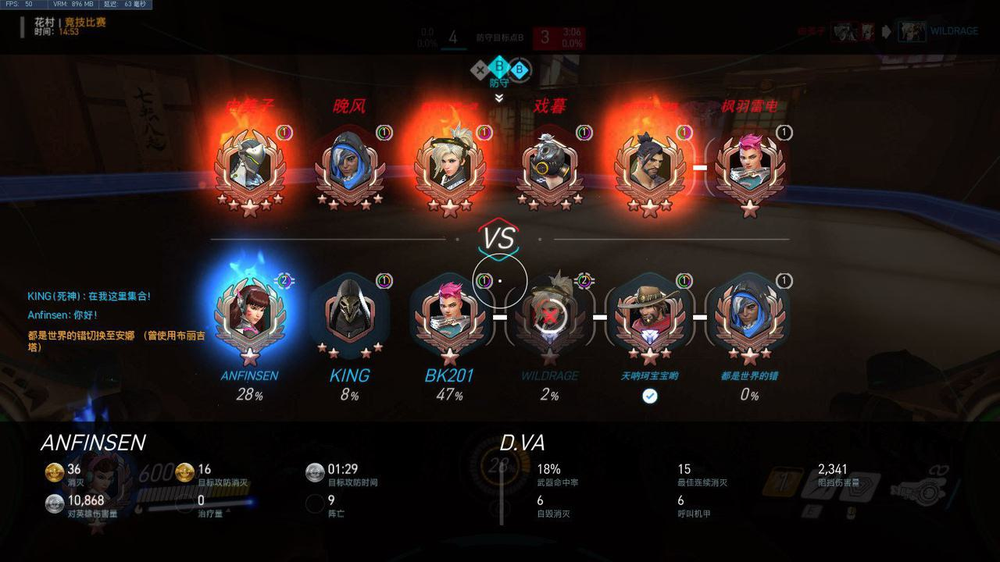
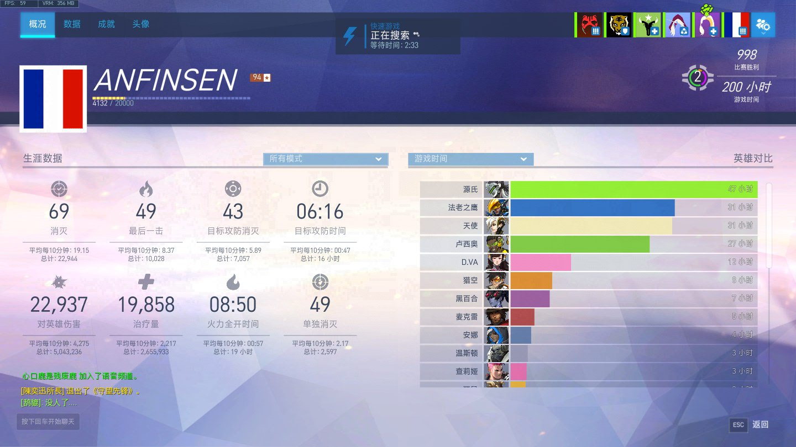
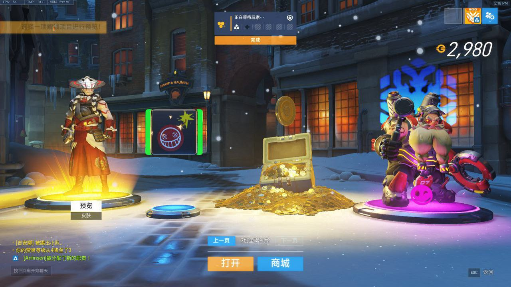
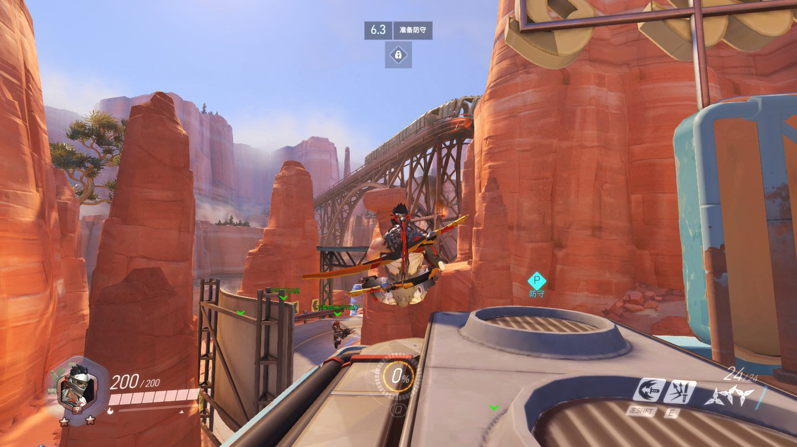
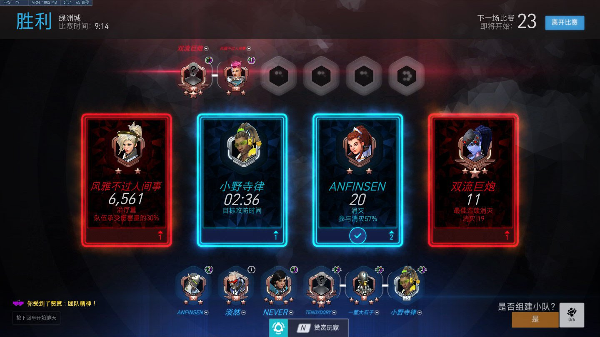
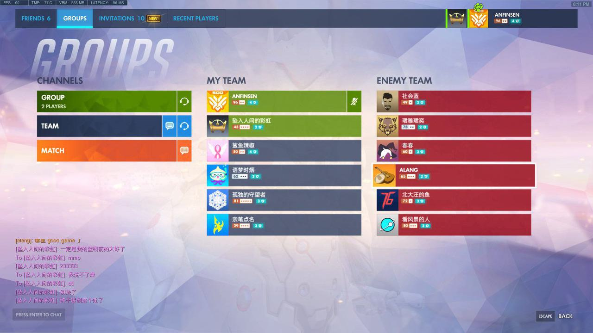
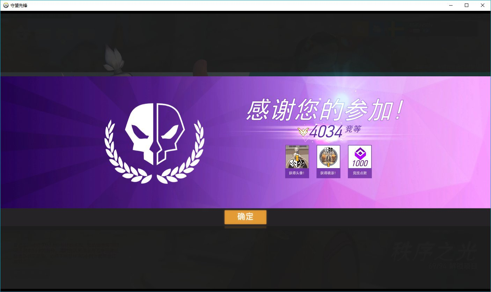
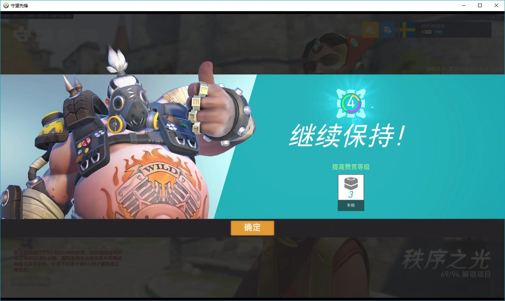

# 种子开始发芽：2018，中考年的疯狂与热爱

> 守望先锋十年回忆录 · 第二篇

---

## 中考前：偷摸玩

2018年我初三，紧张的一年，备战中考。

但我已经上瘾了。

晚上趁着爸妈出去散步，借口说要搜学习资料，偷偷开几把人机。作业要么写到很晚，要么一大早爬起来赶。现在想想真的是"上瘾了哈哈哈"。

那年还出了**粉红天使慈善皮肤**，临近中考的某天，我又偷偷买了两张手机充值卡，加上之前的余额凑够 98 块，支持了一波慈善活动。虽然亚服后来返厂过这个活动，但因为国服关闭的原因我没能赶上，所以我的粉红天使**依旧是稀有的**——而且还有特殊音效和特效，我很钟意。

翻看 2018 年的截图，一共 36 张——不算多，但每一张都是那个紧张又快乐的年份的痕迹。截图画质、UI 和现在都不一样，回看特别有年代感。

当时账号 94 级，998 场胜利，200 小时游戏时间。英雄时间里源氏遥遥领先 65 小时——果然是源氏入坑。

努巴尼也还在投：

- **2018年1月18日**：具体素材不详
- **2018年4月6日**：连投两条——卢西奥地形开大招死神、卢西奥搞笑地形
- **2018年8月6日**：卢西奥DJ+1杀+搞笑（标注"超级搞笑"）

---

## 中考后：全面爆发

中考完回家，第一件事就是**把爸妈房间的电脑搬到我房间来**。

然后跟我妈说要升级显卡。兴冲冲在网上买了一张 GTX 1060，到货发现**我家电脑是小机箱，塞不下正常大小的显卡，得买刀卡**。准备退货的时候发现店家在我家不远的地方，我就自己去线下退货了，顺便在附近找到另一家有卖刀卡的店铺，大概 750 块。

买完兴冲冲回家安装，打上驱动。游戏画面和帧数来到**惊人的 60 帧**，虽然不稳定，打起来也就四五十，但对当时的我来说是不小的提升。后面源玩得越来越好，三杀四杀信手拈来哈哈哈，从早玩到晚。

**中考成绩：666 分。** 被高中录取后，我开始了疯狂的暑假。

花村竞技，D.Va 36 消灭，那时候的 UI 特别有年代感。

---

### 3v3 死斗：第一个 500 强

那时候出了一个 **3v3 死斗的竞技模式**，还有**动感斗球**，我就猛猛玩这俩模式。

3v3 打满 50 场次（上 500 强的要求之一，第二个要求是最低钻石分段）。打 3v3 的时候认识了一个读高三的队友 **Necros**，也是玩源的大师——他是真牛，敢中午溜出学校，下午逃体育课，在网吧跟我打。

我打到了钻石，完成了 50 个场次，顺利留榜 **500 强**！不过是 钻石 500 强。当时拿到专属头像特别高兴，因为那是我**第一个 500 强**。拿着 500 强头像到处炫耀装 X，现在觉得好尬 lol。

组队界面左上角的 500 强图标，当时可是我的骄傲。和"坠入人间的彩虹"号一起打。

---

### 动感斗球：足球队的快乐

动感斗球我也沉迷了——因为自己是学校足球队的，很喜欢踢球。斗球打到大师 3700 左右，摸到了 500 强榜，有小闪电。当时感觉特别帅，可惜后来分太低了，没成功留榜。

---

### 买号：坠入人间的彩虹

当时还花 100 块买了一个账号——**"坠入人间的彩虹"**，有源的暗影守望皮肤（当时好像是国王行动限定的皮肤，大号没有），还有源和半藏的金武器。这个号现在还能用。

---

### 带朋友入坑

暑假的时候 **LRC** 和 **PJW** 来我家玩，然后**卢被我带入坑了**。他回家后买了暗影精灵（好像是），也买了个号，和我一起玩。刚开始我借他"坠入人间的彩虹"号，后面他才自己买了一个号哈哈哈哈。不过现在他在美国上学，很少玩了。

整个暑假基本没断过游戏，除了去军训还有去上海送姐姐上大学。

圣诞节活动开箱，攒了 2980 金币，买了禅雅塔和路霸的圣诞皮肤。

📺 暑假精彩集锦（点击展开）

- [精彩镜头 2018.11.25](https://www.bilibili.com/video/BV1yt411y7Ki/)
- [亮眼表现 P1](https://v.youku.com/v_show/id_XMzczNTQwNzAzMg==.html?playMode=pugv)
- [P1——源氏篇](https://v.youku.com/v_show/id_XMzc3MDY1MDE1Mg==.html?playMode=pugv)
- [P2——源氏篇](https://v.youku.com/v_show/id_XMzc3MTU2MDM5Ng==.html?playMode=pugv)

---

## 高中开学：寄宿生活

然后就开学了。因为高中是寄宿学校，所以只有**周末能回家**玩游戏。

从早玩到晚的日子结束了，但守望先锋已经成了生活的一部分。

赛季结束，4034 竞等，拿到 1000 竞技点——那时候的竞技点可比现在难攒多了。

---

## 📸 2018 截图精选

---

## 2018 大事记

| 时间 | 事件 |
|------|------|
| 2018年中考前 | 偷偷玩游戏，买粉红天使慈善皮肤（98元） |
| 2018年中考 | 成绩 666 分 |
| 2018年暑假 | 升级 GTX 1060 刀卡，帧数提升到 60 |
| 2018年暑假 | 3v3 死斗打到钻石 500 强（第一个500强） |
| 2018年暑假 | 动感斗球大师 3700，摸到百强榜 |
| 2018年暑假 | 花 100 块买号"坠入人间的彩虹" |
| 2018年暑假 | 带 LRC、PJW 入坑 |
| 2018年11月25日 | 剪辑精彩镜头视频投稿 B 站 |

---

> **上一篇**：2016-2017 — 种子悄然种下
>
> **下一篇预告**：2019 — 入坑高峰年，434张截图的故事。
>
> *中考年的疯狂，让守望先锋这颗种子彻底生根发芽。*
