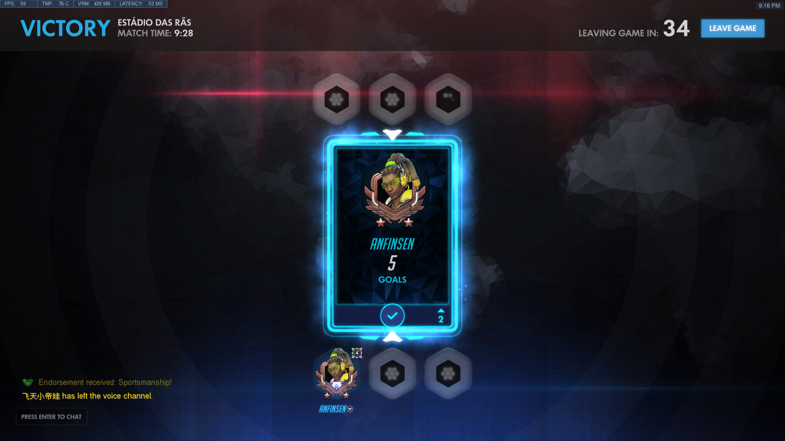
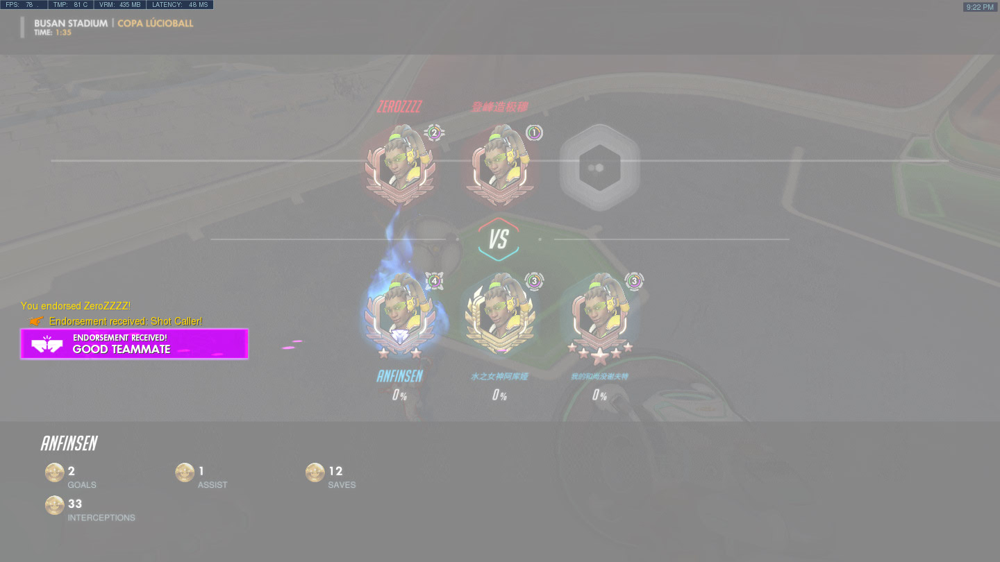
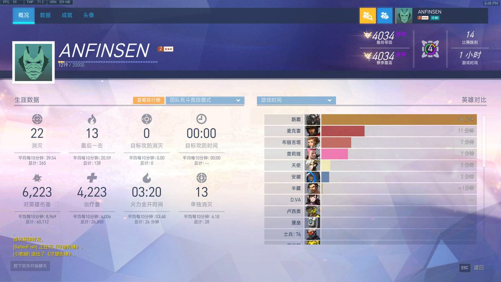
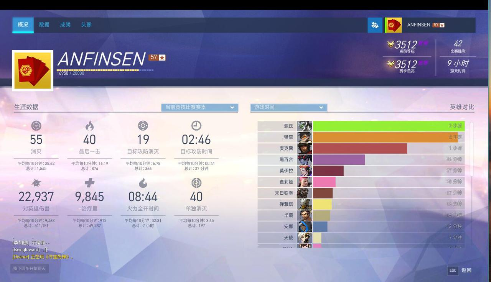
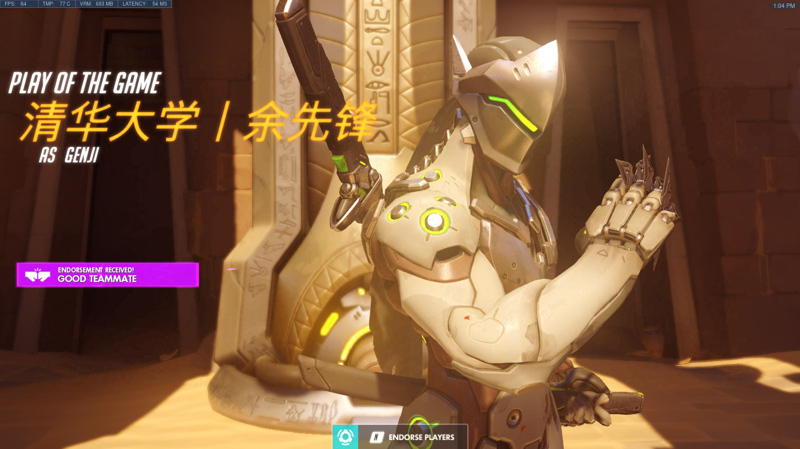
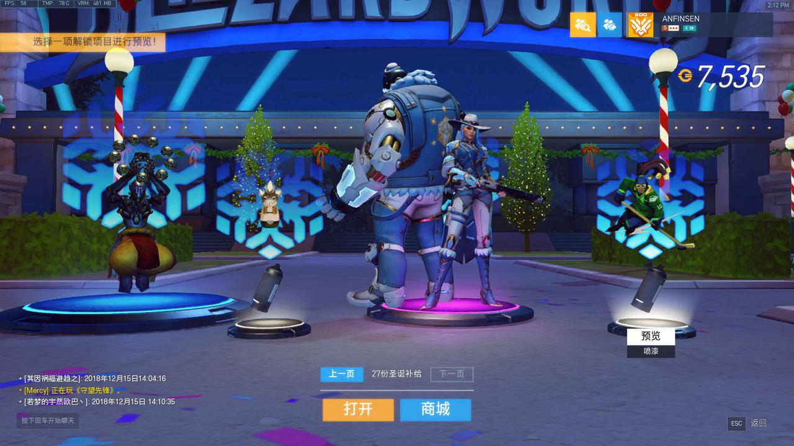
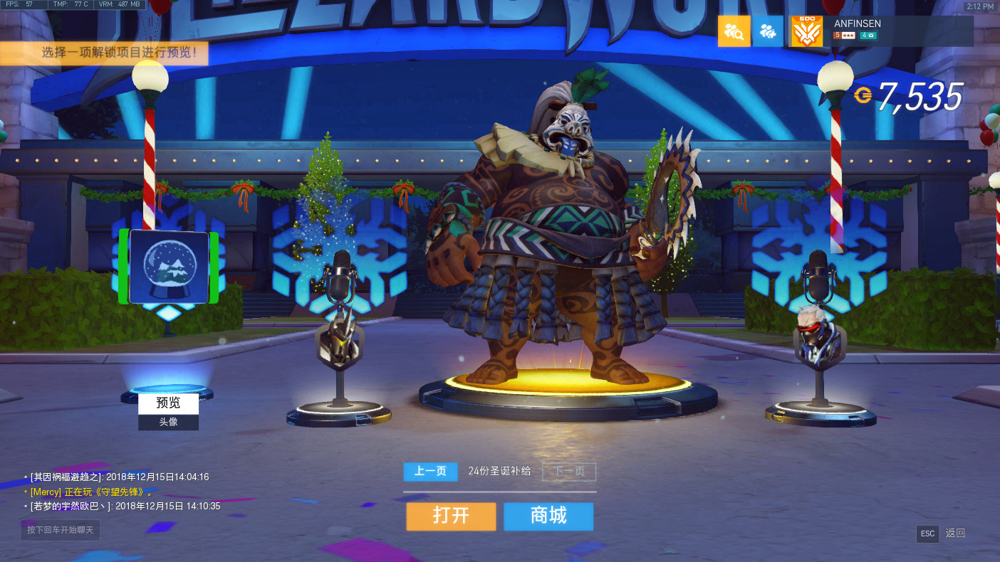
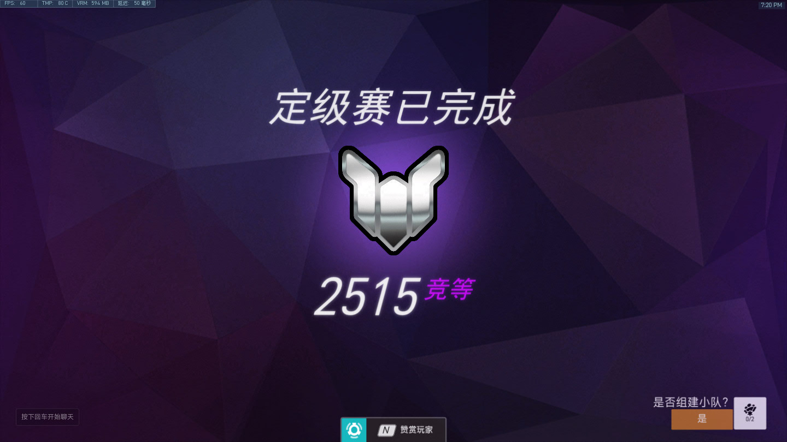

# 种子开始发芽：2018，中考年的疯狂与热爱

> 守望先锋十年回忆录 · 第二篇

---

## 中考前：偷摸玩

2018年我初三，紧张的一年，备战中考。

但我已经上瘾了。

晚上趁着爸妈出去散步，借口说要搜学习资料，偷偷开几把人机。作业要么写到很晚，要么一大早爬起来赶。现在想想真的是"上瘾了哈哈哈"。

那年还出了**粉红天使慈善皮肤**，临近中考的某天，我又偷偷买了两张手机充值卡，加上之前的余额凑够 98 块，支持了一波慈善活动。虽然亚服后来返厂过这个活动，但因为国服关闭的原因我没能赶上，所以我的粉红天使**依旧是稀有的**——而且还有特殊音效和特效，我很钟意。

翻看 2018 年的截图，一共 36 张——不算多，但每一张都是那个紧张又快乐的年份的痕迹。截图画质、UI 和现在都不一样，回看特别有年代感。

那时候还有**防沉迷系统**，每天只有 3 小时有经验——截图里左下角那个提醒现在看着特别怀旧。

---

## 中考后：全面爆发

中考完回家，第一件事就是**把爸妈房间的电脑搬到我房间来**。

然后跟我妈说要升级显卡。兴冲冲在网上买了一张 GTX 1060，到货发现**我家电脑是小机箱，塞不下正常大小的显卡，得买刀卡**。准备退货的时候发现店家在我家不远的地方，我就自己去线下退货了，顺便在附近找到另一家有卖刀卡的店铺，大概 750 块。

买完兴冲冲回家安装，打上驱动。游戏画面和帧数来到**惊人的 60 帧**，虽然不稳定，打起来也就四五十，但对当时的我来说是不小的提升。后面源玩得越来越好，三杀四杀信手拈来哈哈哈，从早玩到晚。

**中考成绩：666 分。** 被高中录取后，我开始了疯狂的暑假。

---

### 里程碑：1000胜

7月1日那天，我连着截了三张图——**998胜、999胜、1000胜**，刚好凑满 200 小时。

---

### 3v3 五百强：第一个500强

7月10日，3v3 打到了**五百强榜单第 177 名**，致敬 LF177 选手。

3v3 打满 50 场次（上 500 强的要求之一，第二个要求是最低钻石分段）。打 3v3 的时候认识了一个读高三的队友 **Necros**，也是玩源的大师——他是真牛，敢中午溜出学校，下午逃体育课，在网吧跟我打。

我打到了钻石，完成了 50 个场次，顺利留榜 **500 强**！不过是 钻石 500 强。当时拿到专属头像特别高兴，因为那是我**第一个 500 强**。拿着 500 强头像到处炫耀装 X，现在觉得好尬 lol。

和 LRC 双排，右上角 ANFINSEN 的 500 强头像，当时可是我炫耀的资本。

---

### 夏季运动会

8月的夏季运动会出了好东西：箱子开出**黑百合美丽的金皮肤**，还开出过**罕见的双金**。

最离谱的是**卢西奥打碟表情**——当时商城 bug，90 块买了，后来退了 100 联赛代币（ 相当于退了 30 块）。那个表情后来不卖了，当时很稀有。

---

### 动感斗球：足球队的快乐

动感斗球我也沉迷了——因为自己是学校足球队的，很喜欢踢球。斗球打到大师 3700 左右，摸到了 500 强榜，有小闪电。当时感觉特别帅，可惜后来分太低了，没成功留榜。

---

### 源氏与各种金皮

那年源玩得越来越好，炫酷的斩杀截图不少。还练了和尚 carry、防空源打法（消灭天上的法老之鹰）。

大号也终于有了**暗影守望者皮肤**——之前就是因为大号没有，才斥巨资买了"坠入人间的彩虹"号。

---

### 买号：坠入人间的彩虹

当时还花 100 块买了一个账号——**"坠入人间的彩虹"**，有源的暗影守望皮肤（当时好像是国王行动限定的皮肤，大号没有），还有源和半藏的金武器。这个号现在还能用。

黄金段位路人 6 排，我 4 金数据最高。大号定级 D.Va carry 钻石队友，结算还赢了。

---

### 死斗定级：第一个宗师

11月10日，**死斗定级宗师**——那是我**第一个上宗师的位置**！

4034 竞等——打团队死斗竞技模式，定级赛定到宗师。拿到 1000 竞技点——那时候的竞技点可比现在难攒多了。

---

### 生涯首次：大师段位

同年，竞技比赛也打到了**大师段位 3512 SR**——这是我生涯首次达到大师。

42场胜利，9小时游戏时间，源氏是绝对主力。从黄金到钻石再到大师，这一年的成长是实打实的。

---

### 带朋友入坑

暑假的时候 **LRC** 和 **PJW** 来我家玩，然后**卢被我带入坑了**。他回家后买了暗影精灵（好像是），也买了个号，和我一起玩。刚开始我借他"坠入人间的彩虹"号，后面他才自己买了一个号哈哈哈哈。不过现在他在美国上学，很少玩了。

10月1日国庆还和 LRC 双排了一波。那时候加我好友的人"多如牛毛"，说明我很厉害（自恋了）。还创了个小号叫**"清华大学 余先锋"**，挺中二的哈哈。

整个暑假基本没断过游戏，除了去军训还有去上海送姐姐上大学。

📺 暑假精彩集锦（点击展开）

- [精彩镜头 2018.11.25](https://www.bilibili.com/video/BV1yt411y7Ki/)
- [亮眼表现 P1](https://v.youku.com/v_show/id_XMzczNTQwNzAzMg==.html?playMode=pugv)
- [P1——源氏篇](https://v.youku.com/v_show/id_XMzc3MDY1MDE1Mg==.html?playMode=pugv)
- [P2——源氏篇](https://v.youku.com/v_show/id_XMzc3MTU2MDM5Ng==.html?playMode=pugv)

---

## 高中开学：寄宿生活

然后就开学了。因为高中是寄宿学校，所以只有**周末能回家**玩游戏。

从早玩到晚的日子结束了，但守望先锋已经成了生活的一部分。

---

## 年底收官

### 圣诞节与年末

圣诞节活动开出艾什的皮肤、路霸金皮。年末"坠入人间的彩虹"号竞技定级 2515 白金，还开出过双金。

---

那一年从黄金到钻石，从 500 强到宗师，从人机菜鸟到能 carry 钻石队友——**2018 年，是真的在成长。**

---

## 💰 2018 战网消费记录

> 账号：ANFINSEN，数据来源：战网消费记录页面

| 日期 | 类型 | 内容 | 金额 |
|------|------|------|------|
| 2018-02-09 | 🎆 春节补给 | 60货币（24份） | ¥120 |
| 2018-02-09 | 🎆 春节补给 | 30货币（11份） | ¥60 |
| 2018-02-10 | 🎆 春节补给 | 30货币（11份） | ¥60 |
| 2018-02-10 | 🎆 春节补给 | 5货币（2份） | ¥12 |
| 2018-02-10 | 🎆 春节补给 | 5货币（2份） | ¥12 |
| 2018-02-11 | 🎆 春节补给 | 5货币（2份） | ¥12 |
| 2018-02-20 | 🎆 春节补给 | 15货币（5份） | ¥30 |
| 2018-02-20 | 🎆 春节补给 | 15货币（5份） | ¥30 |
| 2018-04-13 | ⚔️ 行动补给 | 30货币（11份） | ¥60 |
| 2018-04-13 | ⚔️ 行动补给 | 15货币（5份） | ¥30 |
| 2018-04-23 | ⚔️ 行动补给 | 5货币（2份） | ¥0 |
| 2018-04-24 | ⚔️ 行动补给 | 5货币（2份） | ¥0 |
| 2018-05-10 | 👼 粉红天使 | 慈善皮肤 | ¥98 |
| 2018-05-24 | 🎮 周年补给 | 60货币（24份） | ¥120 |
| 2018-05-25 | 🎮 周年补给 | 30货币（11份） | ¥60 |
| 2018-08-10 | 🏃 夏季运动会 | 60货币（24份） | ¥120 |
| 2018-08-10 | 🏃 夏季运动会 | 30货币（11份） | ¥60 |
| 2018-08-10 | 🏃 夏季运动会 | 15货币（5份） | ¥30 |
| 2018-08-10 |  联赛代币 | 400枚 | ¥120 |
| 2018-08-18 |  联赛代币 | 200枚 | ¥60 |
| 2018-10-13 | 🎃 万圣节补给 | 60货币（24份） | ¥120 |
| 2018-12-15 | 🎄 圣诞补给 | 60货币（24份） | ¥120 |
| **2018年合计** | | | **¥1,302** |

### 消费亮点

- **粉红天使慈善皮肤**（5月10日）：中考前偷偷买了两张手机充值卡，凑够 98 块支持慈善活动
- **夏季运动会**（8月10日）：一天买了3波夏季补给+联赛代币，共 ¥330，开出黑百合金皮肤、双金
- **活动补给全覆盖**：春节→行动→周年→夏季→万圣节→圣诞，每个活动都氪了
- **联赛代币**：8月买了两波共600枚联赛代币，开始关注 OWL 联赛

---

## 2018 大事记

| 时间 | 事件 |
|------|------|
| 2018年中考前 | 偷偷玩游戏，买粉红天使慈善皮肤（98元） |
| 2018年中考 | 成绩 666 分 |
| 2018年暑假 | 升级 GTX 1060 刀卡，帧数提升到 60 |
| 2018年7月1日 | 里程碑：1000胜，200小时 |
| 2018年7月10日 | 3v3 死斗打到**五百强第177名**（第一个500强） |
| 2018年8月 | 夏季运动会：黑百合金皮肤、双金 |
| 2018年暑假 | 动感斗球大师 3700，摸到百强榜 |
| 2018年暑假 | 花 100 块买号"坠入人间的彩虹" |
| 2018年暑假 | 带 LRC、PJW 入坑 |
| 2018年10月1日 | 国庆和LRC双排，创小号"清华大学 余先锋" |
| 2018年11月10日 | 死斗定级赛打到**宗师 4034**（第一个宗师） |
| 2018年 | 竞技比赛打到**大师段位 3512 SR**（生涯首次） |
| 2018年11月25日 | 剪辑精彩镜头视频投稿 B 站 |
| 2018年12月15日 | 圣诞活动：艾什皮肤、路霸金皮 |
| 2018年12月30日 | "坠入人间的彩虹"号竞技定级 2515 白金 |
| 2018年12月31日 | 赛季结算 4034 竞等，拿到 1000 竞技点 |

---

> **上一篇**：2016-2017 — 种子悄然种下
>
> **下一篇预告**：2019 — 入坑高峰年，434张截图的故事。
>
> *中考年的疯狂，让守望先锋这颗种子彻底生根发芽。*
