# 入坑高峰年：2019，OWL巅峰与广州线下观赛

> 守望先锋十年回忆录 · 第三篇

---

## 学校里的o瘾少年

2019年，高一。

OWL（守望先锋联赛）特别火爆，我在学校瘾犯了怎么办呢？——**不交手机**。

晚上、体育课、自习课、放学的时候，找个地方偷偷看比赛。厕所、没人的实验室、教室……哪里能躲去哪里。上课还有平板，偷偷越狱看 B 站直播。

那时候学业负担比较重，只有周末和假日可以大 o 特 o。有一次 o 上瘾了玩到凌晨两三点，被我爸发现了，推门进来骂我哈哈哈。

确实离谱了，玩太晚。因为我的房间就在客厅旁边，门那里可以看到房间里的灯光——**灯光出卖了我**。

2019年初的釜山，D.Va 还是我的主力英雄。

---

## 广州城市巡礼：第一次线下观赛

**2019年6月7日**，守望先锋城市巡礼登陆广州！

活动地点在广州高德置地冬广场中庭。现场可以免费试玩、参加互动和水友赛，还能看 OWL 实时比赛——广州冲锋队 VS 成都猎人队、洛杉矶英勇队 VS 上海龙之队。

那是我**第一次参加线下观赛活动**。

那天没怎么睡，一大早就出发了。当时 OWL 人气真的很高，很早就有人在排队了，还好我去得早，顺利抢到了座位。见到了**赤小兔、大牙、织田**三位解说。

因为怕离开座位位置会被别人坐了，而且我是一个人去看的，所以**从早坐到晚**，等看完广州冲锋队的比赛才去吃的晚饭，饿死俺了。比赛结束赤小兔还和 OYL、艾琳打了微信视频通话，因为艾琳在美国打的比赛，所以通话很卡。

那天还领了很多周边，现在还在我家放着。总之特别开心。

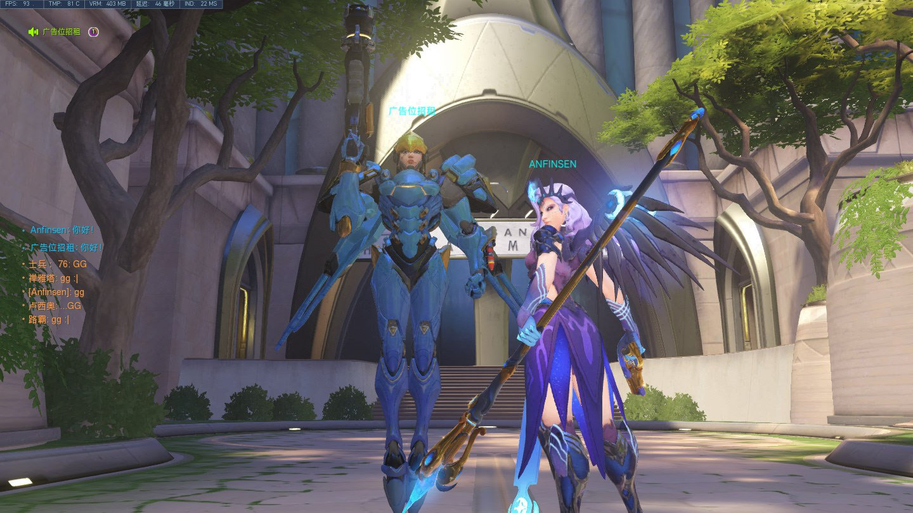

城市巡礼当天晚上回家打的，和路人合影——紫色天使皮肤。

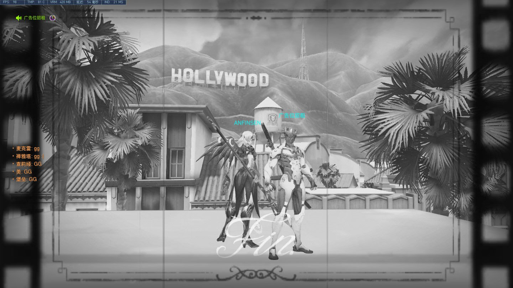

好莱坞地图胜利，ANFINSEN 和队友的合影。那天线下看完比赛，回家又打了一晚上。

---

## OWL巅峰年：为源买单

那一年 OWL 应该是巅峰了吧，加入了好几支新队伍——广州冲锋队、杭州闪电队、成都猎人队……

我冲了好多钱去**给源氏买联赛皮肤**，最喜欢的还是**广州配色**！

多拉多，穿着广州冲锋队配色的源氏——这皮肤现在看还是很帅。

---

## 暑假：宗师斗球与源氏修炼

又是一年一度的动感斗球活动。小号"坠入人间的彩虹"最高打到了**宗师**，大号大师 3900，也是摸到百强榜，没留榜。

赛季 14，最高打到 3964——离大师就差一步。英雄池也广了，美、半藏、禅雅塔、源氏、法老之鹰各 8 小时。

📺 动感斗球视频（点击展开）

- [动感斗球 2019](https://www.bilibili.com/video/BV1m4411x7Z5/)

当时在刻苦练源氏的**顺转卡转**，反正就搞帅的，现在看来有点"嘉豪"了哈哈哈，中二？

凌晨 5 点还在漓江塔练源氏，30% 命中率，737 反弹伤害——那时候是真肝。

📺 源氏练习视频（点击展开）

- [源氏练习 1](https://www.bilibili.com/video/BV1X4411U7Qj/)
- [源氏练习 2](https://www.bilibili.com/video/BV1m4411Z7f3/)

那年还往努巴尼投了最后一次稿——**2019年9月7日**，源氏5杀卡转小秀，这次附上了完整的战网 ID `anfinsen#5208`。

---

## 那一年

2019年是入坑的高峰年。OWL 的激情、广州线下观赛的回忆、源氏的执念、宗师斗球的荣耀……

守望先锋不再只是游戏，它是一种生活方式。

---

## 💰 2019 战网消费记录

> 账号：ANFINSEN，数据来源：战网消费记录页面

| 日期 | 类型 | 内容 | 金额 |
|------|------|------|------|
| 2019-01-11 |  联赛代币 | 900枚 | ¥238 |
| 2019-05-11 |  联赛代币 | 200枚 | ¥60 |
| 2019-06-10 |  周年补给 | 30货币（11份） | ¥60 |
| 2019-08-05 |  夏季运动会 | 30货币（11份） | ¥60 |
| **2019年合计** | | | **¥418** |

### 消费亮点

- 🎫 **联赛代币**：1月买了900枚（¥238），为广州冲锋队应援，给源氏买广州配色联赛皮肤
- 🎮 **活动补给**：周年庆和夏季运动会各买了30货币，比2018年收敛了不少
- 💸 **消费下降**：从2018年的¥1,302降到¥418，上高中住校没时间玩，消费也跟着降了

---

## 📸 2019 截图精选（19/433）

❄️ 1月 · 开局（2张）

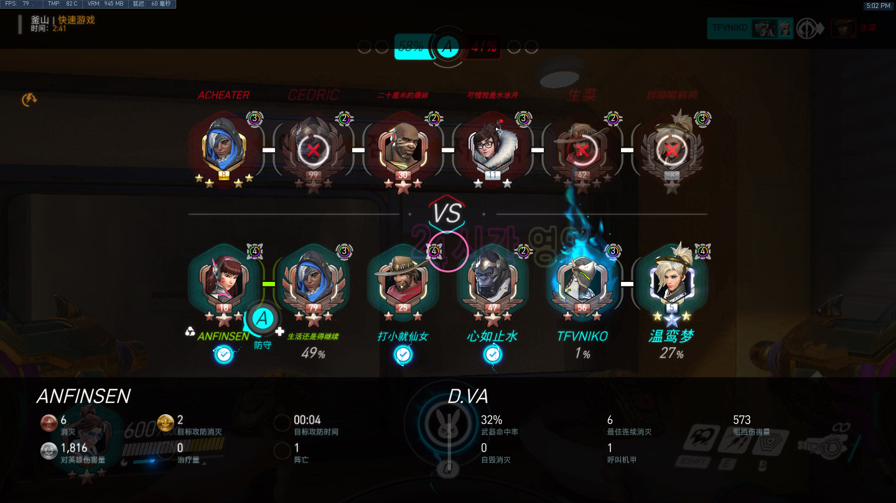

> 开服第一周的釜山，D.Va 还是我的本命

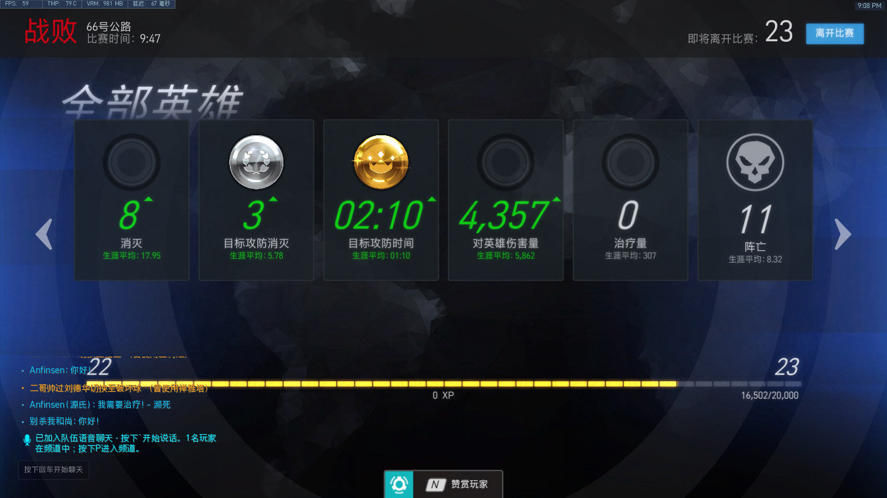

> 1月的某场对局，段位还在爬升中

🏆 5月 · 500强与动感斗球（2张）

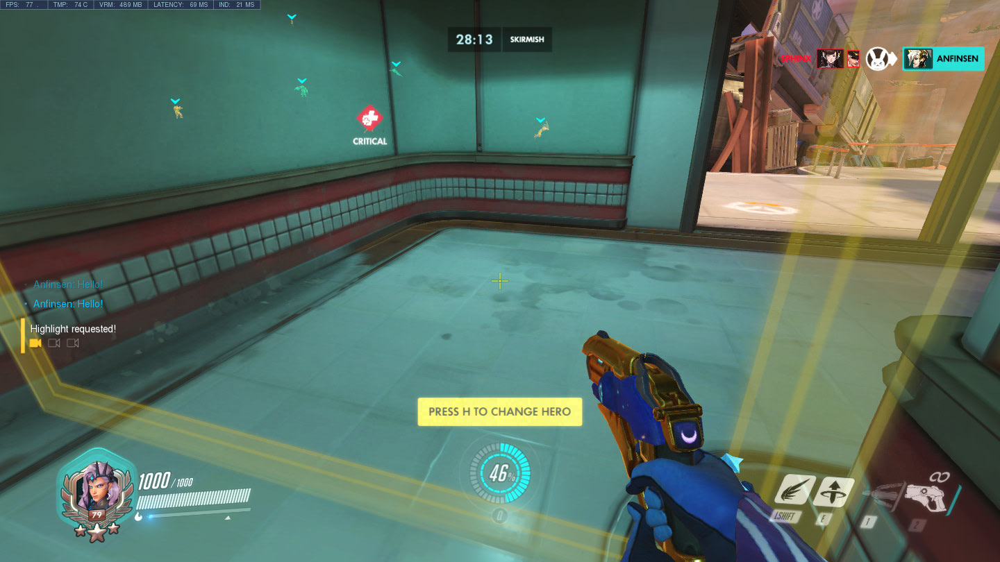

> 冲击500强的日子

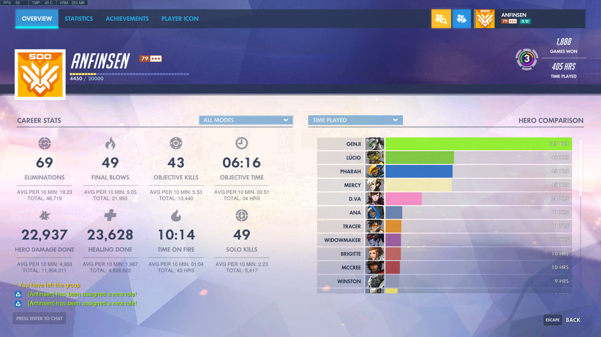

> 凌晨2点还在打动感斗球，肝帝本帝

🏟️ 6月 · 广州城市巡礼（3张）

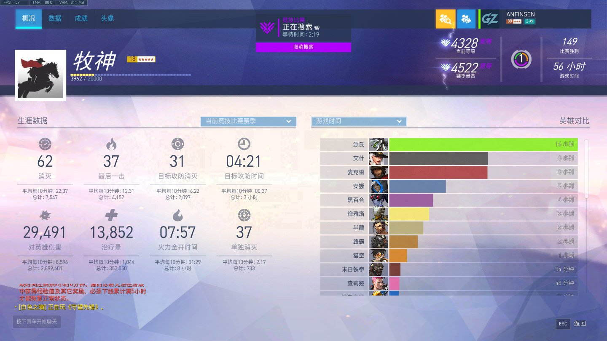

> 线下前一天，赛季最高 4522 竞等，"牧神"称号

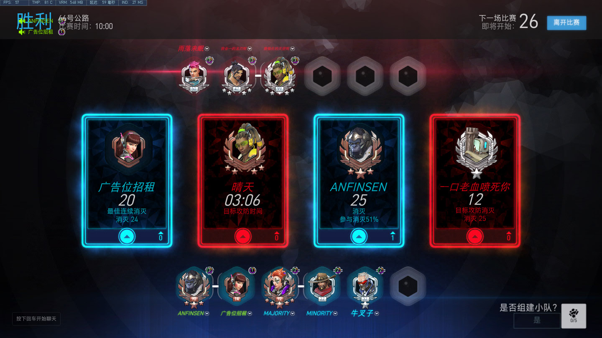

> 广州线下当天晚上回家打的，66号公路 25 消灭 carry 全场

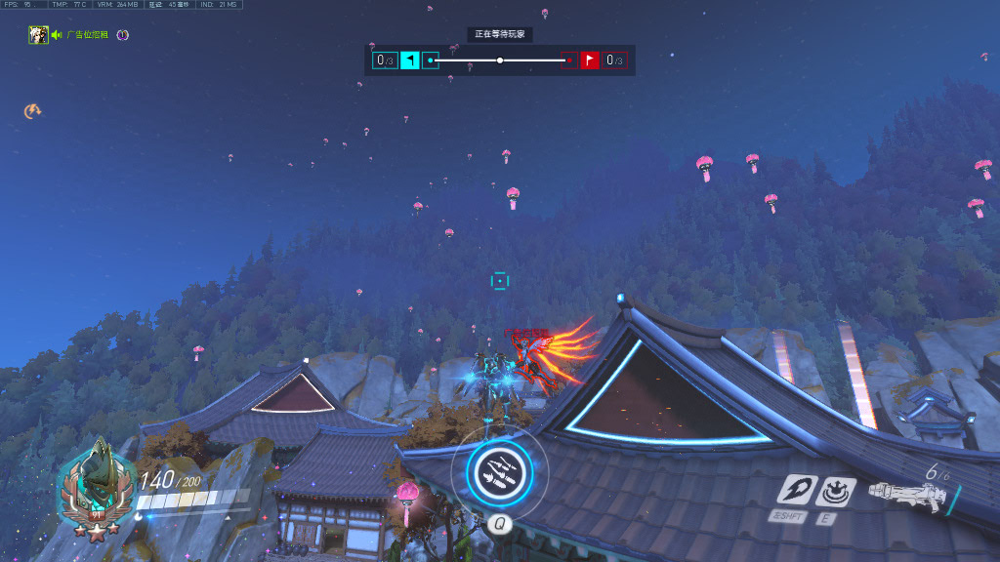

> 花村粉色天空下的纸灯笼，那天线下看完比赛回来特别兴奋

⚽ 7月 · 动感斗球杯（3张）

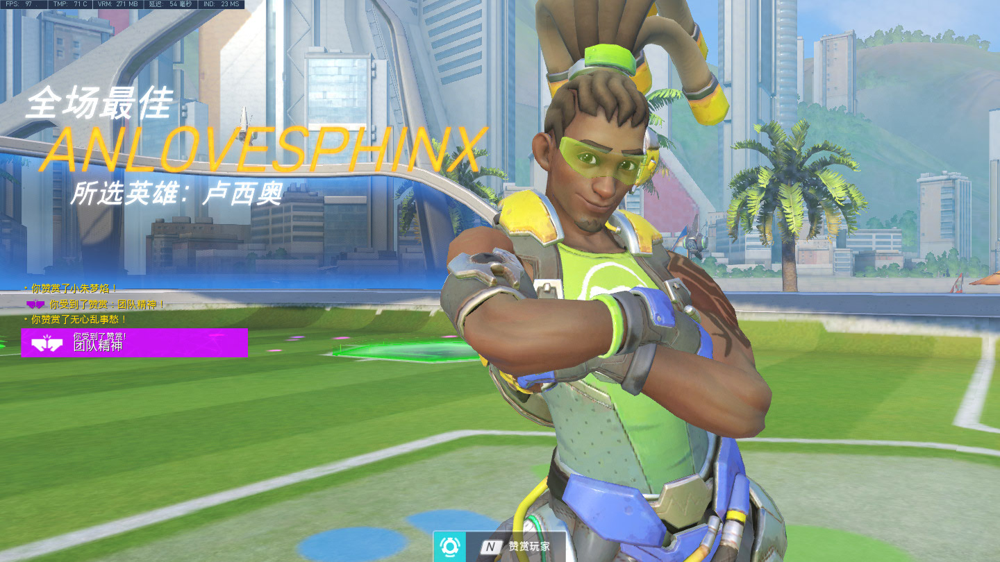

> 暑假凌晨5点还在斗球杯，排名322的代价

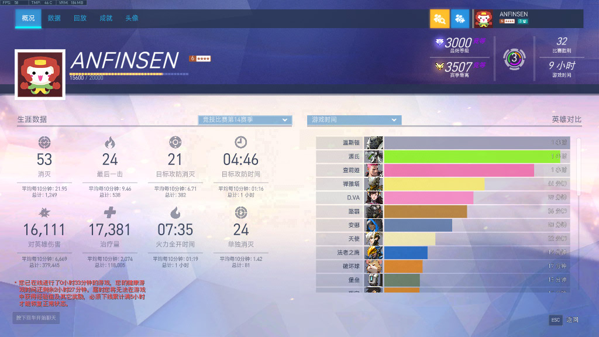

> 弗格体育场主场作战，卢西奥全场飞

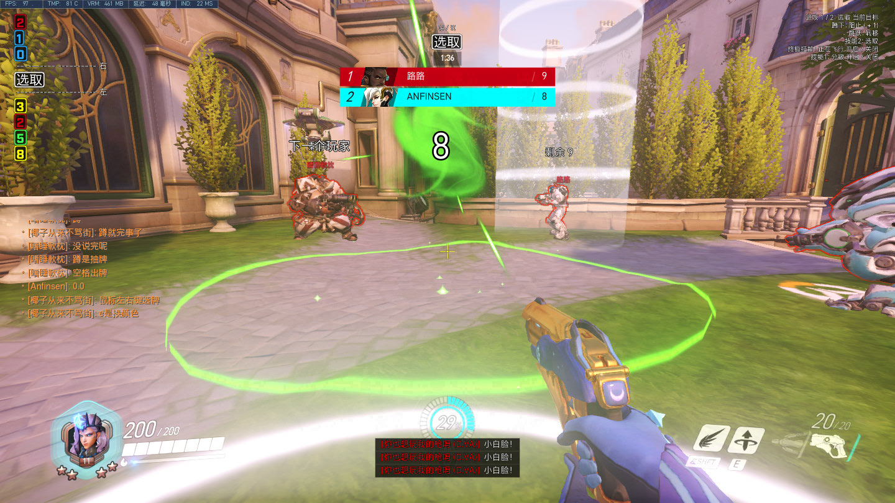

> 斗球杯尾声，宗师段位到手

🎃 11月 · 万圣节与新赛季（3张）

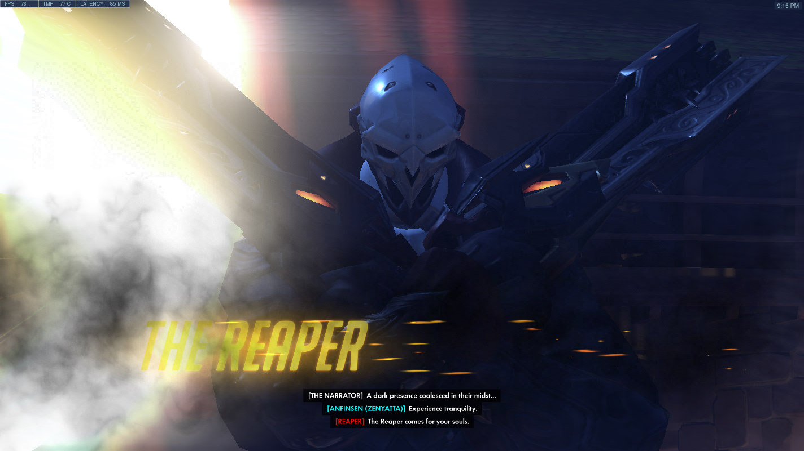

> 万圣节活动第一天，43/45物品全解锁

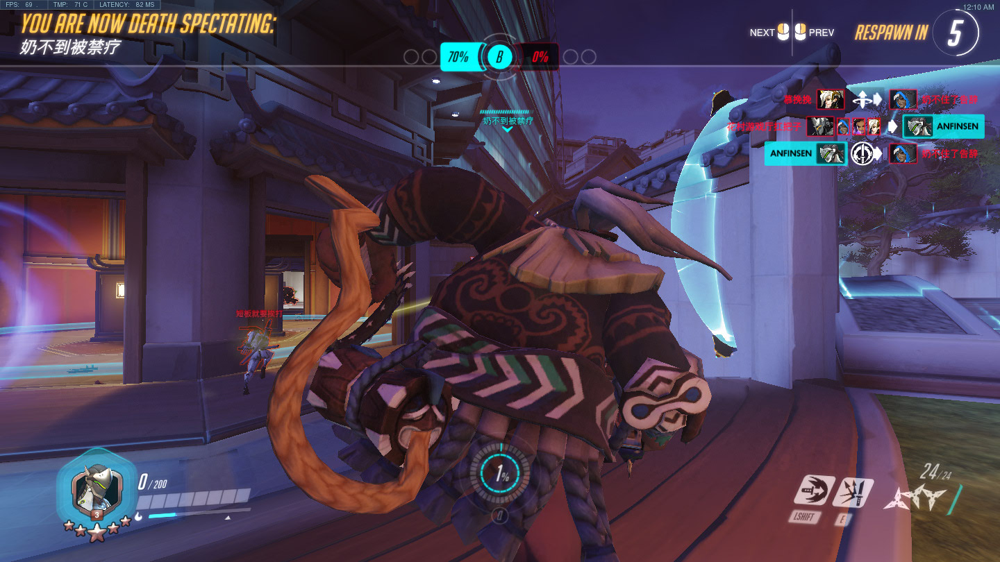

> 凌晨刷万圣节补给，温斯顿稻草人皮肤到手

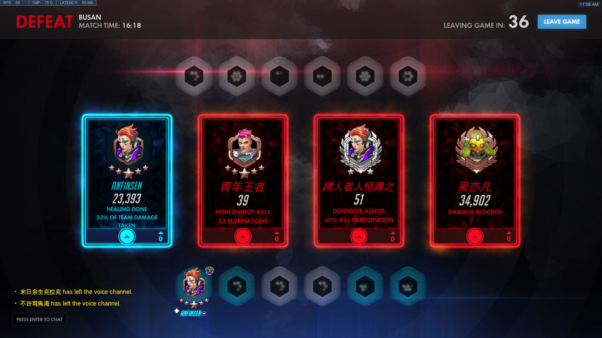

> 新赛季竞技定级，从大师回到钻石

🎄 12月 · 年末（1张）

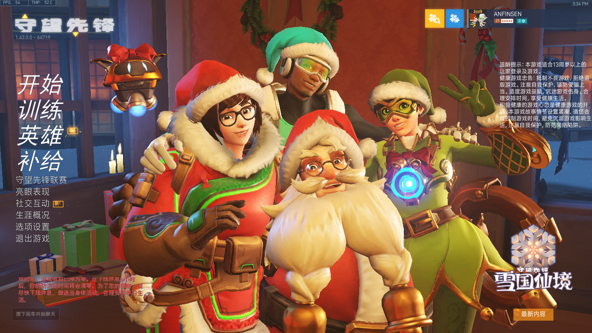

> 2019年最后一张截图，这一年从钻石到大师再到钻石

---

## 2019 大事记

| 时间 | 事件 |
|------|------|
| 2019年高一 | 学校偷看OWL直播，不交手机 |
| 2019年某日 | 凌晨两三点玩游戏被爸爸抓包 |
| 2019年6月6日 | 赛季最高 4522 竞等 |
| 2019年6月7日 | 广州城市巡礼，第一次线下观赛（高德置地冬广场） |
| 2019年 | 为源氏买OWL联赛皮肤（广州配色） |
| 2019年暑假 | 动感斗球宗师，大师3900摸百强榜 |
| 2019年 | 练习源氏顺转卡转 |
| 2019年9月7日 | 最后一次努巴尼投稿（源氏5杀卡转） |

---

> **上一篇**：2018 — 中考年（偷玩、粉红天使、500强）
>
> **下一篇预告**：2020 — 燃烧的热爱，437张截图的疫情守望时光。
>
> *2019年的OWL巅峰，让守望先锋的热爱达到了新高度。*
