## 前言

5 月中旬，守望先锋国服上线了一个全新的赛事活动——**璀璨排位赛**（5 月版璀璨竞技场）。这是国服专属的竞技模式，单人锁职责、积分排位、独立榜单，门槛钻石 2 起步，和年初 2 月的老璀璨竞技场完全是两套赛制。

我选了重装职责，从 5 月 18 号开始打，排名从 737 一路爬到 285，最终拿到了 **Top 500 璀璨重装**的称号和奖励。这篇文章记录一下这段冲榜经历。

---

## 璀璨竞技场是什么？

简单来说，这是守望先锋国服的**官方排位赛事活动**，全程免费参赛，目标是选拔高分选手进入线下总决赛。

### 5 月版赛制概览

| 项目 | 规则 |
|------|------|
| 参赛方式 | 单人报名，锁职责（重装/输出/支援三选一，整赛季不能换） |
| 匹配方式 | 系统随机匹配路人组成 5 人队 |
| 参赛门槛 | 当前竞技段位 ≥ 钻石 2 |
| 比赛时间 | 每天 19:00～24:00，不限周末 |
| 地图规则 | 标准 5v5 竞技地图，有 BP 禁用英雄 |
| 反作弊 | 人脸识别 + IP 核验 |

### 赛季时间线

```
5.13 报名 → 5.16 积分赛开打 → 6.7 锁榜 → 6.13-14 线下总决赛 → 6.16 收官
```

### 积分机制

积分 = 隐藏匹配分 (MMR) + 当局表现 + 对局胜负，**浮动计分，没有固定加分**：

| 对局结果 | 大致积分变化 |
|----------|-------------|
| 3:0 大胜 | +30~60 |
| 3:1 取胜 | +20~35 |
| 3:2 小胜 | +20~30 |
| 3:3 平局 | ±0 |
| 2:3 小劣 | -10~20 |
| 1:3 大败 | -20~30 |
| 0:3 惨败 | -25~35 |

几个关键点：
- 新号初始隐藏分约 1100，前期加分极高
- 个人数据表现有加成（同职责队内数据靠前额外加分）
- 连胜会小幅提升单局加分，连败会压低隐藏分
- **无每日积分上限**，可以无限刷

### 晋级名额

三个职责**独立排行榜**，分别晋级：
- 重装：前 25 名
- 输出：前 50 名
- 支援：前 50 名

晋级后自由组队（1 重装 + 2 输出 + 2 支援），8 支队伍打 BO3 单败淘汰赛，线下直播决出总冠军。

### 奖励

- **积分赛奖励**：分段解锁专属喷漆、名片、史诗皮肤、每日完成一场比赛获取1个补给箱、每周完成20场获取1个传奇补给箱、每赢得5场对局获取1000竞技点 共3000竞技点
- **榜单奖励**：各职责前列 ID 永久镌刻璀璨名人榜，瓜分现金奖池
- **职业通道**：从 OWCS 第三阶段开始，报名国服预选赛**必须拥有璀璨排位参赛记录**；高分选手可直通 WBG/AG 等职业俱乐部试训

---

## 我的冲榜记录

选了重装，5 月 18 号开打。

### 排名变化

从 737 名开始，一路往上爬：

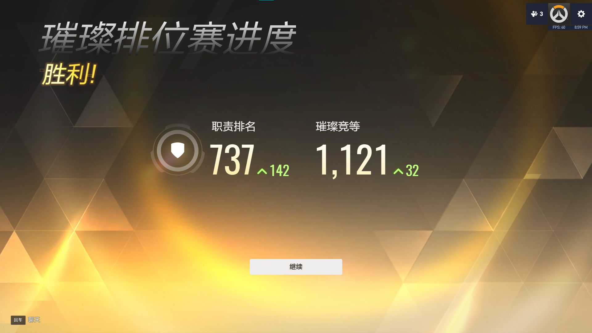

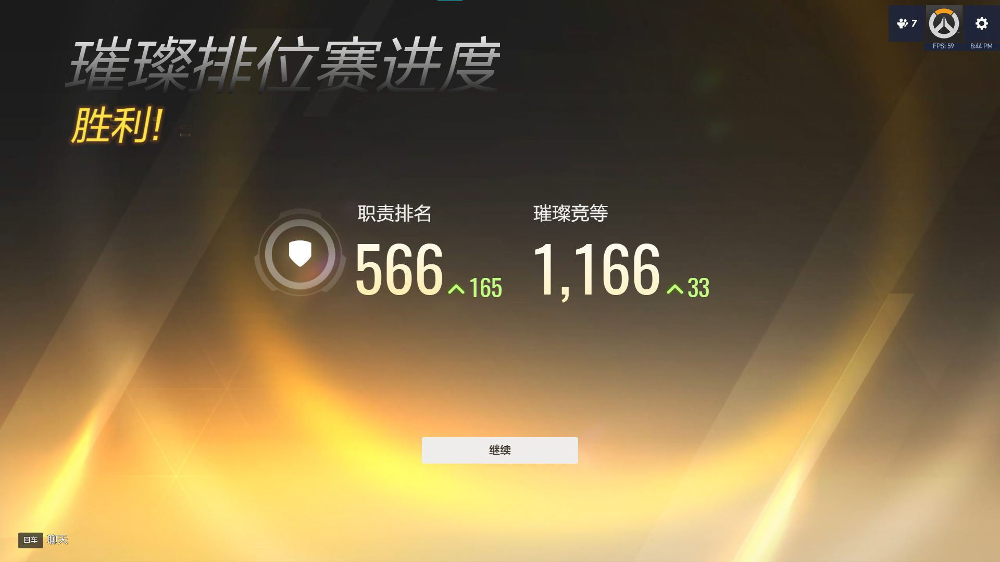

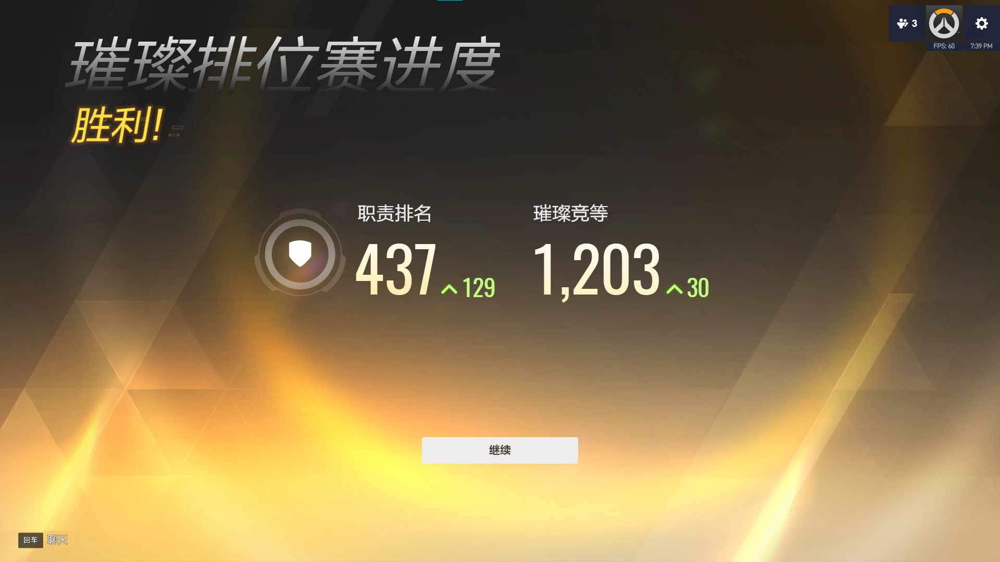


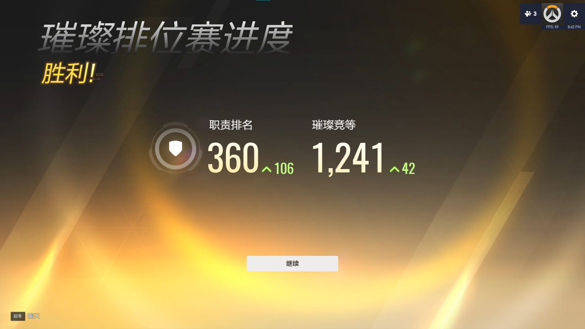


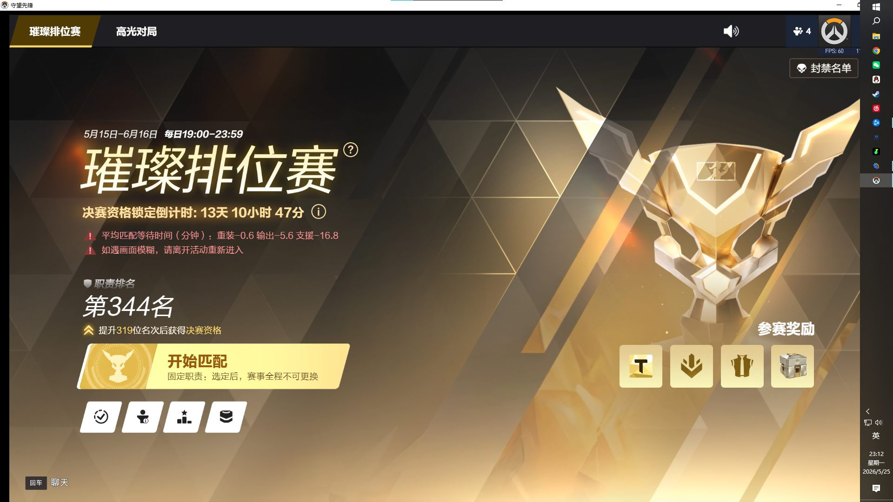

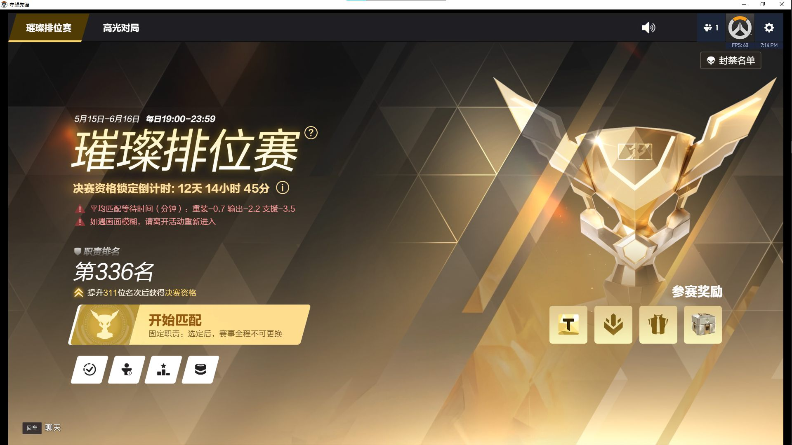

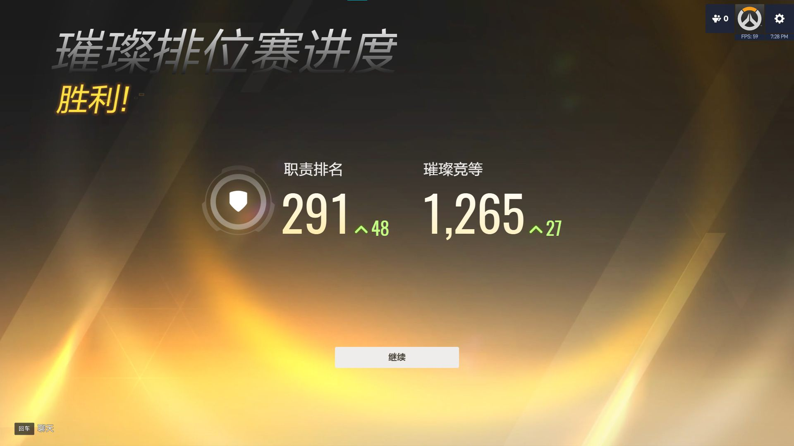

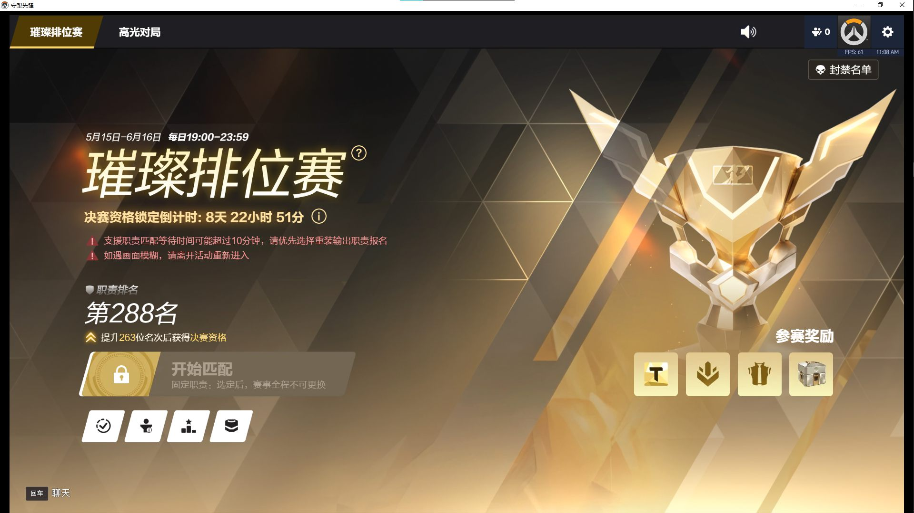


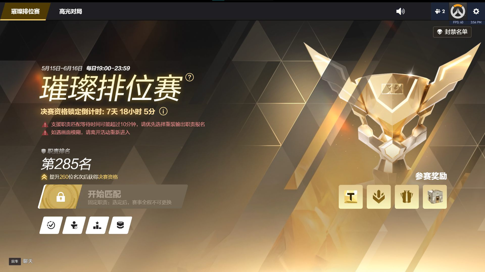

从 737 到 285，整整爬了 452 个名次。

### 有趣的瞬间

**1111 分**——刚好卡在一个很整齐的数字上，截图留念：

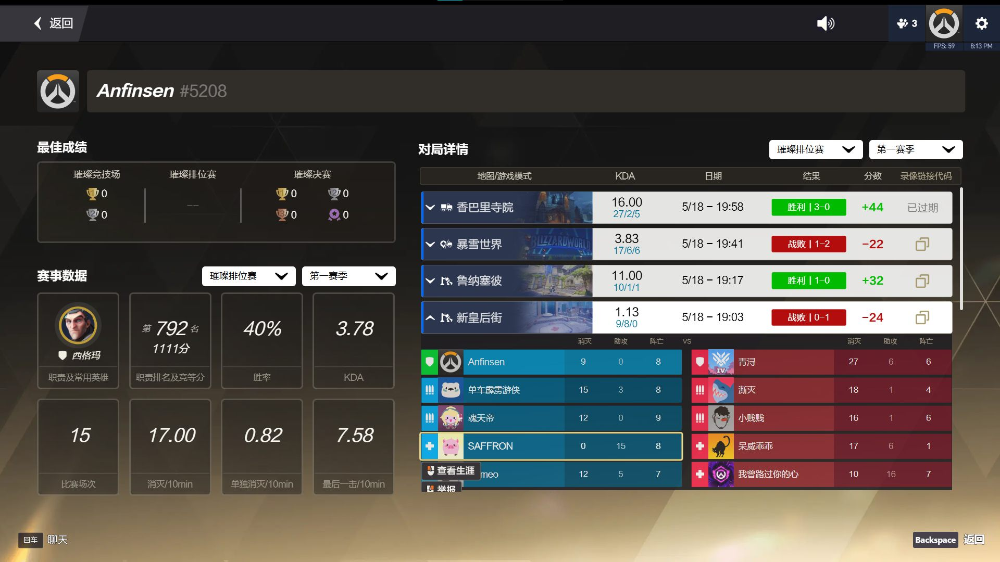

**Match 1：带不动局**——全程在兜、在carry，但就是没资源。队友输出拉不起来，我一个人扛着全队，那种无力感真的很难受。尽力了，但就是赢不了。

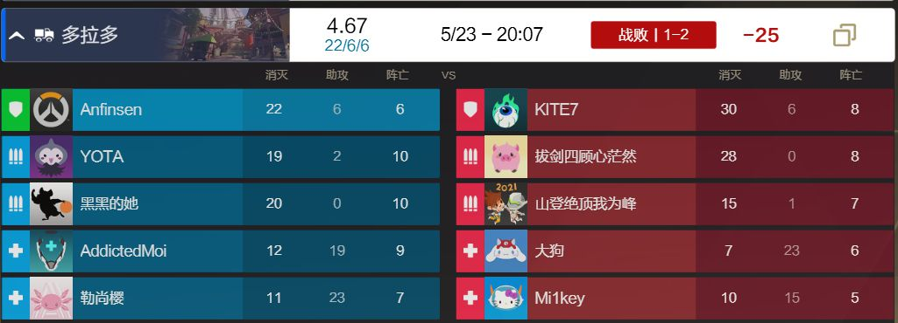

> 🎬 [点击查看完整对局录像（P2）](https://www.bilibili.com/video/BV1BDG66CEKc/?p=2)

**Match 2：爆杀局**——有低谷就有高光。这局直接碾压，对面完全没有还手之力，打出了节奏感，爽局。

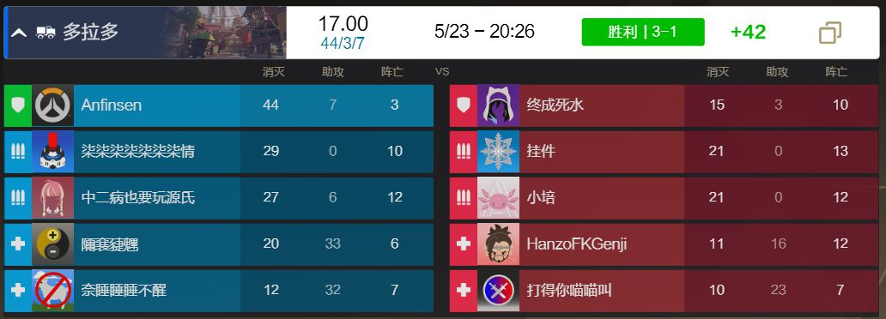

> 🎬 [点击查看完整对局录像（P3）](https://www.bilibili.com/video/BV1BDG66CEKc/?p=3)

**Match 11：遇见麦香鸡大神**——排到了国服和亚服双英杰段位的秩序之光路人王——麦香鸡大神。他也是我的老队友了，我们隔着屏幕友好互动，他也手下留情，没掏出绝活英雄。

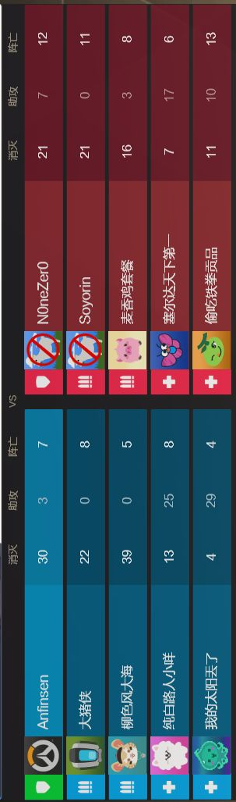

<div align="center">

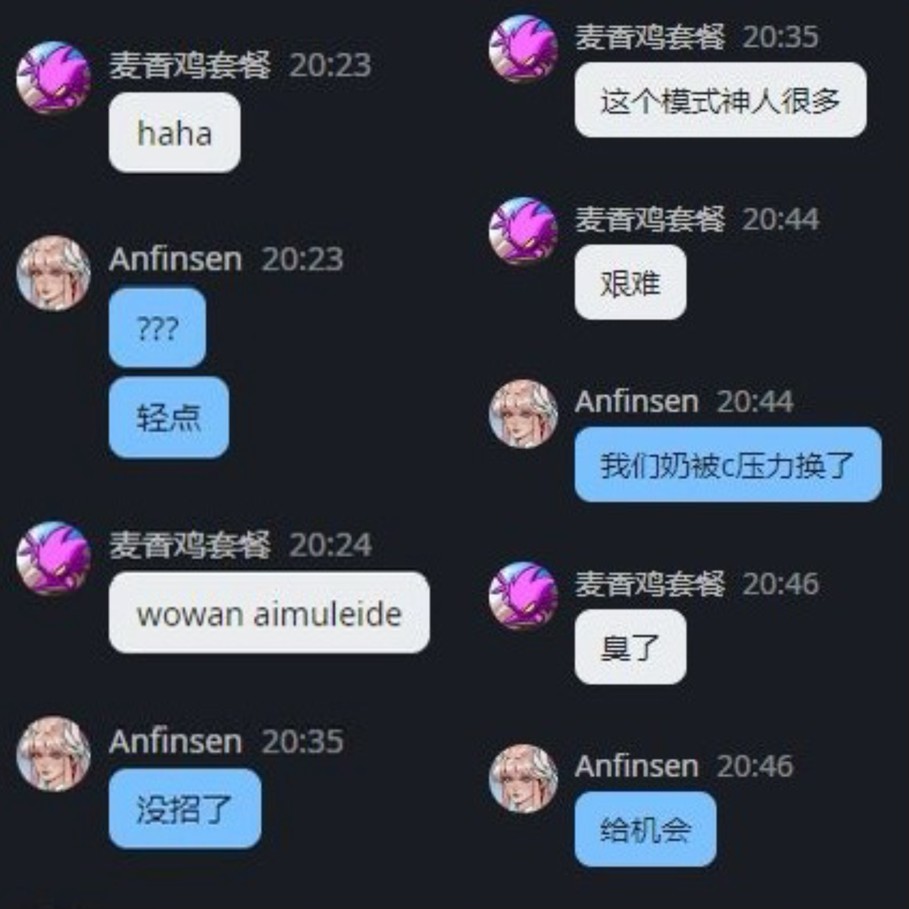

</div>

这局打得异常激烈。第一回合我几乎没吃到资源，被一路推到终点，心里很憋屈。这时输出位队友 柳色风大海 开始给辅助施压："我说实话我们T玩得比对面好，T吃不到资源，你们换别的。"

有人懂我的难处，心里暖暖的。但我还得安抚队友情绪："没事，花男是专精，不能要求路人跟职业选手一样什么都会。"

第二回合换了西格玛，辅助也换了主流英雄，我和 柳色风大海 力挽狂澜，一路推到终点还剩不少时间。他说："你看，给资源我们T就能打了吧。"花男回了句："又不是只有我一个奶。"我赶紧打圆场："行了行了，别吵了，能打！"

后面一直给队友报信息，C位跟伤害也到位，最终拿下胜利。终于有人懂玩T的难处了——又要抗压，又要安抚队友，还要力挽狂澜😭。

> 🎬 [点击查看完整对局录像（P4）](https://www.bilibili.com/video/BV1BDG66CEKc/?p=4)

**Match 24：绝地翻盘**——开局就被碾压，我一度以为这局没了。但我不甘心，一直在换英雄尝试，虽然操作一般，但靠着积极沟通——要资源、要激素、报信息——硬是把局势扳了回来。输出位前期被压力，最后一波发力锁定胜局，队友心态也稳住了，hh🤣。

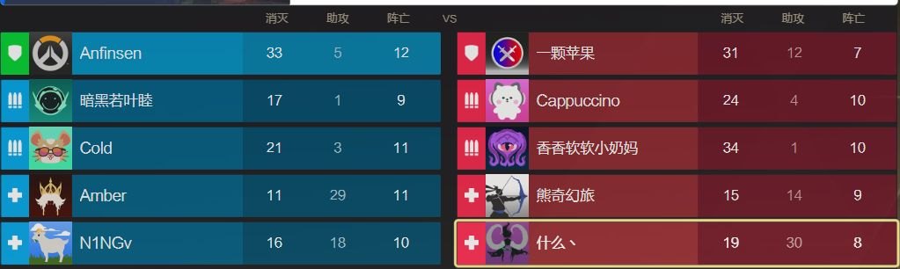

> 🎬 [点击查看完整对局录像（P5）](https://www.bilibili.com/video/BV1BDG66CEKc/?p=5)

---

## 最终成果

拿到了 **Top 500 璀璨重装**的奖励：

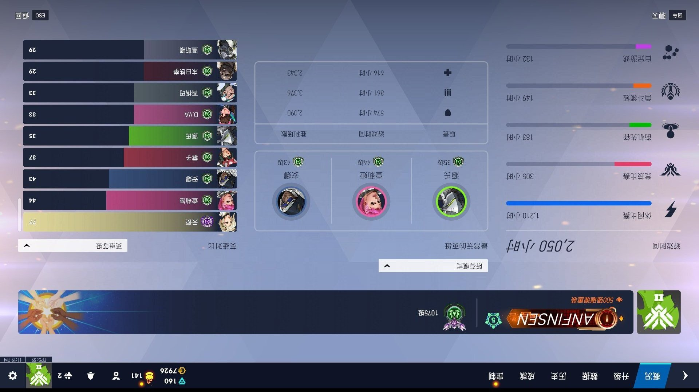

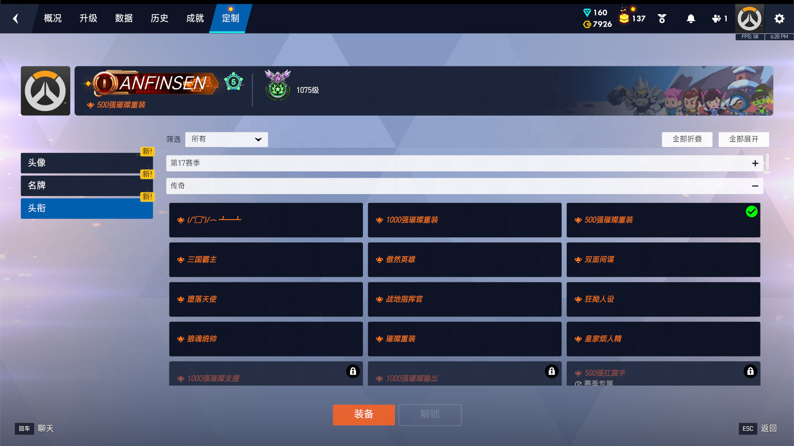

---

## 冲榜心得

打了大半个月的璀璨排位，几点感受：

### 1. 重装是最吃大局观的位置

输出可以靠枪法，支援可以靠意识，但重装需要同时把控节奏、开团时机、资源分配。一个重装的好坏直接决定团队上限。

### 2. 随机匹配是最大的变量

锁单人匹配意味着你永远不知道队友是什么水平。能做的就是把自己的部分做好，尽量减少对队友的依赖。

### 3. 连胜和连败都是正常的

隐藏分机制决定了你会经历波动。连胜的时候不要上头，连败的时候及时止损，心态比操作更重要。

### 4. 每晚固定时间打效率最高

19:00～24:00 的开赛时段，前半段（19:00～21:00）玩家水平相对稳定，后半段（22:00 以后）质量会下降。找到自己状态最好的时间段，固定打那几个小时就够了。

---

## 和 2 月老璀璨竞技场的区别

| 项目 | 2 月老璀璨竞技场 | 5 月璀璨排位赛 |
|------|-----------------|---------------|
| 组队 | 5 人固定车队 | 单人随机匹配，锁单一职责 |
| 赛制 | 周末限时 BO3 单淘，连胜 3 场夺冠 | 全月每日积分排位 |
| 门槛 | 全段位无门槛 | 钻石 2 起步 |
| BP | 有英雄禁用 | 有英雄禁用 |

5 月版更考验个人实力和持久力，2 月版更考验团队配合和临场发挥。

---

## 最后

璀璨竞技场是国服 OW 难得的官方赛事活动，门槛不高（免费参赛），奖励丰厚，还能作为 OWCS 的参赛资格门槛。如果你是钻石 2 以上的玩家，强烈推荐参与。

最终排名还没出来，等 6 月 7 号锁榜后我会更新最终成绩。期待能拿到一个好名次。

---

> 📺 **参考视频**：[璀璨竞技场介绍 — B 站](https://www.bilibili.com/video/BV19gRbB6ELa/)
